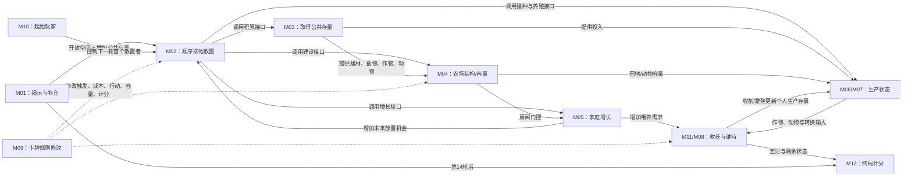

# 《农场主》：2016 英文修订版四人基础游戏深度案例

- 案例编号：`agricola-revised-2016-en-4p-base`
- 分析深度：深度
- 状态：Gate B 结构校准通过；行为证据、96 张手牌审计与具体对局观察待补
- 建档日期：2026-07-21
- 研究问题：工人放置、排他行动空间、累积资源、家庭增长、周期收获与私人卡牌，怎样由不同种类的状态、关系和规则组成经济系统？“家庭成员、行动机会、房间、食物都属于资源”这一说法在哪些尺度成立，又会在哪些地方失真？
- 案例角色：多人资源与机制编排锚点；与 2026 WSOP Event #65 无限注德州扑克共同构成校准门 B
- 模板版本：[案例研究包 v0.3](../CASE-PACKET-TEMPLATE.md)

> 本文是开放研究中的案例包，不是规则教学、策略指南或完成书稿。所有规则事实限定于下述版本与配置；“抢位”“阻挡”“引擎”“紧张”等玩家活动或体验，在没有对局、访谈或行为材料时不会写成规则事实。

## 1. 案例范围卡

| 字段 | 锁定值 | 证据或理由 |
| --- | --- | --- |
| 游戏制品 | *Agricola (Revised Edition 2016)*，EAN / UPC `4-260402-315287` | [Lookout 官方产品页](https://www.lookout-spiele.de/en/games/agricolare.html) |
| 规则集或版本 | Lookout 英文规则书与附录，均为 ©2016、各 12 页 | [官方规则书](https://www.lookout-spiele.de/upload/en_agricolare.html_Rules_Agricola-RE_EN.pdf)；[官方附录](https://www.lookout-spiele.de/upload/en_agricolare.html_Appendix_Agricola-RE_EN.pdf) |
| 模式与配置 | 四人基础游戏；随机起始玩家；每人随机获得 7 张 Occupation 与 7 张 Minor Improvement；使用四人游戏板扩展、10 张公开 Major Improvement 与 14 张分阶段行动空间牌 | Rules pp.2–3；Appendix pp.6–7 |
| 平台或物质形式 | 英文修订版基础盒的实体桌游组件；本轮尚未锁定某一实体盒印刷标记 | 产品页与 Rules p.2 |
| 游玩情境 | 一局标准四人游戏，从设置到第 14 轮最终收获后计分 | Rules pp.3–4、12 |
| 明确排除 | 旧版组件、其他语言版本、1–3 人配置、5–6 人扩展、*Farmers of the Moor*、额外牌组、推广卡、十五周年版附加物 | 防止作品名代替规则对象 |
| 排除的官方变体 | Drafting、Quick Drafting、Living Hand、无手牌新手变体、Side Job、额外行动空间牌与 suggestion markers | Rules p.3；Appendix pp.1、8–9 明列为可选内容或变体 |
| 来源锁定日期 | 2026-07-21 |  |
| 关键来源制品 | 上述英文 Rules PDF、Appendix PDF 与官方产品页 | 分别支持基础流程、术语/空间/变体细则和产品身份 |
| 完整性标识 | Rules SHA-256 `1AA612ED43BDDE109A0BFFF900CF9322BAE02E5B53F4EE3FE9F37D264CA8BC70`；Appendix SHA-256 `AFB1C374982E290317A290DE3D109132D52424EC1EC7B310220D9F04EB1A7967` | 项目于锁定日对官方 URL 下载文件的测量值，不是 Lookout 公布的校验值 |
| 复现状态 | 规则文本分析完成；尚未清点冻结实体盒的 96 张基础手牌，也未建立完整四人 session fixture | 不能把纸面分析冒充物质执行或真实游玩观察 |

### 版本歧义与范围限制

- **[来源事实]** 产品页仍把作品标作 Revised Edition 2016；页面展示的 2023 盒图不能单独证明出现了新的规则版。
- **[来源事实]** 官方说明 Revised Edition 与旧版总体机制相近，但卡牌、措辞和图形经过重做，并警告混用可能产生问题。因此本案不从旧版补写规则或牌面。
- **[来源事实]** Drafting 虽被附录称作流行变体，仍不属于本案基础设置；本案直接随机发放 7+7 张手牌。
- **[未知]** 官方公开 PDF 没有提供基础盒 96 张手牌的完整可核查卡面档案。由于卡面文字可以覆盖规则书，本文能分析卡牌修改器的语言结构，却不能声称穷尽所有实际修改路径。
- **[未知]** 尚未锁定一局的起始玩家、座次、手牌、六阶段内行动牌顺序和执行轨迹；规则对象已经冻结，不等于一局具体游戏已经复现。

## 2. 为什么研究它

### 2.1 一分钟内讲清这局游戏

四名玩家各从两个家庭成员和一座只有两间木屋的农场开始。全局棋盘摆着许多行动空间：取得木材、耕地、学习职业、建房、播种、养动物等。每轮从起始玩家开始，大家按顺时针顺序每次把一名尚在家中的家庭成员放到一个空的行动空间，并立刻执行那里至少一项行动；这个空间本轮通常不能再被别人使用。家庭成员越多，一轮能做的事越多，但收获时也需要更多食物。

部分行动空间上的货物每轮继续累积，直到有人占用并全部拿走。六个指定轮次结束时依次收割田地、喂养家庭、繁殖动物。第 14 轮最终收获后，游戏按农场空间、作物、动物、房间、家庭、卡牌和乞讨等项目计分，最高分获胜。

这个摘要还省略了私人手牌。每位玩家从随机的 7 张职业和 7 张小改良开始；未打出的卡牌文字不生效，打出后却可以增加、替换或改写既有规则，并且卡面优先于规则书。完整游戏因此不是一套固定行动表，而是基础规则与本局被激活的内容规则共同运行。

### 2.2 本案承担的检验任务

- 检查项目的**资源**定义能否区分物品存量、空间容量、行动机会、公共机会和评价量，而不把所有重要事物装进一个类别。
- 检查“放置家庭成员”与“执行行动空间”能否分成输入、占位、许可、立即动作、效果与持续阻塞，而不是一句“放工人拿资源”。
- 检查**编排**能否表示家庭增长同时增加未来行动容量与喂养义务、早期空间建设怎样门控后续生产、条件收获怎样延迟结算早期选择。
- 检查私人卡牌作为**规则修改器**时，来源、目标、条件、时间、优先级与可见性是否足以表达，而不把每张卡都提升为一种新原语。
- 与无限注德州扑克对照：两案都有顺序提交、稀缺机会与他人行动造成的状态变化，但信息、决策锁定、所有权、经济和终局评价明显不同。

### 2.3 当前最小主张

> **[工作假设]** 四人《农场主》的核心不是单一“工人放置机制”，而是“分阶段开放并补充公共行动机会 → 轮流以家庭成员排他占位并立即执行 → 把取得的存量、空间与规则能力转换为农场结构 → 在预告的收获边界进行生产、维持与繁殖 → 以新状态改变后续行动容量与终局评价”的机制系统；私人卡牌会在不改变公开主线层级的前提下修改该系统。

### 双视图导航

- **教学最小视图**：本节摘要、4.8 的资源辨析、5.2 的机制索引、5.3 的核心机制卡与第 6 节编排，足以说明“为什么工人放置不是把几个资源词相加”。
- **研究充分视图**：第 4 节完整规则世界、5.4–5.7 的边界机制、第 11 节模型压力和第 13 节证据账本，用来复核条件收获、规则覆盖、实体身份、物质执行与证据缺口。
- 教学视图省略了 96 张具体手牌、所有行动空间细则、异常裁定和一次实局的随机设置；因此它不能支持“完整可执行规格”或策略主张。

## 3. 证据与陈述约定

- **[来源事实]** 设置、阶段、行动、支付、积累、收获、卡牌优先级和计分来自 Lookout 官方英文 Rules / Appendix 的明确页码。
- **[项目定义]** “资源角色”“机制单元”“编排边”“动作生命周期”等术语来自本项目，不代表规则书使用相同本体。
- **[综合判断]** 对规则结构的拆分、角色映射与玩法模板命名是本项目的可修订分析。
- **[观察]** 本案暂时没有锁定对局、录像、行动日志或玩家访谈，因此没有实际策略、频率、难度或体验事实。
- **[未知]** 规则 PDF 未公开完整 96 张手牌档案；涉及任意可能牌面组合的穷尽性结论均保留为空缺。

## 4. 规则世界

### 4.1 教学最小视图

只理解核心循环时，可以暂时保留以下事实：

```text
四名玩家
+ 每人若干在场家庭成员
+ 每轮顺时针轮流授予一次放置机会
+ 每个行动空间默认每轮只容一人
+ 放置后立即执行至少一项空间行动
+ 累积空间每轮加货、被使用时全部取走
+ 指定轮次执行收割 → 喂养 → 繁殖
+ 家庭增长增加下一轮放置次数，也增加喂养需求
+ 第 14 轮最终收获后按多项农场状态计分
```

这个视图有意不展开手牌修改、房屋材质、动物容量、作物位置、四人专属行动空间和卡牌触发顺序。它适合教学，却不足以裁定具体局面。

### 4.2 参与者、能动性与执行

| 项目 | 内容 | 来源 |
| --- | --- | --- |
| 玩家与阵营 | 四名互相竞争的玩家，各自管理一种颜色的家庭与农场 | Rules pp.2–4 |
| 玩家控制对象 | 自己在场的家庭成员、个人供应中的组件、农场布局、个人货物与手牌选择 | Rules pp.2–3、6–11 |
| 系统或环境行动者 | 没有会自行选择策略的系统代理；轮次表、行动牌堆、补充与收获流程自动规定必须发生的事件 | Rules pp.3、6、9 |
| 执行来源 | 玩家共同移动组件、补充货物、支付成本、执行卡文和记录分数；物质组件限制个人色家庭成员、栅栏和马厩数量 | Rules pp.2、12 |
| 裁定权 | 基础文件没有为休闲桌指定外部裁判；规则书、附录、有效卡面与玩家共同解释构成实际裁定来源 | Rules p.11；Appendix pp.2–6 |
| 能动性边界 | 当前轮到的玩家选择一名可用家庭成员和合法未占行动空间；空间内部分支可选，但必须执行至少一项可用行动；强制阶段与补充不由玩家取消 | Rules p.6 |

**[综合判断]** 这里的“系统执行”是分布式的：规则文本规定，组件承载，玩家共同实施。某人忘记补充一个积累格，是执行偏差，不会因此把规范规则改成“不补充”。当前没有实际执行样本可比较两层。

### 4.3 **实体**、类型、实例与标签

| 实体类型 | 实例或集合 | 身份如何保持 | 可附着状态/标签 | 证据 |
| --- | --- | --- | --- | --- |
| 家庭成员 token | 每色 5 枚；开局 2 枚在场、3 枚作为 offspring 在个人供应 | 一轮内必须分别追踪每枚所在位置；规则不记录同色 adult 的个人履历，跨轮成人通常可交换 | 未入场 offspring、newborn、adult、在家、已放置、所在行动空间 | Rules p.2、p.7；Appendix pp.4–5 |
| 行动空间 | 印在棋盘上的永久空间、四人扩展空间与逐轮出现的 14 张行动空间牌 | 地址及规则接口持续存在；牌面空间在对应轮次才进入可用集合 | 未进入、可用、被占据；永久/积累 | Rules pp.3、6；Appendix pp.6–7 |
| 农场格 | 每人 3×5 共 15 格，其中两格开局为木屋 | 坐标持续；上面覆盖的房间、田地、马厩或围合关系可变 | used/unused、房间材质、田地、牧场成员关系 | Appendix p.5 |
| 房间、田地、马厩、栅栏 | 放置到农场格或 fence space 的物质构件 | 位置结构持续；翻修可替换房间物质制品但保留房屋位置与整体关系 | 木/泥/石房；已播种/未播种；围栏内/外 | Rules pp.7–9；Appendix pp.4–6 |
| 货物 token | 木、泥、芦苇、石、谷物、蔬菜、食物和三类动物的可替代计量 | 通常按种类与数量而非个体谱系追踪；动物还需合法容纳 | 所在位置、归属、可支付/不可访问 | Rules pp.2、6、8–10；Appendix p.6 |
| 卡牌 | 48 Occupation、48 Minor Improvement、10 Major Improvement 及 14 action-space cards | 每张卡具有内容身份；手牌、公开区和行动牌堆之间位置改变 | 私人手牌、已打出、traveling、公开可购、未揭示 | Rules pp.2–3、10–11 |
| 起始玩家标记 | 1 枚 | 持续物质实例 | 当前持有者 | Rules pp.3、12 |
| begging marker | 每次缺 1 食物取得 1 个 | 取得后不能消除；作为终局扣分记录 | 所属玩家 | Rules p.9；Appendix p.12 |

**[综合判断]** 货物数量通常不需要个体身份，家庭成员和卡牌则需要持续身份或至少持续来源。把所有组件都建模为同一种“实体实例”会让经济结算冗长；把所有货物都压成数值又会漏掉动物所在位置和卡牌承载的规则身份。

### 4.4 **状态**与事实

一个足以运行本配置核心规则、但尚未展开全部牌面的状态至少包括：

```text
Round + Phase
+ StartingPlayer + CurrentPlacementActor
+ ActionSpaceDeckOrder + RevealedActionSpaces
+ ActionSpaceOccupancy + AccumulatedGoods
+ PersonStatusAndLocation(each player)
+ PlayerSupplyGoods + PersonalComponents
+ FarmyardOccupancy + HouseMaterial + RoomCapacity
+ FieldCrops + AnimalPlacementAndCapacity
+ PrivateHands + PlayedCards + ActiveCardRules
+ BeggingMarkers + RecordedBonusPoints
```

| 状态项 | 基础 / 派生 / 历史 | 读写者 | 更新时机 | 证据 |
| --- | --- | --- | --- | --- |
| 当前轮次与阶段 | 基础 | 全桌 | 准备、工作、回家、条件收获边界 | Rules pp.4、6、9 |
| 当前起始玩家与放置顺序 | 基础/派生 | 全桌 | Meeting Place 立即转移 token；下一轮从新持有者开始 | Rules p.12；Appendix p.5 |
| 行动空间占据 | 基础 | 全桌 | 家庭成员放置时建立，通常到回家阶段清除 | Rules p.6；Appendix pp.4–5 |
| 各积累空间货物量 | 基础 | 全桌 | 每轮准备阶段增加；使用时全部清空 | Rules p.6；Appendix pp.6–7 |
| 玩家供应的货物量 | 基础 | 所有人可物理观察 | 取得、支付、转换、丢弃和收获时 | Rules pp.6–10；Appendix p.6 |
| 房间数、房屋材质与空余容量 | 基础 + 派生 | 全桌 | 建房、翻修、家庭增长时 | Rules p.7 |
| 农场格使用状态 | 派生 | 全桌 | 放置房间、田地、马厩、围栏或特定卡文时 | Appendix pp.5、11 |
| 田地上的作物 | 基础 | 全桌 | 播种增加；每次收获从每块田取 1 | Rules p.9 |
| 动物所在容器与剩余容量 | 基础 + 派生 | 全桌 | 取得、移动、丢弃、转食物和繁殖时 | Rules pp.8–9；Appendix p.5 |
| 手牌与有效卡文 | 基础 | 手牌身份对持有者直接可见；打出后公开 | 设置时发放；打出/传递时改变；未打出卡文不生效 | Rules pp.3、11 |
| 新生状态 | 短期状态 | 全桌 | 家庭增长时建立，到该轮结束（含收获）后转为 adult | Appendix p.4 |
| 乞讨标记与局中 bonus | 历史压缩 | 全桌/计分表 | 喂养不足或卡牌效果发生时 | Rules pp.9、12；Appendix p.12 |

### 4.5 **关系**、所有权、控制、保管与许可

| 关系 | 两端类型 | 建立 / 改变 / 移除 | 结构含义与来源 |
| --- | --- | --- | --- |
| `controls(player, person)` | 玩家 → 同色家庭成员 | 颜色配置固定 | 玩家为其选择行动空间；Rules p.2 |
| `inPlay(person, player)` | 家庭成员 → 玩家家庭 | 开局两枚；家庭增长把供应中的 offspring 纳入 | 决定每轮可放置数、喂养和计分；Rules pp.2、7、9、12 |
| `occupies(person, actionSpace, round)` | 家庭成员 → 行动空间 | 放置时建立；通常回家或卡牌移除时解除 | 既标记位置，也使空间默认不能再用；Rules p.6；Appendix pp.4–5 |
| `hasPlacementPermission(player)` | 玩家 → 当前放置窗口 | 起始玩家和顺时针顺序授予；无在家成员时跳过 | 不是对某格的所有权；Rules p.6 |
| `belongsTo(goods, player)` | 货物 → 玩家 | 从公共位置/供应取得、转移或支付时改变 | 决定可支付与终局计数；Appendix pp.6、11–12 |
| `locatedAt(goods, container)` | 货物 → 供应、积累格、田地、卡牌或农场 | 取得、播种、收获和卡牌效果改变 | 位置影响访问；田地或未满足卡牌上的货物不必然可支付；Rules pp.6、9；Appendix pp.6、11 |
| `holdsCard(player, card)` | 玩家 → 私人手牌 | 发牌或 traveling card 传递时建立；打出时通常解除 | 给予打出候选和私人信息，不使卡文生效；Rules p.11 |
| `activeRule(card, scope)` | 已打出卡牌 → 规则目标 | 打出后按卡文条件、期限和作用域建立 | 卡面优先于规则书；Rules p.11 |
| `hasStartingPlayerToken(player)` | 玩家 → token | 随机设置；Meeting Place 立即转移 | 决定下一轮第一个放置者，不重启当前轮；Rules pp.3、12；Appendix p.5 |
| `roomCapacity(house, player)` | 房屋 → 玩家家庭 | 由房间数派生；建房增加，基础增长比较房间与在场人数 | 表达耐久容量而非把每个成人永久配给某间房；后期无房增长可绕过前置；Rules p.7 |

**[综合判断]** 占用行动空间并不等于拥有它。玩家获得的是“一次立即调用该空间接口的许可”，同时建立一个持续到本轮末的占据事实，使后来玩家通常失去该接口许可。把它们合成“拿走行动格”会混淆空间身份、占据、使用权和阻塞效果。

### 4.6 **规则空间**

本案同时存在两种相连但不同的空间模型：

1. **公共行动空间图**：每个行动空间是一个可单独寻址的功能槽。几何相邻通常不决定基础合法性；核心关系是进入可用集合、是否被占据以及其规则接口。新行动牌按轮次加入，使可用空间集合逐渐扩张。
2. **个人农场 3×5 网格及 fence-space 网络**：15 个农场格正交相邻，房间、田地和牧场各自受连续性约束；围栏建在格间或边界的 fence space 上，围合区域形成牧场。一个农场格只能承载允许的结构，15 格因而构成持久容量约束。

物理空间与规则空间大体对应，但规则关系不总由图形直觉决定：房间与田地边缘不算围栏；行动空间的视觉接近也不自动产生可达或冲突；卡牌还能重新定义某些空间的功能或“used”状态。Rules pp.7–9；Appendix pp.4–6。

### 4.7 **时间结构**与调度语义

```text
整局：14 轮
每轮：准备 → 工作 → 回家 → 若 round ∈ {4,7,9,11,13,14} 则收获
工作：起始玩家起顺时针，每次一名尚在家的成员，直到全部在场成员已放置
收获：田地 → 喂养 → 繁殖
```

- **驱动来源**：轮次表驱动准备、阶段转移与收获；起始玩家标记和顺时针关系驱动工作阶段的运行机会；当前玩家输入选择具体放置。
- **准备阶段顺序**：揭示本轮行动空间，取得放在本轮 round space 上、归属于玩家的货物，再为所有 accumulation space 增加图示货物；剩余货物不会阻止继续补充。Rules p.6；Appendix p.4 对 round-space goods 另有细则。
- **工作阶段顺序**：当前玩家放置恰好一名在家成员并立即执行空间；成员已用完的玩家被跳过，仍有成员者继续顺时针循环。不同玩家家庭规模可以导致一轮末段只有部分玩家继续行动。Rules p.6。
- **条件阶段**：规则书口头说每轮有四阶段，但 Harvest 仅在六个指定轮次运行。形式表达应是轮次谓词门控的阶段，而不是每轮运行一次“空收获”。
- **阶段内不可并发**：基础工作行动依序发生并立即提交，后续选择读取更新后的公开状态；基础收获三个子阶段也依序发生。
- **卡牌调度**：卡文可以在轮开始前、准备阶段、使用行动空间时、收获子阶段或“at any time”插入效果，并可允许额外行动或改变占位。完整优先级与冲突需要全部 96 张卡面才能穷尽；当前只记录语言接口和已公开例子，不伪造统一队列。
- **暂停与积压**：不适用软件式暂停；桌面对规则解释的现实停顿不推进任何规则计时。未解决的卡牌裁定如何恢复由参与者共同处理，规范文本未定义计时责任。

### 4.8 **集合结构**

| 集合 | 有序性 | 可见性 | 典型操作 | 证据 |
| --- | --- | --- | --- | --- |
| 六个阶段的行动空间牌堆 | 阶段间有序、阶段内洗混 | 背面阶段可知，阶段内次序未揭示 | 每轮翻开顶部一张并加入公共棋盘 | Rules p.3 |
| 每位玩家 7 张职业手牌 | 本身无规则顺序 | 对持有者私有；打出时公开并朗读 | 选择一张、支付职业成本、公开激活 | Rules pp.3、11；Appendix pp.1–3 |
| 每位玩家 7 张小改良手牌 | 本身无规则顺序 | 对持有者私有；打出时公开或作为 traveling card 传递 | 检查前提、支付成本、激活/传递 | Rules pp.3、11 |
| 10 张大改良公共供应 | 陈列位置不表示获得顺序 | 完全公开 | 选择、支付、置于玩家面前；部分可升级返还 | Rules pp.3、10 |
| 各玩家在场家庭成员 | 每轮放置顺序形成事件轨迹，集合本身无序 | 公开 | 放置、回家、增长 | Rules pp.6–7 |
| 公共货物与个人供应 | 按类型计量，无个体顺序 | 通常公开 | 产生、取得、支付、转换、丢弃 | Appendix pp.5–6 |

### 4.9 **资源**、资源操作与经济

#### 来源术语映射

官方附录 p.6 有自己的内容分类：`crops + building resources = resources`，再由 `resources + animals + food = goods`。这是规则文本的有效术语系统，用于解释卡文，但它与本项目按稀缺、竞争用途和规则角色定义的**资源（Resource）**不是同一个分类问题。

本文在**来源语域**与术语映射中保留官方命名，在项目分析中使用共享术语：

```text
官方内容术语 resource / goods
    用途：解析该版本的卡文与组件类别

项目分析角色 资源
    用途：判断某对象、容量、权限或机会是否形成跨用途权衡
```

因此，官方名为 `food` 或 `animal` 的 goods 可以在项目分析中承担资源角色；官方名为 `resource` 的谷物也可能在某一具体位置暂时不可访问。反过来，行动机会和农场空间不是官方 goods，却可能在项目尺度上承担资源角色。

| 来源术语与来源身份 | 来源中的操作性含义 | 映射关系 | 项目概念拆解 | 不能自动等同 |
| --- | --- | --- | --- | --- |
| Appendix `resources` | crops 与 building resources 的内容分类 | 部分重叠 | 内容标签；其具体实例在满足准入条件时可承担**资源**角色 | 项目对所有资源角色的全集 |
| Appendix `goods` | resources、animals 与 food 的上位内容分类 | 部分重叠（来源分类较宽） | 多种内容类型；需分别检查其载体、操作与时间尺度 | 单一资源类型或经济系统 |
| Rules `action space` | 可放置家庭成员并调用印刷行动的位置 | 拆分 | **规则空间**中的位置 + 本轮占据状态 + 调用许可 | 可被玩家永久拥有或消耗的物品 |

#### 资源候选辨析

下表把**资源**视为可叠加角色。每个肯定判断都必须同时说明载体、稀缺对象、竞争用途、可执行操作、时间尺度及其对未来可行行动的影响；否定判断保留原对象的实体、状态、空间、权限或评价身份。

| 资源候选及载体 | 判断 | 稀缺与竞争用途 | 资源操作与时间尺度 | 未来可行行动变化、反证或边界 | 证据 |
| --- | --- | --- | --- | --- | --- |
| 食物（货物 token；个人／公共供应或卡牌位置） | 明确资源 | 存量有限；用于喂养、职业成本和部分交换 | 行动格、卡牌和货物转换取得；个人供应保存；收获与支付消耗 | 食物通常不直接计终局分，不能把“重要”与“计分”合并 | Rules pp.9–11；Appendix pp.6–7 |
| 木、泥、芦苇、石（货物 token；供应与行动空间） | 明确资源 | 多种建造、翻修、改良和终局剩余建材破同分竞争 | 从空间/供应获得，保存、支付或经工艺建筑转换 | 组件耗尽时多数可替代，物质 token 数不是经济上限 | Rules pp.7、10、12 |
| 谷物、蔬菜（作物 token；供应或田地） | 明确资源，但访问依位置 | 可作为种子、食物、烤面包投入、部分建造/卡牌成本或终局评价 | 取得、播种、收获、转食物；田地上的作物通常不能直接支付 | 同一类作物在 supply 与 field 的可用权限不同 | Rules pp.9–12；Appendix pp.6、11 |
| 动物（动物 token；行动空间或农场容纳位置） | 明确资源，同时是需容纳的货物 | 可保留计分/繁殖，或经改良转成食物；三类争夺不同容量 | 市场取得、农场内移动、繁殖、转食物或丢弃 | 没有合法容量的动物不能简单存入 supply；个体位置有规则意义 | Rules pp.8–10 |
| 每轮家庭成员放置机会（成员状态与调用许可） | 明确的时间/权限资源角色 | 每位在场成员每轮提供一次不可储存的公共空间调用；不同空间互斥选择 | 每轮刷新；放置即占用；家庭增长扩大未来容量 | 资源首先是“由成员承载的一次许可”，不能抹去成员实体、占位和喂养责任 | Rules pp.4、6–7 |
| 家庭成员（person token；供应、农场与行动空间） | 实体为主，也承载持续资源能力 | 数量上限 5；更多成员扩大每轮机会但增加喂养与空间需求 | family growth 使供应中的 offspring 入场；不会被一次行动消耗 | 把 token 只写成“行动点”会漏掉位置、newborn、房间、喂养和计分 | Rules pp.2、7、9、12 |
| 行动空间的本轮使用机会（空间占据与许可关系） | 公共竞争机会资源角色 | 每个空间默认每轮只能被一名成员调用一次，且不同空间功能不可替代 | 每轮解除占据后刷新；放置取得并立即用完调用权 | 行动空间本身是持久规则位置，不在使用时被玩家拥有或消耗 | Rules p.6 |
| 空余房间容量（房间数与在场人数的派生余量） | 耐久容量资源角色 | 基础家庭增长通常要求房间多于人数；农场格和建材限制扩建 | 建房产生；家庭增长占用其余量；后期无房增长例外绕过 | 房间实体不会因住人而消失；“房间=资源”太粗，应写容量角色 | Rules p.7；Appendix p.7 |
| 15 格农场容量（个人 3×5 规则网格） | 明确空间资源角色 | 房间、田地、牧场、马厩竞争有限位置，终局还评价 unused space | 建造/围合分配格位；大多不可撤销或重置 | 坐标仍是规则空间，不能只化约为 15 点抽象容量 | Rules pp.7–9；Appendix pp.5、11 |
| 积累格上的未领取货物（空间上的货物 token） | 公共资源存量 | 所有人可争夺，同一空间下一轮继续增长 | 每轮产生并保存；首次使用者本轮全部取得 | 当前没有玩家所有权；价值随等待增长但“等待”不是玩家单独控制 | Rules p.6 |
| 手牌（私人卡牌实体与手牌集合） | 私人规则选项；是否统称资源暂缓 | 有限且不可补抽，打出机会与成本竞争；打出后通常成为持续规则而非消失 | 初始随机取得，打出/传递/公开激活 | 96 张内容未审计；不同卡的持久、传递和一次性结构差异大 | Rules p.11 |
| 起始玩家标记（标记实体与顺序权限关系） | 顺序权限，不先定为资源 | Meeting Place 与其他行动争用一次放置，影响下一轮行动顺序 | token 可转移但不消耗 | 它不是可分配存量；价值依局面，规则只保证顺序后果 | Rules p.12 |
| 剩余轮数（全局轮次状态） | 全局期限，不是玩家存量 | 会限制可执行行动总量，却不能由玩家保存、转移或花费 | 规则自动递减 | 把所有期限叫时间资源会失去调度/资源区分 | Rules pp.4、6 |
| 分数（终局派生评价量） | 评价量，不是资源 | 决定排名但通常不能消费以获得行动 | 终局由状态映射；少量 bonus 在局中记录 | “越多越好”不足以成为资源 | Rules p.12；Appendix pp.10–12 |
| begging marker（物理标记与玩家附着状态） | 持久惩罚状态，不是资源 | 记录喂养缺口并终局每枚 -3 分 | 缺食物时取得且不能去除 | 玩家不能把它用于替代用途；“负资源”会混淆惩罚与存量 | Rules p.9 |

#### 经济结构

```text
公共产生/积累
→ 通过排他行动机会取得
→ 存入个人供应或受容量约束地安置
→ 支付为房间、田地、围栏、马厩、改良与职业
→ 建立生产/转换/容量接口
→ 收获时取得作物、消耗食物、增加动物
→ 家庭/农场状态改变下一轮行动能力与终局评价
```

**[综合判断]** 本案支持项目的角色型资源定义，但不支持一张互斥“资源类型表”。同一家庭成员同时是实体、位置占据者、控制对象、行动机会载体、喂养负担和计分对象；只有明确当前规则槽位，资源判断才不会吞掉其他语义。

### 4.10 **信息结构**

| 信息项 | 世界真值 | 谁可观察 | 何时 / 渠道 | 证据与限制 |
| --- | --- | --- | --- | --- |
| 公共棋盘、占位、积累量 | 物质桌面状态 | 所有玩家 | 持续可见 | Rules pp.3、6 |
| 各玩家农场、供应与已打出卡 | 物质桌面状态 | 所有玩家通常可直接观察 | 持续可见；卡牌打出时应朗读 | Rules pp.6–11；Appendix pp.5–6 |
| 私人 7+7 手牌 | 确定的世界状态 | 持有者直接访问；其他玩家不直接持有 | 设置时发放，打出时公开 | Rules pp.3、11；Appendix p.6 称 only you have access；公开规则未详述自愿展示手牌的权限 |
| 同阶段未揭示行动牌次序 | 设置时已经确定 | 无玩家按基础流程直接观察 | 每轮准备阶段揭示一张 | Rules pp.3、6 |
| 其他玩家未来选择 | 尚未发生，不是隐藏世界事实 | 无人可知 | 可依据公开状态形成信念 | 不能把玩家预测冒充规则信息 |
| 卡牌未来可得货物 | 可能只是条件性权利，不一定已经属于玩家 | 由公开/私人卡面和条件决定 | 卡文触发时 | Appendix pp.6、11 区分“在卡上”与“已经属于你” |

#### 观察后效审计

| 观察 | 保留与复查 | 验证 | 记录与传播 | 衰减或终止 |
| --- | --- | --- | --- | --- |
| 公共棋盘、农场与已打出卡 | 由实体组件持续保留，可在桌面存在期间反复查看 | 可由组件位置、供应与公开卡文共同核对 | 卡牌打出时应朗读；规则未保证外部日志 | 状态改变后旧配置通常只留在玩家记忆，除非另行记录 |
| 私人手牌 | 持有者可在整局持有期间复查 | 持有者可凭实体卡验证；其他玩家没有基础规则访问权 | 打出时转为公开并朗读；自愿展示和外部记录权限未由当前来源锁定 | 打出、传递或其他卡文处理后，原私人访问关系改变 |
| 分阶段行动空间牌序 | 未揭示部分只保留其阶段身份，不能复查具体未来顺序 | 揭示后由实体牌面验证 | 揭示后向全桌传播；本案没有完整事件日志 | 未保存初始牌序时，结束后无法重建完整揭示历史 |
| 其他玩家未来选择 | 尚未发生，不是可保留观察 | 不适用 | 可以讨论或预测，但当前资料不保证沟通规范 | 选择发生后才转为公开行动事实 |

本表不把“桌面上曾经出现过”写成玩家实际记得，也不把可以交谈写成已经传播了某项信息。

- 基础规则没有随机补抽；私人初始手牌在整局中构成持续的信息不对称。
- 规则状态大多公开，但“公开桌面”不等于所有玩家拥有相同记忆、理解或计划。
- 本案未取得实际沟通材料；不能从桌面可交谈直接推出承诺、威慑、误导或合作活动。

### 4.11 **随机性**与不确定性

| 来源 | 生成过程 | 玩家何时知晓 | 可控 / 可复现 | 影响范围 |
| --- | --- | --- | --- | --- |
| 起始玩家 | 随机决定 | 设置时公开 | 规则未规定随机算法；未复现 | 首轮放置顺序与起始食物 |
| Occupation / Minor Improvement | 各自洗混后每人发 7 | 持有者收到时知晓自己的手牌 | 未保存输入牌序与洗法，当前不可复现 | 私人规则选项与初始不对称 |
| 行动空间牌 | 按 Stage 1–6 分组，各组内洗混后叠放 | 每轮准备阶段逐张公开；阶段范围预先可知 | 未保存组内顺序，当前不可复现 | 某些行动在该阶段的具体出现轮次 |
| 其他玩家行动 | 由玩家选择，不是随机抽样 | 提交后公开 | 可由事件日志复现但未记录 | 空间占据、资源取得与后续状态 |

规则事实只能支持“不确定性存在及其来源”。玩家怎样估计他人选择、是否记住已出现牌或如何利用阶段范围，需要观察或玩家材料。

### 4.12 **目标**、终止与评价

| 项目 | 内容 | 证据状态 |
| --- | --- | --- |
| 规则目标 | 发展农场并在终局获得最高总分；规则书通俗表述还要求为家庭准备食物 | **[来源事实]** Rules pp.4–5、12 |
| 终止条件 | 第 14 轮最终收获完成后结束 | **[来源事实]** Rules p.12 |
| 结果评价 | 田地、牧场、谷物、蔬菜、三类动物、未用农场格、围栏内马厩、房屋材质与房间、在场人数、改良、bonus 和 begging 等共同计分；最高分胜 | **[来源事实]** Rules p.12；Appendix pp.10–12 |
| 同分 | 剩余 building resources 较多者破同分；仍同则共享名次 | **[来源事实]** Rules p.12 |
| 局部强制任务 | 六次收获都必须完成田地、喂养、繁殖流程；喂养不足不会立即淘汰，而是取得永久 begging marker | **[来源事实]** Rules p.9 |
| 玩家自定目标 | 未观察；不能把“无乞讨”“最快增长”“完整农场”等策略子目标写成所有玩家实际目标 | **[未知]** |

## 5. **机制**分解

### 5.1 尺度声明

本案把“放置一名家庭成员并使用行动空间”视为核心复合机制，把占位、积累取得、建造/生产、家庭增长、收获、卡牌激活和计分视为可比较的机制单元或复合机制；完整四人基础游戏是一套机制系统。

若把每个印刷行动空间都命名为独立机制，会把同一种调用骨架误写成大量题材功能；若只写一个“工人放置机制”，又会掩盖积累、空间建设、周期结算、规则修改和双向反馈。

| 术语族 | 动作义项 | 机制义项 | 玩法模板义项 | 类型标签义项 | 本案采用尺度 |
| --- | --- | --- | --- | --- | --- |
| 工人放置 | `action:place-family-member`：放置一名家庭成员 | `mechanic:exclusive-action-space-use`：排他占据并调用行动空间 | `pattern:sequential-exclusive-action-allocation`：顺序分配机会并连接个人经济发展的结构候选 | 工人放置游戏、德式桌游等社群／市场分类 | M02 为复合机制；第 8 节候选还需 M01、M03–M12 的编排支持 |

### 5.2 机制索引

| ID | 暂定名称 | 尺度 | 一句话规则结构 | 依赖 | 证据 |
| --- | --- | --- | --- | --- | --- |
| M01 | 分阶段行动空间开放与准备 | 复合 | 轮开始 → 揭示本轮空间/领取 round-space goods/补充所有积累格 → 进入工作阶段 | 轮次、阶段牌序、卡牌效果 | Rules pp.3、6 |
| M02 | 顺序式排他放置与空间调用 | 复合 | 当前玩家放置一名在家成员到合法空位 → 立即执行至少一项空间行动 → 占据持续 | 起始玩家、在场成员、空间状态 | Rules pp.4、6；Appendix pp.4–5 |
| M03 | 积累空间公共存量取得 | 单元/复合 | 每轮固定增量叠加剩余 → 首位使用者必须全部取得 → 空间归零但保持占据 | M01、M02 | Rules p.6；Appendix pp.6–7 |
| M04 | 农场空间建造与容量形成 | 系统 | 支付资源 → 在 3×5 网格合法放置房间/田地/马厩/围栏 → 改变容量与评价 | 资源、相邻、空格、卡文 | Rules pp.7–9 |
| M05 | 家庭增长 | 复合 | 取得相应行动空间 + 满足房间条件（或后期例外） → offspring 入场为 newborn → 下轮增加一次放置机会 | M02、房间容量、阶段空间 | Rules p.7；Appendix pp.4、7 |
| M06 | 作物播种—收割 | 复合循环 | 耕地/取得种子/播种 → 田地储存作物 → 每次收获强制取 1 到供应 | 农场空间、行动、收获调度 | Rules pp.8–9 |
| M07 | 动物容纳—繁殖 | 复合循环 | 取得动物 → 立即容纳/转食物/丢弃 → 收获时每类满足 2+ 和容量则增 1 | 牧场、马厩、卡牌、收获 | Rules pp.8–9 |
| M08 | 喂养与乞讨 | 复合 | 收获喂养阶段计算人数需求 → 支付食物/允许转换 → 每缺 1 取得 1 永久 begging marker | 食物经济、家庭增长、改良 | Rules pp.9–10 |
| M09 | 手牌激活与规则修改 | 复合/高阶 | 合法卡牌行动 + 前提 + 成本 → 卡牌公开/传递 → 卡文按作用域覆盖或插入基础规则 | 私人手牌、行动空间、优先级 | Rules pp.10–11；Appendix pp.1–6 |
| M10 | 起始玩家转移 | 单元 | 使用 Meeting Place → token 立即转移 → 当前身份改变，下一轮首个放置者改变 | M02 | Rules pp.11–12；Appendix p.6 |
| M11 | 条件收获调度 | 复合 | 指定轮结束 → 田地 → 喂养 → 繁殖 → 返回下一轮或终局 | 轮次谓词、M06–M08 | Rules p.9 |
| M12 | 终局多项计分 | 评价系统 | 最终收获后读取多个状态类别、卡文与惩罚 → 求和、比较、破同分 | 全局状态、有效卡文 | Rules p.12；Appendix pp.10–12 |

### 5.3 核心机制卡：M02 顺序式排他放置与空间调用

- **触发**：工作阶段开始，或上一名玩家的空间行动完成后，调度器找到顺时针下一位仍有在家成员的玩家。
- **触发策略**：强制轮流；无成员可放者被跳过。基础规则每次恰好放置一人，卡文可允许跳过、连续放两人、共占或移除人员。
- **调度语义**：从当前起始玩家开始顺时针循环；每次动作立即提交，后续玩家读取新的空间占据和资源状态；直到所有在场成员都已放置。
- **行动者与能动性**：当前玩家选择自己一名在家成员、一个合法行动空间和空间允许的分支/参数。
- **执行来源与裁定权**：玩家移动组件并执行动作；全桌依据 Rules、Appendix 和有效卡文检查。卡文优先于规则书。
- **输入**：物理放置、行动选择、支付与目标声明。
- **规则动作**：`UseActionSpace(player, person, space, chosenActions, parameters)`；附录明确“placing a person”与“using an action space”不是同一语义。
- **动作生命周期与锁定点**：选择候选 → 将成员放到空间并建立占据，越过本轮通常不可撤回的放置锁定点 → 至少一项空间行动进入执行 → 按 `and/or` 或 `and afterward` 语法执行/支付 → 立即提交效果 → 成员继续占位至回家阶段或卡文提前移除。
- **前置条件**：当前有放置许可；该成员在家；空间已进入可用集合且默认未被占据；至少一项提供的动作或合法 replacement action 可执行。
- **合法性**：永久空间不能在完全不行动时占用；带“and afterward”的后项只有先执行前项才能选择；积累空间必须全部拿取。
- **成本与决策锁定**：放置消耗该成员本轮的一次行动机会，通常不可撤回；空间内行动另有货物/卡牌成本。规范没有桌游软件式“预览后取消”阶段。
- **过程 / 结算**：先建立占据，再立即运行空间接口；多动作的顺序由 `and/or`、`and afterward` 与卡文规定。
- **行动结果**：成员位置和空间占据公开；空间效果可能取得资源、建造、增长、出牌或转移起始玩家；同一空间本轮默认不再合法。
- **实体身份效果**：家庭成员身份保留，仅更新位置和本轮可用状态；空间身份保留，只改变占据与调用许可。
- **效果时机与原子性**：基础空间行动在当前回合立即结算；“放置”和全部空间效果不是不可观察的单一赋值，卡牌可以在指定里程碑插入效果。
- **反馈**：组件、供应、农场与公开牌面直接呈现结果；没有程序主动阻止非法放置。
- **规则修饰符**：卡牌可替换空间行动、允许多人共占、连续放置、跳过或提前移除成员。
- **来源定位**：Rules pp.4、6；Appendix pp.4–5。
- **未知与争议**：完整牌池可能产生更多生命周期与冲突路径，待 96 张卡面审计。

```text
PlacementPermission(player)
+ AtHome(person)
+ Available(actionSpace)
+ ExecutableAtLeastOneAction(actionSpace, state)
  → PlaceAndUse
  → Occupied(actionSpace, round)
  + ImmediateActionEffects
  + SpendPlacementOpportunity(person, round)
```

### 5.4 机制卡：M03 积累空间

- **触发**：每轮准备阶段自动补充；工作阶段某玩家合法使用该空间时结算取得。
- **调度语义**：补充发生在该轮所有放置之前；即使有上轮剩余也继续增加。取得只在一次合法空间调用中发生。
- **规则动作**：玩家不是选择拿几个，而是使用空间后必须把该处全部 building resources、animals 或 food 取走。
- **所有权与位置**：货物在空间上时没有玩家所有权；取得后通常进入玩家供应。动物必须立刻合法容纳、转食物或把无法处理者送回公共供应，不能留在积累格。
- **占据效果**：拿空空间不解除成员占位；本轮后来玩家仍通常不能使用它。货物存量与空间权限是两条状态通道。
- **实体身份效果**：货物 token 的题材个体身份不重要，数量与位置/归属改变；行动空间实体保留。
- **校准价值**：这不是单一“获得资源”原语，而是 `自动产生 + 跨轮保存 + 公共可见 + 排他取得 + 全量转移 + 本轮权限关闭` 的复合结构。
- **来源定位**：Rules p.6；Appendix pp.6–7。

### 5.5 机制卡：M05 家庭增长

- **触发**：玩家使用 `Family Growth with Room Only`，或 Stage 5 的无房增长空间；有效卡牌也可能提供其他入口。
- **前置条件**：基础增长通常要求当前房间数大于在场人数；检查总人数时，已在其他行动格的成员仍计入。后期空间明确绕过房间要求。
- **动作生命周期**：占用增长空间 → 检查入口与房间条件 → 将个人供应中的 offspring 放在执行者旁并标记为 newborn → 本轮不提供普通放置 → 回家/轮末纳入家庭并在下一轮提供额外机会；newborn 状态持续到本轮结束（含收获）。
- **成本与决策锁定**：通常消耗当前成员的一次空间调用；新成员会在本轮若有收获时需要 1 食物，以后每次收获通常需要 2 食物。
- **结算效果**：在场人数立即增加；下一轮每轮放置容量增加 1；喂养需求与终局人数分数也改变。
- **实体身份效果**：同一物质 token 和规则身份从个人供应中的 offspring 重定型为在场 newborn，再在轮末重定型为 adult；不是凭空创造一枚没有来源的实体。
- **双向反馈**：规则直接支持 `更多家庭成员 → 更多未来行动机会` 和 `更多家庭成员 → 更高未来喂养需求`。这能证明结构上的收益/负担耦合，不能证明玩家必然感到压力或家庭增长总是最优。
- **来源定位**：Rules pp.7、9；Appendix pp.4、7。

### 5.6 机制卡：M11 条件收获与 M08 喂养

- **触发**：仅在轮次 `{4, 7, 9, 11, 13, 14}` 的工作与回家阶段之后。
- **触发策略**：自动、强制；不是玩家选择是否进行收获。
- **调度语义**：严格按 Field → Feeding → Breeding 运行。早期行动建立的田地、供应、家庭、改良和动物容量在此阶段集中读取。
- **田地结算**：每块仍有作物的田强制取恰好 1 个到个人供应，不能跳过。
- **喂养结算**：每名已在场 adult 通常需 2 食物，本轮 newborn 需 1；玩家可使用已有转换接口处理货物，仍缺每 1 食物便取得 1 个永久 begging marker。
- **繁殖结算**：喂养后，对每一类拥有至少 2 只动物且能容纳新生的动物，取得恰好 1 只；父母与新生不得在繁殖阶段转成食物。
- **实体身份效果**：作物主要改变位置/归属可用性；食物被消耗；begging marker 作为持久惩罚记录被建立；动物新增可替代实例并受容量约束。
- **效果时机**：三个子阶段有序，不能把繁殖所得倒流用于同次喂养。
- **来源定位**：Rules p.9。

### 5.7 机制卡：M09 手牌激活与规则覆盖

- **触发**：玩家使用允许学习 Occupation 或打出 Minor Improvement 的行动接口，或已激活卡文提供额外入口。
- **行动者与输入**：玩家从自己手牌选择一张，满足 prerequisite，支付 occupation/building/卡文成本。
- **动作生命周期**：私有持有 → 合法选择与支付 → 通常正面置于玩家面前并朗读 → 卡文立即效果和/或持续规则生效；traveling card 则执行后传给左手玩家并进入其手牌。
- **前置与成本区别**：规则书明确 prerequisite 只要求“拥有某物”，不是支付；cost 才会移除可支付货物。
- **规则修改**：卡文可以添加动作、替换行动空间效果、改变容量/成本/触发、在其他阶段插入效果或修改计分。卡面文字优先于规则书。
- **调度边界例**：Appendix p.5 的 Lasso 允许满足动物积累格条件时，在一次放置时点连续放两名成员，并明确不取消玩家下一次正常轮到的机会。它证明卡牌能够修改基础顺时针调度；它不证明任意一局都会抽到、打出或使用这张牌。
- **作用域与可见性**：未打出时卡文不影响游戏；打出后公开。具体来源、目标、期限、叠加和冲突必须逐卡解释。
- **实体身份效果**：普通卡从手牌转为玩家面前的持续规则载体；traveling card 保留卡牌身份并转移保管与未来使用许可。
- **裁定限制**：官方 PDF 没有公开完整 96 张卡面，故本案不能验证所有优先级冲突或断言一套穷尽语法。
- **来源定位**：Rules pp.10–11；Appendix pp.1–6。

## 6. 机制间的**编排**

### 6.1 有类型编排图



### 6.2 编排表

| 来源机制 | 关系类型 | 目标机制 | 传递对象 | 时间尺度 | 后果 | 证据 |
| --- | --- | --- | --- | --- | --- | --- |
| M01 准备 | 顺序/供给 | M02 放置 | 新行动空间、积累货物、公开状态 | 每轮 | 后续玩家面对扩大或增值的机会集合 | Rules p.6 |
| M02 放置 | 互斥/门控 | 所有空间行动 | 占据、一次调用许可 | 单次行动至轮末 | 先使用者提交效果，空间默认退出本轮候选 | Rules p.6 |
| M03 取得 | 共享资源 | M04/M06/M07/M08 | 建材、作物、动物、食物 | 行动到跨轮 | 公共存量进入个人经济，但访问和容量仍不同 | Rules pp.6–10 |
| M04 房间容量 | 门控 | M05 家庭增长 | spare room capacity | 跨轮 | 基础增长入口只有在房间多于人数时合法 | Rules p.7 |
| M05 家庭增长 | 正/负反馈 | M02 与 M08 | 放置机会 + 喂养需求 | 下一轮及后续收获 | 同一状态变化同时扩大行动容量和维持成本 | Rules pp.7、9 |
| M06/M07 生产 | 延迟反馈 | M11 收获 | 田地库存、动物数量与容量 | 多轮/指定轮 | 早期建设在预告边界结算为货物或新生动物 | Rules pp.8–9 |
| M11 收获 | 转换/惩罚 | 后续经济与 M12 | 食物消耗、begging、动物和作物 | 六个轮次边界 | 同一循环既产生、维持又记录失败代价 | Rules p.9 |
| M09 卡牌 | 高阶修改 | 多个基础机制 | 新规则、替换行动、成本、时机、评价 | 打出后按卡文 | 本局机制网络取决于实际被激活内容 | Rules p.11 |
| M10 起始玩家 | 控制转移 | M02 下一轮 | first-player permission | 跨轮 | 当前轮身份立即改变，但放置队列不重启 | Rules p.12；Appendix p.5 |
| 全局状态 | 评价 | M12 计分 | 农场、家庭、货物、卡牌、惩罚 | 终局 | 多个平时功能不同的状态被统一映射为排名 | Rules p.12 |

### 6.3 循环与跨尺度结构

- **行动尺度**：观察当前空间与资源 → 选择一名成员和空间 → 占位 → 立即执行 → 更新后来者的候选状态。
- **轮尺度**：揭示/补充 → 所有成员交错放置 → 回家，重置个人行动可用性和基础空间占据。
- **阶段尺度**：新行动空间按六阶段逐步开放，改变可达的生产、增长与翻修路径。
- **收获尺度**：多个工作轮的储备和建设在指定边界集中进入生产—消耗—繁殖结算。
- **整局尺度**：有限 14 轮把行动容量、经济转化、空间覆盖和多项计分连接起来；许多可逆的货物转换最终落到难逆的农场结构和历史记录。

单独保留 M02 仍可以得到一个抽象排他选行动系统，但不会自动得到《农场主》的持续玩法：没有 M01 的变化供给、M04–M08 的跨期经济、M11 的期限和 M12 的评价，放置只是一串孤立调用。反过来，拥有复杂经济但没有 M02 的公共排他调度，也会形成不同的玩家交互结构。

## 7. 玩家层

### 7.1 **决策情境**与玩家活动

| 情境 | 可见状态与信念 | 可选行动 | 权衡 / 不可逆性 | 证据状态 |
| --- | --- | --- | --- | --- |
| 选择下一名成员的行动空间 | 公共占据、积累量、个人农场与部分私人手牌；他人未来选择未知 | 所有当前合法空位及其分支 | 使用一个空间会放弃该成员本轮的其他用途，并改变后来者候选 | 规则保证差异后果；具体选择模式未观察 |
| 领取积累格还是让其继续增长 | 当前存量公开；未来是否仍可取得取决于他人选择 | 使用并全取，或选择别处 | 当前收益与未来不确定可得量不同 | 规则可行性；“等待策略”使用频率未知 |
| 扩房和家庭增长 | 房间、人数、建材、收获轮公开 | 先建房、寻找增长入口或走其他行动 | 更多未来行动与更多喂养需求均由规则保证 | 双向规则反馈成立；是否最优/紧张未知 |
| 把作物/动物用于维持还是保留 | 自己库存与下一收获时点公开，转换能力依改良 | 播种、转换食物、保留、动物繁殖等 | 当前喂养、未来生产与终局评价存在不同后果 | 结构推断，实际策略待观察 |
| 何时打出私人卡牌 | 玩家知道自己的手牌和公开成本/局面 | 占用合适空间并支付，或保留未激活 | 当前行动机会与未来规则能力的差异 | 规则支持；卡牌估值和路线未观察 |

**[规则预期]** 玩家需要读取公开占位、积累量、轮次/收获表、个人容量和卡牌前提，才能提交合法动作。

**[工作假设]** 玩家可能据此比较对手的潜在选择、规划多轮转换或有意抢占某空间；这些活动没有被本案行为材料验证。“一个空间被先占后别人不能用”是规则事实，“先手玩家是为了阻挡某人”则是需要玩家陈述或行为证据的意图判断。

### 7.2 推理、执行与协调

- 感知/记忆：公开状态多但分布在公共棋盘、四座农场、卡牌和轮次表；私人手牌增加非对称观察。
- 推断/预测：他人下一动作尚未发生；任何预测属于信念状态，不是隐藏的世界事实。
- 物质执行：玩家需正确补充多个积累格、移动成员、支付/转移 token、维护动物容量与执行卡文；这些操作有规则语义，并非纯装饰界面。
- 沟通：规则要求部分卡牌打出时朗读。除此之外，本轮没有材料支持谈判、承诺或欺骗惯例。

### 7.3 **策略**、惯例与涌现

| 主张 | 规则可行性 | 实际使用证据 | 结论 |
| --- | --- | --- | --- |
| “先扩房再增长以扩大行动经济” | 基础规则明确提供这条因果路径 | 无具体玩家样本 | 只能标策略候选，不标常规最优路线 |
| “故意抢占对手需要的行动格” | 排他占位使其在规则上可行 | 无意图报告或行为编码 | 不能从占位结果反推阻挡意图 |
| “围绕卡牌构筑引擎” | 卡牌能持续修改取得、转换与触发 | 完整卡面审计和对局证据均缺 | 先写机制网络候选，不写已观察玩法 |
| “喂养制造紧张感” | 收获期限、强制成本和永久扣分可支持体验假设 | 无玩家体验材料 | 不写成事实 |

### 7.4 挑战、难度、平衡与体验

- **挑战结构**可以由规则描述为：有限行动机会、排他空间、跨期货物和容量转换、阶段性新接口、预告收获成本、私人内容和多项终局评价。
- **难度**仍需指定玩家经验、手牌、座次、教学和物质执行环境；官方规则复杂度不能单独证明所有人的实际困难。
- **平衡**至少可指起始玩家/食物补偿、牌面强度、行动空间供给、座次结果或终局策略分布；没有指标时不能写“平衡”。
- **公平**可以问随机手牌机会、公开程序、座次与信息是否满足某一标准；规则一致不自动证明主观公平。
- “紧张、充实、挫败、满足”等均保留为待测**体验假设**。

## 8. **玩法模板**候选

| 候选名称 | 编排签名 | 持续玩家活动 | 时间与反馈 | 成立条件 | 证据状态 |
| --- | --- | --- | --- | --- | --- |
| 顺序式排他行动选择—个人经济发展 | 个人行动容量 → 顺序公共空间选择 → 持续占据互斥 → 立即取得/转换 → 个人状态改变未来合法性与收益 | 观察公开机会、分配成员、提交一次调用、重估后来状态 | 每轮刷新成员与占据；经济状态跨轮保留；空间/牌面分阶段开放 | 公共行动接口必须有竞争性容量；结果必须反馈到未来选择而非只给瞬时分数 | **[规则预期]** |
| 期限驱动的家庭生产—维持循环 | 建设容量 + 获得/播种/养殖 + 条件收获 + 强制喂养 + 繁殖 + 终局多项评价 | 在未来收获边界前建立存量和转换能力，并在维持与发展之间选择 | 六个收获点集中结算；增长同时扩大行动与负担 | 必须存在跨轮生产、预告维持成本、失败记录和后续反馈 | **[规则预期]** |
| 私人规则模块化发展 | 随机私人内容 → 支付行动/成本激活 → 规则覆盖/新增接口 → 改写个人经济和计分 | 识别手牌条件、安排激活时机、在修改后的规则网络中选择 | 未打出时不生效，打出后按作用域持续/触发/传递 | 内容必须实际改变规则接口而非只给一次数值；完整牌池仍待审计 | **[规则候选 / 证据不足]** |

这些候选与“德式桌游”“工人放置”“农业游戏”等社群或市场标签重叠，但不是同一命名空间。尤其“工人放置”可指机制家族或类型惯称；本案的玩法模板还需要资源网络、期限、反馈和持续玩家活动。

单个 M02 可以形成局部的“轮流占位选行动”活动，但不能独自解释整局模板；其内部已经包含顺序、互斥和即时反馈，故可成为教学上的局部模板候选，却不应替代更高尺度编排。

## 9. 从模板到这款**游戏**

- 角色绑定：行动容量由家庭成员承担，维持成本被表现为喂养，个人建设空间被表现为 17 世纪农场。
- 参数化：四人专属行动空间、每色 5 人/4 马厩/15 栅栏、15 格农场、14 轮、六次收获、具体补充量和成本共同限定状态空间。
- 内容化：10 张大改良、随机 7+7 私人手牌和阶段内随机行动牌使同一基础模板产生不同规则路径；当前未审计全部卡面，不能把内容层黑箱化为一个固定机制。
- 材料与反馈：物质占位直接显示排他关系；积累 token 显示公共存量；农场板显示空间容量；私人手牌实现不对称信息。材料若改为软件自动执行，会改变错误路径、信息呈现和裁定来源。
- 模式限定：四人扩展加入额外积累格、Resource Market、第二个 Lessons 与 Traveling Players；换成人数不是只改一个参数，而会改变公共机会供给。
- 多模板共存：行动选择、空间建设、生产—维持、私人规则模块和终局组合评价同时叠加；游戏不能缩成“放工人”。
- 题材表达：家庭、饥荒、农作和财富为规则关系提供文化意义，但“木材 5 + 芦苇 2 建木屋”等具体映射不是由抽象机制必然推出。
- 单次游玩：起始手牌、行动牌顺序、座次和每次选择共同形成一条事件轨迹；尚无这样的锁定样本。

## 10. 跨案例比较

| 比较对象 | 暂定判断 | 相同之处 | 关键差异 | 证据 |
| --- | --- | --- | --- | --- |
| 《农场主》放置与 FIDE 国际象棋棋步 | 功能类比 | 都有当前行动许可、物质操作、合法性、状态更新与轮流顺序 | 前者的成员持续占用公共功能槽并立即调用经济动作；棋子走法改变位置网络并把唯一许可转给对手 | 两案规则包 |
| 《农场主》积累与 Tetris 空间容量 | 功能类比，不结构等价 | 都有跨时间累积状态与后续选择权衡 | 积累格自动增加可转移货物且由多人排他取得；Tetris 容量由堆叠占据并经消行恢复 | 两案规则/实现包 |
| 家庭成员与房间 | 相关但非同一资源类型 | 两者共同门控家庭增长 | 成员是有位置、生命周期与喂养义务的实体；房间是空间结构，空余容量才承担增长资源角色 | Rules p.7 |
| 官方 `resources` 与项目**资源** | 不可直接等同的术语映射 | 都讨论可取得和使用的稀缺内容 | 官方词是卡文内容类别；项目词是跨对象的语义角色，可包括 food、animals、opportunities、capacity | Appendix p.6；项目 CONTEXT |
| 《农场主》与 Gate B 德州扑克 | 结构校准通过；行为证据待补 | 顺序提交、稀缺机会、公开动作改变后来选择 | 私人手牌用途、资源锁定、退出、所有权和评价结构已经逐项比较，但玩家活动尚无对称证据 | [Gate B 报告](../../research/calibration-gates/gate-b-holdem-agricola.md) |

## 11. 反例、失败与模型压力

### 11.1 本案最顺畅的解释

- **实体—关系—权限—动作—结算—效果**能把家庭成员、占位与空间调用从“工人”这个题材词中拆开。
- 角色型**资源**定义能同时分析货物、容量和机会，又允许同一对象保留实体、空间或信息角色。
- **调度语义**解释了条件收获、顺时针跳过、立即动作和阶段内状态可见性；只写“回合制”不足以表达这些差异。
- **规则修改器**比“卡牌是机制”更精确：卡牌是内容实体，打出后按来源、目标、时机与优先级改变既有规则。
- 有类型编排图清楚显示家庭增长为何是一条连接行动经济与喂养经济的双向边，而不是孤立升级。

### 11.2 本案最失真的解释

| ID | 失败类型 | 具体症状 | 证据 | 局部绕法 | 可能的模型修订 | 门审 |
| --- | --- | --- | --- | --- | --- | --- |
| AG-F01 | 术语变义 | 官方 `resources` 排除 animals/food，而项目资源角色应能纳入它们及机会/容量 | Appendix p.6 | 明示来源术语映射，不覆盖官方词义 | 共享写作规范需要求术语命名空间 | B |
| AG-F02 | 资源边界 | “家庭成员、行动机会、行动空间、房间”都可称资源，却分别还是实体、许可、规则位置和容量 | Rules pp.4、6–9 | 每次写明对象 + 当前角色 + 时间尺度 | 若角色模型仍冗长，门 B 决定是否增加“资源载体”速记 | B |
| AG-F03 | 动作边界歧义 | `placing a person` 不含空间动作；`using a space` 必须先放置再执行至少一项；卡牌还可给不放人的 action | Appendix pp.4–5 | 区分输入、放置、占据、空间调用与卡牌额外动作 | 复验动作生命周期是否足够，无需新顶层动作类型 | B |
| AG-F04 | 调度/例外复杂 | 基础排他占位可被卡文允许共占、连续放置、跳过或提前移除；Lasso 是直接的连续放置例，卡文还可插入多个阶段 | Appendix pp.4–5 | 基础规则 + 显式修改器，不把例外写进默认定义 | 完整卡牌审计后再判断触发策略是否缺少冲突优先级 | B/延后 |
| AG-F05 | 证据不足 | 卡面优先，但官方公开材料没有完整 96 张基础手牌档案 | Rules p.11；来源包 §2.4 | 限定为基础语言与已展示卡例，不声称可执行完备 | 先补实体卡牌审计，不修改模型 | 阻塞完整规格，不阻塞门 B |
| AG-F06 | 实体身份/状态转换 | 家庭增长不是简单“数量 +1”：供应中的 offspring 变为 newborn，再变 adult；翻修替换物质房间面但保留空间结构 | Rules p.7；Appendix pp.4–5 | 使用实体身份效果与状态附着 | 与合成/召唤/升级案例复验身份尺度 | B |
| AG-F07 | 因果越界 | 排他空间保证他人不能再用，却不证明占位者意图阻挡；期限和乞讨不证明紧张/挫败 | Rules pp.4、6、9 | 玩家层标规则预期/工作假设，等待行为材料 | 保持 Gate A 的证据纪律 | 长期 |
| AG-F08 | 模板粒度 | “工人放置”既可指 M02 机制、局部活动模板或市场类型标签 | 本文 5–9 节 | 声明当前尺度与命名空间 | 门 B 检查玩法模板是否需要最小编排门槛 | B |
| AG-F09 | 教学负担 | 解释排他放置只需少量状态，但真实基础游戏因卡牌覆盖不能只靠固定规则表 | Rules pp.6、11 | 教学视图展示默认规则，并显式指向研究视图的修改器 | v0.2 双视图继续保留 | B |

### 11.3 反例与竞争解释

- **相同原语清单、不同机制**：家庭成员、空间、资源和轮流也可以组成“选择后立即释放空间”的游戏；若占据不持续到轮末，就没有本案的排他放置结构。原语清单不足以决定机制。
- **相似机制、不同玩家活动**：保留 M02 但把所有空间改成等价的固定得分按钮，仍有轮流占位，却不再需要跨轮生产、容量与收获规划。机制家族相近不保证玩法模板相同。
- **更简单的竞争解释**：“《农场主》就是行动点分配 + 资源转换”。它能做粗略教学，却漏掉公共空间的持续占据、家庭成员实体生命周期、私人规则覆盖和条件收获调度。
- **放弃条件**：若后续案例显示“资源角色”必须为每个对象反复列出大量互不相容资格，且无法提高预测、比较或设计变异能力，就应缩窄项目资源定义；若完整卡面无法用现有规则修改器字段表达，则需修订高阶规则模型。

## 12. 设计变体与可检验预测

| ID | 隔离改变 | 保持不变 | 预测的规则后果 | 预测的玩家后果 | 最小测试方法 | 结果 |
| --- | --- | --- | --- | --- | --- | --- |
| V01 | 家庭成员执行后立即回家，行动空间不持续占据 | 空间动作、资源、顺序与每人每轮次数 | 同一空间一轮可被多次调用；空间机会不再是每轮单容量 | 对他人已占空间的监测价值下降；是否改善体验未知 | 用固定手牌/牌序运行 4 轮纸面 fixture，对比合法行动集 | 未测试 |
| V02 | 积累空间每轮补充前清除剩余 | 每轮增量、全取规则和放置排他 | 跨轮等待不再提高存量，公共空间不保存历史 | 选择更依赖固定当轮产量；行为分布待测 | 固定行动轨迹计算两版存量和可建造状态 | 未测试 |
| V03 | 家庭增长增加放置机会，但不增加喂养需求 | 其他增长、房间与计分规则 | 移除增长到维持系统的负反馈边 | 增长相对吸引力可能提高；平衡和体验需实验 | 小样本受控对局或穷举简化经济，比较增长时点 | 未测试 |
| V04 | 所有玩家手牌从开局公开 | 相同 7+7 分配、成本和卡文 | 世界状态不变，观察函数扩大；私人信息不对称消失 | 对他人可用规则的预测可能改变；不预断更公平 | 同一发牌进行公开/私有交叉对局并记录预测与动作 | 未测试 |
| V05 | Harvest 每轮都执行 | 所有子阶段公式与 14 轮终局 | 生产、喂养和繁殖频率大幅增加，原有资源数值不再匹配 | 现有路线与家庭增长时点可能失效；体验未知 | 用无卡简化 fixture 模拟前 4 轮可行性 | 未测试 |
| V06 | 卡面只补充规则书、冲突时规则书优先 | 卡牌、成本、行动入口 | 一批当前合法的覆盖/替换效果变成无效或歧义 | 私人内容的差异化能力下降；实际影响需完整卡审 | 对基础盒逐卡分类冲突/新增/参数化效果 | 未测试 |

## 13. 证据账本

| ID | 主张与标签 | 主张类型 | 规则实现层 | 适用范围 | 来源与定位 | 直接支持什么 | 不能支持什么 | 置信度 |
| --- | --- | --- | --- | --- | --- | --- | --- | --- |
| C001 | **[来源事实]** 本案产品是 2016 Revised Edition，支持 1–4 人且 EAN 如范围卡 | 版本 | 规范/制品入口 | 产品身份 | Lookout 官方产品页，访问 2026-07-21 | 版本与产品边界 | 某实体盒未混件、逐条规则 | 高 |
| C002 | **[来源事实]** 四人基础设置每人 2 名在场成员、随机 7+7 手牌、随机起始玩家及 2/3 食物 | 规则 | 规范 | 本配置设置 | Rules pp.2–3 | 初始状态与随机来源 | 具体发牌/座次、策略影响 | 高 |
| C003 | **[来源事实]** 14 个行动牌按六阶段组织，阶段内洗混并逐轮揭示 | 规则 | 规范 | 基础游戏 | Rules pp.3、6 | 分阶段开放和不确定性 | 一局具体牌序 | 高 |
| C004 | **[来源事实]** 工作阶段顺时针每次放一人，空间默认每轮一人且行动立即执行 | 规则 | 规范 | 基础默认；有效卡文可修改 | Rules pp.4、6 | M02 默认骨架 | 实际阻挡意图、无例外的绝对排他 | 高 |
| C005 | **[来源事实]** `placing a person` 与 `using an action space` 不同；后者含放置及至少一项/替代行动 | 规则 | 规范 | 基础与卡牌语言 | Appendix pp.4–5 | 动作生命周期和槽位区分 | 玩家怎样口头表述动作 | 高 |
| C006 | **[来源事实]** 积累格即使有剩余仍每轮补充，使用时必须全部取得 | 规则 | 规范 | 基础积累空间 | Rules p.6；Appendix pp.6–7 | M03 的产生、保存和全量取得 | 玩家是否会等待或争抢 | 高 |
| C007 | **[来源事实]** 农场板为 3×5 共 15 格，开局两格木屋，其余 13 格可发展 | 规则 | 规范/物质制品待复核 | 每位玩家农场 | Appendix p.5 | 空间容量与邻接结构 | 具体玩家布局 | 高 |
| C008 | **[来源事实]** 基础 family growth 通常要求房间多于人数；newborn 下轮才增加行动，并在本轮收获只需 1 食物 | 规则 | 规范 | 基础增长路径 | Rules pp.7、9；Appendix pp.4、7 | M05 双向反馈、生命周期 | 家庭增长最优或必然带来压力 | 高 |
| C009 | **[来源事实]** 收获仅在 4/7/9/11/13/14 轮末，顺序为田地、喂养、繁殖 | 规则 | 规范 | 基础游戏 | Rules p.9 | 条件阶段与有序结算 | 实际执行无误、玩家体验 | 高 |
| C010 | **[来源事实]** 每缺 1 食物取 1 begging marker，且每枚终局 -3 分并不能去除 | 规则 | 规范 | 喂养与计分 | Rules p.9；Appendix p.12 | 持久惩罚效果 | 它是否足以威慑所有玩家 | 高 |
| C011 | **[来源事实]** 未打出的手牌卡文不生效；打出后卡面优先于规则书，整局不补抽 | 规则 | 规范 | 基础手牌游戏 | Rules p.11 | M09 高阶修改和私人内容 | 全部 96 张卡的冲突可执行性 | 高 |
| C012 | **[来源事实]** 官方把 crops + building resources 称 resources，把它们与 animals、food 合称 goods | 规则术语 | 规范 | 本规则集卡文 | Appendix p.6 | 官方内容分类 | 项目跨游戏资源本体 | 高 |
| C013 | **[综合判断]** 家庭成员是实体，并承载每轮可刷新的行动机会资源角色 | 分析 | 不适用 | 本案例、当前尺度 | C004、C008 与项目资源定义 | 解释多重语义角色 | 证明这是唯一分类 | 中高 |
| C014 | **[综合判断]** 房间本身是空间实体，空余房间容量才在增长机制中承担资源角色 | 分析 | 不适用 | 本案例、基础增长 | C007、C008 | 避免“房间=资源”过度简化 | 适用于所有游戏的房间定义 | 中高 |
| C015 | **[工作假设]** 本案实例化“顺序式排他行动选择—个人经济发展”玩法模板 | 分析 | 不适用 | 本案例及未来工人放置对照 | 第 5–8 节综合 | 提供跨案例候选 | 玩家实际活动与模板普适性 | 中 |
| C016 | **[未知]** 基础盒 96 张手牌可全部由当前规则修改器模型表达 | 规则/分析 | 规范制品缺口 | 完整基础牌池 | 官方 PDF 未提供完整卡面档案 | 标记后续审计需求 | 任何穷尽结论 | 未知 |
| C017 | **[工作假设]** 玩家会有意阻挡、建立引擎并感受喂养压力 | 行为/体验 | 观察缺失 | 未锁定玩家/局面 | 当前无行为来源 | 仅列待检验问题 | 不能作为事实 | 低/未证 |

### 规则实现层补记

| 层 | 本案已覆盖 | 尚未覆盖 |
| --- | --- | --- |
| 规范 | 官方 Rules 与 Appendix 对基础设置、阶段、行动、资源内容术语、卡文优先和计分的规定 | 完整 96 张牌的公开一手卡面档案；可能的印刷勘误 |
| 实装 | 产品页、组件表和 PDF 描述支持所需物质结构 | 一套已记录 EAN、印刷标记、组件/卡号/照片的实体盒 |
| 执行 | 只知道规则要求玩家共同执行，不算实际执行证据 | 一局对补充、占位、容量、卡文和收获的完整 trace 及争议裁定 |
| 观察 | 暂无玩家样本 | 行动日志、录像、访谈或对局后意图编码 |

### 来源清单

#### 规则与版本

- Lookout GmbH. [*Agricola Revised Edition — English Rules*](https://www.lookout-spiele.de/upload/en_agricolare.html_Rules_Agricola-RE_EN.pdf)，©2016，12 页，访问于 2026-07-21。
- Lookout GmbH. [*Agricola Revised Edition — English Appendix*](https://www.lookout-spiele.de/upload/en_agricolare.html_Appendix_Agricola-RE_EN.pdf)，©2016，12 页，访问于 2026-07-21。
- Lookout GmbH. [*Agricola (Revised Edition 2016)* 产品页](https://www.lookout-spiele.de/en/games/agricolare.html)，访问于 2026-07-21。
- 版本冻结、哈希、证据缺口与复现清单见[校准门 B 一手资料包](../../research/sources/calibration-b-primary-sources.md#2-对象-b22016-英文版-agricola-revised-edition-四人基础游戏)。

#### 设计意图、行为与体验

- 当前没有纳入足以支持玩家行为、策略频率或体验的材料。
- Appendix p.1 的 Blitz Intro 可支持发行方的教学建议，不用来证明玩家实际怎样学习或感受。

#### 竞争解释与反例

- [校准门 B 事前研究协议](../../research/calibration-gates/gate-b-protocol.md)列出本案与德州扑克的预注册问题和否证条件。
- [第一轮失败清单](../../research/calibration-failure-log.md)用于在门审中汇总跨案例模型压力；本案不直接改共享定义。

## 14. 校准结论与后续

- **结构校准状态**：在本案声明范围内通过；行动空间、排他放置、资源网络、收获与反馈均可表达，完整卡面缺口仍限制规则修改器审计。
- **行为证据状态**：待补；本案没有锁定的四人对局、行动日志或访谈，阻挡、引擎路线和喂养压力仍是未验证假设。
- **保留的工作定义**：角色型资源、资源操作、规则空间、时间作用域、调度语义、动作生命周期、规则修改器、编排和世界—观察—信念三分。
- **最重要的模型压力**：资源不是互斥对象类别，而是对象、容量、权限或机会在机制中的角色；但若缺少“对象 + 角色 + 时间尺度”，这套灵活性也会退化为“万物皆资源”。
- **原语候选**：`占据`、`每轮刷新许可`、`容量`、`全量取得`、`条件阶段门控`、`内容规则激活`。它们目前只保留候选，必须经过其他案例的准入检验。
- **不新增的候选**：“阻挡”“引擎构筑”“喂养压力”当前分别更接近玩家意图、策略/涌现结构与体验假设，不应因本案知名就提升为原语或规则机制。
- **Gate B 已落实**：**来源语域**与映射、**资源**准入及关系视图、**观察后效**、**决策锁定**、**术语族**，以及结构／行为双状态均已进入模板 v0.3 与共享词汇；M02 保持复合机制身份，不单独冒充完整玩法模板。
- **需要补做**：清点英文基础盒 96 张手牌及勘误；建立一个正常路径与一个卡牌例外路径的完整四人 session fixture；采集明确玩家/水平/局面的行动与意图材料。
- **下次复核条件**：若完整卡牌审计出现无法由来源—目标—条件—作用域—时间—优先级—叠加表达的规则，或后续行为材料反驳当前玩家活动假设，再重开相关模型与证据结论。
