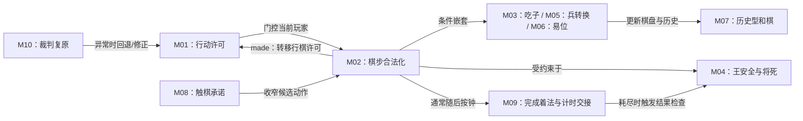

# 国际象棋：FIDE 桌面标准棋深度案例

- 案例编号：`chess-fide-2023-standard-otb`
- 分析深度：深度
- 状态：校准门 A 已通过；行为观察与实体复现待补
- 建档日期：2026-07-21
- 研究问题：离散、交替、确定、公开信息的棋类，能否作为当前规则语法的清晰锚点？它的特殊走法、历史权利、物理执行和竞赛裁定又会在哪里打破“选择棋子并改变位置”的简式？
- 案例角色：规则语法锚点；与实时数字游戏 Game Boy《俄罗斯方块》构成时间与执行对照
- 模板版本：[案例研究包 v0.2](../CASE-PACKET-TEMPLATE.md)

> 本文是研究包，不是国际象棋教程或完成书稿。规则事实以 FIDE 一手文本为准；玩家策略和体验若没有独立材料，只标为“规则所预期”或“工作假设”。

## 1. 案例范围卡

| 字段 | 锁定值 | 证据或理由 |
| --- | --- | --- |
| 游戏制品 | 标准初始局面的国际象棋 | FIDE Laws 第 1–3 条 |
| 规则集 | *FIDE Laws of Chess taking effect from 1 January 2023*；截至 2026-07-21 仍由 FIDE Rules Commission 列为 current Laws | [FIDE Handbook](https://handbook.fide.com/chapter/e012023)；[当前 35 页官方 PDF](https://rcc.fide.com/wp-content/uploads/2022/12/20230101Laws-of-Chess.pdf)；[Rules Commission 文档页](https://rcc.fide.com/documentation/) |
| 模式与配置 | 两人、桌面面对面、标准棋而非快棋或超快棋；从规定初始局面进行一局 | FIDE Laws 0.1、1、2、附录 A–B |
| 研究用时间控制 | 每方 90 分钟，第一步起每步加 30 秒 | 这是为使时钟状态可复现而选的研究配置，满足 Glossary 中 standard chess 每方至少 60 分钟的边界；不主张它是 FIDE 唯一“默认”时限。FIDE 第 6.3 条要求赛事预先规定时限 |
| 平台或物质形式 | 8×8 实体棋盘、棋子、双面棋钟、记录表；有裁判可处理竞赛规则 | FIDE Laws 第 2、6、8、12 条 |
| 游玩情境 | 遵循 Basic Rules 与 Competitive Rules 的一局；不锁定具体赛事、积分或配对制度 | 将局内结构与赛事结构分离 |
| 明确排除 | Chess960、网络棋、通信棋、快棋、超快棋、残局题、让子、赛事配对与跨局积分 | FIDE 文本明确其 Laws 覆盖 over-the-board play；附录另行处理快棋和超快棋 |
| 来源锁定日期 | 2026-07-21 |  |
| 关键来源制品 | FIDE 当前链接的 35 页 `20230101Laws-of-Chess.pdf` | 规则正文与条款定位均以此文件为准 |
| 完整性标识 | URL、35 页、2023-01-01 生效；本地 SHA-256 尚未保存 | 保留为证据缺口，不把可变 URL 当作不可变制品 |
| 复现状态 | 规则文本分析完成；`90+30` 实体棋钟、触棋、申诉与裁判路径尚未运行复现 | 不阻塞校准门 B，但不得写成已观察行为 |

### 版本歧义

**[来源事实]** FIDE 文本没有一个对所有标准棋赛事强制的单一时间控制，而是要求赛前规定。因此，本案把 `90+30` 当研究参数，不把它偷换为规则定义。若以后分析某届赛事，应建立新的案例单元并锁定该赛事规程。

**[未知]** 本轮尚未锁定一盘实际对局作为玩家行为样本。本文关于计算、威胁、计划与时间管理的句子因此均不标“已观察”。

## 2. 一分钟内讲清这局游戏

两名玩家各控制十六枚棋子，在所有人都看得到的 8×8 棋盘上轮流走一步。不同棋子拥有不同的到达方式；通常一次选择一枚己方棋子和一个合法终点，若终点有对方棋子便将其移除。玩家不能让自己的王处于被攻击状态，最终目标是让对方王受到攻击且没有合法应对。棋局也可能因逼和、无法将死、重复局面、长时间没有兵移动或吃子、双方同意、认输或时间耗尽而结束。

这个摘要故意说“通常”。王车易位同时移动两枚棋子；吃过路兵移除的棋子不在终点；升变更换实体类型；重复局面还依赖行棋权、王车易位权和吃过路兵可能性。它们正是本案的校准价值。

### 当前最小主张

> **[工作假设]** 国际象棋的一般走子可以表达为“有类型实体在离散空间中，经可达关系、占据与王安全共同判定后，原子地更新棋局并转移行动许可”；但完整 FIDE 对局还必须加入历史状态、物理承诺、计时、主张与裁判过程，不能压缩为 `位置 + 邻接 + 移动`。

### 双视图导航

- **教学最小视图**：本节通俗摘要、5.2 机制索引、5.3 普通棋步与第 6 节核心循环，足以解释“原语怎样经语法形成机制”。
- **研究充分视图**：第 4 节完整规则世界、5.4–5.7 边界机制、第 11 节失败与第 13 节证据账本，用来处理触棋、易位、历史和棋、棋钟与裁判。
- 教学视图省略的核心事实是：棋盘着法 `made`、行棋许可转移和按钟 `completed` 并非同一时点；需要讨论物质执行或计时时必须进入研究充分视图。

## 3. 证据边界

- **[来源事实]** 关于棋盘、走子、合法性、终局、棋钟、记录、和棋主张与裁判权限的陈述来自 FIDE Laws 的明确条款。
- **[综合判断]** 对原语、机制、编排和玩法模板的命名属于本项目分析，不代表 FIDE 或棋类研究界使用相同分类。
- **[观察]** 本案暂未纳入逐手对局、录像、访谈或实验，所以不对策略使用频率和主观体验作事实判断。
- **[反例]** 特殊走法不是边角噪声，而是用来检验简式是否遗漏身份、历史、复合效果和规则阶段。

## 4. 规则世界

### 4.1 参与者、能动性与执行

| 项目 | 内容 | 来源 |
| --- | --- | --- |
| 玩家 | 白方与黑方；白先行，此后交替 | FIDE 1.1–1.3 |
| 控制对象 | 每方开始控制同色的王、后、双车、双象、双马和八兵 | FIDE 2.2–2.3 |
| 系统或环境 | 棋钟连续减少当前玩家的剩余时间；它没有战略选择 | FIDE 6.1–6.3 |
| 规则执行 | 玩家日常执行走子、按钟与部分主张；裁判监督、复原、裁决并处罚 | FIDE 7、9、12 |
| 能动性边界 | 只有当前行棋方能作规则走子；对手可对和棋提议回应，裁判只在 Laws 指定处介入 | FIDE 1.2–1.3、9.1、12.6 |

这说明“系统”不一定是软件。棋钟、对手、记录表、玩家的规则义务和裁判共同执行了一套分布式规则系统。

### 4.2 **实体**、身份与标签

| 实体类型 | 实例 | 身份如何保持 | 可变标签或权限 |
| --- | --- | --- | --- |
| 棋子 | 初始 32 枚具颜色和棋子种类的实例 | 普通移动不改变实例；被吃后离开棋盘 | 位置、已移动历史；王和车的易位权相关历史 |
| 兵 | 每方八枚 | 升变时“兵”被新后/车/象/马替代；规则结果比物质棋子连续性更重要 | 首次移动资格、刚双步移动形成的短暂吃过路兵窗口 |
| 棋格 | 64 个具稳定坐标的地址 | 不随局面变化 | 颜色固定；占据关系可变 |
| 棋钟显示 | 白方与黑方各一 | 连接成同一设备的两个计时显示 | 运行/暂停、剩余时间、flag |
| 记录表 | 每方一份记录载体 | 可用于主张、复原和赛果确认 | 已记录着法、和棋提议、结果 |

**[综合判断]** “棋子种类”既可作为实体类型，也可作为决定可达关系的参数；“升变”提醒我们必须声明当前分析关注物质棋子、逻辑实体还是规则角色。若要求每个实体实例跨升变保持同一种类，模型会失真。

### 4.3 **状态**与事实

一个足以判断后续规则的棋局状态至少包括：

```text
BoardOccupancy
+ SideToMove
+ CastlingRights
+ EnPassantEligibility
+ RepetitionRelevantHistory
+ NoPawnMoveOrCaptureCount
+ ClockState
+ PendingClaimsOrDrawOffer
+ PhysicalCommitmentState
```

| 状态项 | 类别 | 更新时机 | 用途与来源 |
| --- | --- | --- | --- |
| 棋格占据 | 基础状态 | 棋步“made”时 | 走子、攻击、将军、终局；FIDE 2–5 |
| 当前行棋方 | 基础状态 | 对手的棋盘着法已经 `made` 时；通常早于按钟完成 | 行动许可；FIDE 1.2–1.3、4.7、6.2 |
| 王车易位权 | 历史压缩状态 | 王或相关车首次移动后永久失去 | FIDE 3.8.2、9.2.3.2 |
| 吃过路兵资格 | 短时历史状态 | 对方兵刚双步后的紧接一手 | FIDE 3.7.3.1–3.7.3.2 |
| 重复相关历史 | 历史 / 派生 | 每次局面完成后 | 三次主张与五次自动和棋；FIDE 9.2、9.6 |
| 无兵步或吃子计数 | 历史压缩状态 | 每个相关着法后重置或递增 | 50/75 回合和棋；FIDE 9.3、9.6 |
| 双方剩余时间 | 连续数值状态 | 对应一侧棋钟运行时连续变化 | 超时判负及时间分配；FIDE 6 |
| 触摸承诺 | 瞬时权限状态 | 有意触棋后，到合法着法作出 | 限制该回合后续可选动作；FIDE 4.2–4.5 |

**[反例]** 两个棋盘占据完全相同的局面，不一定是规则意义上的“同一局面”。若行棋方、易位权或吃过路兵可能性不同，FIDE 9.2.3 明确不把它们视为同一。这反驳 `GameState = Board`。

### 4.4 **关系**与权限

- `occupies(piece, square)`：可变、一对零或一；每格最多一枚在盘棋子。
- `controls(player, piece)`：由颜色阵营决定；本局中不会转移。
- `attacks(piece, square, position)`：依棋子类型、方向、阻挡和局面派生；攻击不等于当前允许移动，受牵制棋子仍可能“攻击”某格（FIDE 3.1.3）。
- `reachableByType(piece, source, destination)`：只给出局部候选，不足以证明走子合法。
- `hasMove(player)`：当前行动许可；双方交替转移。
- `hasCastlingRight(player, rookSide)`：历史依赖的规则许可，不是棋盘坐标的别名。

**[综合判断]** 棋子由玩家**拥有**、**控制**、**保管**在棋盘上且被规则**许可**移动，四者在这局中经常同向，却仍不是同一关系。例如玩家控制一枚被牵制的棋子，但规则不许可某些走法；裁判可要求复原棋子，却没有取得该棋子的战略控制。

### 4.5 **规则空间**

- 64 个具坐标的离散位置，具有行、列、斜线、相邻和颜色关系。
- 车、象、后使用沿直线或斜线的射线可达关系，并受中间占据门控；马使用非行、列、斜线的近邻跳跃；兵具有方向和动作类型相关的可达关系；王通常使用相邻关系。
- 路径对线路棋子、兵双步和王车易位有规则意义；普通目的地更新本身通常不保留经过格。
- 物质空间与规则空间大体对应，但棋子的拿起轨迹没有空间规则意义；王车易位的规定执行顺序和触棋则有物质规则意义。

因此，“相邻”不是移动机制的必备原语；更一般的槽位是由实体类型和当前状态共同定义的**可达关系**。

### 4.6 **时间结构**

本案同时存在至少四种时间：

1. **交替行动序**：白先行；一方棋盘着法已经 `made` 后，对方便取得行棋权。
2. **着法内部阶段**：声明/触碰 → 操作棋子 → `made` → 按钟 → `completed`。
3. **历史窗口**：吃过路兵只存在一手，触棋承诺存在到当前着法结束，和棋主张依赖更长历史。
4. **连续物理时间**：当前一方的棋钟在思考和执行期间消耗。

**[来源事实]** FIDE 1.3、4.7 与 6.2 把三个常被混写的时点分开：棋盘着法 `made` 后对手已经有行棋权；行动方通常还要按钟才使该着法 `completed`；按钟同时暂停自己的钟并启动对手的钟。两者之间的时间仍计入刚行动的一方。某些结束游戏的着法无需再按钟便完成，对手也可能在前一方尚未按钟时已经走子。

**[综合判断]** 行动许可与计时责任因而是两条通常同步、却不严格重合的状态通道。把它们合成一个“回合切换”原语会丢失合法的中间态。

**[综合判断]** “回合制”不是没有实时性，而是行动许可离散交替；计时、触摸和物质执行仍发生在连续时间中。这正是与《俄罗斯方块》比较时要保留的结构。

### 4.7 **集合结构**

- `piecesOnBoard(player)`：无序、容量随吃子下降，可见。
- `legalMoves(position, player)`：由状态派生的有限集合；某些元素是复合状态转换而非单实体位移。
- `positionHistory`：有序历史，部分规则只需压缩计数，重复主张却要比较等价局面。
- `scoresheetMoves`：有序记录，既是记忆外置，也是主张与复原证据。

### 4.8 **资源**与资源操作

| 资源候选 | 判断 | 理由 |
| --- | --- | --- |
| 棋钟时间 | 明确资源 | 稀缺、跨多个未来行动配置、持续消耗，耗尽可能直接结束游戏 |
| 棋子 | 资源角色成立，但首先是实体 | 数量有限，可牺牲、交换并服务多个空间与攻击用途；“价值”不由 FIDE 规则表直接规定 |
| 行动机会 | 资源类比需谨慎 | 每次只允许一手且不可储存；更适合表达为轮流授予的许可 |
| 王车易位权 | 可消耗权限，不直接定为资源 | 一旦王/车移动便失去，存在保留与使用权衡；但没有可交换数量和多个独立单位 |

**[综合判断]** 同一个对象可在不同分析角色中既是实体又是资源载体；原语分类若要求“棋子只能属于一个盒子”会降低解释力。

### 4.9 **信息结构**

在规则相关的棋盘、行棋方、棋钟和公开历史范围内，本案是公开信息的：双方可观察同一棋盘与时钟，并记录着法。玩家的计划、评价与计算过程不是规则世界中的公开状态。

因此更准确的说法是：

```text
公开的规则状态 ≠ 相同的玩家信念 ≠ 相同的局面理解
```

**[工作假设]** 玩家可能遗忘历史权利、误判攻击关系或没有计算到某条变化；这属于观察和信念差异，不能因此把规则本身称为隐藏信息。

### 4.10 **随机性**与不确定性

- 规则结算没有随机抽样；给定完整状态和合法着法，直接结果确定。
- 对手的下一选择和玩家有限计算造成战略不确定性。
- 棋钟、人手操作、裁判判断和规则违规会造成执行不确定性，但不把基础棋步结算变成随机机制。

### 4.11 **目标**、终止与评价

| 层面 | 内容 | FIDE 定位 |
| --- | --- | --- |
| 规则目标 | 使对方王受攻击且对方没有合法着法，即将死 | 1.4 |
| 即时胜负 | 将死、认输；竞赛规则还可因超时或违规判负 | 5.1、6.9、7.5.5、12.9 |
| 和棋 | 逼和、死局、协议；三次重复/50 回合可主张，五次重复/75 回合自动结束 | 5.2、9 |
| 结果评价 | 一般胜方 1 分、负方 0 分、和棋各半分；赛事可另定 | 10 |
| 玩家目标 | 保存棋子、控制中心、进入某种残局等只能暂作策略性子目标，非规则终局条件 | 需玩家或教学材料另证 |

## 5. **机制**分解

### 5.1 尺度声明

本案把“棋步合法化与执行”视为核心复合机制，并把棋子可达、吃子、王安全、权限转移等作为可独立比较的机制单元。完整竞赛对局是机制系统。若把每种棋子的走法都叫一套完整机制，会失去它们共享的合法性与结算骨架；若只写“国际象棋移动机制”，又会掩盖易位、升变和历史权利。

### 5.2 机制索引

| ID | 暂定名称 | 尺度 | 规则结构 | 主要来源 |
| --- | --- | --- | --- | --- |
| M01 | 行动许可交替 | 单元 | 棋盘着法 `made` 后把行棋许可转给对手；不等待棋钟交接 | 1.2–1.3、4.7、6.2 |
| M02 | 有类型棋步合法化 | 复合 | 可达 + 占据/路径 + 王安全 + 当前许可 → 合法着法 | 3.1–3.10 |
| M03 | 吃子 | 单元 | 进入敌方占据格时，作为同一步移除对方实体 | 3.1.1 |
| M04 | 将军—将死约束 | 复合 | 攻击关系限制己方合法着法；无合法应对时终局 | 1.4、3.9、5.1.1 |
| M05 | 特殊兵转换 | 复合 | 首步双进、短窗吃过路兵、终线强制升变 | 3.7 |
| M06 | 王车易位 | 复合 | 历史权利 + 空路 + 安全路径 → 一步更新两枚棋子 | 3.8.2 |
| M07 | 历史型和棋 | 复合 | 重复/无兵步无吃子历史 + 主张或自动阈值 → 和棋 | 9.2–9.6 |
| M08 | 触棋承诺 | 单元 | 有意触碰把本回合选项收窄到被触棋子/吃子 | 4.2–4.5 |
| M09 | 棋钟交接与超时 | 复合 | 当前钟运行；按钟完成着法并切换；耗尽触发结果判定 | 6.1–6.10 |
| M10 | 违规复原与裁定 | 系统 | 发现违规 → 回退/复原 → 时间调整/处罚 → 继续或终局 | 7、12 |

### 5.3 核心机制卡：M02 有类型棋步合法化

- **触发**：当前行棋方准备移动己方棋子。
- **触发策略**：每个交替行动窗口可选择一次；触棋后选择可能被 M08 收窄。
- **行动者与输入**：玩家选择一个受控棋子及规则允许的目的地；升变等情形另含参数。
- **规则动作**：`ChessMove(piece, destination, optionalChoice)`。
- **前置条件**：玩家拥有当前行动许可；棋子在盘且由该玩家控制。
- **合法性**：棋子种类的可达关系、路径/占据约束和“完成后己方王不受攻击”全部满足。
- **成本**：消耗一次不可储存的行动许可，同时消耗思考与执行时间。
- **结算**：更新位置；若适用则吃子、升变、更新历史权利与计数；检测终局；着法 `made` 后转移行棋许可。通常随后按钟完成前一着并切换计时责任。
- **效果时机**：规则把一次棋步当作离散转换，但物质执行存在开始、作出和完成阶段。
- **反馈**：新棋盘布局和棋钟状态公开可见；“是否将军”通常由玩家自行识别，规则不要求对手口头宣布。
- **来源定位**：FIDE 1.2–1.4、3、4.7、5、6.2。

```text
SideToMove(player)
+ Reach(pieceType, source, destination)
+ OccupancyAndPath(position)
+ KingSafe(resultingPosition)
  → ChessMove
  → BoardDelta + HistoryDelta + PermissionHandoff
  → usually ClockHandoff / MoveCompleted
```

### 5.4 边界机制卡：M06 王车易位

- **触发**：行棋方选择王，并按易位规则操作王与一侧车。
- **前置**：王与相关车从未移动；两者之间无棋子；王不在被攻击格且不穿越或落在被攻击格。
- **结算**：规则称其为王的一步，却原子地更新王和车两个实体的位置。
- **历史效果**：使用后及任何王/车此前移动后，对应易位权丧失。
- **物理承诺**：王先触后触车与车先触后触王产生不同许可后果。
- **校准价值**：反驳“一个动作只有一个 actor/一个位置效果”；机制语法需要允许复合参与实体与多状态差分。

### 5.5 边界机制卡：M07 历史型和棋

- **触发**：玩家提出合规主张，或五次重复/75 回合阈值自动达到。
- **规则动作**：这里的关键动作不是棋子移动，而是对历史条件的声明与验证。
- **结算**：玩家与裁判可暂停时钟，检查记录或复原历史；正确主张立即和棋，错误主张按规则继续并可能调整时间。
- **校准价值**：单看当前棋盘不足；“目标判定”有时由事件触发自动执行，有时需要有资格的参与者调用。

### 5.6 边界机制卡：M09 棋钟交接与超时

- **触发**：白方时钟在开局启动；每次一方作出棋盘着法后通常按钟切换；flag fall 由裁判观察或有效主张确认。
- **过程**：思考和物质操作共享同一持续递减资源；每步增益按研究配置加入。
- **结果**：超时通常判负，但若对手无法通过任何合法着法序列将死，则为和棋。
- **校准价值**：触发事实“时间已耗尽”和规则承认“flag 已落”之间可能隔着观察或主张；实时过程嵌在交替回合结构内部。

### 5.7 校准门 A 回填：生命周期、调度、执行与身份

| 机制 | **动作生命周期** | **调度语义** | 执行来源 / 裁定权 | **实体身份效果** |
| --- | --- | --- | --- | --- |
| M02 普通棋步 | 选择与物质操作 → 按 4.7 `made` → 行棋许可转移 → 通常按钟 `completed`；立即终局等路径不要求相同尾段 | `SideToMove` 门控离散棋步；对手可在棋盘着法作出后获得行动权，不必等待前一方按钟 | 玩家物质执行；双方与裁判按竞赛规则检查，争议由裁判裁定 | 普通移动保留棋子身份；若吃子则同时移除目标 |
| M06 王车易位 | 触王、触车、移动与释放的顺序改变许可和承诺；最终作为王的一步提交 | 位于一次行棋作用域内，王与车的位置作为联合效果处理 | 玩家执行；裁判处理错误顺序或非法着 | 保留王与车两个身份，原子更新两个位置 |
| M07 历史型和棋 | 条件形成 → 合资格主张或自动阈值 → 核验 → 终局或恢复继续 | 历史事实跨回合累积；主张窗口、暂停和核验嵌入行动顺序 | 玩家发起部分主张；裁判核验与裁定 | 通常保留实体，只改变终局与许可状态 |
| M09 棋钟与超时 | 钟运行 → 着法 `made` → 按钟完成并切换 → 落旗被观察或有效主张 → 结果判定 | 两个互锁时钟连续运行，与离散行棋许可形成独立状态通道 | 棋钟实装计时；玩家按钟；裁判或有效主张确认落旗 | 不适用；主要更新计时、许可与终局状态 |

## 6. 机制间的**编排**



核心循环不是“移动 → 移动”的关键词相加，而是：

```text
观察公开状态
→ 在当前许可与剩余时间内选择
→ 物质承诺与合法性约束
→ 原子棋局更新并转移行棋许可
→ 终局/历史检查
→ 通常完成按钟与计时交接
→ 对手面对新状态
```

吃子改变未来实体集合和可达关系；王安全把对手攻击网络反向接入己方动作合法性；时钟让每次计算使用共享的跨局资源；历史型和棋防止部分无限循环。它们不是彼此独立的“功能列表”。

## 7. 玩家层

### 7.1 决策情境

| 情境 | 权衡 | 当前证据状态 |
| --- | --- | --- |
| 从多个合法着法中选择 | 立即棋盘变化与对手可能回应不同，且通常不可撤回 | 规则保证差异后果；哪些选择“好”尚未以对局材料支持 |
| 是否交换或牺牲棋子 | 失去实体与换取位置、节奏或攻击机会之间的权衡 | 结构推断，待玩家/棋谱证据 |
| 是否保留易位权 | 当前移动王/车的收益与永久失权之间的权衡 | 规则支持不可逆性；实际策略待证 |
| 如何分配思考时间 | 当前决策质量与未来剩余时间之间的跨期配置 | 规则支持资源结构；行为分布待证 |
| 是否提出和棋或主张 | 结束机会、错误主张后果与继续下棋的价值 | 规则支持可选动作；实际使用待证 |

### 7.2 推理、执行与协调

- **规则预期**：玩家必须辨认合法着法、攻击关系、将军和部分可主张条件。
- **工作假设**：玩家会形成对未来着法序列的条件性计划，但深度和形式依水平、时间与局面而变。
- **物质执行**：触棋、单手移动、按钟和记录都可能影响合法性与时间，不只是无语义的界面包装。
- **社会层**：直接合作不存在；和棋提议、主张、礼仪与裁判沟通构成有限的规则化互动。

### 7.3 **策略**与体验边界

“控制中心”“发展子力”“双攻”“弃子”等常用棋类概念不能仅凭 FIDE Laws 写成机制；它们可能是条件性策略、战术模式或教学概念，需要棋谱、棋手陈述或可靠教学材料另证。

同理，“紧张”“纯粹”“公平”“烧脑”都不是从完全信息、确定结算或高分支数自动推出的体验事实。当前只可提出待测试假设：公开状态减少了信息获取的不确定性，却没有消除对手选择、计算限制与计时造成的决策压力。

## 8. **玩法模板**候选

| 候选 | 编排签名 | 持续活动 | 成立条件 | 状态 |
| --- | --- | --- | --- | --- |
| 交替式公开状态位置对抗 | 唯一行动许可交替 → 有类型空间转换 → 攻击/安全约束 → 不可逆与历史反馈 → 终局 | 观察局面、比较合法行动及其回应、提交一步、重新评估 | 双方共享规则状态；行动影响对手未来行动空间；目标冲突 | **[工作假设 / 规则预期]** |
| 计时的确定性搜索对抗 | 上述结构 + 跨行动消耗的个人时间资源 | 在有限时间内决定计算深度与着法 | 使用棋钟且非无限时间；玩家能理解未来分支 | **[工作假设]** |

**[模型压力]** “国际象棋”常被当作一个游戏类型的典范，但为它命名玩法模板时很容易只是改写“轮流下棋”。若一个模板不能帮助比较围棋、将棋、战争棋或回合战术游戏中的成立条件与差异，它就没有超出作品标签。本轮暂保留描述性候选，不急于入词典。

## 9. 从模板到这款**游戏**

- 抽象阵营被绑定为白、黑；棋子类型和初始布局提供具体可达结构。
- 8×8 棋盘、六类棋子、兵方向、易位与升变参数共同限定状态空间；更换其中任何一项都可能生成亲缘棋类而非仅换皮。
- 实体棋具使触摸顺序、单手操作、按钟和人工复原成为规则相关事件；数字实现通常会在输入前后自动过滤合法性，从而改变承诺和违规机制。
- 标准棋、快棋和超快棋共享大量棋步结构，却因时间、记录和裁判条款形成不同案例单元。
- 一盘具体对局是规则系统的一条历史轨迹，不等于作为制品和规则集的“国际象棋”。

## 10. 跨案例比较准备

| 比较对象 | 暂定关系 | 理由 |
| --- | --- | --- |
| 国际象棋普通棋步与王车易位 | 同一棋步系统中的不同结构子型 | 都消耗一手并转移许可；后者同时更新两个实体且依赖历史权限 |
| 实体棋与合法着法自动过滤的数字棋 | 核心棋局可能行为等价，执行结构不等价 | 数字系统可阻止非法声明，消除触棋与人工复原的部分路径 |
| 国际象棋与 Game Boy《俄罗斯方块》 | 功能类比待检验，不主张机制同构 | 都有空间占据、输入、合法性和终局；行动许可、时间、控制对象和状态更新根本不同 |

## 11. 反例、失败与模型压力

### 11.1 当前模型解释最顺畅之处

- **实体—状态—关系—动作—前置—结算—效果**能够清楚拆开普通棋步。
- “规则空间”比几何图更准确：不同棋子共享棋盘，却读取不同可达关系。
- 世界、观察与信念的区分避免把“完全信息”误写成“玩家知道最佳着法”。
- 时间作用域能同时容纳交替回合、着法阶段、短暂权利与连续棋钟。

### 11.2 活跃失败

| ID | 类型 | 症状 | 临时处理 | 门审 |
| --- | --- | --- | --- | --- |
| CH-F01 | 粒度漂移 | “移动”可指坐标状态更新、玩家棋步、复合易位或移动机制家族 | 每次声明对象与尺度；不把同词当同结构 | A |
| CH-F02 | 无法用单 actor 简式表达 | 王车易位一手改变两个受控实体，吃过路兵移除非终点实体 | 机制卡允许参与实体集合和多重状态差分 | A |
| CH-F03 | 状态遗漏 | 仅记录棋盘不能判断重复、易位、吃过路兵与 50/75 回合规则 | 显式加入历史压缩状态和历史序列 | A |
| CH-F04 | 时间阶段歧义 | 日常语言的“走完一步”混合 `made` 与 `completed` | 区分物质声明、棋盘作出、按钟完成和许可转移 | A |
| CH-F05 | 跨媒介失真 | 把实体棋输入当无意义外壳会漏掉触棋、单手、按钟、违规复原 | 把输入映射与规则动作分开，但保留有规则后果的物质事件 | A |
| CH-F06 | 模板失配 | 模板 v0.1 对“裁判/执行者”表达充分，但每个机制卡没有独立裁定者槽 | 暂写入行动者与结算；与数字自动执行案例比较后决定 | A |
| CH-F07 | 证据不足 | 规则可以支持“预期决策”，不能支持策略频率和体验 | 保留未知；后续加入具体棋谱/访谈观察包 | 延后 |
| CH-F08 | 状态通道误合并 | 初稿把行棋许可转移与棋钟交接都放在 `completed`；FIDE 1.3 表明许可在 `made` 时已转移 | 分开 `SideToMove` 与 `ClockRunning`，保留合法中间态 | A |

详细跨案例登记见[第一轮失败清单](../../research/calibration-failure-log.md)。

### 11.3 竞争解释

- 若把“走子”定义为合法着法集合中的一次状态转换，王车易位并不反例；但此定义已比空间移动宽，可能把非空间动作也收进来。
- 若把物理触棋和按钟全部视为外围竞赛流程，抽象棋类模型更简洁；代价是无法解释实体赛与数字棋的不同合法行为轨迹。
- 若把“棋子价值”写进规则世界，资源分析更顺滑；代价是把经验性评价误作 FIDE 明定数值。

## 12. 设计变体与预测

| ID | 隔离改变 | 保持不变 | 规则预测 | 玩家后果假设 | 最小测试 |
| --- | --- | --- | --- | --- | --- |
| V01 | 移除王安全约束，允许王被吃 | 其他棋子可达与交替结构 | “将军”不再限制合法着法，终局改为吃王后 | 玩家无需回应即时将军，部分当前将杀结构消失 | 实现变体并比较合法着法图与终局长度 |
| V02 | 每方每回合可连续走两手 | 棋盘、棋子与将死目标 | 行动许可从单步交替改为双步批次 | 威胁与回应节奏改变，首行动方优势可能扩大 | 对小型残局穷举，对称交换先后手 |
| V03 | 当前棋盘相同即视为重复，不比较权利 | 其他和棋阈值 | 某些失去易位/吃过路兵资格的局面被误合并 | 可更早主张和棋，并产生针对权利差的策略利用 | 构造 FIDE 9.2.3 边界局面 |
| V04 | 数字界面在选择前过滤所有非法着法 | 核心合法状态转换 | 非法动作不再能被完成，触棋和复原机制退出 | 降低规则执行负担，但改变承诺与误操作空间 | 同一玩家交叉体验实体与数字原型 |

## 13. 证据账本

| ID | 主张 | 类型 | 范围 | 来源与定位 | 支持 / 不支持 |
| --- | --- | --- | --- | --- | --- |
| C001 | FIDE 2023 Laws 是当前列示的桌面棋规则，分基本与竞赛两部分 | 规则/版本事实 | 截至 2026-07-21 | FIDE Laws 0.1；Rules Commission Documentation | 支持本案版本；不证明所有实际对局均遵守 |
| C002 | 双方在 8×8 棋盘上由白先、交替移动 | 规则事实 | 本规则集标准初始局面 | FIDE 1.1–1.3、2.1 | 支持行动序与空间；不支持玩家策略 |
| C003 | 合法棋步由棋子走法、占据/路径和己王安全共同限制 | 规则事实 | FIDE 基础规则 | FIDE 3.1–3.10 | 支持 M02；不证明这就是最小机制分解 |
| C004 | 易位算王的一步并移动王与车，且依赖历史与安全条件 | 规则事实 | 标准易位 | FIDE 3.8.2 | 支持多实体效果和历史权限 |
| C005 | 相同棋盘占据不足以判断重复局面 | 规则事实 | 三次/五次重复 | FIDE 9.2.3 | 支持完整状态必须含行棋方与相关权利 |
| C006 | 棋盘着法作出、行棋权转移与按钟完成/计时交接不是一个规则时点 | 规则事实 | 竞赛桌面棋 | FIDE 1.3、4.7、6.2 | 支持动作阶段及双状态通道；不代表所有非竞赛棋 |
| C007 | 触摸顺序会收窄当前玩家可选动作 | 规则事实 | 实体桌面竞赛规则 | FIDE 4.2–4.5 | 支持物质输入具有规则后果 |
| C008 | 超时通常判负，但对手不可能将死时为和棋 | 规则事实 | 竞赛桌面棋 | FIDE 6.8–6.9 | 支持时间与终局耦合 |
| C009 | 玩家会以棋子、位置和时间进行条件性长期规划 | 行为假设 | 未锁定玩家与局面 | 尚无行为来源 | 不能写为已观察，留待补证 |
| C010 | 本案可概括为“交替式公开状态位置对抗”模板 | 项目工作假设 | 本案例单元 | 本文第 6–8 节综合 | 待跨棋类和实测活动校准 |

### 规则实现层补记

| 层 | 本案已覆盖 | 尚未覆盖 |
| --- | --- | --- |
| 规范 | FIDE 2023 Laws 条款与当前版本入口 | 具体赛事规程、设备型号与赛场附加条件 |
| 实装 | 仅覆盖规范对棋盘、棋子、棋钟与记录结构的要求，不算具体制品证据 | 一套已记录型号、照片与状态的实体夹具 |
| 执行 | 仅覆盖规范对玩家、裁判和主张程序的职责分配，不算实际执行证据 | 一次实际裁判过程是否按规定执行 |
| 观察 | 暂无 | 锁定棋局、时间记录、录像或现场日志 |

### 来源清单

- Fédération Internationale des Échecs. [*FIDE Laws of Chess taking effect from 1 January 2023*](https://handbook.fide.com/chapter/e012023)；[当前官方 PDF](https://rcc.fide.com/wp-content/uploads/2022/12/20230101Laws-of-Chess.pdf)，2023-01-01 生效，访问于 2026-07-21。
- FIDE Rules Commission. [Documentation](https://rcc.fide.com/documentation/)，用于核验 current Laws 入口，访问于 2026-07-21。
- 第一轮校准的一手来源、版本陷阱与复现清单见[校准门 A 资料包](../../research/sources/calibration-a-primary-sources.md)。
- 项目内部对照：[移动机制案例试验](../../research/pilots/movement-case-study.md)，尤其是第 3、6.1、7–10 节。

## 14. 校准门 A 后结论

- 保留：有类型可达关系、占据、行动许可、历史状态、触发/主张、规则动作与物质输入分离。
- 已采纳：机制卡增加执行来源、裁定权和按需的**动作生命周期**；不把 `declared → made → completed → recognized` 固化为万能阶段。
- 原语候选：`许可`、`历史窗口`、`可达关系`、`连续计时状态`；它们仍需通过跨案例准入检验，不能因国际象棋一案直接录取。
- 后续取证：保存 FIDE PDF 的本地 SHA-256；选取一盘明确版本和时限的实际棋局，加入棋谱、时间或录像，检验预期玩家活动。上述缺口不阻塞校准门 B。
