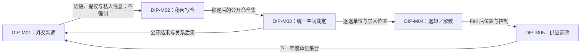

# 《外交》：Hasbro 第四版七人标准局

- 案例编号：`DIP-HASBRO-4E-7P-STANDARD`
- 分析深度：标准
- 状态：结构分析完成，具体对局与行为证据待补
- 案例角色：秘密批次提交、社会沟通与共同裁定的对照
- 研究日期：2026-07-21
- 模型版本：案例研究包模板 v0.3
- 共用来源包：[星际争霸 × 外交一手来源与版本冻结](../../research/sources/calibration-starcraft-diplomacy-primary-sources.md)

> 本案研究的是一套明确规则制品下的七人标准配置，不把“谈判、结盟、承诺、背叛”当作已经观察到的玩家行为。规则允许玩家说话、写协议并不受其约束；只有进入规则认可的书面命令、公开、合法性检查和裁定流程后，行动才直接改变棋盘状态。

## 1. 案例范围卡

| 字段 | 锁定值 | 证据或理由 |
| --- | --- | --- |
| 游戏制品 | Avalon Hill／Hasbro《Diplomacy》 | 官方规则 PDF |
| 规则制品 | *The Rules of Diplomacy*, 4th Edition 2000，英文 24 页 | PDF 封面与页码；官方 Hasbro `common/instruct` 下载 |
| 玩家数 | 七名玩家，分别控制 Austria、England、France、Germany、Italy、Russia、Turkey | 规则 p.1 称七人是最佳方式，并列出七个 Great Powers |
| 势力分配 | 玩家 A–G 依上表顺序分配 | **项目夹具**；固定规则所述随机分配的一次可能结果，不把该顺序称为官方标准 |
| 地图与初始状态 | 第四版规则所描述的标准欧洲省份图；Spring 1901 官方起始单位与供应中心 | 规则 pp.1–2；同版实体地图的字节身份尚未另行冻结 |
| 执行配置 | 七名玩家共同核对；另设一名中立 `gamemaster` 负责计时、收集／宣读命令与争议裁定 | **项目夹具**；规则 p.4 允许有知识且严格中立的人承担该角色 |
| 时间配置 | 首轮外交 30 分钟，此后每轮 15 分钟；外交后写令最多 5 分钟 | 规则 pp.3、18；本夹具采用规则给出的时限 |
| 终局 | Fall 检查后，一方控制至少 18 个供应中心即获胜 | **来源事实＋项目夹具**：规则 p.1、p.3；本夹具关闭规则允许的协商和局 |
| 协商和局 | 不启用 | **项目夹具**；官方规则允许仍有棋子的玩家一致同意平局，但本案为固定终局而排除该路径 |
| 明确排除 | 少于七人变体、缩短局、线上平台自动裁定、电子通信、赛事补充规则、房规、特定开局／联盟／背叛轨迹 | 防止执行载体和行为证据混用 |
| 来源锁定日期 | 2026-07-21 |  |
| 关键来源制品 | `https://www.hasbro.com/common/instruct/diplomacy.pdf` | Hasbro 官方托管英文规则 |
| 完整性标识 | `2,642,044` bytes；SHA-256 `F28C34B97C20933E8629073EB129576703BF7FAB7FCBD88DB15B15A89037C42D` | 主线程下载、哈希并视觉核验 p.1、3、4、18；完整来源记录见来源包 |
| 复现状态 | 部分复现 | 规则制品与材料布局可复核；没有七人命令集、谈判记录或完整裁定轨迹 |

### 1.1 版本歧义

- 当前 Hasbro F3155 产品页不能替代本规则身份。其 `en-us` 下载接口在 2026-07-21 实际返回西班牙文 2021 制品；该入口错误和新版物料必须作为版本缺口保留。
- 第四版 PDF 的封面写 `4th Edition 2000`，PDF 元数据创建／修改时间为 2001-05-16；版本名、排印时间与当前下载时间不是同一字段。
- 本案不把 Renegade Games 的后续版本、赛事裁判惯例或在线平台的自动裁定结果补进第四版规则。
- 本案只固定抽象座位 A–G 与七个强国的映射，不冻结实际玩家身份、抽签过程或社交关系；没有具体谈判、秘密命令、退却或调整记录，因此仍是规则／配置案例，而不是唯一游玩实例。
- 规则 PDF 能支持省份类型、邻接规则、初始单位和供应中心结构，但同版实体地图制品尚未另行扫描与哈希；不能把当前零售版地图图样静默回填给本案。

## 2. 为什么研究它

### 2.1 一分钟内讲清这局游戏

七名玩家各控制一个欧洲强权。每个春、秋回合先自由谈判：可以私聊、结盟、威胁、传播信息、公开或秘密写协议，也可以不履行说过的任何内容。随后每人秘密为自己的单位写命令；所有命令一起公开，再根据移动、支持和运输规则统一判断哪些成功、哪些僵持、哪些单位被逐退。秋回合后按控制的供应中心数量增减单位。最先控制 18 个供应中心的玩家获胜。

### 2.2 本案承担的检验任务

- 区分社会话语、协议内容、玩家信念与规则认可的书面命令。
- 检查**秘密同时提交**究竟需要哪些里程碑：草拟、修正、收集／截止、公开、合法性检查、统一裁定和棋盘更新。
- 复验 [ADR 0091](../../docs/adr/0091-model-decision-locking-without-a-commitment-primitive.md)：现有**锁定点**与**决策锁定**能否表达命令，同时承认社会承诺可能是另一种对象。
- 与[《星际争霸》](starcraft-brood-war-1.23.10-eldritch-lake-1v1.md)区分两种“同时”和两种隐藏信息。
- 检查物质书写、口头沟通、共同核对与中立主持是否属于可删去的呈现；预期答案是否定的。

### 2.3 当前最小主张

> **[工作假设]** 《外交》的核心不是“承诺会强制未来行动”，而是规则把**不具约束力的沟通**、**私有且可修改的计划**、**在锁定点失去修改权的书面命令**与**统一公开裁定**编排在一起。把承诺、命令和行动合成同一原语会同时误写社会层与规则层。

## 3. 证据与术语约定

规则书能直接支持允许说什么、何时写令、怎样公开和裁定、怎样控制供应中心；它不能证明玩家实际信任、欺骗、背叛、结盟或采用某种开局。本文用**[来源事实]**记录规则，用**[项目夹具]**记录固定配置，用**[结构推导]**解释关系，用**[行为待证]**标记需要对局材料的主张。

### 3.1 来源语域与术语映射

| 来源术语与来源身份 | 来源中的操作性含义 | 映射关系 | 项目共享术语或概念拆解 | 不能自动等同 |
| --- | --- | --- | --- | --- |
| `Diplomatic Phase` | 每个 Spring／Fall 回合前的限时自由谈判阶段 | 来源较窄 | **沟通时间窗＋私有／公开传播许可** | 外交玩法的全部；约束性契约 |
| `promise`／`agreement` | 玩家可口头或书面表达的未来意向，规则明确不约束 | 拆分 | **社会话语事件＋信息观察＋可能的信念／规范关系** | 规则命令；锁定点；必然履约 |
| `order` | 为单位写下的 `Hold`、`Move`、`Support`、`Convoy` 等正式指令 | 近似映射 | **规则认可的书面命令** | 谈判提议；已经发生的移动 |
| `simultaneously revealed` | 所有人写令后在同一公开边界展示命令 | 来源较窄 | **批次公开事件** | 程序中的逐 tick 并发执行 |
| `resolve` | 根据整批命令与规则判定成功、冲突、逐退等结果 | 拆分 | **快照式批次裁定＋状态差分提交** | 逐个玩家轮流移动棋子 |
| `supply center` | 特定省份上的标记位置；秋季控制数限定单位数并参与 18 点胜利 | 拆分 | **带控制关系的空间节点＋单位容量／调整资格＋胜利进度** | 可消费库存；《星际争霸》的供应容量 |
| `unit` | Army 或 Fleet；力量相同，按类型受空间约束 | 近似映射 | **有身份单位实体＋省份占据关系** | 资源点；玩家；一次命令 |
| `country`／`Great Power` | 规则用 `country` 泛指七个 Great Powers | 来源特定 | **阵营／政治实体角色** | 现实国家定义；玩家本人 |
| `gamemaster` | 可选中立主持，计时、收令、宣读、解题与裁定 | 来源较窄 | **执行协调者＋裁定者** | 系统玩家；拥有单位的行动者 |

## 4. 规则世界

### 4.1 教学最小视图

```text
限时谈判（说法不具规则约束力）
→ 各自秘密写令并可在锁定前修改
→ 整批命令同时公开
→ 按移动／支持／运输关系统一裁定
→ 更新单位位置、逐退与供应中心控制
→ 秋季按控制数建造或裁减单位
```

这张图省略了海岸、运输路线、支持切断、自我逐退限制、退却冲突、无效／歧义命令和 civil disorder；它们在研究充分视图中保留，但不要求读者先掌握全部例外。

### 4.2 参与者、能动性与执行

| 项目 | 内容 | 证据状态 |
| --- | --- | --- |
| 玩家与阵营 | 七名玩家各控制一个 Great Power | 规则 p.1；分配为项目夹具 |
| 玩家控制的对象 | 本阵营 Army／Fleet 的正式命令、谈判话语、退却和建造／裁减选择 | 规则 pp.3–18 |
| 系统或环境行动者 | 没有自主程序对手；civil disorder 会在缺令时产生默认保持／裁减规则 | 规则 p.18 |
| 共同执行者 | 各玩家宣读，其他人核对书写内容；棋子按裁定结果移动 | 规则 p.3 及执行说明 |
| 中立主持 | 本夹具的 gamemaster 计时、收集、宣读并在必要时裁定 | 规则 p.4 允许；项目固定采用 |
| 能动性边界 | 玩家能说任何内容，但不能用话语直接改棋盘；公开后的合法命令必须按规则处理 | 规则 p.3 |

这是一种分布式规则实现：规范写在规则书，输入由玩家书写，公开由群体／主持执行，裁定可由规则知识与中立裁决完成，棋盘再由参与者物质更新。没有任何一层可独自等同“游戏规则已经执行”。

### 4.3 实体、状态与关系

| 类型 | 关键状态或关系 | 更新边界 | 证据 |
| --- | --- | --- | --- |
| Great Power | 对供应中心的控制、拥有的单位集合、是否仍在棋盘 | 秋季控制检查、单位增减、终局 | 规则 pp.1–3、17–18 |
| Army／Fleet | 类型、所在省份、控制阵营、当前命令、是否逐退 | 命令公开／裁定／退却 | 规则 pp.2–17 |
| 省份 | 内陆／海域／沿海类型、邻接、是否供应中心、当前占据与控制 | 移动、秋季控制检查 | 规则 pp.1–2 与地图 |
| 书面命令 | 日期、单位来源、动作、目标／受支持移动、秘密／公开状态、合法性 | 写令、锁定、公开、裁定 | 规则 pp.3–17 |
| 谈判话语／文件 | 说话者、受众、内容、公开／私有 | 外交阶段 | 规则 p.3；规则不追踪真诚度或履约 |

核心关系包括：玩家对 Great Power 的**控制**，Great Power 对单位的**控制**，单位对省份的**占据**，Great Power 对供应中心的**控制**，单位对另一命令的**支持**或参与**运输路线**，以及话语在说话者与受众之间形成的**信息传播**。

### 4.4 规则空间

- 地图是有类型的省份图：内陆、海域与沿海省份具有不同可进入实体类型；某些沿海省份还有多海岸细分。
- 一个省份同一时刻至多容纳一个单位。Army 在内陆／沿海邻接中移动；Fleet 在海域／沿海邻接中移动。
- `Support` 不是把单位移动到受支持者位置，而是在目标省份可达条件下为特定保持或移动增加力量。
- `Convoy` 由一条或多条相邻海域 Fleet 路线把 Army 的来源沿海省份连接到目标沿海省份。
- 显示地图、玩家会谈用 conference map 与规则省份图承担不同作用；在纸上画箭头不会自行改变棋盘状态。

### 4.5 时间结构与调度语义

一个完整年度由 Spring 与 Fall 两个回合组成；每个回合表示六个月。Spring 有外交、写令、裁定、退却／解散四个阶段；Fall 另加建造／裁减阶段。

| 阶段 | 私有／公开状态 | 修改权限与锁定 | 执行方式 |
| --- | --- | --- | --- |
| 外交 | 谈话和文件可公开或私有 | 可不断修正说法；不形成规则强制 | 玩家沟通，规则只限定时间窗与许可 |
| 写令 | 每人命令私有 | 收集／截止前可改；公开边界后不能按他人命令反应式改写 | 物质书写与主持收集 |
| 命令公开 | 整批从私有转公开 | **锁定点**：宣读必须匹配纸面 | 同时公开；其他人核对 |
| 命令裁定 | 读取同一批次及回合开始状态 | 不接受新命令修正当前批次 | 统一处理保持、移动、支持、运输、冲突与逐退 |
| 退却／解散 | 逐退单位的合法目标按规则限定 | 必须在相应阶段提交；冲突退却可导致解散 | 秘密写下并共同公开／裁定 |
| Fall 调整 | 控制数、单位数与空闲本土供应中心公开 | 建造／裁减选择在批次公开前私有 | 同时公开调整命令并实施 |

**[结构推导]** “所有命令同时公开”与“所有棋子物理上同时移动”不是一回事。为了避免移动顺序改变结果，裁定应从同一批次读取关系并形成一致结果；物质棋子可在结果明确后逐个摆放。

### 4.6 信息结构与沟通

| 信息项 | 世界真值 | 谁可观察／渠道 | 观察后效 | 边界 |
| --- | --- | --- | --- | --- |
| 当前棋盘单位与供应中心控制 | 棋盘与控制标记 | 所有在场参与者 | 材料持续可复查；错误摆放仍可能发生 | 公开棋盘不保证每人正确理解规则 |
| 自己的草拟命令 | 纸面／心中计划 | 写令者，锁定前私有 | 可修改或重写 | 不是已提交的世界动作 |
| 其他玩家本批命令 | 各自纸面事实 | 公开前不可规则取得；公开时全体可见 | 公开后可核对与用于裁定 | 与隐藏当前棋盘不同 |
| 私人谈判 | 发生过的话语事件 | 在场受众；旁听取决于物理环境 | 可记忆、记录、转述或失真；规则不保证保密 | 目标受众不等于实际听众 |
| 公开声明／书面协议 | 话语／文件内容 | 声明覆盖的受众 | 物质记录可复查 | 内容不因此具规则约束力或真实性 |
| 玩家信任、联盟与预期 | 参与者信念／社会关系 | 无统一公开真值 | 可随话语和结果改变 | 不能从规则许可直接写成已形成联盟 |

规则 p.3 明确允许玩家说任何想说的内容，也明确讨论与书面协议不约束玩家。故本案至少要分开：**话语发生事实**、**话语内容**、**受众观察**、**玩家信念**、**规则命令**与**实际裁定结果**。

### 4.7 随机性与不确定性

- 规则称初始 Great Power 随机分配是游戏中唯一的 chance element；本夹具固定了其中一次结果。
- 给定完整、无歧义的合法命令和共同认可的规则解释，命令结果不依赖掷骰。
- 实际不确定性主要来自他人的隐藏命令、私有谈判、可能不真实的话语、规则理解差异和未来选择。
- 歧义命令、复杂运输与人类裁定可能产生解释争议；这不是规则定义的随机抽样。

### 4.8 资源与供应中心

| 候选及载体 | 稀缺与竞争用途 | 主要操作 | 对未来可行行动的影响 | 判定 |
| --- | --- | --- | --- | --- |
| 供应中心省份 | 多方竞争控制同一有限地点；同时参与胜利与秋季单位调整 | 占据后于秋季取得／失去控制 | 控制数限定下一年度可维持单位数，并在本土空位产生建造资格 | **空间实体承担容量／资格／进度资源角色** |
| 单位数量差额 | 秋季控制数与单位数的派生差 | 建造、放弃建造或强制裁减 | 改变下一阶段单位集合 | **派生调整资格／义务**，不是可储存货币 |
| Army／Fleet | 有身份、位置、类型与命令 | 移动、支持、逐退、解散、建造 | 直接承担行动能力 | 首先是**实体**；不可只按“兵力资源”处理 |
| 省份占位 | 同一省份容量为一 | 多单位命令竞争唯一终态 | 限制移动、支持与退却 | **空间容量约束**；不是供应中心库存 |
| 谈判时间 | 规则给出阶段时限 | 分配给不同会谈、写令或公开陈述 | 可能影响可传播信息 | 是**时间窗口**；本轮不自动准入可转移资源 |
| 信任／承诺 | 可能稀缺且有价值，但无统一规则存量或操作 | 社会建立、破坏、解释 | 可能影响未来选择 | **不作为规则资源**；社会／行为模型待证 |

供应中心没有被“支付”来移动、支持或建造。它的控制在 Fall 边界被读取，产生单位容量、建造资格／裁减义务和胜利进度；这与《星际争霸》的供应上限和矿物库存均不同。

### 4.9 目标、终止与评价

| 项目 | 内容 | 证据状态 |
| --- | --- | --- |
| 规则目标 | 控制 18 个供应中心 | 规则 p.1、p.3 |
| 正常终止 | Fall 回合后满足控制门槛 | 来源事实 |
| 协议终止 | 官方规则允许仍有棋子的玩家一致同意平局；本项目夹具关闭该路径 | 来源事实＋项目夹具 |
| 局部任务 | 一次命令成功、支持未被切断、取得中心或保住单位 | **结构推导**；不是独立胜利 |
| 玩家自定目标 | 复仇、保盟友、存活或取得某名次等 | **行为待证**；规则不保证 |

## 5. 机制分解

### 5.1 尺度声明与索引

本案把沟通时间窗、正式命令提交、空间冲突裁定、退却和秋季调整分别视为可检查的机制／复合机制；把“背叛”保留在玩家行为层，因为单条规则没有定义一个 `betray` 状态转换。

| ID | 暂定名称 | 尺度 | 一句话规则结构 |
| --- | --- | --- | --- |
| DIP-M01 | 不具约束力的外交沟通 | 复合机制 | 在限时阶段允许公开／私有话语和文件，但不赋予强制履约效果 |
| DIP-M02 | 秘密写令与批次公开 | 复合机制 | 各自私有写令，在统一锁定边界后同时转为公开命令集 |
| DIP-M03 | 移动—支持—运输统一裁定 | 机制系统 | 从命令集、空间和力量关系计算成功、僵持、逐退与失败 |
| DIP-M04 | 退却与解散 | 复合机制 | 被逐退单位在合法目标中秘密选择；冲突或无目标时解散 |
| DIP-M05 | 秋季供应调整 | 复合机制 | 读取供应中心控制与单位数差，产生建造资格或裁减义务 |

### 5.2 DIP-M01：外交沟通不是正式命令

- **触发与作用域**：每个 Spring／Fall 回合的外交阶段。
- **行动者**：玩家；规则允许一对一、小组、公开宣布、秘密或公开文件、威胁、传闻等沟通形式。
- **规则效果**：产生可被受众观察的话语／文件事件；规则不检查真伪、不建立履约义务，也不自动改变棋盘。
- **玩家层可能后果**：信念、信任、预期与后续命令可能改变；这些需要谈判记录与行为证据。
- **锁定**：一句承诺说出口后可以被听见和记住，但玩家的正式命令仍可与之不一致。社会不可撤回的“已经说过”与规则不可修改的“已经提交命令”是两个不同锁定。

### 5.3 DIP-M02：秘密写令、锁定与公开

- **输入**：每个单位的一条书面命令；缺令按保持处理，非法／歧义命令依规则失效或按唯一可解释含义处理。
- **动作生命周期**：谈判意向 → 私有草拟 → 修正 → 主持收集／截止 → **锁定点** → 同时公开 → 对照纸面核验 → 合法性判断 → 进入裁定。
- **决策锁定**：公开前可改写；公开后不能看见对手命令再修正本批。锁定伴随信息公开与裁定资格变化，但不需要“承诺原语”。
- **反馈**：宣读与纸面核对确认的是“写了什么”；它不预先保证命令成功。
- **异常**：没有命令、非法、歧义、书写错误但唯一解释分别产生不同规则结果，不能统称“输入失败”。

### 5.4 DIP-M03：统一空间裁定

- **候选命令**：保持、移动、支持、运输；每个单位只对应本批一条正式命令。
- **快照**：裁定读取回合开始位置与整批已公开命令，不能由先移动哪枚棋子决定后续合法性。
- **支持**：能到达相关目标省份的单位可为保持或特定移动增加力量；受攻击或被逐退可能切断支持。
- **冲突**：目标省份的攻击力量与防守／竞争力量比较；平手可形成僵持，成功攻击可逐退占据者。
- **运输**：Fleet 链为 Army 连接沿海来源与目标；路线中断会改变结果。
- **效果提交**：确定全部结果后更新位置与逐退状态；物质上逐枚移动只是实现步骤。
- **未知／争议**：复杂运输悖论和不同后版裁定传统不在本标准案例展开；第四版文本若不足，保留为解释缺口。

### 5.5 DIP-M04／M05：后处理与跨年度反馈

- 被逐退单位不能退到攻击来源、被占据省份或本回合僵持省份；多个单位选择同一退却地会相互导致解散。
- Fall 裁定后更新供应中心控制，再比较每方控制数与单位数。
- 控制多于单位时，可以在仍受控制且空闲的本土供应中心建造；控制少于单位时必须裁减。
- 建造资格受数值差、本土身份、当前控制、占位与单位类型共同门控；“有一个中心”不等于可以随处买一个单位。
- 这个反馈把空间结果延迟转化为下一年度单位能力，但具体玩家会否追求某个中心、保留空位或外交交换仍待行为证据。

## 6. 机制间的编排



| 来源机制 | 关系类型 | 目标机制 | 传递对象 | 后果 |
| --- | --- | --- | --- | --- |
| 外交沟通 | 信息／建议，不强制 | 秘密写令 | 话语、文件、信念候选 | 可能影响选择，但不决定正式输入 |
| 秘密写令 | 锁定＋批次公开 | 空间裁定 | 公开命令集 | 移除反应式修改机会，使相互依赖命令可统一读取 |
| 空间裁定 | 后处理门控 | 退却／解散 | 逐退状态、禁入位置 | 建立第二个秘密选择与冲突阶段 |
| 裁定／退却 | 延迟反馈 | 供应调整 | Fall 后位置与控制 | 把领土结果转为下一年度单位集合 |
| 供应调整 | 能力反馈 | 下一轮谈判／命令 | 单位数量、类型和位置 | 改变后续可行命令及谈判条件 |

这套编排显示，“谈判”不能单独推出《外交》的玩法模板；若没有秘密写令、批次公开、相互依赖裁定和供应中心反馈，自由说话只是一种沟通权限。

## 7. 玩家层

### 7.1 可由规则支持的决策情境

| 情境 | 可选行动与权衡 | 规则预期／观察状态 |
| --- | --- | --- |
| 外交阶段信息不完整 | 公开、私聊、承诺、威胁、隐瞒或不沟通 | 规则允许；实际话语和效果未观察 |
| 写令截止前 | 保持原计划或修改命令 | 规则可行；修改频率未知 |
| 支持／移动相互依赖 | 依赖他方配合或选择自保命令 | 结构可推导；联盟是否存在待证 |
| 秋季调整 | 在合法本土中心选择建造类型／位置，或选择裁减单位 | 规则可行；实际优先级待证 |

### 7.2 行为证据边界

- 规则书以“promises kept and promises broken”描述作品，并说信任判断是重要部分；这是规则作者／出版者的框架，不是某局确有背叛的观察。
- “可以说任何话”不证明玩家一定撒谎；“协议不约束”也不证明理性玩家必然违约。
- 本案不主张稳定联盟、均势、围攻、报复、声誉、kingmaking 或特定开局惯例。
- 若以后研究社会承诺，需要录制话语、受众、纸面协议、正式命令与实际裁定，并区分规范评价和规则事实。

## 8. 玩法模板候选

| 候选名称 | 编排签名 | 持续玩家活动 | 时间与反馈 | 成立条件 | 证据状态 |
| --- | --- | --- | --- | --- | --- |
| 协商—秘密命令—批次裁定 | 不具约束力沟通 → 私有计划 → 统一锁定／公开 → 相互依赖空间裁定 → 公开结果回流谈判 | 在沟通与正式命令之间管理可说、可信、可改和不可改的内容 | 每回合重复；结果公开后改变下一轮谈判背景 | 沟通不直接强制；命令公开前私有；裁定必须读取整批关系 | **结构候选** |
| 领土—单位容量反馈 | 省份冲突 → Fall 控制 → 单位增减 → 下一年度行动能力 | 围绕空间节点与未来单位集合安排命令 | 半年度延迟反馈 | 供应中心同时参与控制、调整和胜利 | **结构候选** |

市场或社群把整款作品称为 `Diplomacy`／diplomacy game，不表示“外交”是一个单一机制。只有实际谈判材料出现后，才能把规则结构候选提升为已观察玩法。

## 9. 从模板到这款游戏

- **角色绑定**：七个 Great Powers、Army／Fleet 与 1901 欧洲地图给抽象行动者、单位和空间关系具体身份。
- **参数化**：34 个供应中心、18 点胜利门槛、七方初始单位、春秋阶段和谈判时限共同塑造状态空间。
- **材料与界面**：纸条提供命令私有性和锁定证据；棋盘提供公共当前状态；conference maps 支持私人记录；房间布局影响谁能听见谈判。
- **执行制度**：共同核对与中立 gamemaster 让没有软件的规则可以运行，同时引入解释、书写和物质更新的错误可能。
- **社会情境**：熟人关系、赛事规则、电子通信和长期声誉可能改变实际活动，但它们不是从第四版规则自动推出的内容。
- **本轮缺口**：没有一组完整的七人谈判—命令—裁定轨迹，因而尚未实例化任何联盟或背叛叙事。

## 10. 与《星际争霸》的跨案例比较

| 比较项 | 相同之处 | 关键差异 | 判断 |
| --- | --- | --- | --- |
| “同时” | 多方行动互相依赖，不能按单方顺序理解 | 本案是阶段同步、秘密提交、批次公开／裁定；《星际争霸》是共享时基上的持续输入／执行 | **功能类比，不结构等价** |
| 命令生命周期 | 玩家都把意向转换为单位命令 | 本案统一锁定后不可反应式修改；《星际争霸》多数命令可不断覆盖或排队 | **同一术语族** |
| 隐藏信息 | 都隐藏对手选择 | 本案当前棋盘大体公开，隐藏本批未来命令和私人话语；对照案还隐藏当前世界状态 | **信息结构不同** |
| 空间 | 单位位置与多方冲突决定结果 | 本案为省份图、支持强度与批次状态差分；对照案为细粒度路径和程序持续战斗 | **机制家族对照** |
| 供应 | 同一英文词面参与单位能力 | 本案供应中心是被控制的空间节点；对照案供应是单位容量计数 | **不可比作同一资源** |
| 执行 | 都需把命令变成世界效果 | 本案由玩家／主持共同执行规范；对照案由闭源程序调度 | **功能类比，媒介决定实现** |

## 11. 反例、失败与模型压力

### 11.1 本案最顺畅的解释

- **来源语域**把 `promise`、`order`、`supply center` 与项目共享概念分开，避免词面直接主导本体。
- **动作生命周期**和**锁定点**足以表达秘密写令到公开裁定，无需新增“承诺原语”。
- **世界—观察—信念**可同时容纳公开棋盘、私有命令、定向谈话和可能错误的信念。
- **规则实现层**能记录规范、纸条／棋盘、参与者执行和具体观察之间的边界。
- 有类型编排能说明沟通、命令、空间裁定和供应反馈如何共同形成模板候选。

### 11.2 本案最失真的解释

| 编号 | 失败类型 | 具体症状 | 局部处理 | 可能修订 | 阻塞级别 |
| --- | --- | --- | --- | --- | --- |
| DIP-F01 | 术语变义／社会—规则边界 | “承诺”“协议”“命令”都指向未来行动，却只有正式命令进入规则裁定 | 分开话语事件、内容、观察、锁定命令与世界效果 | 首轮总汇报检验是否需要社会规范关系模块，不先造原语 | 门审 |
| DIP-F02 | 时间／动作生命周期 | “同时提交”常把私有草拟、截止、收集、公开、核对与批次裁定压成一点 | 建立游戏特定里程碑与统一锁定边界 | 与 SC-F01／03 合并为同时性和命令生命周期检查 | 门审 |
| DIP-F03 | 信息传播边界 | 私聊的目标受众、物理可听者、实际听见者和后来转述范围可能不同 | 延续 C1-F03：分开传播目标、渠道可达者与实际观察 | 观察材料出现后决定模板固定字段 | 门审 |
| DIP-F04 | 资源／来源术语 | `supply center` 容易被当作可花费资源或与 RTS 供应计数合并 | 写明空间载体、Fall 读取、调整资格和胜利进度 | 继续复验 ADR 0089，不扩张统一 supply 类别 | 长期检查 |
| DIP-F05 | 跨媒介执行 | 纸条、房间、共同核对和主持裁定会改变保密、错误与争议路径；抽象成纯状态机易漏掉 | 保留规则实现层、执行来源和物质渠道 | 承接 A-F05；以后与在线实现做成对案例 | 门审 |
| DIP-F06 | 因果越界 | 规则允许欺骗、违约和结盟，不能证明实际发生背叛、均势或信任博弈 | 玩家层全部标为待证 | 重复 B-F05；补谈判录音、命令表与访谈 | 长期检查 |

### 11.3 反例与竞争解释

- 若所有谈判协议都由规则强制履行，秘密命令仍存在，但信任、违约与话语—命令分离的结构会被根本改变。
- 若玩家依次公开命令，并允许尚未公开者修改，地图、单位和支持规则仍在，却不再是同一批次决策结构。
- 若命令全部公开书写，统一裁定仍可运行，但隐藏未来行动和外交话语的作用显著改变。
- 若供应中心只能计分而不影响单位数，领土胜利仍可能存在，跨年度能力反馈却消失。
- 若由在线平台自动裁定，规则状态转换或许相同，书写歧义、主持权、错误可见性和争议解决会成为不同案例单元。
- 把本案解释成“有聊天的战争棋”会漏掉不约束话语与秘密批次命令的编排；把它解释成“七人同时下棋”会漏掉支持、运输、供应反馈和社会执行。

## 12. 标准案例暂不执行的模块

- 完整 22 条执行规则及所有复杂运输例：保留在第四版 PDF，不在标准案例逐条转录。
- 具体对局：需冻结七人谈判记录、每批原始纸条、公开顺序、裁定表、棋盘快照与争议处理。
- 行为观察：需区分说过、相信、打算、写下、提交、执行与事后解释。
- 在线实现比较：以后另建平台 × 规则版本案例，不把自动裁定回填为第四版纸面事实。
- 完整证据账本：见共用[一手来源包](../../research/sources/calibration-starcraft-diplomacy-primary-sources.md)。

## 14. 校准结论与后续

- **结构校准状态**：在 Hasbro 第四版英文规则、七名玩家、标准 1901 地图与中立主持夹具范围内通过；复杂运输争议未展开。
- **复现状态**：部分；官方规则制品已取得、哈希并视觉核验，没有具体七人游玩实例。
- **行为证据状态**：待补；不主张真实结盟、欺骗、背叛、信任、策略频率、平衡、难度或体验。
- 当前材料支持 ADR 0091：正式命令可由**动作生命周期＋锁定点＋信息公开＋裁定资格**表达，不需要“承诺原语”。但社会承诺是否需要额外关系模型仍保持开放。
- “同时”必须进入定尺度**术语族**；本案的批次公开／裁定不能与实时持续执行合并。
- 供应中心按空间实体上的容量、资格和进度角色分析，不与可消费库存或 RTS 供应容量合并。
- 下一步：建立一个最小七人 Spring 1901 裁定夹具并哈希原始命令；再采集一场完整谈判—命令—结果轨迹，检验话语与规则命令的关系。
- 关联：[《星际争霸》二人 `Melee`](starcraft-brood-war-1.23.10-eldritch-lake-1v1.md)、[校准失败清单](../../research/calibration-failure-log.md)、[战略／战争模型与多人关系覆盖区域](../../research/corpus/genre-coverage-map.md#6-第一轮研究区域与多角色案例组)。
