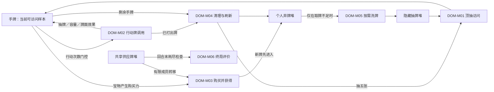

# 《Dominion》：第二版二人 First Game 王国

- 案例编号：`dominion-second-edition-first-game-2p`
- 分析深度：标准
- 状态：分析完成，待首轮总校准；实体对局与行为证据待补
- 建档日期：2026-07-21
- 研究问题：牌怎样在多个容器之间循环，使本回合的购买改变未来回合的抽样分布？“牌库构筑”应被理解为单一机制，还是跨机制的玩法模板？
- 案例角色：局内牌库构筑锚点；与 [《Factorio》2.0.77 基础自由模式](factorio-2.0.77-base-freeplay.md)构成第二组标准对照
- 模板版本：[案例研究包 v0.3](../CASE-PACKET-TEMPLATE.md)

> 本文分析 Rio Grande Games 英文第二版基础游戏、二人、官方 `First Game` 十种王国牌的规则配置。它能检验**集合结构**、**资源**、访问延迟、回合调度和反馈，却不能证明玩家会采用某种购买路线、牌组会变得“更强”，或这套王国的最优策略是什么。

## 1. 案例范围卡

| 字段 | 锁定值 | 证据或理由 |
| --- | --- | --- |
| 游戏制品 | Rio Grande Games *Dominion* 第二版英文基础游戏 | [官方规则 PDF](https://www.riograndegames.com/wp-content/uploads/2016/09/Dominion2E.pdf)，pp.1–16 |
| 规则集或版本 | 2016 年第二版产品身份；使用现行 16 页英文规则 PDF，其内嵌修改时间为 2023-08-17 | [一手来源冻结包 §2.1](../../research/sources/calibration-dominion-factorio-primary-sources.md#21-来源矩阵与制品身份) |
| 模式与配置 | 二人；官方 `First Game` 王国：Cellar、Market、Merchant、Militia、Mine、Moat、Remodel、Smithy、Village、Workshop | Rules pp.2, 15 |
| 供应配置 | 七种基础牌堆；十种王国牌各 10 张；Estate、Duchy、Province 各 8 张；Curse 10 张；宝物牌使用盒中除起始牌外的其余牌 | Rules p.2 |
| 平台或物质形式 | 英文实体卡牌与共同执行；不绑定线上实现 | 数字实现可能自动维护计数、可见性、洗牌和纠错 |
| 游玩情境 | 单局非赛事结构分析；项目以玩家 A、B 标识双方并固定 A 先手 | 规则要求随机选择起始玩家；A 先手是项目夹具 |
| 明确排除 | 第一版；扩展；宣传牌；其他推荐或随机王国；三至六人配置；殖民地／白金；数字客户端特有日志、撤销、提示与匹配制度 | 保持牌池、终止条件和实现边界稳定 |
| 来源锁定日期 | 2026-07-21 |  |
| 关键来源制品 | 官方规则 PDF；官方产品页只用于确认第二版产品身份 | 来源职责分离见冻结包 |
| 完整性标识 | 4,965,016 bytes；SHA-256 `EA9E3FBEF0064E6773C8772BBB234AC7D06C71A478422B45143432A29AA64273` | 项目对 2023-08-17 当前下载制品的测量，不是出版者版本号 |
| 复现状态 | 规则、固定王国与 A 先手已冻结；没有冻结两副起始牌的洗牌结果、后续洗牌结果和动作日志 | 这是可复现配置，不是可重放对局 |

### 版本歧义与范围限制

- **[来源事实]** “第二版”指相对第一版替换六张旧王国牌并新增一张的产品世代；当前 PDF 的 2023 排版／修订身份不构成“第三版”。`/2016/09/` 上传路径也不足以证明当前字节制品就是 2016 原文件。
- **[来源事实]** 官方允许任意选十种王国牌；本案采用明确列出的 `First Game`，因此不是分析整个 Dominion 牌池家族。
- **[来源事实]** 二人局与三至四人局的胜利牌、诅咒牌数量不同；五至六人局还改变空牌堆终局阈值，本案均不外推。
- **[未知]** 未冻结实际洗牌序列，因此不能复现任何手牌、购买时点、牌堆循环长度或胜负。

## 2. 为什么研究它

### 2.1 一分钟内讲清这局游戏

两名玩家各从七张 Copper 和三张 Estate 组成的十张个人牌组开始。每回合先至多打出一张行动牌；牌面可能增加抽牌、行动次数、购买次数或当回合购买力。随后玩家可以打出任意张宝物牌，并以当回合购买力从共同供应区购买牌。买到的牌通常先进入弃牌堆，不会立即打出。

回合末，玩家把手牌和已打出的牌全部弃置，再抽五张。个人抽牌堆不足时，才把弃牌堆洗成新的抽牌堆。因此一次购买先改变“归属于我的牌有哪些”，然后要等待弃牌堆被洗回、目标牌又被抽到手中，才可能改变一次后续行动。相同卡牌会反复循环；胜利牌在局中通常占据手牌而不提供行动或购买力，却在终局计分。

当 Province 牌堆为空，或任意三个供应牌堆为空时，本回合结束后终局。玩家把所有归属于自己的牌合并计分，胜利分最高者获胜。

### 2.2 本案承担的检验任务

- 检查**集合结构**能否同时表达抽牌堆、手牌、弃牌堆、出牌区、废牌区与共享供应牌堆的成员、顺序、访问和移动规则。
- 检查卡牌实体、卡牌归属、卡牌所在容器和卡牌当前可用性是否会被“拥有一张牌”合并。
- 对比持久卡牌与每回合刷新的行动次数、购买次数、购买力，复验**资源**的叠加角色而非对象类别。
- 检查获得牌到实际可调用效果之间的**访问延迟**，以及洗牌不是固定阶段而是按需触发的调度事实。
- 判断“牌库构筑”是一个动作、机制、机制系统、玩法模板还是类型标签，并与《Factorio》的自动化构筑对照。

### 2.3 当前最小主张

> **[综合判断]** 本配置把“个人牌集合的持久改变”与“每回合从该集合中随机获得的有限访问”编排在一起：购买／获得使牌先进入弃牌堆，按需洗牌再把弃牌转成未知顺序的抽牌堆，抽牌才使某张牌进入当前手牌；出牌、购买、清理和重抽重复运行。因而，局内构筑不是一次购买机制的别名，而是若干集合移动、资源门控、随机抽样、规则文本执行和终局评价共同形成的**玩法模板候选**。

### 双视图导航

- **教学最小视图**：本节摘要、4.1 的循环、5.2 的机制索引与第 6 节编排足以说明“买到不等于立即变强”。
- **研究充分视图**：第 4 节展开容器访问、资源准入、阶段与按需洗牌；第 11 节保留“引擎构筑”、效率和策略证据的边界。
- 教学视图省略十种王国牌的逐张规则、洗牌实例、对手反应顺序和行为轨迹，不能支持牌表强度或最优购买判断。

## 3. 证据与来源语域

- **[来源事实]** 设置、回合阶段、卡牌移动、访问权限、王国牌文本、终止与计分来自冻结的官方规则。
- **[项目定义]** **集合结构**、**资源**、**时间结构**、**调度语义**、**机制**、**编排**、**玩家活动**与**玩法模板**为项目共享术语。
- **[结构推导]** 购买改变未来抽样分布，但目标牌何时进入手牌取决于容器状态与洗牌序列。
- **[观察]** 本案没有实体对局、录像、客户端日志或玩家证言。
- **[未知]** 牌组效率、最优路线、循环稳定性、互动强度、体验和玩家是否把某套组合称为“引擎”均待证。

| 来源术语与来源身份 | 来源中的操作性含义 | 映射关系 | 项目共享术语或拆解 | 不能自动等同 | 定位 |
| --- | --- | --- | --- | --- | --- |
| *deck* | 某玩家面朝下、按顶端访问的个人抽牌堆；规则宣传文字有时也泛指玩家全部牌 | 一词多义，拆分 | **有序隐藏抽牌集合**／**玩家持久牌集合** | 手牌、弃牌堆、整个“构筑”玩法 | Rules pp.1, 4, 7–8 |
| *hand* | 当前由玩家持有并可选择打出／弃置的牌 | 来源较窄 | **私有可访问集合** | 玩家全部卡牌资产 | Rules pp.3–4, 8 |
| *discard pile* | 面朝上的个人弃牌堆；仅顶牌公开且通常不能翻查或计数 | 来源较窄 | **部分公开、内部无关序集合** | 废牌区或已经失去的牌 | Rules pp.4, 8 |
| *Supply* | 本局可获得牌的 17 个共同牌堆 | 拆分 | **共享供应集合＋有限同名牌堆** | 抽牌堆、市场价格形成或无限卡池 | Rules p.2 |
| *Action / Buy / Coin* | 行动牌类型／阶段，也用于本回合可再执行次数或购买力符号 | 多义拆分 | **行动牌类型**、**行动阶段**、**行动次数容量**、**购买次数容量**、**当回合购买力** | 一个统一“行动资源”或实体金币 | Rules pp.3–6 |
| *gain* | 默认把一张牌从供应移入个人弃牌堆 | 来源较窄 | **卡牌归属与容器转移** | 立即打出、立即进入手牌、能力立即生效 | Rules pp.4, 6 |
| *trash* | 把牌移入公开废牌区，使其不再属于原玩家 | 来源较窄 | **归属解除＋集合转移** | 普通弃置、销毁物理卡或总是不可恢复 | Rules p.7 |
| *deck-building* | 来源对整款游戏的描述 | 来源较宽 | **局内持久牌集合构筑玩法模板候选** | 单一购买机制、局前组牌或收藏型卡池 | Rules pp.1, 4 |

## 4. 规则世界

### 4.1 教学最小视图

```text
个人十张起始牌 → 洗成隐藏抽牌堆 → 抽五张手牌
手牌中的行动牌 --消耗行动次数--> 按牌面结算
手牌中的宝物牌 --产生当回合购买力--> 购买供应中的一张牌
新牌 → 通常进入个人弃牌堆（不是立即可用）
回合清理 → 手牌与出牌区进入弃牌堆 → 抽五张
抽牌堆不足 --按需触发--> 洗弃牌堆并接到抽牌堆下方
供应耗尽条件达成 → 回合末合并个人全部牌并计分
```

该视图省略了牌面例外、攻击／反应窗口、十种王国牌的具体参数和一次真实洗牌。研究充分视图见下文。

### 4.2 参与者、能动性与执行

| 项目 | 内容 | 来源 |
| --- | --- | --- |
| 玩家与阵营 | 两名各自计分的玩家 | 本案配置；Rules pp.2, 5 |
| 玩家控制对象 | 自己手牌的打出／弃置选择、购买目标、部分牌面选择与个人容器维护 | Rules pp.3–8 |
| 系统或环境行动者 | 没有自主策略代理；随机牌序、供应数量、阶段和牌面规则约束行动 | 规则结构 |
| 执行来源 | 玩家移动实体牌并共同结算；洗牌由持有者执行 | 实体媒介与 Rules pp.3–8 |
| 裁定权 | 官方文字和牌面决定结算；桌上玩家共同检查数量、顺序和终局 | 来源未指定独立裁判 |
| 能动性边界 | 行动／购买可以少用或不用；不能在购买后返回打宝物；强制牌面效果尽可能执行 | Rules pp.3–4 |

### 4.3 **实体**、集合、身份与归属

| 实体／集合 | 身份怎样保持 | 典型状态与访问 | 证据 |
| --- | --- | --- | --- |
| 单张游戏牌 | 牌名、类型、成本、文字与物理实例保持 | 位于供应、某玩家抽牌堆／手牌／弃牌堆／出牌区／暂置区或废牌区 | Rules pp.1–8 |
| 个人持久牌集合 | 由“当前归属于该玩家的全部牌”构成，不等于某一物理牌堆 | 跨回合保留；终局从所有个人区域合并计分 | Rules pp.1, 5, 7 |
| 抽牌堆 | 顶端访问的面朝下序列 | 牌面隐藏；可数张数，不能看牌面 | Rules pp.4, 7–8 |
| 手牌 | 玩家私有、内部可选择的集合 | 张数公开，牌面通常仅持有者可见 | Rules p.8 |
| 弃牌堆 | 面朝上堆叠；内部顺序通常无规则意义 | 顶牌公开；通常不能翻查或计数 | Rules pp.6, 8 |
| 出牌区 | 当前已打出牌的公开集合 | 牌在结算后通常留到清理阶段 | Rules pp.3, 6, 8 |
| 共享供应 | 七种基础牌堆＋十种固定王国牌堆 | 同名牌数量有限、牌面与成本公开 | Rules p.2 |
| 废牌区 | 公开、顺序无关集合 | 可随时翻查；其中牌不再属于原玩家 | Rules p.7 |

**[综合判断]** 同一张牌在供应区时是共享可索取实体，获得后成为某玩家持久牌集合成员；进入手牌时才具备当前直接调用资格。对象身份、归属、保管位置与当前可用性不能合并为一个“拥有”布尔值。

### 4.4 **时间结构**与**调度语义**

- 基础时间模型：两人顺序轮流；每回合固定为行动阶段→购买阶段→清理阶段。
- 每回合开始隐含获得基础的一次行动与一次购买；牌面可以在当前回合增加次数或购买力，未用部分在回合末消失。
- 一张行动牌必须先完整结算，才可花下一次行动；不能把 `+Action` 当成并行执行。
- 宝物牌先打完，再开始购买；一旦购买就不能回到打宝物步骤。
- 清理把当前手牌和出牌区统一送入弃牌堆，再抽五张；下一位玩家随后开始回合。
- 洗牌不是每回合固定阶段：只有规则要求从抽牌堆取牌而数量不足时，才洗弃牌堆并接入抽牌堆，然后继续取牌。
- 多名玩家同时受影响时，从当前玩家开始按回合顺序处理；本案的 Militia 与 Moat 还建立攻击和反应窗口。
- 终止条件在回合结束时检查；牌堆在回合中耗尽不立即截断当前结算。

### 4.5 **集合结构**

| 集合 | 有序性 | 可重复性 | 容量 | 可见性 | 典型操作 | 证据 |
| --- | --- | --- | --- | --- | --- | --- |
| 个人抽牌堆 | 顶端顺序有意义 | 同名可重复 | 随构筑改变 | 牌背公开、牌面隐藏；张数可数 | 顶抽、顶置、按需接入洗牌结果 | Rules pp.4, 7–8 |
| 手牌 | 规则通常不关心排列 | 同名可重复 | 动态；清理通常重抽 5 | 持有者见牌面，张数公开 | 打出、弃置、废弃、清理 | Rules pp.3–8 |
| 弃牌堆 | 仅顶牌公开有意义；内部顺序无关 | 同名可重复 | 动态 | 顶牌公开；通常不可翻查或计数 | 获得、弃置、清理、整体洗牌 | Rules pp.4, 6, 8 |
| 出牌区 | 结算顺序可能重要，静态排列通常不重要 | 同名可重复 | 当前回合动态 | 公开 | 打入、清理弃置 | Rules pp.3, 6, 8 |
| 供应牌堆 | 每堆按同名成员计数，内部顺序无关 | 同名重复 | 固定初始、单调减少 | 公开 | 购买／获得、终局空堆检查 | Rules pp.2, 4–5 |
| 废牌区 | 顺序无关 | 同名可重复 | 动态 | 全部可翻查 | 废弃、极少数扩展可取回（本案排除） | Rules p.7 |

这不是一个“牌库”在不同时间改名，而是多个约束不同的**集合结构**通过卡牌移动连接。尤其是弃牌堆→洗牌→抽牌堆，是批量变换；抽牌堆→手牌，是逐张访问。

### 4.6 **资源**、资源操作与经济边界

| 资源候选及载体 | 稀缺的是什么 | 竞争用途、竞争者或时点 | 资源操作 | 时间尺度与未来可行动变化 | 证据 |
| --- | --- | --- | --- | --- | --- |
| 行动次数容量（回合计数） | 本回合可再打出的行动牌次数 | 多张手牌行动牌竞争调用机会 | 刷新、增加、消耗、放弃 | 回合内；决定还能调用哪些牌面 | Rules pp.3, 6 |
| 购买次数容量（回合计数） | 本回合可购买的牌数 | 多个供应目标竞争购买次数 | 刷新、增加、消耗、放弃 | 回合内 | Rules pp.4, 6 |
| 当回合购买力（回合计数） | 本回合可分配给购买成本的数值 | 多次购买共享同一总额 | 产生、增加、分配、消费、清零 | 回合内；宝物牌本身不被消费 | Rules pp.4, 6 |
| 供应牌堆存量（共享卡牌实体） | 特定同名牌的剩余副本 | 两名玩家竞争购买；空堆还推进终局 | 获得／转移、耗尽 | 整局；改变以后可取得内容与终局距离 | Rules pp.2, 4–5 |
| 个人卡牌访问机会 | 本回合抽到并能在阶段内调用的牌 | 手牌槽位、行动次数与牌型约束用途 | 抽取、弃置、清理、重新抽样 | 跨回合；不是独立计数，而是集合位置承担的机会角色 | 规则＋结构推导 |

- 单张卡牌首先是**实体**，在供应存量、个人持久集合或当前访问机会中可以叠加资源角色；不能据此把“卡牌”定义成资源类型。
- 宝物牌没有因购买而耗尽；它打出时产生一次性的购买力，清理后仍进入弃牌循环。把 Copper 说成“支付掉”会错误删除实体。
- 胜利牌在终局提供评价值，却通常占用抽样与手牌访问；“局中负担、终局收益”是编排结果，不是资源定义本身。
- 本案形成受共同供应、个人循环和每回合容量连接的**经济系统**；但市场价格固定，不存在玩家交易或价格形成。

### 4.7 **信息结构**、随机性与观察后效

| 信息项 | 世界真值 | 谁可观察 | 渠道与时机 | **观察后效** | 证据 |
| --- | --- | --- | --- | --- | --- |
| 供应牌面、成本与剩余数量 | 公共牌堆当前状态 | 双方 | 桌面持续呈现 | 可反复复查与共同计数 | Rules pp.2, 4–5 |
| 自己手牌 | 当前五张及额外抽牌 | 持有者；他人只知张数 | 私有牌面 | 保留到打出、弃置或清理；实体玩家可记忆，规则不记录旧手牌 | Rules p.8 |
| 抽牌堆次序 | 洗牌后存在的物理顺序 | 无人可直接查看牌面次序 | 顶抽时逐步揭示给持有者 | 抽出的牌可被记住；未抽次序仍隐藏 | Rules pp.4, 7–8 |
| 弃牌堆构成 | 物理成员真实存在 | 通常只允许看顶牌，不能翻查或计数 | 顶牌持续公开 | 旧公开移动可由玩家记忆，但规则不保证信念准确 | Rules p.8 |
| 出牌区与废牌区 | 公开牌面 | 双方 | 桌面持续呈现 | 可复查；废牌区可翻查 | Rules pp.7–8 |
| 对手总牌集合与潜在抽样 | 由其历史获得、废弃和当前区域构成 | 部分可从公开历史推导 | 观察购买与公开移动 | 不设自动总表；实际追踪属于玩家活动 | 结构候选 |

- 随机性来自每名玩家对起始牌和后续弃牌堆的洗混；官方规则未规定算法、种子或概率分布。
- “买了某牌”是公共归属事实，“何时抽到”仍由隐藏顺序和触发洗牌的容器状态决定。
- 牌组构成可在原则上由公开历史推导，不等于规则保证每位玩家保持正确完整信念。

### 4.8 **目标**、终止与评价

| 项目 | 内容 | 证据状态 |
| --- | --- | --- |
| 规则目标 | 终局时个人全部牌上的胜利分最高 | **[来源事实]** |
| 终止条件 | 回合末 Province 堆为空，或任意三个供应牌堆为空 | **[来源事实]** |
| 结果评价 | 合并手牌、抽牌堆、弃牌堆、出牌区和暂置牌计分；最高者获胜；平分时回合较少者胜，否则并列 | **[来源事实]** |
| 局部任务 | 打牌、产生购买力、获得牌等受阶段与牌面约束；不是独立胜利目标 | **[结构判断]** |
| 玩家自定目标 | 未主张；“构筑引擎”“尽快循环”等须由行为材料支持 | **[未知]** |

## 5. **机制**分解

### 5.1 尺度与术语族

- 本案把一次有完整触发、前置、结算与集合效果的行动／自动过程作为机制单元，把个人牌循环与共享供应互动视为机制系统。
- 更细拆成拿牌、翻牌或读牌会把物理执行当成通用机制；更粗把整局叫作一个“牌库构筑机制”会丢失访问延迟、资源门控和终止耦合。

| 表面名称 | 动作义项 | 机制义项 | 玩法模板义项 | 类型标签义项 | 本案采用的尺度与 ID |
| --- | --- | --- | --- | --- | --- |
| 抽牌 | 拿取牌堆顶牌 | 隐藏有序集合→私有手牌的访问转移 | 牌库循环的一环 | 卡牌游戏标签 | `DOM-M01` 机制单元 |
| 购买／获得 | 选择并支付／把牌转入个人区域 | 资源门控的供应转移；两者可由牌面分离 | 局内构筑的一环 | “买牌游戏”俗称 | `DOM-M03` 复合机制 |
| 洗牌 | 物理随机化 | 仅在抽牌需求不足时重建隐藏抽牌集合 | 循环重采样的一环 | 随机性标签 | `DOM-M05` 自动机制 |
| 牌库构筑 | 不适用 | 不录作一个机制单元 | 持久集合改变＋随机访问＋反复调用的模板候选 | Deck-building 类型标签 | 本案主要采用模板义项 |
| 引擎构筑 | 不适用 | 可指特定反馈机制组合 | 跨牌组、资源流和能力增长的宽泛模板家族候选 | 市场／评论标签 | 暂不建立稳定概念 ID |

### 5.2 机制索引

| ID | 暂定名称 | 尺度 | 一句话规则结构 | 依赖 | 证据 |
| --- | --- | --- | --- | --- | --- |
| DOM-M01 | 顶抽访问 | 单元 | 从个人隐藏抽牌堆顶把指定数量牌移入私有手牌；不足时调用按需洗牌 | 抽牌堆、手牌、数量 | Rules pp.4, 6–8 |
| DOM-M02 | 行动牌调用 | 复合 | 消耗一次当前行动容量，把手牌行动牌移入出牌区并按文字顺序完整结算 | 手牌、行动阶段、牌面规则 | Rules pp.3, 5–7 |
| DOM-M03 | 购买并获得 | 复合 | 在购买阶段消耗购买次数与相应购买力，把可负担供应牌移入个人弃牌堆 | 供应、购买次数、购买力 | Rules pp.4, 6 |
| DOM-M04 | 回合清理与刷新 | 复合 | 把手牌和出牌区送入弃牌堆，抽五张，并清除未用回合容量 | 阶段、个人集合、DOM-M01 | Rules pp.4–5 |
| DOM-M05 | 按需重建抽牌堆 | 单元／自动 | 取牌需求超过抽牌堆余量时，随机化弃牌堆并接入抽牌堆，再继续取牌 | 取牌需求、两个集合 | Rules pp.4, 6–7 |
| DOM-M06 | 供应耗尽终局 | 复合 | 回合末检查 Province 或任意三堆为空，再合并个人全部牌并比较胜利分 | 供应状态、回合边界、评价 | Rules p.5 |

### 5.3 核心机制卡：DOM-M03 购买并获得

- **触发**：当前玩家进入购买阶段并决定购买。
- **触发策略**：可选；默认一回合至多一次，可由牌面增加购买次数。
- **行动者与能动性**：玩家选择供应中尚有牌、成本不高于剩余购买力的目标。
- **输入**：目标牌堆、一次购买次数、足额当回合购买力。
- **规则动作**：选择牌并执行来源所谓 *buy*；其结果包含 *gain*，默认把牌从供应移到个人弃牌堆。
- **前置与合法性**：仍在购买阶段；购买次数大于零；目标堆非空；成本可承担。
- **成本与锁定**：购买次数减一、购买力减去成本；宝物牌实体不被支付掉。牌移离供应并进入弃牌堆后，基础规则没有撤销。
- **状态效果**：供应存量减少；个人持久牌集合增加；当前手牌和出牌资格通常不增加。
- **延迟效果**：目标牌需经后续清理、按需洗牌和顶抽，才可能进入手牌；确切延迟由集合状态和随机次序决定。
- **反馈**：公共供应与个人弃牌堆顶发生可见变化。
- **来源定位**：Rules p.4；术语定义 p.6。

### 5.4 核心机制卡：DOM-M05 按需重建抽牌堆

- **触发**：某规则要求从个人抽牌堆取、看、揭示、暂置、弃置或废弃的牌数超过抽牌堆余量。
- **触发策略**：强制、条件自动；抽牌堆仅仅为空而没有取牌需求时不运行。
- **执行来源**：实体桌上由玩家洗混；规则决定触发与接续位置。
- **输入**：当前弃牌堆全部成员与尚未满足的取牌需求。
- **过程**：随机化弃牌堆，把结果放到现有抽牌堆下方；随后继续原操作；仍不足时只处理现有牌。
- **集合效果**：弃牌堆清空并变为隐藏有序抽牌集合；卡牌身份和个人归属保留，可访问顺序改变。
- **信息效果**：此前公开的弃牌顶牌和历史成员进入隐藏次序；真实次序存在但对玩家不可直接读取。
- **反馈**：玩家知道洗牌已发生和牌数，不知道新顺序；实体洗牌质量未审计。
- **来源定位**：Rules pp.4, 6–8。

## 6. 机制间的**编排**



| 来源 | 关系类型 | 目标 | 传递对象 | 时间尺度 | 后果 | 证据状态 |
| --- | --- | --- | --- | --- | --- | --- |
| DOM-M02 | 状态／资源 | 后续行动与购买 | 新手牌、行动／购买次数、购买力、攻击效果 | 当前回合 | 牌面可以扩展或改变本回合可行行动 | 来源事实 |
| DOM-M03 | 归属／集合转移 | 弃牌堆 | 新获得牌 | 当前回合，通常延迟可用 | 改变个人持久牌集合和未来抽样总体 | 来源事实＋结构推导 |
| DOM-M04 | 时间／集合批处理 | 弃牌堆与 DOM-M01 | 当前手牌、出牌区、抽五张请求 | 每回合末 | 封闭本回合并建立下一手牌 | 来源事实 |
| DOM-M05 | 条件调度／随机重排 | 抽牌堆 | 弃牌堆全部成员及未知次序 | 按需、跨回合 | 使过去获得与弃置的牌重新进入可抽范围 | 来源事实 |
| DOM-M01 | 信息／访问 | 玩家决策 | 当前私有手牌 | 抽牌时点 | 把持久集合成员转为当前可调用候选 | 来源事实 |
| 供应耗尽 | 门控／评价 | DOM-M06 | 空牌堆状态 | 回合末 | 结束构筑过程并改变卡牌的评价作用域 | 来源事实 |

**[综合判断]** 这套编排有两个不同的反馈：一是购买改变以后会从什么总体抽样；二是被抽到并打出的牌可能改变新的购买和循环速度。第一种由规则直接保证，第二种是否形成净增长、稳定组合或“引擎”取决于具体卡牌比例、随机序列和玩家选择，不能从正反馈箭头自动推出。

## 7. 玩家层

### 7.1 **决策情境**与玩家活动

| 情境 | 可见状态与信念 | 可选行动 | 权衡／不可逆性 | 证据状态 |
| --- | --- | --- | --- | --- |
| 行动阶段 | 自己手牌、公共供应与出牌历史；未来抽序隐藏 | 选择至多一张行动牌，或由 `+Action` 延伸 | 不同结算顺序改变当回合后续手牌与容量 | 规则结构；实际排序策略待证 |
| 购买阶段 | 当前购买力、购买次数、供应余量 | 购买可负担牌或跳过 | 新牌延迟可用；一张牌也会改变牌组规模与构成 | 规则结构；价值判断待证 |
| 是否增厚／移除牌 | 固定王国提供 Mine、Remodel 等改变成员的途径 | 获得、替换、废弃符合牌面条件的牌 | 移除改变未来抽样总体，但具体收益非单调 | 来源牌面；策略待证 |
| 终局接近 | Province 与其他堆余量公开 | 继续构筑、取胜利牌或推进空堆 | 当前得分、局中可用性与终局时点可能冲突 | 结构候选；实际决策待证 |

- 规则结构促成概率判断、循环追踪、组合发现、购买顺序和终局时机判断；没有对局材料时都只能是**玩家活动候选**。
- “好牌更多”不必然提高下一手牌质量：加入牌会同时改变集合大小、类型比例和洗牌时点；胜利牌的评价作用又随终局切换。
- Militia 与 Moat 使对手选择和反应窗口进入循环，但本案不据此断言互动频率或攻击强度。

### 7.2 策略、挑战与体验

- **策略**：不写“先买 Silver”“Village＋Smithy 是最佳引擎”等条件方针；需冻结牌序、对手行为和评价方法。
- **挑战**：规则层可确认玩家要在当前手牌与未来抽样之间分配购买，但认知负担和掌握曲线尚未观察。
- **难度／平衡**：未评估起手优势、第一玩家优势、王国牌强度和胜率。
- **体验**：成长感、连锁满足、坏抽挫败、对手压迫与构筑认同均待行为／体验证据。
- **技能**：记忆弃牌、估算概率和组合规划是结构允许的活动，不是官方规则已经测得的玩家技能。

## 8. **玩法模板**候选

| 候选名称 | 编排签名 | 持续玩家活动 | 时间与反馈结构 | 成立条件 | 证据状态 |
| --- | --- | --- | --- | --- | --- |
| 局内循环牌库构筑 | 每人持久牌集合＋私有手牌访问＋获得进入弃牌＋按需洗牌重采样＋回合容量＋共享有限供应＋终局全牌评价 | 根据当前手牌行动、改变个人集合、预期未来抽样、判断终局时点 | 顺序回合；购买到调用有不定延迟；牌反复循环；终局切换部分牌的价值作用域 | 构筑发生在同一局内；获得牌持久进入后续抽样；访问受随机手牌限制；构筑与局内目标共同结算 | 结构候选；行为待补 |

- 单个“购买”机制不足以形成该模板：若买到的能力立即永久生效而不进入随机循环，时间与访问结构已经改变。
- 单个“抽牌”机制也不足：若牌组在局中不改变，它只是固定集合的随机访问。
- “牌库构筑”可同时是出版类型标签、机制系统俗称和玩法模板名；本案按 ADR 0092 用**术语族**保留多尺度义项。
- 与局前构筑式集换卡牌、袋构筑、骰池构筑和 Roguelike 局内选牌只有部分结构同源，不能仅凭“不断加入内容”视为同一模板。

## 9. 从模板到这款**游戏**

- **角色绑定**：个人持久集合被题材化为 Dominion；Copper、Estate 等牌把购买力、终局分和行动文本绑定在卡牌实体上。
- **内容实例化**：`First Game` 的十种王国牌决定可用抽牌、行动扩展、购买扩展、攻击／反应、废弃与替换方式；换十张牌会保留基础模板却改变机制耦合。
- **参数化**：二人供应数量、起始牌 7＋3、手牌 5、基础行动／购买各 1、Province／三空堆终局共同确定反馈强度与局长边界。
- **材料与界面**：牌背隐藏抽序，桌面区域承载集合位置，公共牌堆显示内容与余量；数字实现可以等价维护规则，却会改变记账、复查和错误执行。
- **社会情境**：两人共同执行洗牌、公开购买与牌面效果；实体洗牌质量、误操作和撤回规范不由规则完全形式化。
- **完整游戏不等于模板**：相同局内牌库构筑签名可由不同卡牌内容、美术、多人结构、终局与实现形成不同游戏。

## 10. 与《Factorio》的跨案例比较

| 比较对象 | 判断 | 相同之处 | 关键差异 | 证据 |
| --- | --- | --- | --- | --- |
| “构筑” | 上位功能类比，不结构等价 | 当前投入都可改变未来可行行动与产出 | Dominion 改变随机循环的个人牌集合；Factorio 布置持续存在的空间生产网络 | 两案一手规则／数据 |
| **集合结构** | 共同字段，不同编排 | 都有容器、容量和成员移动 | Dominion 以批量洗牌和顶抽访问为核心；Factorio 以库存槽、传送带位置和机器输入／输出持续流动 | 两案结构分析 |
| **时间结构** | 根本不同 | 过程都可延迟、阻塞和恢复 | Dominion 由离散回合、阶段和按需洗牌调度；Factorio 由实时 tick 和条件自动过程调度 | 两案来源 |
| 反馈 | 同族候选 | 当前产出可投资进未来能力 | Dominion 新牌通常要等洗牌／抽取且每回合可用不确定；Factorio 已放置机器会在输入、电力和输出允许时反复运行 | 结构推导 |
| 资源 | 同一准入框架 | 都有存量、容量、转换与竞争用途 | Dominion 区分卡牌实体、回合容量和购买力；Factorio 区分物品、流体、电力、空间／机器容量和玩家操作 | 项目定义＋两案来源 |
| “优化／引擎” | 行为与模板待证 | 两者都促成效率比较 | 规则事实只证明可度量结构，不证明玩家实际优化或某配置是引擎 | 证据纪律 |

## 11. 反例、失败与模型压力

### 11.1 本案最顺畅的解释

- **集合结构**的成员、顺序、访问、可见性、归属和移动字段能表达牌循环，无需发明“牌库原语”。
- **资源**作为叠加角色区分了卡牌实体、供应存量、回合容量与购买力，避免把所有数字和牌都叫资源。
- **调度语义**可表达固定阶段、完整结算、攻击反应、回合末检查和按需洗牌。
- **编排**比“抽牌＋购买＋洗牌”的列表更能解释购买为什么不是即时能力，以及构筑怎样跨回合形成反馈。
- **术语族**允许“牌库构筑”在行业语言中跨机制系统、玩法模板与类型标签使用，而不把概念身份合并。

### 11.2 本案最失真的解释

| 编号 | 失败类型 | 具体症状 | 局部处理 | 可能修订 | 阻塞级别 |
| --- | --- | --- | --- | --- | --- |
| DOM-F01 | 集合／归属混淆 | 来源 *deck* 有时指面朝下抽牌堆，有时泛指玩家全部牌；“加入牌库”会隐藏新牌实际先入弃牌堆 | 来源映射拆为抽牌集合、个人持久集合和所在容器 | 检查“集合身份—成员归属—当前容器”是否需要模板固定字段 | 门审 |
| DOM-F02 | 延迟压缩 | “购买→变强”跳过获得、清理、洗牌、抽取与阶段资格；同一新牌的可用延迟不固定 | 在编排边上显式记录访问路径和延迟分布来源 | 若跨案重复，增加“可用化路径／访问延迟”分析字段，不先升格原语 | 门审 |
| DOM-F03 | 资源泛化 | 卡牌既是实体、供应存量成员、个人集合成员和当前机会载体，容易被统一标成资源 | 对每个角色分别执行准入并记录时间尺度 | 与 Factorio 物品／机器／容量对照后复核资源模板 | 门审 |
| DOM-F04 | 模板／机制混淆 | 出版者说“building a deck”，容易把 deck-building 当成单一机制 | 用术语族固定本案的模板义项，并列出必需编排 | 首轮总汇报再判断目录层级，不改主链 | 长期检查 |
| DOM-F05 | 行为越界 | 正反馈图容易诱导“玩家会优化、牌组会更强、形成引擎”的断言 | 只主张规则保证的集合变化；策略和净收益待观察／模拟 | 保持结构与行为双证据状态 | 长期检查 |
| DOM-F06 | 实体执行缺口 | 规则规定随机洗牌和私密访问，却不保证实体执行真正随机、无误或无泄漏 | 区分规范、执行与观察层 | 实体对局复现时记录洗牌、误操作和纠错 | 延后观察 |

### 11.3 反例与竞争解释

- 若获得牌立即进入手牌并可在当前阶段打出，牌名和购买成本可以不变，构筑的延迟反馈却显著改变。
- 若个人牌集合持续增长但每回合允许从中任选四张，随机顶抽与洗牌不再组织当前访问，已不是本案同一种循环。
- 若回合末永久删除所有已打出牌，购买会成为一次性消耗补充；“买牌”相同而持久构筑关系消失。
- 若把供应改成无限副本，购买动作仍存在，但共享存量竞争和空堆终局耦合消失。
- 把 Dominion 仅表达为“经济增长游戏”会漏掉私有随机访问；仅表达为“卡牌游戏”又不能解释为何局中获得会改变未来行动空间。

## 12. 标准案例暂不执行的模块

- 十种王国牌的完整逐卡机制卡：来源冻结包保留牌表，本标准案例只展开跨牌循环必需结构。
- 设计变体：即时入手、固定抽序、无限供应等反例尚未制作原型。
- 行为观察与策略模拟：需冻结起始玩家、随机种子／实体牌序、每次动作与信念证言。
- 完整证据账本：可引用[一手来源冻结包](../../research/sources/calibration-dominion-factorio-primary-sources.md)的主张账本。

## 14. 校准结论与后续

- **结构校准状态**：在英文第二版、二人、官方 `First Game` 王国的声明范围内通过；集合、资源、信息、时间和编排词汇能表达核心规则。
- **行为证据状态**：待补；不主张购买路线、牌组效率、组合频率、最优策略或体验。
- “牌库构筑”暂按**玩法模板术语族**处理：它可以被行业语言用于机制系统或类型标签，但本案的解释对象是跨回合编排。
- 新的模型压力是“归属改变”与“当前可用”之间存在多步、随机且状态依赖的路径；用一条无时序的正反馈箭头会失真。
- 与《Factorio》对照后再判断“引擎构筑”是否值得建立上位模板家族，当前不建立共享机制 ID。
- 后续取证：冻结实体牌序或数字客户端种子与日志，记录每次获得到首次抽取／首次调用的延迟、牌堆构成、供应变化和玩家陈述。
- 关联：[一手来源冻结](../../research/sources/calibration-dominion-factorio-primary-sources.md)、[校准失败清单](../../research/calibration-failure-log.md)、[卡牌研究区域](../../research/corpus/genre-coverage-map.md#6-第一轮研究区域与多角色案例组)。
