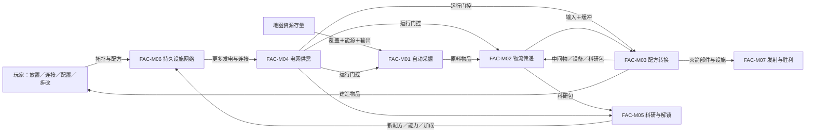

# 《Factorio》：2.0.77 基础游戏自由模式

- 案例编号：`factorio-2.0.77-base-freeplay-default-seed-20260721`
- 分析深度：标准
- 状态：分析完成，待首轮总校准；地图存档、工厂实例与行为证据待补
- 建档日期：2026-07-21
- 研究问题：持续运行的采掘、运输、转换、供电和研究过程怎样被空间网络编排成自动化生产？“吞吐”“瓶颈”“优化”和“引擎构筑”分别属于规则事实、派生指标、玩家活动还是玩法模板？
- 案例角色：生产自动化锚点；与[《Dominion》第二版二人 First Game 王国](dominion-second-edition-first-game-two-player.md)构成第二组标准对照
- 模板版本：[案例研究包 v0.3](../CASE-PACKET-TEMPLATE.md)

> 本文分析 Wube Software 的《Factorio》2.0.77 基础游戏自由模式与一个项目地图夹具，而不是某座已经建成的工厂。冻结的官方规则资料与公开数据能支持机器、物品、配方、物流、电力、研究与胜利的结构分析，却不能替代尚未取得的目标运行制品，也不能单独证明玩家会优化、哪里会成为瓶颈、某布局的实际吞吐或游玩体验。

## 1. 案例范围卡

| 字段 | 锁定值 | 证据或理由 |
| --- | --- | --- |
| 游戏制品 | Wube Software *Factorio* 基础游戏 | [官方网站](https://www.factorio.com/game/content)与官方 2.0 发布说明 |
| 软件版本 | 2.0.77 stable，Windows x64；规则／数据身份以官方发布与 `factorio-data` tag `2.0.77` 锁定 | [官方稳定版下载页](https://www.factorio.com/download)；[官方数据仓库 tag](https://github.com/wube/factorio-data/tree/2.0.77) |
| 内容边界 | 只启用内置 `core` 与 `base`；不启用 Space Age、Quality、Elevated Rails 或第三方模组 | 项目配置；插件会改写原型、配方、目标和地图 |
| 模式 | 单人 `freeplay`；采用下列官方示例地图生成与运行设置 | 项目配置；自由模式身份与基础数据见来源冻结包 |
| 地图生成夹具 | 使用 tag `2.0.77` 的 `map-gen-settings.example.json` 全部示例值，仅把 `seed: null` 改为 `seed: 20260721`；无限宽高，资源／水／树／敌巢参数均保留示例值，`peaceful_mode: false` | [官方示例文件](https://github.com/wube/factorio-data/blob/2.0.77/map-gen-settings.example.json)＋项目固定种子 |
| 地图运行夹具 | tag `2.0.77` 的 `map-settings.example.json` 原值 | [官方示例文件](https://github.com/wube/factorio-data/blob/2.0.77/map-settings.example.json) |
| 游玩情境 | 单人新游戏；不使用控制台、编辑器、作弊、蓝图导入或预制存档 | 项目配置；蓝图本身是基础功能，但导入外部设计会改变研究问题 |
| 明确排除 | 2.1 实验分支；1.1 及更早；Space Age 内容；多人权限与延迟；模组；成就约束；速通规则；具体工厂蓝图；性能瓶颈与硬件帧率 | 保持版本、规则、玩家数和证据单位稳定 |
| 来源锁定日期 | 2026-07-21 |  |
| 关键来源制品 | 官方 2.0.77 发布身份；`factorio-data` tag `2.0.77`；官方 Wiki 的 2.0 基础游戏条目；官网内容页 | 各自支持发布身份、原型／配方、规则解释与产品边界 |
| 完整性标识 | `factorio-data` tag `2.0.77` 指向 commit `ce6741a54c3199caad4ed147e9987fd8d5653fdf`；发布者给 `factorio_win_2.0.77.zip` 的 SHA-256 为 `9EFEE5FE712B741C8FD748F2809608BDF8CCCB1B5AC481E67D2DAC38C55358D6`，尚未本地复算 | tag、公开数据与闭源安装包职责不同 |
| 复现状态 | 规则、数据与配置文本已冻结；尚未用目标安装包创建地图或保存初始存档，因此只是部分复现 | 没有地图交换字符串、初始存档哈希、输入日志或机器状态快照 |

### 版本、夹具与范围限制

- **[来源事实]** 2.0 与 Space Age 同日发布，但 2.0 是所有基础游戏用户获得的更新；扩展内容以模组形式叠加，不能因为同一程序包出现目录就视为本案已启用。
- **[项目夹具]** 固定种子和两个官方示例设置文件用于消除“默认地图”随版本与随机种子漂移；它们不是 Wube 推荐的唯一标准地图。
- **[未知]** 夹具尚未通过 2.0.77 Windows 程序实际建图。程序是否接受原样文件、生成后的地图交换字符串、出生点附近资源分布与敌巢位置都待复现。
- **[来源事实]** 自由模式允许胜利后继续游玩；“发射火箭”是名义胜利边界，不是所有生产过程的强制终止。
- **[范围限制]** 默认敌人、污染与防御仍存在，不能把本案误称为和平沙盒；标准篇只在它们影响生产网络时记录，不展开完整战斗系统。

## 2. 为什么研究它

### 2.1 一分钟内讲清这局游戏

玩家控制一名角色落在程序生成的地图上。开始时许多采集、制作和搬运要由角色亲自完成；玩家可以把材料制作成采矿机、熔炉、传送带、机械臂、发电设施、组装机和实验室，再把这些实体放到地图上并配置方向或配方。

当采矿机覆盖资源且获得所需能源，它会反复产出矿物；传送带持续移动其两条运输线上可容纳的物品；机械臂在拾取处有物品、放置处有容量且自身可运行时反复转移物品；制造设备在输入、配方、电力和输出容量满足时反复完成转换。箱子、机器库存、管道和带面既保存中间物，又把生产阶段解耦。任何一段缺输入、缺电、满输出或运输不畅，都可能让局部过程停等。

玩家把生产出的科研包送入实验室，选择技术后消耗它们推进研究；完成的技术解锁新配方、实体或加成。这些能力又能改变后续采集、运输、制造和防御。基础自由模式的名义目标，是完成科技与生产链、建造火箭发射井并发射带有效载荷的火箭；胜利画面后可以继续扩建。

### 2.2 本案承担的检验任务

- 检查**规则空间**、**集合结构**和**资源流**怎样同时表达传送带位置、库存槽、机器输入／输出与流体网络，避免把一切压成“数量从 A 到 B”。
- 检查实时 **tick**、持续过程、条件停等和多实体自动运行怎样填写**调度语义**，而不虚构未取证的内部更新顺序。
- 区分物品实体／堆叠数量、能源、电网供需、设施容量、地图空间、玩家注意与机器处理机会，复验严格**资源**准入。
- 区分配方转换、物流传递、自动过程编排、派生吞吐指标、玩家识别瓶颈和实际优化行为。
- 检查“自动化”“工厂”“生产链”“引擎构筑”在动作、机制系统、玩法模板与类型标签间的尺度漂移。
- 与 Dominion 对照：两者都允许当前投入改变未来能力，但反馈延迟、访问方式和持续性根本不同。

### 2.3 当前最小主张

> **[综合判断]** 本案的生产自动化可以表达为“玩家放置并配置持久实体 → 多个有条件的采掘、传递、转换、供能和研究过程按实时程序反复获得运行机会 → 物品、流体、电力与解锁状态沿有容量的空间网络连接 → 输出重新成为扩建、供能、研究与防御的输入”。单个配方或组装机不是自动化模板；自动化来自过程的**编排**、持续运行条件、缓冲与反馈。吞吐是可由时序状态导出的指标，瓶颈和优化则仍需具体工厂与行为证据。

### 双视图导航

- **教学最小视图**：本节摘要、4.1 的网络、5.2 的机制索引和第 6 节编排足以说明“机器不是孤立配方播放器”。
- **研究充分视图**：第 4 节展开空间、容器、资源和调度；第 11 节保留地图／存档缺失、指标与行为因果边界。
- 教学视图省略完整科技树、全部配方、战斗、列车、流体算法、电路网络、机器人物流与程序内部实体更新顺序；不能用于复现具体工厂。

## 3. 证据与来源语域

- **[来源／实现事实]** 版本身份、原型字段、配方、实体能力、自由模式目标和程序运行规则来自 Wube 官方发布、数据仓库、程序文档和官方 Wiki。
- **[项目夹具]** 种子、启用内容、单人情境和排除项由项目明确加入，不能写成官方标准。
- **[项目定义]** **实体**、**状态**、**规则空间**、**集合结构**、**资源**、**经济系统**、**调度语义**、**机制**与**编排**为共享术语。
- **[结构推导]** 一个连接网络可能产生积压、饥饿、停等和可度量流率；具体位置与数值需由存档／日志支持。
- **[观察]** 本案未创建地图、未运行工厂、未记录玩家操作或性能数据。
- **[未知]** 真实吞吐、瓶颈、扩张路线、玩家是否优化、敌人压力与体验均不由当前来源证明。

| 来源术语与来源身份 | 来源中的操作性含义 | 映射关系 | 项目共享术语或拆解 | 不能自动等同 | 定位 |
| --- | --- | --- | --- | --- | --- |
| *resource* | 官网通常指可采的矿物／油，程序原型也有 `resource` 类型 | 来源较窄 | **地图资源实体／可采存量**；再按项目标准判断资源角色 | 项目中一切资源、科研包、能源或机器 | 官网内容页；数据原型 |
| *item* | 可位于角色、库存、带面等处并可堆叠的离散游戏对象 | 拆分 | **物品类型＋物品数量／堆＋容器成员** | 项目本体的通用实体或全部资源 | 数据原型与官方 Wiki |
| *inventory* | 有槽位、堆叠上限、过滤／权限的容器 | 来源较窄 | **有索引容量的集合结构** | 所有存储、传送带或无容量集合 | API／原型文档 |
| *transport belt* | 在空间铺设、含两条运输线并持续移动物品的实体 | 拆分 | **空间路径实体＋有容量移动队列／运输过程** | 普通无位置队列或瞬时转移 | 官方 Wiki／原型 |
| *recipe* | 规定输入、输出、时长、可制造类别等的转换定义 | 来源较窄 | **转换规则模式** | 已运行的机制、生产线或玩家计划 | 数据原型 |
| *crafting machine* | 按选定配方反复转换的设施类型 | 拆分 | **持久执行实体＋条件自动转换机制** | 配方本身、整座工厂或资源 | 原型／API 文档 |
| *energy / electric network* | 电力产生、网络连接、需求分配、缓冲与消耗结构 | 部分重叠 | **能源资源流＋供需网络＋设备运行门控** | 物品库存或抽象“行动点” | 官方 Wiki／原型 |
| *technology / research* | 可选择并以研究单位推进、完成后解锁效果的节点／过程 | 拆分 | **解锁图节点＋进度状态＋科研包消耗机制** | 玩家真实知识或学习体验 | 官方 Wiki／数据原型 |
| *automation / factory* | 官网对采矿、制造和整体建设活动的宽泛描述 | 来源较宽 | **条件自动过程编排**／**持久生产机制系统** | 单个组装机、单一转换或已证实的玩法体验 | 官网内容页 |
| *throughput* | 单位游戏时间通过或产出的物品量，部分设备有官方额定值 | 来源／派生并存 | **时序测量指标** | 资源、机制、玩家优化或整局目标 | 官方 Wiki；具体工厂待测 |

## 4. 规则世界

### 4.1 教学最小视图

```text
地图资源存量 --采掘过程--> 原料物品
原料 --带／机械臂／容器--> 机器输入
配方 + 输入 + 能源 + 输出容量 --自动转换--> 中间物／产品
产品 --再投资--> 更多机器、物流、电力、防御与科研包
科研包 --实验室消耗--> 技术进度 --完成--> 新配方／能力／加成

玩家：放置、连接、定向、选配方、选研究、拆改与补给
程序：在游戏运行时反复调度满足条件的实体过程
目标：生产并发射基础自由模式所需火箭；胜利后仍可继续
```

这个视图没有表示敌人、污染、流体、列车、机器人、电路条件、模块、品质或全部中间物，也没有声称每台机器同一 tick 的内部调用顺序。

### 4.2 参与者、能动性与执行

| 项目 | 内容 | 来源 |
| --- | --- | --- |
| 玩家与阵营 | 单人、一个玩家势力；共享科技与敌对势力由程序维护 | 本案配置与程序结构 |
| 玩家控制对象 | 角色移动／采集／制作／战斗，物品库存，实体放置／拆除／旋转，机器配方，物流连接，研究队列等 | 官网与基础游戏规则 |
| 系统或环境行动者 | 采矿机、带、机械臂、制造设备、电网、实验室、污染扩散、敌方单位等按程序运行 | 程序／数据事实 |
| 执行来源 | Factorio 可执行程序裁定碰撞、库存、传递、转换、能源、研究、战斗与目标 | 数字实现不可删 |
| 裁定权 | 单机程序状态为运行结果；数据原型定义参数，脚本定义场景事件 | 官方程序与数据职责分离 |
| 能动性边界 | 玩家配置条件和拓扑，但不逐次批准每次自动采掘、带面移动、机械臂摆动或制造循环；可通过拆改、断电、禁用等改变未来运行 | 机制结构 |

**[综合判断]** 自动实体是系统执行者，不因此成为有玩家意图的代理。玩家的能动性主要发生在网络设计、配置、供给和重构；程序在每个具体转换上持有执行与裁定权。

### 4.3 **实体**、状态、关系与身份

| 实体／结构 | 核心状态 | 关键关系 | 身份效果 | 证据 |
| --- | --- | --- | --- | --- |
| 地图地块／坐标 | 地形、占据、资源、污染等 | 邻接、方向、碰撞、网络覆盖 | 地块身份保留，内容可变 | 程序／数据 |
| 资源实体 | 类型、位置、剩余量 | 被采矿机覆盖／角色可采 | 数量下降，耗尽时移除 | 原型与采矿规则 |
| 物品与物品堆 | 类型、数量、品质（本案不启用品质内容） | 位于库存槽、带面位置、地面或机器接口 | 转移时类型保留；合并／拆堆改变数量承载 | API／原型 |
| 建筑／机器实例 | 类型、位置、方向、配方、能源、库存、工作进度、启用状态 | 空间连接、物流、电网、流体网与控制关系 | 放置创建世界实例；拆除移除并通常返还物品 | 程序／原型 |
| 传送带段与运输线 | 方向、连接、位置占用 | 前后连接、两条带面运输线 | 旋转／拆改改变拓扑 | 原型／官方 Wiki |
| 电网 | 连接成员、供给、需求、缓冲与满足率 | 电杆覆盖和网络连通 | 接线／拆线可分并网络 | 官方 Wiki／程序 |
| 技术节点 | 锁定／可研究／研究中／完成、进度 | 前置依赖、科研包成本、解锁效果 | 完成后状态持久改变 | 数据原型／官方 Wiki |
| 势力与敌人 | 科技、关系、单位、目标状态 | 敌对、攻击、污染触发等 | 生成、受伤、死亡 | 本案存在但不深拆 |

- 物品被放置为建筑时，背包中的可堆叠物品成员被消费，地图上创建一个有位置和持续状态的机器实例；两者不是同一实体仅换坐标。
- 机器被拆除后通常返还对应物品，但库存内容、流体、损伤与特殊实体行为需依具体规则，不能用万能“可逆放置”概括。
- 传送带上的物品既属于运输线的集合成员，又占据连续／离散化的空间位置；集合与空间视图需要叠加，而非二选一。

### 4.4 **规则空间**与网络拓扑

- 地图由可寻址地块组成，实体还具有碰撞框、朝向、覆盖区、输入／输出位置和连接规则；视觉相邻不总等于规则连接。
- 采矿机以覆盖范围选择可采资源，并向指定输出方向交付物品。
- 传送带段按方向连接成路径，每段有两条可承载物品的运输线；物品沿线占位并受前方空间影响。
- 机械臂在离散拾取／放置位置之间转移物品，来源与目标可能是带面、库存或机器接口；它不是把任意两个相邻容器自动连边。
- 库存以槽和堆叠上限提供容量；机器输入／输出槽还受配方与内部规则限制。
- 电力通过网络连接把发电、消费与缓冲实体编排在一起；物流连接与电力连接是不同关系通道。
- 管道、铁路、机器人物流与电路网络会增加其他拓扑和调度，本标准案例承认其存在但不展开。

### 4.5 **时间结构**与**调度语义**

- 基础时间模型是实时模拟；程序以 tick 推进游戏状态。设备速度常以每游戏秒、制造时间或能源消耗给出。
- 自动过程不是“永远运行”：每个过程在获得程序运行机会时检查输入、能源、启用状态、目标容量、配方和连接等条件；不满足会停等或以受限状态运行。
- 制造具有持续进度而非瞬时原子转换；输入锁定、进度推进、输出生成和再次启动的精确边界依设备与程序实现。
- 带面物品持续改变位置；机械臂经过摆动周期；机器与研究按各自速度推进。把它们合成一个全局“生产阶段”会失真。
- 缓冲使相邻过程暂时解耦：上游可在下游停机时继续到容量满，下游也可在上游停机后继续到库存空。
- 电力短缺、满输出、缺输入、禁用、损毁或拆线会使过程减速／停等；条件恢复后通常可继续，无需玩家逐次重新触发。
- 本案只主张公开接口和可观察运行语义；不同实体在同一 tick 的内部更新顺序、并发冲突和确定性细节未从来源充分冻结，不自行补写。
- 暂停、菜单、单人输入冻结和实际墙钟时间不是此处的生产调度同义词。

### 4.6 **集合结构**、容器与运输线

| 集合／容器 | 有序性／空间性 | 可重复与容量 | 可见／访问 | 典型操作 | 证据 |
| --- | --- | --- | --- | --- | --- |
| 角色库存 | 有索引槽；界面可排序 | 同类可堆叠；槽和堆上限 | 玩家可直接查看和操作，受权限／过滤限制 | 插入、取出、拆分、合并、制作消费 | 程序／API |
| 箱子库存 | 有槽集合 | 容量固定或可限制；同类堆叠 | 打开可查；自动实体按接口访问 | 插入、取出、过滤／请求（依箱型） | 程序／原型 |
| 机器输入／输出 | 按配方角色分槽 | 受槽位、堆叠和内部输出限制 | 玩家与兼容物流接口访问 | 投料、锁定／消费、产出、取出 | 程序／原型 |
| 传送带运输线 | 强空间次序；两条线 | 位置密度与速度限制 | 世界中持续可见 | 前移、合流、分流、拾取、放置 | 官方 Wiki／原型 |
| 流体容积 | 连通网络上的数量与容量 | 同一系统的流体类型／容积规则 | 管道与界面可观察 | 输入、输出、混合限制、流动 | 存在但本案不深拆 |
| 研究队列 | 明确顺序 | 可加入满足队列规则的技术 | UI 可查、可重排／移除 | 排队、选中、推进、完成 | 官方 Wiki |

**[综合判断]** “物品流”不是离开集合进入另一个本体层。物品始终位于某种容器或运输承载关系中；差别在于库存强调成员与容量，传送带同时强调成员、空间次序和持续位置更新。

### 4.7 **资源**、资源操作与经济结构

| 资源候选及载体 | 稀缺的是什么 | 竞争用途、竞争者或时点 | 资源操作 | 时间尺度与未来可行动变化 | 证据 |
| --- | --- | --- | --- | --- | --- |
| 地图矿藏／油田 | 有位置的可采存量与开采速率 | 制造、防御、科研、扩建竞争原料；矿区会耗尽／衰减（依类型） | 占用、开采、消耗、增产 | 地图／整局；决定后续可生产集合 | 程序／原型 |
| 物品与中间物 | 容器内数量、物流可达性与到达时机 | 多个配方、建造、燃料、弹药与研究用途竞争 | 采集、储存、转移、转换、消费、回收（有限） | tick 至整局 | 配方／程序 |
| 流体 | 网络内数量、接口与容量 | 多种化工、发电与制造用途 | 生产、流动、储存、转换、消费 | 实时 | 程序／原型 |
| 电力 | 同一网络某时段的发电能力、储能与需求满足 | 多台机器竞争即时供给；发电燃料也竞争用途 | 产生、传输、缓冲、消费、释放 | tick／周期；门控设备速度与运行 | 官方 Wiki／原型 |
| 库存／带面／接口容量 | 可容纳与可通过的槽位、位置或速率 | 不同物品、上游／下游过程竞争 | 占用、释放、保留、过滤 | 短周期；满载可阻塞上游 | 程序／原型 |
| 地图空间与合适位置 | 可放置、可连通且满足碰撞／覆盖的区域 | 建筑、物流、扩建、防御竞争 | 占用、释放、重构 | 持久；改变网络拓扑 | 程序规则 |
| 机器处理能力 | 设备单位时间可推进的工作与可用接口 | 不同配方／需求在配置时竞争；设备一旦定配方持续服务 | 配置、占用、加速、复制、停用 | 实时／持久投资 | 原型＋结构推导 |
| 玩家直接操作机会 | 玩家有限物理时间和输入通道 | 建造、排障、战斗、探索竞争注意 | 分配／切换，不能直接库存 | 物理时间；规则未建立统一计量 | 候选；不因稀缺自动录为规则资源 |

- 前五类在明确载体、竞争用途、操作和未来行动影响下通过资源准入；建造空间与机器处理能力只在边界、用途竞争和配置关系明确时条件通过。“玩家注意”暂不作为规则资源，因为程序没有统一存量与资源操作。
- 机器首先是有身份的**实体**，其处理能力和占用时间可以叠加资源角色；这不意味着建筑类型等于资源类型。
- 生产经济由来源、库存、运输、转换、消费、损耗、容量、反馈和研究解锁构成；没有货币或市场也可以形成**经济系统**。
- “无限地图”不等于资源在任一时点无限可得：位置、探索、敌人、运输距离、开采速率和已生成区域仍限制可用性。

### 4.8 **信息结构**、随机性与目标

| 信息项 | 世界真值 | 谁可观察 | 渠道与时机 | **观察后效** | 证据 |
| --- | --- | --- | --- | --- | --- |
| 已探索地形、资源与建筑 | 程序世界状态 | 玩家通过视野、地图和界面 | 探索／雷达／地图 | 已探索地图通常保留，实时细节依视野与雷达刷新；精确规则待专案 | 程序规则 |
| 机器工作状态 | 输入、电力、输出、进度与停等原因 | 玩家在世界与 GUI 中查看 | 持续动画、状态灯、面板 | 当前状态可复查；历史默认不完整保留 | 程序／界面 |
| 库存与流量 | 真实物品、位置和数量 | 玩家按可见世界、打开容器、统计面板或网络读取 | 多渠道、粒度不同 | 当前值可复查；历史需图表／电路／外部日志，不能假定完整 | 程序功能 |
| 科技状态 | 前置、成本、队列、进度、完成与效果 | 玩家经科技界面 | 持续可查 | 完成永久记录；队列可改 | 官方 Wiki／程序 |
| 未探索地图 | 由固定种子和生成算法潜在决定 | 玩家尚不可直接观察 | 探索时生成／揭示 | 揭示后保留；没有初始全图权限 | 地图生成结构 |
| 敌人状态 | 世界中真实单位、巢穴、攻击与演化 | 依视野、地图和警报 | 实时观察与提示 | 旧观察可能过时 | 程序规则 |

- 地图随机性由版本、启用数据、设置与种子共同决定；固定种子减少生成不确定性，却不固定玩家输入、战斗、调度状态或硬件执行日志。
- 对玩家而言，未来敌袭、未探索区域和复杂生产后果可不确定；它们不能都归因于随机数。
- 基础自由模式的规则目标是完成火箭相关生产并触发胜利；具体有效载荷与 2.0.77 条件以来源冻结包为准。
- 胜利画面不是强制世界终止。玩家可退出、查看制作人员或继续游戏；“继续扩大工厂”是可选后续，不自动成为每位玩家自定目标。

## 5. **机制**分解

### 5.1 尺度与术语族

- 本案把一个有稳定触发条件、运行前置、持续结算和状态／物流效果的自动过程作为机制单元，把互连生产网络视为机制系统。
- 更细到每个引擎函数会失去设计可读性；更粗把整座工厂叫一个“自动化机制”会吞掉空间、容量、停等和反馈差异。

| 表面名称 | 动作义项 | 机制义项 | 玩法模板义项 | 类型标签义项 | 本案采用的尺度与 ID |
| --- | --- | --- | --- | --- | --- |
| 制作 | 玩家点击手工制作／机器执行配方 | 输入锁定、持续进度与输出生成 | 生产循环的一环 | Crafting 游戏标签 | `FAC-M03` 自动转换；手工制作另列 |
| 物流 | 搬一个物品 | 多种库存、带、臂、管、车和机器人传递机制 | 空间物流网络编排 | Logistics／Factory 标签 | 本案展开 `FAC-M02` 基础物流族 |
| 自动化 | 让一次过程无需逐次输入 | 条件自动机制／机制系统 | 持久生产自动化模板候选 | Automation 类型标签 | 本案主要采用编排／模板义项 |
| 工厂 | 不适用 | 多个连接实体与自动过程的实例系统 | 自动化生产模板的一次布局实例 | Factory game 类型标签 | 不建立单一机制 ID |
| 吞吐 | 不适用 | 不是机制；是单位时间的流量测量 | 模板的可分析反馈指标 | 优化游戏常用词 | 派生指标 |
| 瓶颈／优化 | 玩家识别／重构活动 | 不录作规则机制 | 可能持续组织玩家活动 | 类型／体验标签 | 行为与测量待证 |

### 5.2 机制索引

| ID | 暂定名称 | 尺度 | 一句话规则结构 | 依赖 | 证据 |
| --- | --- | --- | --- | --- | --- |
| FAC-M01 | 条件自动采掘 | 复合 | 采矿设备在覆盖可采资源、能源与输出条件满足时持续推进并产生原料、减少资源存量 | 资源、机器、能源、输出 | 原型／采矿规则 |
| FAC-M02 | 有容量空间传递 | 机制族 | 带面持续移动物品，机械臂在拾取与放置端条件满足时周期转移，容器保存并门控流动 | 空间、方向、库存、容量、能源 | 原型／官方 Wiki |
| FAC-M03 | 配方自动转换 | 复合 | 配置配方的制造设备在输入、能源和输出容量满足时消耗输入、推进制造并生成输出 | 配方、机器、库存、能源 | 原型／API |
| FAC-M04 | 电网供需结算 | 系统 | 连通网络把发电、消费与缓冲状态结算为设备可获得的能源和运行水平 | 电网拓扑、发电、需求、储能 | 官方 Wiki／程序 |
| FAC-M05 | 科研消耗与解锁 | 复合 | 实验室消耗所选技术要求的科研包推进单位，完成后持久应用解锁／加成 | 科技图、实验室、科研包、电力 | 数据原型／官方 Wiki |
| FAC-M06 | 设施放置与重构 | 复合 | 玩家消耗建筑物品，在合法位置创建有方向／配置的世界实体，并可通过旋转、拆除和重放改变拓扑 | 角色库存、空间、权限 | 程序规则 |
| FAC-M07 | 火箭胜利结算 | 复合 | 满足基础自由模式火箭与载荷条件并发射后触发胜利界面，同时保留继续游戏选择 | 科技、生产链、发射井、场景脚本 | 官方自由模式／Wiki |

### 5.3 核心机制卡：FAC-M03 配方自动转换

- **触发**：制造设备已放置、配置兼容配方，并处于程序运行中。
- **触发策略**：条件自动、反复监听；不需要玩家为每个制造周期单独确认。
- **行动者与能动性**：玩家选择布局和配方；程序执行、检查并裁定每次周期。
- **输入**：配方要求的物品／流体、设备制造类别与速度、能源、输出容量及规则修改。
- **前置条件**：设备启用且未损毁；配方有效；所需输入可被设备使用；能源满足相应规则；输出可容纳结果。
- **生命周期**：等待条件→锁定／消费所需输入的实现边界→推进制造进度→生成输出→再次检查。不同设备的精确锁定点须由程序复现，不统一发明。
- **状态效果**：输入数量减少，输出数量增加，设备进度／能源／污染等状态变化；设备实例和配方配置通常保留。
- **停等与恢复**：缺输入、缺电、输出满或被禁用时不会按理想速率继续；条件恢复后重新取得运行机会。
- **反馈**：动画、状态灯、配方面板、库存和统计可显示部分状态；具体历史记录能力另行标注。
- **来源定位**：2.0.77 数据原型、配方定义与官方机制说明，详见来源冻结包。

### 5.4 核心机制卡：FAC-M02 有容量空间传递

- **触发**：传送带在游戏运行时持续尝试推进运输线；机械臂在来源可取、目标可放、能源／燃料和启用条件满足时开始一个转移周期。
- **输入**：物品成员、来源位置／容器、目标位置／容器、方向、容量、过滤与堆叠规则。
- **过程**：带面物品依次沿空间路径前移；机械臂从离散拾取端取出物品，经摆动后放入目标。两者不能压成相同的瞬时 `move(A,B)`。
- **容量与阻塞**：前方带面位置或目标库存没有容量时，移动停等；上游可能继续到自己的缓冲边界。
- **实体效果**：物品身份／类型和数量被转移；运输设施身份保留；合并／拆堆可能改变数量承载方式。
- **时间效果**：路径长度、速度、密度、摆动周期和目标等待共同形成延迟；实际吞吐需对具体拓扑测量。
- **反馈**：物品位置、机械臂状态与容器数量可见；默认不把每次转移保存成永久事件日志。
- **来源定位**：2.0.77 运输带／机械臂原型与官方 Wiki，详见来源冻结包。

### 5.5 核心机制卡：FAC-M05 科研消耗与解锁

- **触发**：玩家选择／排队一个前置满足的技术；实验室获得所需科研包与电力。
- **触发策略**：技术选择由玩家；实验室消耗与进度自动运行；每个势力同一时刻只有一个当前研究。
- **输入**：科技节点要求的科研包组合、单位数、每单位时间、实验室速度和能源。
- **过程**：实验室按研究周期消耗科研包并推进共享进度；多实验室可为同一势力研究提供能力。
- **效果**：完成节点后持久应用配方解锁、实体能力或数值加成，并使后继技术可研究。
- **反馈**：科技界面显示要求、队列与进度；完成产生通知。
- **编排作用**：科研包来自生产网络，解锁又改变未来可建实体和配方，形成生产→研究→能力→生产的反馈。
- **证据边界**：这证明规则能力扩展，不证明玩家按照某条科技路线或感觉到学习。

## 6. 机制间的**编排**



| 来源 | 关系类型 | 目标 | 传递对象 | 时间尺度 | 后果 | 证据状态 |
| --- | --- | --- | --- | --- | --- | --- |
| FAC-M06 | 控制／空间拓扑 | M01–M05 | 位置、方向、连接、配方和容量 | 玩家重构时，效果持久 | 决定哪些自动过程能交换输入／输出 | 来源＋结构推导 |
| FAC-M04 | 资源门控 | M01–M05 | 能源可用量／满足率 | tick／网络周期 | 供电不足会限制生产网络多个过程 | 来源事实 |
| FAC-M01 | 资源流 | M02 | 原料物品与矿藏减少 | 重复采掘周期 | 把有位置存量转成可运输输入 | 来源事实 |
| FAC-M02 | 空间／集合传递 | M03／M05 | 物品、流体与容量状态 | 持续、带延迟 | 连接过程并造成缓冲、阻塞或饥饿候选 | 来源＋结构推导 |
| FAC-M03 | 转换／反馈 | M02／M06／M05 | 中间物、建筑物品、科研包 | 制造周期至长期 | 输出既可消费也可扩大网络能力 | 来源事实 |
| FAC-M05 | 解锁／规则修改 | M01–M06 | 新配方、实体与加成 | 技术完成后持久 | 改变以后可建与可运行的结构 | 来源事实 |
| M01–M05 状态历史 | 测量／观察 | 玩家活动 | 流率、库存变化、停等状态 | 观察窗口 | 可能支持识别并处理约束；不保证发生 | 结构候选；行为待证 |
| M03／M05 | 目标支持 | M07 | 火箭科技、设施、部件和载荷 | 长期 | 使名义胜利可达 | 来源事实 |

**[综合判断]** 这张图中的箭头不表示“所有流量都会增长”。正反馈只有在输出被再投入且新增能力超过其成本、供能与物流负担时才可能产生净扩张；具体工厂还可能因容量、矿藏、敌人或错误连接停滞。规则保证可反馈的路径，不保证玩家建立有效闭环。

## 7. 玩家层

### 7.1 **决策情境**与玩家活动

| 情境 | 可见状态与信念 | 可选行动 | 权衡／不可逆性 | 证据状态 |
| --- | --- | --- | --- | --- |
| 从手工转向自动生产 | 当前库存、已解锁设备、资源位置 | 继续手工、建采矿／物流／制造、电力 | 设施消耗材料和空间，但可反复运行；拆改成本依实体 | 规则结构；路线待证 |
| 连接一段生产链 | 配方输入输出、机器接口与地图拓扑 | 选择机器数、方向、带路、缓冲和供电 | 局部选择改变容量、距离、可扩展性和故障传播 | 结构候选 |
| 处理停机／积压 | 当前状态灯、库存、带面与供电 | 增产、扩容、改路、限流、换配方或等待 | 修一处可能把约束转移到别处 | 结构候选；真实诊断待证 |
| 选择研究 | 科技前置、成本、现有生产能力 | 选择／排队可研究技术 | 科研包消耗与新能力的未来用途竞争 | 来源规则；策略待证 |
| 扩张与防御 | 已知资源、污染、敌人和物流距离 | 加固、清巢、绕路、增产或迁移 | 默认敌人可能破坏生产；投入防御挤占扩建材料 | 来源结构；频率待证 |
| 接近火箭 | 科技、产线和部件进度 | 集中胜利链或继续扩建 | 胜利可触发但不强制结束世界 | 来源事实；玩家目标待证 |

- 玩家可能测量流率、计算比例、识别瓶颈、标准化模块、预留空间、复制蓝图和重构网络；未有存档／录像时均为**持续玩家活动候选**。
- “机器停了”可由缺输入、满输出、缺电、禁用、损毁或连接错误等不同事实造成。玩家观察到结果不等于已正确诊断原因。
- 规则允许低效、冗余、手工、审美或自定目标玩法；自动化结构不强制效率最大化。

### 7.2 策略、挑战与体验

- **策略**：不主张主总线、城市区块、直插、特定科研顺序或防御比例为通用最优；它们需要版本、地图、目标和行为资料。
- **挑战**：可从规则确认多种容量、时序、空间与依赖关系同时存在；实际认知负荷和学习路径待观察。
- **难度／平衡**：未评估默认敌人强度、资源富集、配方成本、通关时长或玩家技能。
- **吞吐与瓶颈**：设备额定速率是来源／实现事实；一座网络的端到端流率和主要约束必须由具体拓扑、状态窗口与测量方法给出。
- **体验**：掌控、秩序、规模感、压迫、强迫性优化或“工厂必须增长”均不是规则来源已经证明的普遍体验。

## 8. **玩法模板**候选

| 候选名称 | 编排签名 | 持续玩家活动 | 时间与反馈结构 | 成立条件 | 证据状态 |
| --- | --- | --- | --- | --- | --- |
| 持久空间网络自动化 | 可放置／配置的执行实体＋有容量空间物流＋配方转换＋能源门控＋缓冲与停等＋输出再投资＋研究解锁＋可观测运行状态 | 设计连接、配置配方、供应能源、观察流动、诊断约束、扩容／重构、选择解锁 | 实时条件自动运行；局部周期并行／交错；缓冲解耦；输出反馈到网络规模与能力；目标可在胜利后继续 | 自动过程无需逐次玩家输入；输入输出能跨实体持久连接；容量与空间会影响运行；玩家能改变拓扑并观察后果 | 结构候选；测量与行为待补 |

- 单个组装机不足以形成该模板：若输入／输出只能由玩家逐次搬运，机器转换仍存在，但空间物流自动化尚未成立。
- 单条传送带也不足：没有采掘、转换、供能、缓冲与再投资，它只是持续运输机制。
- “生产链”描述转换依赖；“自动化”还要求持续调度、执行者和停止／恢复条件；两者不能互作别名。
- 与 Satisfactory、Dyson Sphere Program、Shapez、Opus Magnum、工厂桌游和放置经济有结构亲缘，但媒介、空间、调度、目标与玩家活动可能不同。

## 9. 从模板到这款**游戏**

- **程序实例化**：Factorio 2.0.77 的原型、配方、速度、能源、碰撞、地图生成和自由模式脚本为抽象槽位给出具体值与执行语义。
- **地图与内容**：固定设置和种子决定潜在地形、矿藏与敌人分布；尚未创建存档意味着没有已观察的出生区和具体网络。
- **角色与界面**：玩家通过可移动角色、库存、快捷栏、地图、实体 GUI、统计与警报介入；这些通道影响能观察和修改什么。
- **多系统耦合**：默认污染与敌人把生产规模连接到防御压力；科技把科研包连接到新规则能力；火箭把长生产链连接到名义胜利。
- **内容边界**：不启用 Space Age 并不删除 2.0 引擎改进；只启用 `core+base` 才把扩展原型和目标排除。
- **游戏不等于一座工厂**：同一规则与种子仍允许无数输入历史、布局、目标和结果；具体存档是作品实例下更细的游玩状态制品。

## 10. 与《Dominion》的跨案例比较

| 比较对象 | 判断 | 相同之处 | 关键差异 | 证据 |
| --- | --- | --- | --- | --- |
| 当前投入→未来能力 | 共同反馈骨架 | 产品／新牌都可被再投入未来行动 | Factorio 的机器实例持续存在并条件自动运行；Dominion 的牌进入随机循环，需抽到并花阶段资格调用 | 两案规则／实现 |
| **集合结构** | 可统一字段，不能统一拓扑 | 都有成员、容量、可见性和转移 | Factorio 的运输线还包含空间次序和连续更新；Dominion 的抽牌堆以隐藏随机顺序和顶端访问为核心 | 两案分析 |
| **调度语义** | 同一概念，不同参数 | 条件触发、停等和延迟都重要 | Factorio 多实体在实时 tick 中持续取得运行机会；Dominion 用玩家回合、阶段、完整结算与按需洗牌 | 两案来源 |
| 自动化 | 非对称 | 两者都有规则自动执行 | Dominion 每回合主要由玩家选择并共同维护牌移动；Factorio 把大量重复执行交给持久系统实体 | 两案执行结构 |
| 可用化路径 | 共同问题 | 新取得内容都不必立即转化为效果 | Factorio 建筑物品还需放置、连接、供能与供料；Dominion 新牌需清理、洗牌、抽取与阶段资格 | 结构推导 |
| “引擎构筑” | 上位术语族候选 | 都可能出现输出再投资和正反馈 | 相同标签会隐藏随机访问／回合容量与空间物流／实时容量的根本差异 | 术语分析 |

## 11. 反例、失败与模型压力

### 11.1 本案最顺畅的解释

- **规则空间**与**集合结构**叠加后可以表达带面位置、库存成员和机器接口，不必新增“流动层”。
- **调度语义**可表达实时持续过程、条件停等和恢复，并保持未知的内部同 tick 顺序。
- 严格**资源**准入能区分物品、能源、空间、容量和机器处理能力，同时拒绝自动吸纳玩家注意与所有数值。
- 有类型**编排图**能表达供电、物流、转换、研究和再投资怎样互相门控，比“采矿＋制造＋建造”的清单更有解释力。
- 结构／行为双证据状态阻止从设备速率直接跳到玩家优化和体验。

### 11.2 本案最失真的解释

| 编号 | 失败类型 | 具体症状 | 局部处理 | 可能修订 | 阻塞级别 |
| --- | --- | --- | --- | --- | --- |
| FAC-F01 | 案例单位／版本完整性 | 已冻结规则、数据和生成夹具，却没有实际地图存档、地图交换串或工厂实例；不能给出具体资源、布局与流率 | 明确分开软件制品、配置、生成地图、工厂状态和游玩轨迹 | 承接 C1-F01，考虑案例范围卡固定五级单位提示 | 门审 |
| FAC-F02 | 空间／集合双重角色 | 带面物品既是运输集合成员又有位置与相互阻塞；只写队列或只写坐标都会漏掉一半 | 在同一实体上叠加集合承载关系和规则空间位置 | 若后续列车／体育复现，增加“承载拓扑”固定视图 | 门审 |
| FAC-F03 | 调度实现缺口 | 公开资料能说明持续条件过程，却不足以支持所有实体同 tick 的精确优先级和原子边界 | 保留接口语义与未知内部顺序，不用并发词汇补全 | 与《星际争霸》实时多单位案例共同复验调度字段 | 延后实现取证 |
| FAC-F04 | 指标／机制混淆 | 设备速率、实际流量、端到端吞吐、瓶颈和玩家优化常被一并称作“生产机制” | 区分规则参数、派生指标、具体测量、玩家诊断与设计评价 | 首轮总汇报考虑增加“派生测量”而非新层级 | 门审 |
| FAC-F05 | 资源过度吸纳 | 物品、机器、土地、电力、带宽与注意都可被日常语言叫资源 | 逐项写载体、稀缺、竞争用途、操作和时间尺度；拒绝未通过项 | 继续复验 ADR 0089，不扩张资源本体 | 长期检查 |
| FAC-F06 | 模板／术语变义 | 自动化、生产链、工厂、引擎构筑和优化在机制、系统、模板与类型标签间漂移 | 建立来源映射和术语族；当前只给一个可检验模板候选 | 与 Dominion 对照后保留差异签名 | 门审 |
| FAC-F07 | 因果越界 | 正反馈与可测流率诱导“玩家必然优化、工厂持续增长、瓶颈带来某体验” | 只写结构促成；等待存档、遥测、录像与证言 | 重复 A-F08／B-F05，保持双证据状态 | 长期检查 |
| FAC-F08 | 可用性压缩／编排 | 制造出建筑物品不等于已经取得生产能力；还须合法放置、配置、连接、供能、供料并为输出留出容量 | 在编排边上保留从取得、部署到条件运行的完整**可用化路径** | 与 Dominion 的获得—洗回—抽取路径共同检验是否需要固定分析字段 | 门审 |

### 11.3 反例与竞争解释

- 若机器每完成一次配方都必须由玩家再次点击确认，配方和资源流仍在，持续自动过程模板却被打断。
- 若物品可在任意连接机器间瞬时、无限量传送，转换依赖仍在，但空间路径、缓冲、容量和端到端延迟失去作用。
- 若设备缺输入或输出满时直接丢弃工作状态而不能恢复，停等与缓冲的编排会改变；不能只写“有自动制造”。
- 若研究只提高分数而不改变配方、实体或规则能力，科研生产仍可能存在，却不再构成能力扩展反馈。
- 若玩家只手工完成火箭所需物品，仍可能触发胜利；“能够胜利”不等于“已经形成自动化玩法模板”。具体基础游戏还会用不可手工制作的依赖限制这种反例，须按配方取证。
- 把本案解释成纯粹资源转换图会漏掉空间、执行时序、敌人、信息界面与玩家重构；把它解释成建造游戏又会漏掉持续流动和容量反馈。

## 12. 标准案例暂不执行的模块

- 完整配方与科技树：保留在 2.0.77 数据制品，不在标准案例逐项复制。
- 精确程序调度：需目标二进制、最小测试存档、tick 级日志或官方实现资料。
- 地图／工厂复现：需用夹具生成初始存档，记录交换字符串与哈希，再建立一个最小采矿—熔炼—科研—扩建网络。
- 行为观察：需玩家录像、输入／生产统计、存档时间序列和邻近证言。
- 完整证据账本：引用[一手来源冻结包](../../research/sources/calibration-dominion-factorio-primary-sources.md)。

## 14. 校准结论与后续

- **结构校准状态**：在 2.0.77 stable、Windows x64、`core+base`、单人自由模式和项目地图夹具的声明范围内通过；空间、集合、资源、时间、机制和编排词汇可表达核心自动化结构。
- **复现状态**：部分；配置可读但尚未生成目标存档，不能主张具体地图或工厂状态。
- **行为证据状态**：待补；不主张真实吞吐、瓶颈、扩建路线、优化行为、难度或体验。
- 新的模型压力有三类：传送承载同时属于空间与集合；内容取得到实际生效有配置／连接／供能路径；规则参数、派生指标、具体测量和玩家诊断必须分离。
- “引擎构筑”暂保留为跨案例**术语族候选**，不把 Dominion 与 Factorio 归为同一个机制。两者共享反馈骨架，却采用不同的访问与调度编排。
- 后续取证：创建并哈希初始存档；冻结最小自动化工厂；采集库存、流率、停机原因、供电和玩家操作的时间序列；再检验吞吐与瓶颈陈述。
- 关联：[一手来源冻结](../../research/sources/calibration-dominion-factorio-primary-sources.md)、[校准失败清单](../../research/calibration-failure-log.md)、[生产自动化研究区域](../../research/corpus/genre-coverage-map.md#6-第一轮研究区域与多角色案例组)。
