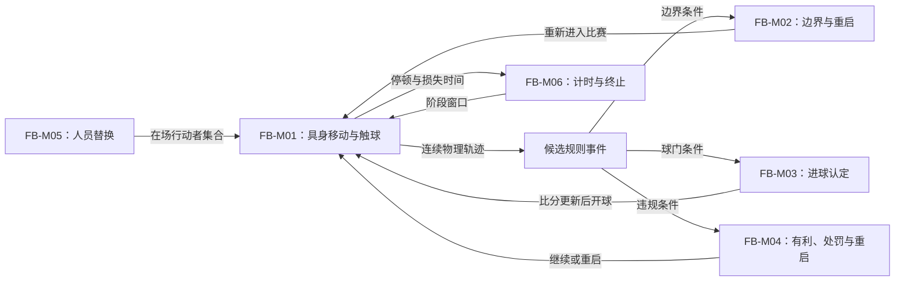

# 十一人制足球：IFAB 2026/27 成年标准配置

- 案例编号：`football-ifab-2026-27-adult-eleven-a-side`
- 分析深度：标准
- 状态：结构分析完成；实体场地、参赛者、比赛轨迹、裁判报告与行为证据待补
- 建档日期：2026-07-21
- 研究问题：当身体、球与场地在连续物理世界中直接互动，而正式比赛状态又依赖裁判认定时，当前模型怎样表达行动、时间、执行与规则事实？
- 案例角色：具身体育与人类裁定锚点；与 [NetHack 5.0.0 普通模式 TTY 配置族](nethack-5.0.0-windows-x64-tty-normal.md)构成第四组标准对照
- 模板版本：[案例研究包 v0.3](../CASE-PACKET-TEMPLATE.md)
- 共用来源包：[NetHack × 足球一手来源与版本冻结](../../research/sources/calibration-nethack-football-primary-sources.md)

> 本案冻结 IFAB 2026/27 Laws 与一组合法的**项目竞赛配置**，不是一场已经发生的比赛。没有球队、球员、实体球场、裁判决定、视频或事件数据，因此只能校准规则结构，不能声称真实控球、战术、犯规频率、体能负荷、公平性或体验。

## 1. 案例范围卡

| 字段 | 锁定值 | 证据或理由 |
| --- | --- | --- |
| 规则机构与版本 | The IFAB, *Laws of the Game 2026/27*，自 2026-07-01 生效 | IFAB 官方文档页与 2026 年规则变更公告 |
| 比赛类型 | 成年室外十一人制协会足球；两支抽象球队 A、B | **项目夹具**；排除青少年、老年、残障与 grassroots 可修改规则 |
| 队伍 | 每队首发 11 人且一人为守门员；比赛中少于 7 人不得开始／继续 | Law 3；没有绑定真实名单 |
| 替补配置 | 每队列名 12 名替补；最多使用 5 人；各队 3 次换人机会，半场换人不占机会 | **项目竞赛规程夹具**；均在 Laws 允许范围内，不是 IFAB 唯一配置 |
| 场地 | 中立、天然草、105 m × 68 m；矩形标线及球门符合 Law 1 | **项目夹具**；尺寸位于国际比赛允许范围，实际测量与材料未冻结 |
| 比赛用球 | 符合 Law 2 的一只比赛球及必要替换球 | 规则条件；未冻结具体品牌、序列号或检测报告 |
| 比赛官员 | 一名裁判、两名助理裁判、一名第四官员 | **项目竞赛配置**；其职责受 Laws 5–6 约束 |
| 技术配置 | 不使用 VAR、GLT、SAOT、裁判 body camera 或其他可选技术 | **项目夹具**；避免把不同观察与复核制度合并 |
| 比赛时长 | 两个 45 分钟半场；中场休息最多 15 分钟；裁判为损失时间作补时 | Law 7 |
| 结果配置 | 单场比赛允许平局；常规时间结束即止，不设加时赛、点球决胜或两回合总比分 | **项目竞赛规程夹具**；Law 10 的决胜程序因本案不要求胜者而不启用 |
| 明确排除 | 临时罚离、回场换人、脑震荡额外换人、临时换人、队长专区、延长控球限制的试验协议、联赛积分与纪律累积 | 防止把可选协议与外部赛事制度回填到基础比赛 |
| 来源锁定日期 | 2026-07-21 |  |
| 规则制品完整性 | 单页版 PDF 23,437,157 bytes；260 页；SHA-256 `89398520B353C6D995A1BB2557C97DC3C5AA1712C1D3009589F580A5A23C6A7D` | 官方下载制品，项目下载、哈希并目视核验 |
| 复现状态 | 规则制品与项目配置已冻结；未取得实际场地、器材、参赛者、裁判组、比赛视频或事件报告 | 不是一场可重放的比赛实例 |

### 1.1 规则版本与竞赛配置边界

- **[来源事实]** 2026/27 Laws 自 2026-07-01 生效；在此之前开始的比赛可按 IFAB 条件提前采用，但本案不依赖提前实施。
- **[来源事实]** Laws 留出多项由竞赛规程确定的参数，例如列名／使用替补人数、是否需要决出胜者、是否采用允许的技术或试验协议。
- **[项目夹具]** 12 名列名替补、5 名可使用替补、3 次换人机会、允许平局和禁用可选技术共同组成一场合法但非唯一的比赛配置。
- **[未知]** 规则制品不能替代实体场地测量、球的合格证明、参赛名单、赛前检查、天气、裁判判断或实际比赛记录。

## 2. 为什么研究它

### 2.1 一分钟内讲清这场配置

两队各以十一名球员在同一片连续场地上争夺一个球，尝试使整个球越过对方球门线并满足进球条件。运动员用身体直接奔跑、转向、触球、对抗与沟通；这些动作先改变真实物理世界，并不先变成一个由程序保证合法的离散命令。

规则只把其中一部分连续过程识别为正式事件：球整体越过边线产生相应重启，球整体越过球门线可能成为进球，特定身体行为可能构成犯规或不正当行为，越位位置只有在随后参与比赛时才可能成为越位犯规。裁判具有执行 Laws 的充分权力，可以允许有利继续，并对事实、重启和比赛结果作正式决定。比赛时钟、球在比赛中／外、损失时间和终场又是不同状态通道。

### 2.2 本案承担的检验任务

- 表达“连续物理世界 → 被观察事件 → 正式规则事实 → 重启／处罚／计分”的转换，而不假装裁判使物理事件发生。
- 区分运动员的身体动作、规则动作与设备输入；检验现有**输入映射**是否过度数字游戏化。
- 复验 A-F05：规范、器材、参与者、比赛官员和可选技术怎样共同实现规则。
- 拆开比赛时钟、球的比赛状态、停顿、损失时间、补时与裁判终场。
- 检查球、球员、控球、比分、时间和换人机会是否真的满足**资源**准入，而不是“重要且有限即资源”。
- 区分开球掷币的规则随机化与开放物理系统中的偶然性、对手选择、环境和观察不完备。

### 2.3 当前最小主张

> **[综合判断]** 本案可表达为“运动员身体动作在连续场地和物理材料中改变球员／球状态 → 比赛官员与参与者按 Laws 观察并识别边界、得分、违规等事件 → 授权裁定把部分观察写成正式比赛事实，并触发继续、重启、处罚、计分或终止 → 比赛在持续时间、球状态与人员容量等并行通道中推进”。正式状态依赖裁定，但物理世界并非由裁判命令生成。

### 双视图导航

- **教学最小视图**：4.1、5.1 与第 6 节展示连续活动如何被离散规则事件组织。
- **研究充分视图**：4.2–4.8 保存执行权、观察、时间、边界、资源准入和不确定性；第 11 节保留没有真实比赛的证据缺口。
- 本案不逐条重述十七条 Laws，也不分析任一阵型或战术；引用规则页码用于结构定位，不能替代原规则制品。

## 3. 证据与来源语域

- **[来源事实]** 球员人数、场地、比赛时长、得分、越位、边界、犯规、重启与官员权限来自 IFAB Laws。
- **[项目夹具]** 场地具体尺寸、替补参数、比赛官员组合、无视频技术与允许平局是项目在 Laws 允许范围内作出的配置。
- **[结构推导]** 连续世界、事件识别、正式事实与裁定写回的分层是项目分析，不是 IFAB 的本体术语。
- **[行为待证]** 控球、传球网络、阵型、逼抢、时间管理、犯规动机与体验没有实际比赛材料。

| 来源术语 | 来源中的操作性含义 | 映射关系 | 项目共享术语或拆解 | 不能自动等同 |
| --- | --- | --- | --- | --- |
| `in play`／`out of play` | 由重启、裁判停止与球整体越界等规则确定的球状态 | 来源较窄 | **球的比赛资格状态** | 物理上仍在移动／静止，或时钟运行／停止 |
| `possession`／`control` | Laws 在不同条款中描述球员／守门员对球的控制状态 | 拆分 | **球员—球控制关系**＋判定条件 | 球作为可所有库存或球队永久资产 |
| `offside position`／`offside offence` | 位置本身不违法；参与比赛等后续条件才构成犯规 | 严格区分 | **位置派生事实**＋**条件事件**＋**违规认定** | 同一个布尔状态 |
| `advantage` | 裁判允许比赛继续，并在预期有利未出现时按规则处理 | 来源较窄 | **延迟裁定／条件回溯** | 玩家拥有的优势数值或所有“领先” |
| `decision` | 裁判基于意见与 Laws 作出的正式判断 | 拆分 | **观察**＋**裁定权**＋**正式事实写回** | 物理事实本身或任意人的看法 |
| `additional time` | 裁判为换人、伤情、拖延等损失时间作出的补足 | 来源较窄 | **阶段终止调整量** | 可由球队自由花费的时间资源 |
| `substitution opportunity` | 一队在比赛中作换人的次数窗口；半场等不计入 | 来源特定 | **有限许可／容量** | 替补球员实体或换人名额货币 |

## 4. 规则世界

### 4.1 教学最小视图

```text
身体动作 + 球／球员／场地的连续物理变化
→ 被参与者和比赛官员观察
→ 某个边界、进球、违规、受伤或换人事件满足规则条件
→ 授权裁定确认正式比赛事实
→ 继续比赛，或以开球／任意球／罚球点球／掷界外球／球门球／角球等重启
→ 比分、人员、纪律、时间与球状态更新
```

### 4.2 参与者、能动性、执行与裁定

| 角色 | 能动性／职责 | 执行与证据边界 |
| --- | --- | --- |
| 球员 | 奔跑、触球、对抗、沟通并在规则约束下选择行动 | 身体既是行动执行器，也是可被犯规、替换和处罚的规则实体 |
| 守门员 | 作为球员参与，且在本方罚球区获得特定手球权限 | 是角色／权限配置，不是另一种比赛主体 |
| 裁判 | 对比赛拥有充分执行权；基于 Laws 与意见作决定，管理继续、重启、纪律与终场 | 正式裁定权不等于全知；具体观察可能错误且本案无实例 |
| 助理裁判／第四官员 | 按 Laws 与裁判指示协助边界、越位、换人和行政事项 | 不取代裁判最终权力；无实际沟通记录 |
| 教练／球队官员 | 可按竞赛配置提出换人、管理技术区等 | 不直接触球或自行改写正式状态 |
| 物理环境 | 场地、球、天气与身体动力学持续演化 | 不是有策略的“系统玩家”，也不是 IFAB 文本执行的程序 |

- 程序型游戏通常先检查命令是否合法再改状态；足球允许身体行为先发生，随后才被观察、判罚或放任继续。
- 规则由多方部分执行：球员自行遵守、裁判裁定、助理提供信息、竞赛组织者配置参数、器材和场地限定物理可能性。
- 裁判决定可能因新信息在有限边界内改变，但比赛重启或终场信号后的锁定条件限制回改；这是一种**裁定生命周期**。

### 4.3 **实体**、**状态**与关系

| 实体／结构 | 关键状态或关系 | 规则角色 |
| --- | --- | --- |
| 球员 | 队伍、位置、在场／替补／被罚离、纪律状态、守门员角色 | 具身行动者与规则对象 |
| 球 | 连续位置、运动、是否在比赛中、最后触球者、是否整体越线 | 共享运动实体与边界事件载体 |
| 场地与标线 | 边线、球门线、罚球区、球门区、中圈、罚球点等 | 连续物理平面上的规则区域与边界 |
| 球门 | 位置、立柱／横梁与球门线关系 | 进球条件的物质边界 |
| 比赛官员 | 角色、观察位置、信号、决定与复核资格 | 信息来源与裁定者 |
| 比分 | A、B 已确认进球数 | 评价／结果状态 |
| 比赛时钟／阶段 | 当前半场、经过时间、损失时间与终止状态 | 时间与终局通道 |
| 纪律记录 | 警告、罚令出场及相关事件 | 对球员资格与赛后制度的连接状态 |

重要关系包括球员对球的**接触／控制**、球员对球队的**成员关系**、球与边界的**整体越过**、球员之间的**空间与身体互动**、官员对事件的**观察**以及裁判对正式事实的**裁定权**。

### 4.4 **规则空间**与事件离散化

- 物理空间近似连续；球员和球不是每次只从一个格跳到相邻格。
- 标线和区域给连续空间叠加有法律后果的边界：同一次触球在罚球区内外、越位位置与非越位位置、边线两侧会触发不同条件。
- 球越界要求**整个球**越过整条边界；视觉投影、接触点和球心位置不能随意替代规则条件。
- 越位位置是从球员、球、倒数第二名防守队员与半场关系派生的空间事实；只有后续参与实际比赛等条件出现时才成为越位犯规。
- 连续轨迹不会全部进入正式记录。模型需要从物理演化中抽取少数**候选事件**，再由授权观察和规则条件形成**正式比赛事实**。

### 4.5 **时间结构**与阶段终止

| 时间通道 | 作用 | 不能等同 |
| --- | --- | --- |
| 现实连续时间 | 身体、球与环境持续变化 | 比赛时钟的正式读数 |
| 比赛时钟 | 每半场 45 分钟的规则时间基线 | 球一定在比赛中 |
| 球的比赛状态 | `in play`／`out of play` | 时钟一定停止／运行 |
| 比赛停顿 | 伤情、换人、处罚、庆祝、延误等造成的中断 | 自动等长地暂停官方计时 |
| 损失时间估计 | 裁判对规则列举原因造成时间损失的判断 | 一项精确自动计时器 |
| 补时／终场 | 每半场最低补时指示与裁判结束该半场 | 球一到显示数值就自动终止 |

- 两个 45 分钟半场和最多 15 分钟中场休息是规则结构；实际持续时长取决于损失时间和裁判终止。
- “球出界”与“比赛时钟停止”不能合并。足球的运行时间更接近连续阶段加裁判调整，而非倒计时归零自动停机。
- 赛事广播时钟、场内计时显示和裁判正式时间可能是不同观察渠道；本案没有具体设备配置。

### 4.6 **信息结构**与正式事实

| 信息项 | 世界／规则对象 | 可观察者与渠道 | 观察后效／锁定 |
| --- | --- | --- | --- |
| 球和球员连续位置 | 物理世界状态 | 场上参与者、官员、观众从不同位置观察 | 感知有限且可能分歧；无 VAR 时不提供视频复核渠道 |
| 助理旗示／官员沟通 | 关于候选事件的信号 | 裁判及相关官员 | 提供裁定信息，不自行保证最终事实 |
| 裁判哨声与手势 | 停止、重启、纪律等正式沟通 | 场上参与者与记录人员 | 形成公共行动依据；部分决定在重启后锁定 |
| 比分 | 已确认进球的正式计数 | 比赛参与者及记录系统 | 可持续复查；错误更正受裁定生命周期约束 |
| 球员意图 | 身体动作背后的目标或心理状态 | 不总能直接观察 | 规则只在特定条款要求判断；不能由动作结果任意反推 |

- **物理真值**、**官员观察**、**正式裁定**和参与者**信念**必须分开。裁判有权决定不等于裁判观察无误。
- 没有 VAR／GLT 时，某些物理事实仍然存在，只是正式比赛没有这些技术观察与复核通道。
- 裁判可在有利原则下暂缓停止；这让“观察到可能违规”和“立即写回处罚／重启”出现时间间隔。

### 4.7 **资源**、容量、关系与评价

| 候选 | 判定 | 理由 |
| --- | --- | --- |
| 球 | **实体**，不是库存资源 | 唯一、重要且可争夺不等于可计量、消耗和转换的存量 |
| 控球 | 时间化的**控制关系／派生测量** | 球没有进入球队库存；控制可以连续、争议并瞬间变化 |
| 球员 | 有身份的**行动者实体** | 被替换或罚离会减少能力，但不能因此抹去身份并叫作通用资源单位 |
| 替补名额／换人机会 | **有限许可与容量** | 有计数、竞争用途和未来行动门控，但载体与使用规则不同于替补球员本身 |
| 比赛时间 | **阶段窗口与进程** | 球队不能像货币那样拥有或转移；“浪费时间”是行为／处罚语境，不等于规则库存 |
| 体能 | 真实身体状态，当前 Laws 未提供统一可支出计量槽 | 需生理测量或具体模型，不从常识建立共享资源 |
| 比分 | **评价量／终局比较状态** | 进球增加计数，但比分不是支付成本以购买行动的库存 |

### 4.8 随机、偶然性、目标与终止

- 开赛前掷币是 Laws 明示的随机选择程序，用于确定开球／进攻方向权限；这是有限、可定位的**随机化机制**。
- 正常比赛中的球路、对抗结果和失误具有不确定性，但主要来自连续物理、参与者选择、环境扰动和有限感知；不能因为难以预测就全写成 RNG。
- 每队的规则目标是比对手取得更多有效进球；本案允许平局，常规时间结束后不追加决胜程序。
- 进球是整个球越过球门线、位于立柱之间和横梁下，且进球队未在此前违规的正式事实。
- 裁判对与比赛相关的事实及结果具有正式决定权；终场结束的是该比赛实例，不删除球员、球队或现实世界状态。

## 5. **机制**分解

### 5.1 尺度声明与索引

| ID | 暂定名称 | 一句话规则结构 | 主要依赖 |
| --- | --- | --- | --- |
| FB-M01 | 具身移动与触球 | 球员以身体在连续场地中移动并改变球／球员状态 | 身体能力、场地、球、物理与规则限制 |
| FB-M02 | 边界事件与重启 | 当整个球越过特定边界时，按最后触球者和边界类型分派重启 | 连续位置、边界、观察、最后触球关系 |
| FB-M03 | 进球认定 | 对整个球越过球门线的候选事件检查位置与此前违规，更新比分 | FB-M01、球门、观察与裁定 |
| FB-M04 | 违规—有利—处罚 | 观察候选违规，由裁判选择停止、允许有利、纪律处理并确定重启 | 行为条件、裁定权、时间与信息 |
| FB-M05 | 人员替换与在场容量 | 在列名、人数、机会与程序条件内替换在场球员 | 球队成员、换人机会、比赛状态 |
| FB-M06 | 阶段计时与终止 | 推进半场时间、估计损失、宣布补时并由裁判结束阶段／比赛 | 比赛时钟、停顿原因、裁判权力 |

### 5.2 FB-M01：身体是执行器也是规则实体

- **触发**：球员在比赛中作出跑动、转身、踢球、头球、抢截、跳跃或其他身体行为。
- **输入边界**：没有独立控制器把按键映射成规则命令；意图通过身体直接改变世界。
- **前置与约束**：位置、在场资格、球状态、身体接触方式和具体 Laws 共同限制后果。
- **执行来源**：身体与物理环境产生轨迹；球员自行遵守与裁判事后裁定共同实现规范。
- **反馈**：本体感觉、视觉／听觉、队友沟通、球的运动和裁判信号；本案没有实际测量。
- **结论**：需要一般化的**行动实现载体**，而不是把所有玩家行动都写成输入设备事件。

### 5.3 FB-M02／M03：从物理越线到正式事件

- 球的连续轨迹先产生“整个球越过某线”的候选事实。
- 越过边线时，最后触球者决定对方掷界外球；越过球门线而未进球时，最后触球关系与攻防方向分派球门球或角球。
- 越过球门线并满足球门位置条件仍只是进球候选；此前进球队违规会阻止进球成立。
- 裁判与助理的观察、信号和权力把候选事件写成正式重启或比分状态。

### 5.4 FB-M04：违规、延迟裁定与锁定

- 身体行为满足条款时可形成犯规／不正当行为候选；裁判不必在每个候选出现时立即停止比赛。
- 预期有利时可让比赛继续；若几秒内有利未出现，规则允许回到原违规处理。这里存在**观察—暂缓—继续／回溯**的裁定生命周期。
- 处罚可改变球状态、重启位置、球员纪律资格和比赛时间；同一个事件不只更新一个数值。
- 决定在比赛重启或终场后的特定边界获得锁定，不能无限追溯修改。

### 5.5 FB-M05／M06：人员与阶段并行更新

- 替补球员、在场球员、可用次数和换人机会是不同对象；完成换人会改变在场身份与剩余容量。
- 罚令出场减少在场人数但不消费普通换人机会，也不能把被罚球员当作普通被替换实体。
- 比赛时钟持续推进，停顿原因进入裁判对损失时间的判断，半场结束由裁判信号正式发生。
- 人员、纪律、比分、球状态和时间是并行通道；不能用一个“比赛状态”布尔量覆盖它们。

## 6. 机制间的**编排**



| 来源 | 关系类型 | 目标 | 传递对象 | 后果 |
| --- | --- | --- | --- | --- |
| FB-M01 | 物理产生 | 候选事件 | 轨迹、接触、位置与时间 | 使边界、得分或违规条件可被观察 |
| 候选事件 | 观察／裁定 | FB-M02／M03／M04 | 官员信号、事实判断与规则资格 | 只有部分物理变化进入正式比赛状态 |
| FB-M02／M03／M04 | 重启 | FB-M01 | 球的位置、球队权限与比赛状态 | 在离散规则边界后恢复连续活动 |
| FB-M05 | 行动者集合更新 | FB-M01 | 在场／替补身份与剩余机会 | 改变后续可行动实体与能力 |
| FB-M06 | 时间门控 | 全部机制 | 半场、补时与终场状态 | 规定这些机制何时仍能产生比赛后果 |

## 7. 玩家层

### 7.1 可由规则支持的决策情境

| 情境 | 规则支持的选择或权衡 | 证据状态 |
| --- | --- | --- |
| 持球／争球 | 传、带、射、护球、抢截、跑动或暂缓 | 行动空间存在；实际战术未知 |
| 边界与重启 | 选择合法重启目标、时机与执行者 | Laws 约束；具体选择未知 |
| 潜在身体违规 | 继续动作、调整接触或停止挑战 | 规则后果可知；球员意图与风险判断未知 |
| 换人 | 在名单、剩余名额和机会内选择被换与替补球员 | 配置允许；教练动机和效果未知 |
| 补时阶段 | 在剩余正式时间内继续比赛 | 时间结构存在；“拖延／提速”行为未观察 |

### 7.2 行为证据边界

- Laws 可以定义允许、禁止和裁定什么，不能证明球队必然控球、反击、压迫、造越位或采用固定阵型。
- “控球率”“跑动距离”“预期进球”“比赛强度”需要测量定义、传感器／事件数据和具体比赛；不能从规则文本导出。
- 公平、身体技能、协作、紧张、观赏性和裁判争议都需要比赛记录与参与者材料；官方规则目标不是体验证据。

## 8. **玩法模板**候选

| 候选名称 | 编排签名 | 持续玩家活动 | 时间与反馈 | 成立条件 | 证据状态 |
| --- | --- | --- | --- | --- | --- |
| 具身领地—球门争夺 | 连续身体控制＋共享球实体＋区域／边界条件＋团队目标＋得分／重启＋裁判裁定 | 跑位、传接、争夺、射门、协作与防守 | 连续阶段中穿插离散重启；比分和官员信号公开反馈 | 可用场地／器材、两队行动者、可靠的事件认定与时间边界 | 结构候选；行为待证 |
| 裁判化连续竞赛 | 开放物理过程＋授权观察＋条件事件化＋可延迟裁定＋正式结果锁定 | 在不完全知道未来裁定的情况下行动并响应信号 | 物理先发生，正式事实在观察／裁定后写回 | 需要人类或技术裁定者及可执行规范 | 跨体育模板候选，尚需其他项目复验 |

- “足球玩法”不能由“移动＋碰撞＋进球”三个词推出；团队权限、球状态、边界重启、越位、违规裁定、人员和时间共同组织持续活动。
- 裁判化连续竞赛也不是足球专有；是否能跨篮球、网球、赛车和搏击稳定成立，需后续案例比较。

## 9. 从模板到这个案例

- **角色绑定**：抽象行动者绑定为两队各十一名首发，其中一名守门员；官员绑定为裁判、两名助理和第四官员。
- **参数化**：105 × 68 m、45 分钟半场、12 名列名替补、5 名可使用替补和 3 次机会共同限定状态空间与人员节奏。
- **材料与尺度**：球的尺寸／压力、草地摩擦、球门与标线把抽象空间规则落到物理制品；本案未冻结实际检验值。
- **裁定制度**：无 VAR／GLT 让正式事实依赖现场官员观察；加入技术不是纯表现升级，会改变证据渠道与决定生命周期。
- **竞赛外层**：允许平局使终场评价停在比分相等；联赛积分、淘汰晋级和纪律累计会形成另一个案例外层，本案排除。
- **游玩实例缺口**：没有真实球员、天气、球路、官员位置、事件轨迹和裁定记录，不能实例化任何战术或争议。

## 10. 与 NetHack 的跨案例比较

| 比较对象 | 相同之处 | 关键差异 | 判断 |
| --- | --- | --- | --- |
| 状态转换 | 都有行动条件、世界变化、反馈和终止 | NetHack 程序计算离散状态；足球身体先推动连续世界，再抽取正式事件 | **共同骨架，运行语义不同** |
| 行动接口 | 都需把人类选择连接到游戏后果 | NetHack 经键盘／菜单形成命令；足球身体本身就是执行器和规则实体 | **输入映射不能包办具身行动** |
| 时间 | 都不能用单一“回合／时钟”表达 | NetHack 是耗时命令、移动点和全局回合；足球是连续时间、球状态、停顿、补时与裁判终场 | **带参数时间术语族** |
| 不确定性 | 都包含未知未来 | NetHack 有明确 RNG 与生成分派；足球只有掷币是显式随机程序，开放比赛的不确定性不能都称 RNG | **区分随机化与偶然性** |
| 裁定 | 都会形成正式状态 | 程序主动阻止／执行 NetHack 命令；足球允许违规身体动作发生后再判罚 | **预防式与事后式执行不同** |
| 生命周期 | 都有正式终止 | NetHack 结束一个角色运行并可能留下 bones；足球结束一场比赛但现实行动者持续存在 | **终止对象不同** |

## 11. 反例、失败与模型压力

### 11.1 本案最顺畅的解释

- **规则实现层**能保存物理材料、参与者自我执行、助理观察和裁判裁定，直接复验 A-F05。
- **世界—观察—信念**再加入授权裁定关系后，可以表达物理事实、官员感知和正式比赛事实，而不把“裁判说了算”误写成物理真值。
- 严格**资源准入**成功阻止球、球员、比分、体能和比赛时间被平坦吸入同一资源表。
- 有类型**编排**能说明连续活动为何被边界、犯规、得分和重启反复离散化。

### 11.2 本案最失真的解释

| 编号 | 失败类型 | 具体症状 | 局部处理 | 可能修订 | 阻塞级别 |
| --- | --- | --- | --- | --- | --- |
| FB-F01 | 跨媒介失真／无法表达倾向 | 仅有离散状态转换时，很容易跳过连续物理、候选事件与授权裁定之间的关系 | 显式增加物理世界→候选事件→正式事实的分析链 | 首轮汇总检查是否需要固定**事件化／裁定**槽位 | 门审 |
| FB-F02 | 跨媒介失真／动作边界 | “输入映射”默认设备事件，无法自然表达身体同时是执行器、状态载体和规则对象 | 使用**行动实现载体**并保留具身实体 | 扩展动作卡的实现载体，而非新增身体原语 | 门审 |
| FB-F03 | 时间结构 | 比赛时钟、球状态、停顿、损失时间、补时与终场常被压成“实时 90 分钟” | 分离并行通道和裁判终止 | 与 NH-F01 汇总为带参数时间比较槽位 | 门审 |
| FB-F04 | 术语变义／不确定性 | 开放物理系统难预测，不代表系统持续抽样随机数；只有掷币等局部程序是明示随机化 | 分开 RNG／随机程序、他人选择、物理偶然与观察不完备 | 建立**不确定性来源**比较槽位 | 门审 |
| FB-F05 | 资源边界 | 球、控球、球员、体能、时间、比分和换人机会都常被口语叫作资源，却有不同载体与操作 | 逐项通过资源准入并保留实体、关系、容量、进程和评价 | 重复 A-F07／B-F02；现有模型可表达 | 长期检查 |
| FB-F06 | 案例单位／版本 | IFAB Laws、竞赛规程参数、实体比赛条件和一次裁判轨迹共同决定一场比赛 | 将来源事实、项目配置与未实例化内容分开 | 重复 C1-F01；范围卡需固定“规范＋配置＋实例” | 长期检查 |
| FB-F07 | 因果越界 | Laws 允许团队协作与战术选择，不能证明任何真实阵型、策略、体能或体验 | 玩家层全部标为结构候选／待证 | 重复 A-F08／B-F05；后续补比赛数据 | 长期检查 |

### 11.3 反例与竞争解释

- 球物理上越过门线但裁判未观察或认定，不会在这场比赛中自动产生正式比分；物理真值与比赛事实不能合并。
- 相反，裁判决定正式有效并不说明观察必然无误；裁定权与认识论正确性是两个关系。
- 若用传感器和自动裁判取代部分官员，场地、球员和目标仍在，但信息渠道、锁定与争议路径会改变；技术不是纯界面皮肤。
- 若比赛改为无裁判的随意踢球，许多身体活动仍然存在，却不再具有同一套授权裁定与竞赛事实结构。
- 若只保留移动、碰撞、球门和比分，会漏掉边界重启、越位条件、在场资格、有利、纪律和补时；原语清单相近不保证玩法模板相同。

## 12. 标准案例暂不执行的模块

- 十七条 Laws 的逐条形式化与所有犯规／重启例外。
- 实体场地、球、名单、官员装备与赛前检查制品冻结。
- 一场完整比赛的视频、事件、跟踪、裁判信号和报告对齐。
- 控球、战术、体能、判罚一致性、公平、难度和体验研究。

## 14. 校准结论与后续

- **结构校准状态**：在 IFAB 2026/27 与本文项目竞赛配置范围内通过，但明确暴露了连续物理、候选事件、授权裁定与正式事实之间缺少简洁固定槽位。
- **复现状态**：规则 PDF 与配置已冻结，实体比赛未实例化；不能声称任何真实触球、得分、违规或裁定。
- **行为证据状态**：待补；不主张战术、控球、协作质量、体能、裁判准确度、公平或体验。
- 现有**规则实现层**、**裁定权**、**观察后效**、**资源准入**和有类型编排仍然有效；需要在首轮总汇报决定是否将“行动实现载体”“事件化／裁定”和“不确定性来源”变成固定比较槽位。
- 后续应选择一场公开、版本相符且具有完整视频／官员报告的比赛，对齐连续轨迹、候选事件、现场观察和正式决定；再与一项数字竞速或具身节奏游戏对照。
- 关联：[一手来源冻结](../../research/sources/calibration-nethack-football-primary-sources.md)、[校准失败清单](../../research/calibration-failure-log.md)、[体育／竞速／节奏覆盖区域](../../research/corpus/genre-coverage-map.md#6-第一轮研究区域与多角色案例组)。
