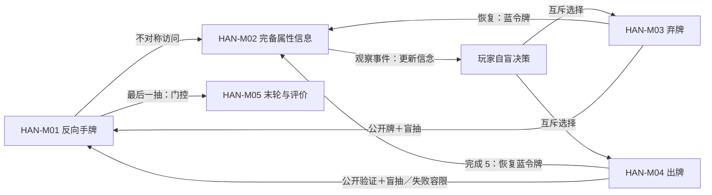

# 《花火》：R&R Games 标准卡牌版四人五色基础局

- 案例编号：`hanabi-rr869-en2013-4p-5c-strict`
- 分析深度：标准
- 状态：分析完成，待首轮总校准；实体印次、具体对局与行为证据待补
- 建档日期：2026-07-21
- 研究问题：当玩家持续看见别人的牌、却不能看自己的牌时，一次有成本且受限的信息行动怎样改变信念而不改变牌面？规则允许的记忆外部化、共享资源和社会执行应怎样进入机制表达？
- 案例角色：受限沟通与合作信息锚点；与 [Nikoli 标准 9×9 数独](sudoku-nikoli-standard-9x9.md)构成第一组标准对照
- 模板版本：[案例研究包 v0.3](../CASE-PACKET-TEMPLATE.md)

> 本文分析 R&R Games ©2013 标准卡牌规则中的四人、五色基础配置，并冻结为严格沟通路径。规则能证明玩家获得哪些访问和行动机会，不能单独证明他们记住了线索、采用某种暗示惯例或产生某种合作体验。

## 1. 案例范围卡

| 字段 | 锁定值 | 证据或理由 |
| --- | --- | --- |
| 游戏制品 | R&R Games 标准卡牌版 *Hanabi*；当前产品目录编号 #869 | [R&R Games 官方规则](https://rnrgames.com/Content/RRGames/images/ProductRules/hanabiRules.pdf)；[2024–25 官方目录](https://rnrgames.com/Content/RRGames/files/RnRGames_Catalog2024-25.pdf)，PDF p.24 |
| 规则集或版本 | 英文规则 PDF，©2013 R&R Games Inc.，2 页 | [一手来源冻结包 §3.1](../../research/sources/calibration-sudoku-hanabi-primary-sources.md#31-来源矩阵与制品身份) |
| 模式与配置 | 四人；白、红、蓝、黄、绿五色基础牌组；每人四张；严格沟通路径 | Rules pp.1–2；严格路径是从规则允许的两种交流配置中作出的项目冻结 |
| 平台或物质形式 | 标准卡牌、8 枚蓝色信息容量令牌、4 枚黑色失败容限令牌与盒盖；未冻结某一实体盒印次 | Rules p.1；目录 p.24 |
| 游玩情境 | 一局基础合作游戏，从随机设置到立即终局或牌库耗尽后的末轮计分 | Rules pp.1–2 |
| 明确排除 | 第六多彩花色、Variants 1–4、Master Artisan、Black Powder、Deluxe／Deluxe II、线上实现、社群暗示惯例与宽松沟通房规 | 防止同名版本与沟通配置混用 |
| 来源锁定日期 | 2026-07-21 |  |
| 关键来源制品 | 上述标准卡牌规则 PDF；产品目录用于确认 #869／#871 边界；[Deluxe II 规则](https://rnrgames.com/Content/RRGames/images/productrules/hanabiDeluxeII_rules.pdf)仅作排除对照 | 规则、产品身份与排除对象不互相替代 |
| 完整性标识 | Rules 4,787,609 bytes；SHA-256 `F23DF0CEAA2715E6B46444018FB8BFAD6AFB021D76FC2C2EE802FDFB4C2DC472` | 项目于锁定日测量，不是 R&R 公布的校验值 |
| 复现状态 | 规则制品已冻结；尚未拍摄具体盒、固定牌序、座次、起始玩家或完整行动／沟通轨迹 | 规则对象不等于一局具体游戏 |

### 版本歧义、配置选择与文本冲突

- **[来源事实]** 标准规则组件共六花色 60 张，但基础设置只把五个单色花色的 50 张洗入牌堆；第六花色属于高级变体。
- **[来源事实]** 同一出版者另有 Deluxe II #871，改用牌块、`Clock`／`Fuse` 牌块和额外组件；本案不借其文字补写标准卡牌版。
- **[来源事实]** 规则既说严格遵循时只能在信息行动中沟通，也允许玩家自行采用更宽松评论。本案选择前者，以 `STRICT` 作为配置字段，不宣称所有玩家群体都这样执行。
- **[文本冲突]** 计分句写“6 fireworks”，但五色基础目标、五项计分示例与 25 分上限相互一致。本案按五列顶值求和，同时保留这个编辑冲突，不静默启用第六花色。
- **[未知]** 当前目录仍列标准产品，却不能证明每个实体印次都附带与冻结 PDF 字节相同的规则。

## 2. 为什么研究它

### 2.1 一分钟内讲清这局游戏

四名玩家共同搭建五列烟花，每列都必须按同一颜色从 1 依次打到 5。每人面前有四张牌，但牌面朝外：其他三人能看见，你自己不能看见。轮到你时必须只做一件事：花掉一枚蓝色令牌，向一名队友完整指出其手中某一种颜色或某一个数字的全部牌；弃掉自己的一张未知牌并恢复一枚蓝色令牌；或者尝试把自己的一张未知牌打到公共烟花列。

成功出牌会推进一列，完成一张 5 还能恢复蓝色令牌；错误出牌则进入弃牌堆并推进公共**失败容限**，第三次错误立即失败。出牌和弃牌后通常盲抽一张补牌。有人抽到牌库最后一张时，四人各再行动一次；若此前完成全部五列，则立即以 25 分结束，否则按各列最高值计分。

严格配置下，队友不能在你的回合随意提醒或影响你。你可以重排自己的手牌帮助记忆，却不能直接翻看。于是，规则保证的是一次定向、完整匹配的信息事件；“这条线索意味着马上打左一”“所有人都记住了”或任何社群约定，都不属于规则已证明的事实。

### 2.2 本案承担的检验任务

- 复验**世界状态—观察—信念**能否表达“自己看不见、别人持续可见、离手后公开”的同一张牌。
- 复验**观察后效**能否区分持续可查的牌面、无系统历史标记的口头信息、可重排的有限外部记忆与玩家实际记忆。
- 检查蓝令牌怎样通过严格**资源准入**，同时防止失败容限、牌、行动机会和得分被统统叫作资源。
- 把“给信息”展开为目标、属性、完备匹配集合、成本、传播与反馈，而不是 `信息 + 沟通` 的词语相加。
- 区分规则允许的合作结构、玩家协调活动、社群惯例和体验主张。
- 检查物质朝向、指点、牌序与人类共同执行是否属于规则实现，而非可以随意删除的表现层。

### 2.3 当前最小主张

> **[综合判断]** 四人五色《花火》的核心机制系统可表达为“反向手牌建立观察者不对称 → 蓝令牌门控定向且完备的信息行动 → 玩家在不能直接验证自己牌面的条件下选择出牌、弃牌或继续传递信息 → 公开结算同时改变烟花进度、失败容限、牌库、可复查记录与下一轮信念条件”。合作推理是这一编排促成的**玩法模板候选**，不是规则书已经观察到的单一机制。

### 双视图导航

- **教学最小视图**：本节摘要、4.1 的结构、4.8 的信息表、5.2 的机制索引和第 6 节编排足以解释反向手牌与受限沟通。
- **研究充分视图**：4.3–4.9 处理身份、观察者、资源边界、传播缺口和末轮；5.3–5.5 展开信息、弃牌与出牌；第 11 节保存社会执行和来源冲突。
- 教学视图省略实体印次、具体牌序、所有手势／语调、房规、行动撤回和玩家记忆轨迹，因此不能支持完整可重放规格或策略主张。

## 3. 证据与来源语域

- **[来源事实]** 组件、设置、可见性、三种行动、令牌移动、烟花、终局、计分与规则内沟通来自 R&R 官方规则。
- **[项目定义]** **信息访问**、**观察后效**、**资源角色**、**决策锁定**、**机制**与**编排**属于项目共享词汇。
- **[结构推导]** 因信息行动必须指出目标手中全部匹配牌，未被指出的其余牌不具该次指定属性；这不证明目标玩家实际推出或记住。
- **[观察]** 本案没有录像、牌序、行动日志、玩家访谈或实体盒审计。
- **[未知]** 旁观队友是否在规则意义上同样接收一次信息、现实信号怎样执行、玩家是否遗忘，以及各种惯例是否存在，均不能由规则补写。

| 来源术语与来源身份 | 来源中的操作性含义 | 映射关系 | 项目共享术语或拆解 | 不能自动等同 | 定位 |
| --- | --- | --- | --- | --- | --- |
| *hand* | 某玩家保管、本人不看而队友可看的牌组 | 来源特殊化 | **个人持牌集合＋保管关系＋反向信息访问** | 通常卡牌游戏的私有手牌 | Rules pp.1–2 |
| *give one piece of information* | 消耗蓝令牌，对一名队友完整指出某颜色或数字的全部匹配牌 | 拆分 | **信息传播动作＋目标＋属性查询＋完备匹配集合＋资源成本** | 任意提示、建议或一般信息事实 | Rules p.2 |
| *Blue Clock token* | 可用时允许给信息；弃牌或完成 5 可恢复 | 名称错位 | **信息容量令牌／共享资源载体** | 自动计时、时钟或经过时间 | Rules pp.1–2 |
| *Black Fuse token* | 错误出牌推进，第三次触发失败 | 来源较窄 | **失败容限载体＋终止计数** | 已自动通过资源准入的通用生命值 | Rules pp.1–2 |
| *firework* | 某颜色从 1 到 5 的公共升序列 | 题材化 | **按属性分组的有序公共构筑列** | 视觉特效、单次出牌或整个目标 | Rules pp.1–2 |
| *communication* | 严格路径下的信息行动，另可由房规放宽 | 部分重叠 | **沟通权限＋传播动作＋社会执行规范** | 所有可听、可见和附带信号均已穷尽 | Rules p.1 |
| *cooperative game* | 玩家不互相对抗并共同追求目标 | 拆分 | **共享目标与结果关系**；另保留来源类型标签 | 一个已定义的合作机制 | Rules p.1 `Summary` |

## 4. 规则世界

### 4.1 教学最小视图

```text
四名玩家共享五列 1→5 烟花目标
+ 每人四张：自己看背面，队友看正面
+ 每回合必须且只能：给信息 / 弃牌 / 出牌
+ 给信息消耗蓝令牌，弃牌或完成 5 可恢复
+ 出牌按真实牌面确定成功或错误
+ 错误推进失败容限，第三次立即失败
+ 出／弃后盲抽，最后一抽触发每人一次末轮
→ 完成五列立即 25 分，或末轮后按五列顶值计分
```

这个视图省略第六花色、宽松房规、牌面指点细节、实体印次和计分编辑冲突；它只适用于已冻结的五色严格配置。

### 4.2 参与者、能动性与执行

| 项目 | 内容 | 来源 |
| --- | --- | --- |
| 玩家与阵营 | 四名玩家共享一个烟花目标、失败状态和终局得分 | Rules p.1 `Summary`；四人为项目配置 |
| 玩家控制对象 | 当前回合选择一种主行动；可按位置选自己的一张牌；给信息时选择一名队友、一个属性类型和值 | Rules p.2 |
| 认知边界 | 玩家控制自己手牌的选择与排列，却没有其正面身份的直接观察权限 | Rules pp.1–2 |
| 系统或环境行动者 | 随机牌堆按顶牌供给；烟花序列、令牌与终局规则自动规定结算但不作策略选择 | Rules pp.1–2 |
| 执行来源 | 玩家共同洗牌、朝向／持牌、指点、翻令牌、维护牌堆／弃牌堆／烟花和末轮次数 | Rules pp.1–2 |
| 裁定权 | 没有外部裁判；规则文本、材料与玩家共同执行合法性及沟通边界 | 规则制品 |
| 能动性边界 | 不可跳过；令牌状态可关闭给信息或弃牌；不能看自己牌面；严格配置不允许额外影响当前玩家 | Rules p.2 |

**[综合判断]** “我控制这张牌”并不意味着“我知道这张牌是什么”。本案清楚分离**控制**、**保管**、按位置选择的**许可**与牌面身份的**观察访问**。

### 4.3 **实体**、集合与身份

| 实体／集合 | 身份怎样保持 | 状态／关系 | 证据 |
| --- | --- | --- | --- |
| 烟花牌 | 50 张基础牌各有颜色和值；从牌堆进入手牌、烟花或弃牌堆时保持牌身份 | 所在容器、朝向、观察者访问、是否仍可用于完成 | Rules p.1 `Contents / Getting Ready` |
| 玩家手牌 | 每人四张的有序／可重排持牌集合；牌库耗尽后可缩短 | 玩家保管并按位置选择；持有者看背面、他人看正面 | Rules pp.1–2 |
| 抽牌堆 | 洗混后的有序剩余牌 | 顺序隐藏；顶牌抽取；最后一张触发末轮 | Rules pp.1–2 |
| 弃牌堆 | 正面公开的离场牌集合 | 所有人可随时查看；具体堆叠是否完整保存时序未规定 | Rules p.1 `Strategic Advice` |
| 烟花列 | 每色一列公开的 1→5 连续构筑 | 当前顶值决定下一张合法值与得分 | Rules p.2 |
| 蓝令牌 | 8 个可用／已用位置状态 | 桌面表示可用，盒盖表示已用；共享容量 | Rules pp.1–2 |
| 失败容限令牌 | 四枚堆叠的失败显示组件 | 错误推进；第三次揭示爆炸并终局 | Rules pp.1–2 |
| 玩家 | 四个持续身份与顺时针关系 | 当前行动者、信息目标、牌的保管者与观察者 | Rules pp.1–2 |

### 4.4 **状态**、关系与权限

足以运行五色基础局的研究状态至少包括：

```text
CurrentPlayer
+ DeckOrder + DeckRemaining + FinalRoundTurnsRemaining
+ HandCardsAndPositions(player)
+ CardFace(card)
+ Custody(player, card)
+ FaceAccess(observer, card, time)
+ FireworkTop(color)
+ DiscardPile
+ AvailableBlueTokens
+ FailureToleranceProgress
+ GameEnded + EndReason + Score
```

| 关系／权限 | 两端 | 建立／改变 | 含义 |
| --- | --- | --- | --- |
| `custodyOf(player, card)` | 玩家—手牌 | 发牌／补牌建立，出／弃移除 | 物质保管，不等于知道牌面 |
| `controlsSelection(player, handPosition)` | 玩家—自己手牌位置 | 持牌期间存在 | 允许按位置选出／弃或重排 |
| `observesFace(observer, card, interval)` | 观察者—牌面 | 他人持牌时对非持有者成立；离手公开后对所有人成立 | 带观察者和时间范围的信息访问 |
| `mayHint(currentPlayer)` | 当前玩家—信息行动 | 蓝令牌大于 0 时成立 | 行动许可，不等于已经拥有某条信息 |
| `mayDiscard(currentPlayer)` | 当前玩家—弃牌行动 | 至少一枚蓝令牌已使用时成立 | 满容量时弃牌关闭 |
| `sharedOutcome(player, game)` | 每名玩家—共同结果 | 全局持续 | 所有人共享终局与得分 |

**[综合判断]** 玩家被告知“这些牌是红色”不会改变任何牌的颜色。它创建一次**观察／传播事件**，可能改变目标玩家的**信念**，同时消耗蓝令牌；世界状态变化发生在令牌位置和动作历史，而非牌面真值。

### 4.5 **规则空间**与材料

- 功能区域：四个个人手牌区、隐藏牌堆、公开弃牌堆、五个烟花列、蓝令牌桌面／盒盖区域和失败容限区域。
- 手牌位置既是可选择地址，也是规则允许的记忆辅助载体；收到信息者可重排、横放或竖放牌帮助记忆。
- 信息行动要求清楚指出目标玩家手中全部匹配牌。物理指点因此参与规则动作，而非纯装饰。
- 牌面朝向建立观察者不对称：同一实体的正面对于持有者和其他玩家具有不同访问权限。
- 标准卡牌与 Deluxe II 牌块可能支持不同的摆放、指点和无障碍方式；核心相似不等于媒介等价。

### 4.6 **时间结构**与调度

```text
设置 → 起始玩家
普通回合：当前玩家恰选一个主行动
          → 若出牌／弃牌且牌堆非空则盲抽补牌
          → 检查立即终局／末轮触发
          → 顺时针转移
最后一张被抽取：建立四个“每人再行动一次”的末轮机会
```

- 驱动来源：当前玩家完成动作后顺时针转移；不能跳过回合。
- 部分合法性在回合开始由蓝令牌状态门控：0 枚可用时不能给信息，8 枚全可用时不能弃牌。
- 出牌按真实牌面立即结算；成功 5、推进失败容限、离手公开和抽牌按动作内顺序更新。
- 第三次错误或五列全部完成会立即终局，覆盖普通轮转与牌库末轮。
- 最后一抽建立一个等于玩家数的有限末轮；本配置为四次，包括抽到最后一张的玩家。规则没有专用计数组件，实际防止数错依赖共同执行。
- 规则没有秒级时限、并发行动、响应窗口或可撤回程序。

### 4.7 **资源**与边界

| 候选及载体 | 稀缺对象 | 竞争用途／时点 | 操作 | 对未来可行行动的改变 | 判断 |
| --- | --- | --- | --- | --- | --- |
| 蓝令牌 | 最多 8 次当前可用的信息行动容量 | 现在给某人信息或留给以后／他人；不同回合共享 | 给信息消耗；弃牌或完成 5 恢复；上限 8 | 0 时关闭信息行动；8 时关闭弃牌 | 通过严格准入，承担**共享信息行动容量资源**角色 |
| 失败容限进度（黑色令牌承载） | 到第三次错误的公共容限 | 不同回合的风险出牌竞争剩余容限，但无主动替代用途 | 错误自动推进，不恢复 | 第三次立即终局；此前不直接关闭三种动作 | 首先是**失败容限状态／终止计数**；暂不叠加资源角色 |
| 烟花牌 | 有颜色和值身份的有限副本 | 一张牌只能出、弃或留在手中；唯一 5 尤其稀缺 | 抽取、保管、出牌、弃牌 | 丢失必要副本可使完美完成不可达 | 首先是实体／集合成员；可在具体构筑机制中承担稀缺材料角色，不压成同质库存 |
| 回合行动机会 | 当前玩家一次三选一许可 | 三种动作互斥 | 用后转移 | 不能储存、转让或累计 | 轮流许可，不自动录作资源 |
| 得分 | 终局评价量 | 无竞争用途 | 终局求和 | 不解锁或支付行动 | 不是资源 |

蓝令牌验证了“资源可以是可叠加语义角色”：令牌仍是实体，数量仍是状态，位置仍是关系，同时在这一机制尺度承担共享资源角色。失败容限则反证“可计数且重要”不足以自动通过准入。

### 4.8 **信息结构**与**观察后效**

| 信息项 | 世界真值 | 谁可观察、何时 | **观察后效** | 证据 |
| --- | --- | --- | --- | --- |
| 自己手牌的颜色和值 | 牌面固定 | 持有者在持有期间不得看；其他三人持续可见 | 牌保存真值，但持有者不可直接复查；离手公开后才可验证此前判断 | Rules pp.1–2 |
| 他人手牌 | 同上 | 观察者可持续看见其余玩家正面 | 在牌仍在手中且朝向合规时可反复复查；严格配置禁止随意传播 | Rules pp.1–2 |
| 牌堆顺序 | 洗牌后物理固定 | 所有人不可见，直到牌进入可见区域 | 无官方日志或回放；随抽牌逐步揭示 | Rules p.1 |
| 一次合法信息 | 目标、属性类型和值、全部匹配牌 | 目标玩家当时被告知并看到指点；旁观队友的规则访问身份未精确定义 | 规则不放永久标记；目标可重排手牌辅助记忆；旧位置可因离手／重排过时 | Rules pp.1–2 |
| 未被指牌的反面信息 | 匹配集合完备性蕴含其余牌不具指定属性 | 目标玩家可推导，但不保证实际推出 | 无系统记录；只能记忆、位置编码或再次取得信息 | 结构推导 |
| 公开弃牌堆 | 已弃牌面 | 所有人随时可看 | 持久、可复查、可验证；时序保存程度未规定 | Rules p.1 |
| 烟花、蓝令牌、失败容限 | 公共状态 | 全桌持续可见 | 组件保留，可反复核对，只按规则更新 | Rules pp.1–2 |
| 玩家对自己牌的信念 | 认知状态 | 仅玩家本人直接拥有 | 可能保留、混淆、遗忘或经离手验证；规则不保证，也无统一笔记协议 | 行为待证 |

- 访问必须是 `观察者 × 对象 × 时间范围` 的关系，不能给牌贴一个全局“隐藏”标签。
- 一次信息行动的规则效果是提供观察并消耗资源，不是生成永久知识状态。**观察后效**记录系统有没有替玩家保存，以及之后怎样复查、验证和传播。
- 重排手牌是规则明确允许的有限外部化，但位置编码没有标准语义；不能把某种摆法直接写成共享信息。
- 来源只明定信息传给一名队友。物理桌上其他人通常可能听见，不足以把“全体广播”写成规则事实；实际录像可以另记执行层访问。
- 严格沟通限制只规定合法通道，没有完备消除语调、停顿、表情、手势和牌序附带信号的执法协议。

### 4.9 **随机性**、目标与评价

| 项目 | 内容 | 证据状态 |
| --- | --- | --- |
| 随机过程 | 50 张基础牌洗混形成隐藏牌序；未给算法、种子或可重放分布 | **[来源事实＋来源缺口]** |
| 他人选择不确定性 | 其他玩家未来会给信息、出牌或弃牌；规则结构可知，选择未知 | **[结构事实]** |
| 规则目标 | 共同按五种颜色各完成 1→5 烟花 | **[来源事实]** |
| 立即失败 | 第三次错误出牌推进失败容限并揭示爆炸 | **[来源事实]** |
| 立即完成 | 牌库耗尽前完成五列，立即以 25 分结束 | **[来源事实]** |
| 普通终局 | 最后一抽后每人再行动一次，然后按五列顶值求和 | **[来源事实＋文本冲突处理]** |
| 玩家自定目标 | 未主张；宽松沟通房规也未启用 | **[未知／排除]** |

## 5. **机制**分解

### 5.1 尺度与术语族

- 本案把一次主行动及其强制结算作为机制单元，把回合三选一和跨回合状态连接视为机制系统。
- 更细拆到“说一个词”“指一张牌”“翻一枚令牌”会丢失信息行动的完备匹配语义。
- 更粗把整款游戏叫作一个“合作推理机制”，会合并观察访问、资源门控、随机抽取、序列构筑、风险结算与玩家活动。

| 表面名称 | 动作义项 | 机制义项 | 玩法模板义项 | 类型标签义项 | 本案采用尺度与 ID |
| --- | --- | --- | --- | --- | --- |
| 线索／信息 | 一次合法传播动作 | 蓝令牌门控的属性匹配传播 | 受限沟通循环的一环 | Deduction／Memory 标签 | `HAN-M02` 机制单元；不等同一般信息 |
| 出牌 | 选一张手牌放到公共区 | 按真实身份结算成功／失败并补牌 | 隐身选择—公开验证循环的一环 | 卡牌游戏通俗动作 | `HAN-M04` 机制单元 |
| 合作 | 不适用 | 共享结果关系与多项机制编排 | 受限沟通合作模板候选 | 出版者类型标签 | 不建立单一机制 ID |
| 记忆 | 玩家认知活动 | 不录作规则机制；重排是规则许可 | 模板成立的可能活动／条件 | 产品分类标签 | 行为待证 |

### 5.2 机制索引

| ID | 暂定名称 | 尺度 | 一句话规则结构 | 依赖 | 证据 |
| --- | --- | --- | --- | --- | --- |
| HAN-M01 | 反向手牌建立与盲抽 | 复合 | 把牌交由一人保管和选择，却把正面访问授予其他玩家；出／弃后盲抽补牌 | 牌堆、朝向、保管、观察关系 | Rules pp.1–2 |
| HAN-M02 | 完备属性信息 | 单元 | 消耗一枚蓝令牌，向一名队友指出其全部某色或某值牌 | 蓝令牌、目标手牌、属性匹配 | Rules p.2 |
| HAN-M03 | 弃牌并恢复信息容量 | 复合 | 公开弃掉一张自盲手牌，恢复一枚蓝令牌，再盲抽补牌 | 已用蓝令牌、手牌、牌堆 | Rules p.2 |
| HAN-M04 | 自盲出牌与序列结算 | 复合 | 选择一张自己不可见的牌；按公开烟花序列成功构筑或推进失败容限，再盲抽 | 信念、牌身份、烟花、失败容限、牌堆 | Rules p.2 |
| HAN-M05 | 牌库末轮与终局评价 | 复合 | 最后一抽建立每人一次末轮；立即成功／失败优先，否则末轮后求五列顶值和 | 牌库、轮序、烟花、失败容限 | Rules p.2；文本冲突记录 |

### 5.3 核心机制卡：HAN-M02 完备属性信息

- **触发**：轮到当前玩家且其选择给信息。
- **触发策略**：可选；若可用蓝令牌为 0 则不合法。
- **行动者与能动性**：当前玩家选择另一名玩家，以及颜色或数值中的一种属性及其具体值。
- **执行来源与裁定权**：行动者口头说明并指点；全桌共同检查是否指出目标手中全部匹配牌。
- **输入**：目标玩家、属性类型、属性值。
- **规则动作**：把一枚蓝令牌移入盒盖，对目标完整指出全部匹配牌；零命中信息不合法。
- **动作生命周期与锁定**：规则没有精确规定说错、漏指或中途改口的纠正点；至少在令牌移动且完整信息被实施后状态已提交。
- **成本与决策锁定**：消耗一单位共享信息行动容量；没有失败返还条款。
- **结算**：按目标当前手牌真实属性计算完整匹配集合。
- **状态／规则效果**：蓝令牌可用量减一；目标获得一次有内容的观察事件；牌面不变。
- **反馈**：口头属性和物理指点；规则未建立历史标记。
- **观察后效**：可重排手牌帮助记忆；能否正确保留、旁观者是否同等接收、旧位置何时过时分别保留。
- **来源定位**：Rules p.2 `Give one piece of information`；p.1 `Strategic Advice / Communicating...`。

### 5.4 核心机制卡：HAN-M03 弃牌并恢复信息容量

- **触发**：当前玩家选择弃牌，且至少一枚蓝令牌位于盒盖。
- **规则动作**：清楚宣布弃牌，按位置选择一张自己不可见的手牌，正面放入弃牌堆，再从牌堆盲抽补牌（若仍有牌）。
- **合法性**：8 枚蓝令牌全可用时不能弃牌。
- **决策锁定**：被选牌离手并公开后，其身份和可用路径不可由基础规则恢复；来源未规定撤回纠错。
- **效果**：恢复一枚蓝令牌；移除一张可能有用的牌；建立公开可复查记录；引入一张持有者自盲的新牌；可能触发末轮。
- **实体身份效果**：旧牌身份保留但转入弃牌集合；新牌从牌库转入手牌。
- **未知**：玩家是否知道、为何相信该牌可弃，属于信念与行为证据。

### 5.5 核心机制卡：HAN-M04 自盲出牌与序列结算

- **触发**：当前玩家选择出牌。
- **行动者与信息**：玩家只按手牌位置和自身信念选择，不能直接读取目标牌身份。
- **前置条件**：玩家手中存在所选位置；出牌行动本身不要求玩家能证明牌可接。
- **过程／结算**：公开牌面；若颜色对应烟花当前需要该值，则加入该列，否则进入弃牌并推进失败容限。
- **成功效果**：烟花顶值加一；若为 5 且蓝令牌未满，恢复一枚；之后通常盲抽。
- **失败效果**：牌进入弃牌，失败容限推进一步；第三次立即失败；否则通常盲抽。
- **决策锁定**：牌被公开并放入烟花或弃牌时，选择已不可撤回；更早口头／手势纠错规则未知，不发明统一阶段。
- **反馈**：所选牌真实身份公开，玩家此前信念得到延迟验证；公共进度或失败容限更新。
- **来源定位**：Rules p.2 `Playing a card / How the fireworks are built / Bonus / End of the game`。

## 6. 机制间的**编排**



| 来源机制 | 关系类型 | 目标 | 传递对象 | 时间尺度 | 后果 | 证据状态 |
| --- | --- | --- | --- | --- | --- | --- |
| HAN-M01 | 信息不对称 | HAN-M02／玩家决策 | 自己不可见、他人可见的牌身份 | 持牌期间 | 使定向信息与信念选择有结构作用 | 来源事实 |
| HAN-M02 | 观察／门控 | 玩家决策 | 属性信息与蓝令牌余量 | 一次信息行动后 | 改变可行信念，不改变牌面；减少未来信息机会 | 来源＋结构推导 |
| HAN-M03 | 资源反馈 | HAN-M02 | 恢复的一枚蓝令牌 | 跨回合 | 牺牲一张牌换回未来信息行动容量 | 来源事实；“牺牲”不含策略评价 |
| HAN-M04 | 延迟验证／风险反馈 | 后续决策 | 公开牌面、烟花进度或失败容限 | 一次出牌后 | 验证信念并改变目标可达性、容限和公共记录 | 来源事实 |
| HAN-M03／M04 | 随机补充 | HAN-M01 | 新抽牌、牌库余量 | 每次出／弃后 | 引入新的不对称信息并推进末轮边界 | 来源事实 |
| HAN-M01 | 门控 | HAN-M05 | 最后一张被抽取 | 一局一次 | 建立四次末轮行动 | 来源事实 |

**[综合判断]** 蓝令牌没有表示“玩家知道多少”。它表示还能执行多少次受规则认可的信息行动。实际知识取决于已经发生的传播、玩家信念、记忆、公开牌和未来验证；把令牌命名为“信息本身”会混淆资源与内容。

## 7. 玩家层

### 7.1 **决策情境**与玩家活动

| 情境 | 可见状态与信念 | 可选行动 | 权衡／不可逆性 | 证据状态 |
| --- | --- | --- | --- | --- |
| 选择给信息 | 看见三名队友牌面、公共状态与蓝令牌；不知道其内在信念 | 目标玩家、颜色／数值及合法命中集合 | 消耗共享容量；同一行动不能同时给颜色和值 | 规则结构；线索意图待证 |
| 选择弃牌 | 看不见自己牌面，只能依靠历史信息和信念 | 选择一个手牌位置 | 恢复蓝令牌，却把牌永久公开弃掉 | 规则结构；“安全弃牌”待证 |
| 选择出牌 | 同上 | 选择一个手牌位置 | 成功推进目标，失败消耗容限；离手后才直接验证 | 规则结构；风险判断待证 |
| 牌库接近耗尽 | 牌库余量与公共状态可见 | 仍在三种行动中选择 | 最后一抽建立有限末轮，未来行动次数减少 | 规则结构 |

- 玩家可能需要记忆已收信息、从完备匹配推出反面信息、结合公开弃牌推断剩余副本，并预测队友怎样解释行动；当前均为**结构促成的活动候选**。
- 规则明确允许重排手牌帮助记忆，只能证明这种操作可用，不能证明玩家使用、记忆成功或采用共同位置代码。
- 严格沟通要求多人协调却限制解释渠道；实际语调、手势、停顿和惯例需要录像与群体规范资料。
- 身体执行主要涉及视觉访问、持牌朝向、指点和组件维护；视障、听障或远程实现可能改变访问渠道，当前来源没有无障碍协议。

### 7.2 策略、挑战与体验

- **策略**：不主张“先提示 5”“弃最旧牌”“左一即出”等条件方针；它们需要来源、对局和适用群体。
- **挑战**：规则任务同时要求在自盲条件下选择、有限地传播属性信息、维护共享容量并避免不可逆错误；实际负担依玩家、牌序和沟通配置而异。
- **难度／平衡**：未评估。四人、随机牌序和严格沟通只是适用范围，不证明任何胜率或最优性。
- **公平**：所有人遵守相同朝向与行动规则，但起手与牌序并非对称分配；本案没有竞争结果公平主张。
- **体验**：合作、信任、紧张、默契、挫败或记忆负担均为行为／体验待证，不由出版者类型标签自动推出。

## 8. **玩法模板**候选

| 候选名称 | 编排签名 | 持续玩家活动 | 时间与反馈结构 | 成立条件 | 证据状态 |
| --- | --- | --- | --- | --- | --- |
| 受限沟通的自盲合作构筑 | 反向持牌＋有成本完备信息＋互斥出／弃／提示＋公开序列与错误容限＋共享终局 | 观察他手、维护自己手牌信念、选择传播内容、按信念出／弃、协调共享容量 | 顺时针回合；信息先到信念、出／弃后延迟验证；随机补牌重建不确定性；末轮收束 | 自己牌面不可直接访问；他人能观察；传播有严格通道与成本；选择后有共享且不可逆后果 | 结构候选；行为待补 |

- 与出版者的合作、推理、记忆等类型标签重叠，但不把这些标签当作已定义机制。
- 单个信息机制不足以形成模板。移除反向访问，提示失去关键作用；移除资源门控，传播不再稀缺；移除公开结算和共享目标，合作选择的后果结构改变。
- 宽松沟通、全体广播、预先约定代码、线上自动记忆等变体可能保留规则名，却改变模板成立条件与玩家活动。
- 相邻对照包括 *The Mind* 的禁言时机协调、*Codenames* 的一对多语义线索和 *Pandemic* 的公开状态合作；不能只因都“合作”就归为同一模板。

## 9. 从模板到这款**游戏**

- **角色绑定**：隐藏值绑定为颜色和值的牌；观察不对称由朝向和保管关系承担；共享构筑绑定为五列烟花。
- **参数化**：四人每手四张、五色各 `3×1, 2×2, 2×3, 2×4, 1×5`、8 枚蓝令牌、第三次错误失败。
- **内容**：随机牌序和重复分布决定具体局的可达状态；没有冻结牌序就没有可重放游玩实例。
- **界面与材料**：卡牌朝向、手牌位置、明确指点、盒盖令牌、公开弃牌堆与烟花列都承载规则信息；不是可无损删除的美术表现。
- **模式与情境**：严格沟通是本案配置。规则明确容许宽松房规，因此必须作为案例单位的一部分。
- **多模板共存**：还可从风险预算、集合计数与公共序列构筑角度建立候选，但本案不急于把每个功能命名成独立模板。
- **题材与表达**：烟花题材为公共序列和失败容限提供来源命名；合作、信息不对称与结算结构不依赖玩家真的相信自己是烟火师。

## 10. 与数独的跨案例比较

| 比较对象 | 判断 | 相同之处 | 关键差异 | 证据 |
| --- | --- | --- | --- | --- |
| “线索” | 功能类比，不结构等价 | 都能约束玩家对未知值的信念 | 数独线索是持久公开的初始状态；《花火》信息是有成本、定向、只描述当前手牌匹配集合的行动 | 两案一手规则 |
| **观察后效** | 同一字段的不同参数 | 都需记录保留、复查、验证与记录 | 数独题面由系统载体永久保存；《花火》口头历史无标记，只允许有限位置外部化 | 两案信息表 |
| 玩家推理 | 活动家族候选 | 都可能由可获得信息推出行动依据 | 数独公开约束确定；《花火》加入随机牌序、他人选择、资源成本、记忆与延迟验证 | 结构分析；行为待证 |
| 资源 | 不可比 | 信息均影响行动 | 数独没有明确资源；《花火》蓝令牌控制信息行动容量 | 严格资源准入 |
| 错误结算 | 不同机制家族 | 错误都会影响完成路径 | 数独基础规则没有自动惩罚；《花火》错误公开牌并推进共享失败容限 | 官方规则 |
| 目标关系 | 功能类比 | 都有可验证完成状态 | 数独为单人赋值任务；《花火》为四人共享序列、分数与失败 | 官方规则＋配置 |

## 11. 反例、失败与模型压力

### 11.1 本案最顺畅的解释

- 带观察者和时间范围的**信息访问关系**自然表达同一张牌对持有者隐藏、对队友可见、离手后公开。
- **观察后效**无需新增“信息生命周期层”，便可比较持续牌面、一次口头信息、手牌重排、公开弃牌和玩家记忆。
- 蓝令牌通过资源准入，而失败容限、行动机会与得分保留不同身份，复验 ADR 0089。
- **决策锁定**可由牌离手、令牌移动和不可逆结算表达，不需要“承诺原语”。
- **来源语域**能阻止 *information*、*clock*、*cooperative* 与项目共享概念因同名而合并。

### 11.2 本案最失真的解释

| 编号 | 失败类型 | 具体症状 | 局部处理 | 可能修订 | 阻塞级别 |
| --- | --- | --- | --- | --- | --- |
| HAN-F01 | 证据不足／传播边界 | 来源指定一名信息目标，却没有形式化旁观队友是否拥有同等规则访问 | 区分目标访问、物理可听性和实际观察 | 后续案例若反复出现，再细分定向／广播传播 | 门审 |
| HAN-F02 | 跨媒介失真／执行 | 严格沟通靠人类共同执行，无法从规则文本证明语调、手势和牌序不泄漏信息 | 保留规范、执行与观察层 | 录像案例复验社会执行字段 | 延后观察 |
| HAN-F03 | 资源边界 | 失败容限像共享“生命”，却主要自动计数错误、缺少主动竞争用途 | 先记失败容限，不强收资源 | 与生命值、尝试次数和风险预算案例比较后再决定 | 门审 |
| HAN-F04 | 版本／文本冲突 | 五色基础计分句出现“6 fireworks” | 采用五列示例、目标和 25 分的一致解释，保留冲突 | 无本体修订；继续要求来源冲突可追踪 | 已处理 |
| HAN-F05 | 因果越界 | 规则结构极易诱导“玩家会记忆、合作推理、形成默契”的断言 | 模板只给结构候选，行为状态待补 | 无共享模型修订；继续双证据状态 | 长期检查 |
| HAN-F06 | 术语变义 | 来源把信息内容、信息行动和蓝色 *Clock* 令牌放在相近语言中 | 来源映射后改用共享术语 | 若跨案重复，建立“线索”术语族 | 门审 |

### 11.3 反例与竞争解释

- 若所有玩家都能看自己的牌，实体、牌组和烟花规则几乎不变，但信息行动的功能、信念活动和风险结构显著改变；相同原语清单不保证相同玩法模板。
- 若系统永久标注每张牌收到过的全部信息，规则语义可能近似，玩家记忆与观察后效却改变；结构不能只保留“提示过”。
- 若允许无限自由沟通，蓝令牌仍可作为组件存在，却不再垄断规则认可的信息传播，核心资源反馈被架空。
- “《花火》是合作游戏”是出版者有效类型陈述，却不足以解释为何合作成立；共享目标、观察不对称、传播成本、不可逆结算和共同失败的编排才是可检验结构。
- 把本案解释成多人约束满足问题可以形式化部分牌序与选择，却会弱化社会执行、时间、资源、随机抽取和信念传播，不能独自替代设计分析。

## 12. 标准案例暂不执行的模块

- 设计变体：实体、通信或自动记忆变体待具体原型后再做单变量实验。
- 完整证据账本：标准案例不强制；可引用[一手来源冻结包 §5](../../research/sources/calibration-sudoku-hanabi-primary-sources.md#5-可直接进入案例包的主张账本)。
- 行为观察：需冻结四人座次、牌序、严格沟通声明、完整录像／日志和时间邻近证言。

## 14. 校准结论与后续

- **结构校准状态**：在 R&R ©2013 标准卡牌、四人五色、严格沟通的声明范围内通过；信息、资源、时间、动作生命周期和编排词汇均可表达核心规则。
- **行为证据状态**：待补；不主张记忆成功、线索惯例、策略、合作质量或体验。
- 保留的工作定义：**观察后效**是信息访问事件之后的保留、复查、验证、记录、传播与衰减属性；不等于第四种信息状态。
- 候选概念：蓝令牌稳定为**共享信息行动容量资源**；失败容限暂不叠加资源角色；“线索”保留术语族候选，不立即升格为原语。
- 新的模型压力：定向传播与物理广播可能分离；严格社会规则的规范、执行和实际观察必须分别取证。
- 后续取证：冻结具体 #869 实体印次和四人对局；记录完整牌序、信息目标与指点、旁观者访问、手牌重排、信念证言及规则外信号。
- 关联：[一手来源冻结](../../research/sources/calibration-sudoku-hanabi-primary-sources.md)、[校准失败清单](../../research/calibration-failure-log.md)、[合作与社会互动覆盖地图](../../research/corpus/genre-coverage-map.md#6-第一轮研究区域与多角色案例组)。
