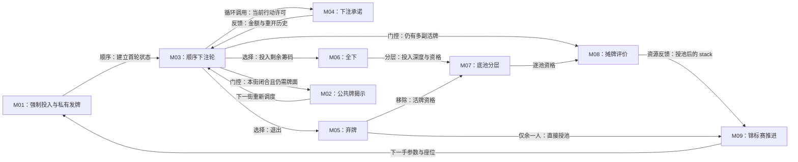

# 无限注德州扑克：2026 WSOP Event #65 深度案例

- 案例编号：`holdem-wsop-2026-event-65`
- 分析深度：深度
- 状态：分析完成；校准门 B 待跨案例门审，完整牌谱复现待补
- 建档日期：2026-07-21
- 研究问题：隐藏信息、顺序下注、弃牌、全下与边池怎样把同一批筹码组织成行动上限、承诺量、结算池和索取资格？现有的关系、生命周期与信息模型能否表达这一过程，而不发明一个含混的“承诺原语”？
- 案例角色：隐藏信息与下注承诺的锚点；与 2016 英文修订版四人《农场主》构成校准门 B 对照
- 模板版本：[案例研究包 v0.2](../CASE-PACKET-TEMPLATE.md)

> 本文分析一个被版本冻结的现实赛事对象，不编造“通用德州扑克规则”。WSOP 规则中的 `Participant`、`chips`、`wager`、`pot`、`side pot` 与 `all-in` 是来源术语；本文另用项目定义说明它们在具体规则中承担的实体、状态、关系、资源与动作角色。规则事实不能单独证明诈唬、读牌、范围、GTO 或任何体验。

## 1. 案例范围卡

| 字段 | 锁定值 | 证据或理由 |
| --- | --- | --- |
| 游戏制品 | 2026 World Series of Poker，Event #65：`$1,500 Freezeout No-Limit Hold'em` | [WSOP 官方赛事页](https://www.wsop.com/tournaments/2026-57th-annual-world-series-of-poker/)与官方结构表 PDF p.75 |
| 规则集 | *2026 WSOP Official Tournament Rules*；未覆盖事项依 Rule 129 才查询 *2026 WSOP Official Live Action Rules*，仍未覆盖时依 Rule 51 裁定 | Tournament Rules 51、129 |
| 模式与配置 | Freezeout；常规高牌无限注德州扑克；首级每名新参赛者 25,000 起始筹码，BBA 100、SB 100、BB 100 | [2026 WSOP Bracelet Structures](https://assets.wsopcdn.com/wsop/449960d6-f34d-406d-8424-ff84f5ae51c3.pdf)，Event #65，PDF p.75 |
| 桌上人数 | **未由 Event #65 官方材料锁定**；每手实际被发牌人数必须来自观察记录或明确的项目夹具 | Tournament Rules “Flop Games”只给出 2–10 人许可范围，不能证明本赛事以几人桌开局；Rule 34、67 还允许运营调整 |
| 平台或物质形式 | 拉斯维加斯 Horseshoe／Paris 的实体赛事：实体牌、赛事筹码、按钮、牌桌，由 dealer、floor 与其他 WSOP Personnel 执行 | Tournament Rules 34、51、69–76、85–105 |
| 游玩情境 | 一场多日 Freezeout 锦标赛中的连续手牌；核心机制以一手牌为主要尺度，并保留筹码、按钮与级别的跨手反馈 | Event #65 结构表；Tournament Rules 79、85；官方赛事结果页 |
| 明确排除 | 现金桌、re-entry、赏金、Short Deck、PLO、straddle、run it twice、线上实现、TDA 规则替代、未在结构表中规定的 shot clock | 版本冻结的研究选择；Tournament Rule 129 不会把全部现金桌选项带入赛事 |
| 来源锁定日期 | 2026-07-21 | [校准门 B 一手资料包](../../research/sources/calibration-b-primary-sources.md) |
| 关键来源制品 | 41 页 Tournament Rules、116 页赛事结构表、31 页 Live Action Rules、官方结果与 PokerNews 同期报道 | 规则身份、事件身份和选择性观察分别取证，互不越权 |
| 完整性标识 | Tournament Rules SHA-256 `EC87C297C9C99BF7C320AD34DDC57E80259782A7785BD5218151EEFAE742AD14`；Structures `0E92BD62B25A174EF1F2FBE7EDFBA79CD30B2E097A40324B7529E6F5209DACAD`；Live Action Rules `BD291AD3A639742736499D06841FF2BAC496508F081E1A3C5B12BBA73BFC2F06` | 项目于锁定日对官方 URL 下载文件的测量值，不是 WSOP 发布的校验值 |
| 复现状态 | 规则文本与选择性现场报道已分析；没有桌号、完整牌序、逐动作筹码量和裁定记录齐全的可重放牌谱 | 当前只有事件记录 E、选择性直接观察 O 和少量参与者证言 T，没有完整可复现轨迹 R |

### 版本歧义与范围缺口

- **[未知]** Event #65 的正式桌型没有出现在结构表。本文绝不以“常见 WSOP 桌制”补成九人桌、八人桌或其他数字。
- **[来源缺口]** 当前冻结的 WSOP 文本没有为本案完整枚举普通 52 张牌和常规高牌型的逐级比较；Short Deck 小节的 36 张牌与 `Flush > Full House` 不得倒灌。
- **[来源缺口]** Level 1 的 BBA 数值已知，但大盲短到不足以同时支付 ante 与 blind 时的扣除优先级没有在所选 WSOP 文本中锁定；不得把 TDA 建议冒充 WSOP 规则。
- **[来源事实]** TDA 明说其规则补充具体 house rules。本案只把它当外部比较规范，不与 WSOP 拼成一个虚构规则集。
- **[综合判断]** Event #65 是赛事级**游戏制品／规则对象**；任意一手牌只是一个**游玩实例**。逐手人数、按钮、座次、牌序和起手筹码属于实例字段，不应由赛事标题推断。

## 2. 为什么研究它

### 2.1 一分钟内讲清这局游戏

一桌仍有资格参加本手的选手先按位置投入盲注和大盲前注，每人获得两张只有自己通常能看的暗牌。随后玩家依次面对当前下注：没有人下注时可以过牌或下注；已经有人下注时可以弃牌、跟到当前金额，或在规则允许时加注，最多投入自己面前的全部筹码。第一轮下注结束后，桌面依次公开三张翻牌、一张转牌和一张河牌，每次公开后再进行一轮下注。

如果其他人都弃牌，唯一仍持有活牌的人无需公开暗牌便获得底池；若多人留到最后，则按规则顺序摊牌，以暗牌和公共牌组成的最佳五张牌决定各底池归属。不同深度的全下会把后续投入分成主池和一个或多个边池，玩家只能争夺自己有资格取得的部分。赛事采用 Freezeout：已经投入和赢得的筹码会进入下一手，强制下注随级别改变，淘汰后不能重新参赛。

这个摘要故意没有写“玩家靠诈唬赢”。规则确实允许一手在不摊牌时结束，也让行动携带公开信息；但某次下注是诈唬、价值下注还是误操作，需要暗牌、玩家证言或更完整观察，不能从结构自动得出。

### 2.2 本案承担的检验任务

- 检验**世界状态—观察视图—信念状态**能否表达私有暗牌、公共牌、未知牌序、公开下注、muck 与对手意图。
- 检验同一 `chips` 如何在 stack、wager、pot 和 side pot 中承担不同规则角色，而无需复制成互不相干的“多种资源”。
- 检验**动作生命周期**能否表达口头声明、筹码动作、约束力、纠正、例外退回、行动顺序和 floor 裁定。
- 检验弃牌者失去底池资格但已投入筹码仍留下、全下者失去继续下注能力却保留部分索取资格的交叉关系。
- 检验下注、信息展开、退出、边池、摊牌与跨手筹码反馈怎样经**编排**形成持续玩法，而不是把“德州扑克”当成一个不可拆黑箱。
- 与四人《农场主》对照：两案都把稀缺机会顺序提交并影响后来玩家，但信息、承诺、资源刷新和目标连接明显不同。

### 2.3 当前最小主张

> **[工作假设]** 一手 Event #65 无限注德州扑克可以表达为“私有信息发放与分街公开 → 顺序下注及不可单方撤回的筹码承诺 → 弃牌／全下改变后续权限和底池资格 → 逐池评价与转移”。所谓“承诺”目前能由**动作生命周期**、`control/custody/permission/eligibility` 关系和状态效果组合表达，没有证据要求把它提升为新的顶层**原语**。

### 2.4 双视图导航

- **教学最小视图**：本节摘要、4.0 的五条规则、5.2 机制索引、5.4 下注机制卡和第 6 节编排闭环，足以解释“隐藏信息怎样与下注承诺结合”。
- **研究充分视图**：4.1–4.12 展开参与者、筹码角色、观察精度与调度；5.3–5.9 处理行动顺序、弃牌、全下、边池和摊牌；第 11、13 节记录失败与证据。
- 教学视图省略：口头/筹码输入冲突、行动抢跑、under-call、短 all-in 是否重开、边池与奇数筹码、牌组/牌型来源缺口和 floor discretion。省略它们不会改变核心循环，却会阻止精确合法性或可执行模拟，因而必须在研究视图保留。

## 3. 证据与陈述约定

- **[来源事实]**：由 Event #65 结构表、2026 WSOP 规则或官方结果页直接支持。
- **[观察 O]**：PokerNews 同期逐手报道实际记录到的公开动作；报道是选择性现场记录，不是完整牌谱。
- **[参与者证言 T]**：选手对目标、风格或现场情况的自述；只证明“该参与者如此陈述”。
- **[综合判断]**：本项目对原语角色、机制边界、编排和模板的分析。
- **[工作假设]**：规则允许或激励、但缺少足够游玩材料验证的玩家活动和设计后果。
- **[未知]**：未公开暗牌、未记录动作、玩家内心状态、正式桌型与未覆盖裁定，不用扑克惯例补齐。

两份观察材料尤其重要：

1. [O-H1：Gonzalez Raises the River](https://www.pokernews.com/tours/wsop/2026-wsop/event-65-freezeout/chips.836898.htm)记录了一次多街下注、加注、跟注、过牌、河牌再加注与对手弃牌。它证明一条公开响应链实际发生，却没有公开双方暗牌，不能证明诈唬或读牌。
2. [O-H2：Kyle Lin Eliminated in 2nd Place](https://www.pokernews.com/tours/wsop/2026-wsop/event-65-freezeout/chips.836905.htm)记录了 heads-up 全下、跟注、两手暗牌公开、公共牌展开、求值和淘汰。它覆盖完整骨架，但缺少全下前精确筹码、底池分层和秒级动作，仍不能计算重放。

[赛后采访 T-H1](https://www.pokernews.com/tours/wsop/2026-wsop/event-65-freezeout/chips.836936.htm)只用于说明冠军 Gonzalez 事后描述过自己的阶段目标和主动风格；不把自述升级为全赛事普遍行为或胜因。

## 4. 规则世界

### 4.0 教学最小规则视图

```text
每人两张私有暗牌
+ 最多五张分街公开的公共牌
+ 四轮顺序下注
+ 弃牌 / 跟注 / 下注 / 加注 / 全下
→ 唯一活牌者直接获池，或多人摊牌后逐池获奖
```

这五行有意把“怎样解释一次筹码动作”“谁能争哪个边池”和“何时公开暗牌”留到研究充分视图。核心语义不是 `牌 + 筹码 + 随机` 的关键词相加，而是信息访问、承诺、权限与结算资格按时间连接。

### 4.1 参与者、能动性与执行

| 项目 | 内容 | 来源 |
| --- | --- | --- |
| 赛事参与者 | 被分配到本桌、在本手有资格收牌的 `Participant`；实际人数逐手记录，不能由赛事标题预填 | Tournament Rules 34、66–68、Section IX “Flop Games” |
| 玩家控制对象 | 自己尚未投入的筹码、自己的暗牌保管与合法动作选择；不能选择牌序、公共牌或他人动作 | Rules 90–108；Section IX.1 |
| dealer | 发牌、烧牌、公开公共牌、推进动作、管理筹码与底池、识别部分异常；没有玩家式战略能动性 | Rules 70–76、90–105；Section IX.1 |
| floor / WSOP Personnel | 在歧义、行动抢跑、下注解释、未覆盖事项、争议与处罚中裁定 | Rules 51、72、90、93、103、105、129 |
| 共同执行者 | 参与者有持续观察、澄清意图、保护手牌和指出读牌错误等责任 | Rules 69、71、93、104、106、108 |
| 能动性边界 | 只有当前获得 action 的活牌参与者能提交正常下注动作；行动抢跑可能被条件性约束或处罚，而非一概视为不存在 | Rule 90.d；Glossary “ACTION OUT OF TURN” |

**[综合判断]** 本案的**执行来源**分布在玩家、dealer、物质筹码/牌和赛事人员之间；**裁定权**集中于 WSOP Personnel。实体赛事不是“大家口头自觉执行”的纯社会系统，也不是输入一到便得到唯一程序输出的纯自动系统。

### 4.2 **实体**、类型、实例与身份

| 实体或结构 | 实例 / 集合 | 身份怎样保持或改变 | 证据 |
| --- | --- | --- | --- |
| 赛事参与者 | 每名参赛者 | 跨手保持赛事身份；本手可从 active 变 folded、all-in 或 eliminated，参与者实体本身不因弃牌消失 | Rules 2、13、70–72；官方结果页 |
| 座位与按钮 | 当前桌座位、dealer button | 座位是可寻址位置，按钮每手移动；桌平衡会改变参与者—座位关系 | Rules 34、66–68、85 |
| 扑克牌 | 暗牌、公共牌、烧牌、stub、muck 中的具体牌 | 发放、揭示或 muck 通常改变保管与可见性，不改变牌本身身份；误发/废牌另有异常路径 | Rules 70–72、81–89；Section IX.1 |
| 赛事筹码 | 各面额实体筹码及其规则价值 | 从 stack 移入下注区与 pot 时通常保留物质身份；规则结算主要追踪价值、位置和资格，而非某枚筹码的谱系 | Rules 90–107；Glossary “POT” |
| 本手 hand | 某参与者的两张暗牌及其存活状态 | 弃牌时退出当前结算资格；摊牌时可公开成为 tabled hand | Rules 70–72；Glossary “HAND”“TABLED HAND” |
| 主池 / 边池 | 由已承诺金额和 all-in 深度形成的结算池 | 在本案尺度下可当作临时结算实体：形成、独立评价、分割/授予后退出 | Rule 74；Glossary “POT (MAIN/SIDE POT)” |

**[综合判断]** “筹码下注”默认不是**实体身份效果**中的移除。筹码或其价值从可控 stack 转为已承诺 wager，再进入 pot；变化的主要是位置、控制、撤回权限与结算用途。奖池授予才把筹码价值转入获胜者的新 stack。若模拟只写 `chips := chips - bet`，会丢失这批筹码为何仍存在、谁有资格赢回以及弃牌后为何不返还。

### 4.3 **状态**与事实

一个足以判断普通下注和边池的研究状态至少包括：

```text
EventLevel + HandBoundary
+ TableSeats + Button + DealtInSet
+ Street + Board + Deck/Stub + Burn + Muck
+ HoleCards(player) + HandStatus(player)
+ StackValue(player) + StreetContribution(player) + TotalContribution(player)
+ CurrentBet + LastFullBetOrRaiseIncrement + HasActedSinceFullRaise(player)
+ ActionOn + ActionHistory
+ PotLayers + Eligibility(player, potLayer)
```

| 状态项 | 基础 / 派生 / 历史 | 读写者 | 更新时机 | 证据 |
| --- | --- | --- | --- | --- |
| Level 与强制下注参数 | 基础参数/状态 | 赛事时钟、dealer、玩家 | 新级别宣布后，从下一手边界生效 | Event #65 p.75；Rule 79 |
| `DealtInSet` 与手牌状态 | 基础状态 | dealer / floor | 发牌、弃牌、判死、淘汰时 | Rules 67、70–72、108 |
| 暗牌与公共牌 | 基础世界状态 | dealer 写入；可见者不同 | 初始发牌与 flop/turn/river | Section IX.1 |
| stack / 当街投入 / 全手投入 | 基础数量状态 | 玩家动作、dealer 管理 | 强制下注、bet/call/raise/all-in、退回、授池 | Rules 90–105；Glossary |
| 当前待跟金额与最小加注 | 派生 + 历史摘要 | dealer/floor/玩家共同读取 | 每次完整下注、加注或短 all-in 后 | Rules 95–96 |
| 已行动及重开资格 | 历史摘要 | 规则判断 | 每次行动；完整或连续短 all-in 后重算 | Rule 96 |
| 主池、边池与资格 | 由投入深度、活牌状态派生的结算结构 | dealer / floor | all-in 深度分叉与弃牌发生后 | Rules 70、74；Glossary “ALL-IN”“POT” |
| 动作轨迹 | 有序历史 | 全桌观察，记录可能不完整 | 每次声明、筹码动作与裁定 | Rules 90–105；观察 O-H1/O-H2 |

**[综合判断]** “已经下注多少”至少有当街投入、整手总投入、当前需补齐金额和可争夺池层四种问题。把它们压成一个 `bet` 数字会使短 all-in、重开加注和边池无法判断。

### 4.4 **关系**、控制、保管与资格

| 关系 | 两端 | 建立 / 改变 / 移除 | 分析含义 |
| --- | --- | --- | --- |
| `seatedAt(participant, seat)` | 参与者—座位 | 分桌、平衡、重抽座位 | 决定按钮相对位置和行动顺序，不等于玩家身份 |
| `custodyOf(player, holeCards)` | 玩家—暗牌 | 发牌建立；muck / 收牌移除 | 当前物质保管，不自动保证仍是活牌 |
| `controls(player, stackValue)` | 玩家—未承诺筹码 | 获池增加；下注减少；处罚/淘汰可能改变 | 允许玩家决定合法投入；已入 pot 的量不再受其单方控制 |
| `committedTo(value, hand/pot)` | 下注值—本手 | 有约束力动作建立；规则指定的退回/作废才解除 | 不是简单消耗，而是用途与撤回权限改变 |
| `eligibleFor(player, potLayer)` | 玩家—主/边池 | 由投入匹配且手牌仍 live 建立；弃牌移除 | 底池索取资格，不等于所有权，也不保证获奖 |
| `actionPermission(player, street)` | 玩家—下注窗口 | 按座序转移；弃牌/all-in 后通常不再取得下注许可 | 当前能行动的规则资格 |
| `observes(player, fact, precision)` | 玩家—信息事实 | 发牌、公开、口头/筹码动作、muck 等改变 | 见 4.9；可见不等于由 dealer 精确报数 |

**[综合判断]** WSOP 规则并未要求本文把 pot 直接写成某位玩家的“所有物”。投入后更准确的项目描述是：玩家对该量失去日常行动控制，dealer/赛事结构保管并结算，仍持活牌者按投入层拥有条件性**索取资格**。弃牌会移除资格，却不逆转已承诺投入（Rule 91）。现有 `control + custody + permission + ordinary relation` 足以表达；无需让“ownership”独自承担所有含义。

### 4.5 **规则空间**

- **拓扑空间**：座位围绕牌桌形成有方向的循环次序；按钮、SB、BB 和“按钮左侧”由这一关系定义。
- **功能区域**：个人 stack、当前下注区、中央 pot、board、stub、burn/muck 与 dealer 区。它们的边界决定筹码或牌当前承担什么角色。
- **物质动作空间**：筹码是否被推向 pot、是否一次连续动作、是否返回 stack，以及口头声明与筹码落桌哪个先发生，都会改变动作解释（Rules 90、94、97–103）。
- **显示与规则空间**：没有单独 UI；筹码必须可见、可合理估算，高面额须显露。NLHE 中 dealer 不替玩家报总 pot，但可摊开供当前行动者查看（Rules 101、106–107）。

**[综合判断]** 这里最重要的空间不是牌桌的厘米距离，而是座位顺序与功能区域。物理媒介仍非纯表现：一次筹码手势的轨迹可能进入规则语义。

### 4.6 **时间结构**与调度语义

本案同时存在四层时间：

1. **赛事级别**：Day 1 每级 40 分钟、Days 2–3 每级 60 分钟；级别到时不改写正在进行的一手，新参数在下一手起点生效。
2. **一手牌**：强制下注与初始发牌 → preflop → flop → turn → river → showdown/直接授池。
3. **下注轮**：从首个应行动者开始顺序转移；call、raise 与 all-in 可使 action 绕桌一次或多次，直到所有仍能行动者完成当前要求。
4. **单次动作生命周期**：取得 action → 给出首个可解释信号 → 解释/约束 → 合法性与金额纠正 → 筹码承诺 → 公开反馈 → action 转移。

**调度语义**：

- 初始发牌由按钮左侧开始；preflop 的首个正常行动者在大盲左侧，后续 streets 从按钮左侧第一个仍在手中的参与者开始；heads-up 有专门按钮/盲注顺序（Rules 85、87；Section IX.1；Live Action “Button and Blind Use”）。
- 每条 street 的公共牌只有在前一轮 betting action complete 后才发出（Section IX.1）。玩家不能跳过尚未完成的行动，主动要求提前发下一张牌。
- 行动抢跑不是简单“非法即无效”：若到该参与者前 action 没有改变，先前动作可能保持约束；若 action 改变，则可重选，筹码可能退回；被跳过者若在其左侧出现 substantial action 前不维护行动权，也可能受裁定（Rule 90.d）。
- all-in 且整手下注已结束时，暗牌统一翻开；之后继续发完公共牌并结算，不再等待无筹码玩家下注（Rule 70）。
- 规则保留叫钟与 floor 裁量，但 Event #65 结构没有预先规定 shot clock；不能把每个动作写成固定秒数（Rule 80）。

**[模型压力]** 行动抢跑表现出一种“条件性待定承诺”：动作在输入时已发生，却要等其前方 action 是否改变才能确定是否继续约束。这仍可由生命周期分支、历史事实和后续重检表达，不必新增一个跨游戏万能的“半行动”层。

### 4.7 **集合结构**

| 集合 | 有序性 / 容量 | 可见性 | 典型操作 | 证据 |
| --- | --- | --- | --- | --- |
| deck / stub | 有序但本案没有可复现洗牌算法；标准牌组完整定义仍缺 | 牌背可见，未来牌值通常无人可观察 | shuffle、deal、burn | Rules 78、81–89；Section IX.1 |
| 每位玩家的 hole cards | 固定两张 | 对本人私有，直至主动/强制 table；muck 后通常不可得 | deal、protect、table、muck | Rules 70–72、108；Section IX.1 |
| board | flop 三张 + turn 一张 + river 一张 | 翻开后全桌公开 | reveal、evaluate | Section IX.1 |
| muck / burn | 无需保持玩家可用顺序 | 通常隐藏；特定错误与 floor 裁量有例外 | discard、retrieve in narrow cases | Rules 70、81–89；Glossary |
| stack | 每位参与者可数筹码集合/价值 | 必须公开可合理估算 | post、bet、receive pot、color-up | Rules 77、90–107 |
| main/side pots | 按投入深度形成一个或多个价值池 | 物质可见，资格由规则派生 | create、split、award | Rules 73–74；Glossary |

### 4.8 **资源**、资源操作与筹码角色

| 资源候选 / 所处状态 | 稀缺来源与竞争用途 | 资源操作 | 跨期影响 | 证据与判断 |
| --- | --- | --- | --- | --- |
| 未承诺 stack | 每人有限；同时支持当前 call/raise、未来 streets 与未来 hands | 保存、分配、承诺、获池 | 决定本手最大合法下注；获池后进入后续手牌 | No-Limit 规则；Event #65 起始筹码 |
| 当前 wager / contribution | 已从 stack 分配到本手；服务跟注、加注与取得对应池层资格 | 承诺、补齐、纠正、少数路径退回 | 通常不能单方撤回；弃牌后仍留在 pot | Rules 90–96，尤其 91 |
| main/side pot | 来自 ante、blinds、bets 与后续 action 的总和/分层 | 汇集、按资格分层、分割、授予 | 授予后成为获胜者未来 stack | Rules 70、73–74；Glossary “POT” |
| 行动机会 | 顺序授予且不可储存 | 获得、使用、失去 | 影响本街可提交动作 | 更适合写成**规则权限**而非资源存量 |
| 暗牌 | 稀缺且私有，但没有可交换的多用途分配网络 | 保管、公开或弃入 muck | 决定本手评价候选 | 首先是实体与信息，不因“重要”就称资源 |
| pot size 数值 | 结算与决策相关的派生量 | 求值/观察 | 本身不能花费 | 是资源集合的度量，不是另一种资源 |

筹码经济的正常路径不是：

```text
stack --消耗--> 不存在
```

而是：

```text
受玩家控制的 stack
--下注生命周期建立承诺-->
当前 wager / contribution
--下注轮完成与投入深度分层-->
main pot / side pots + eligibility
--直接获池或摊牌评价-->
获胜者 stack
```

**[综合判断]** 同一价值载体在不同位置承担多个规则角色，但没有因此变成多种互不相容的“筹码原语”。规则通过位置、控制、保管、撤回权限、贡献历史和索取资格改变其语义。本案支持 Gate B 假设 B-H01，也支持 B-H02：承诺目前是关系与生命周期的组合结构。

### 4.9 **信息结构**：世界、观察与信念

| 信息项 | 世界真值 | 谁可观察 | 时机 / 渠道 | 精度、延迟或成本 | 证据 |
| --- | --- | --- | --- | --- | --- |
| 自己的两张暗牌 | 确定的两张具体牌 | 持有者；公开后全桌 | 发牌后私有查看；table 时公开 | 玩家须保护手牌 | Rules 70–72、108；Section IX.1 |
| 对手暗牌 | 世界中确定 | 通常不可见；all-in 后下注结束或 showdown table 时公开 | 翻牌动作 | 若弃入 muck 且未 table，通常不公开 | Rules 70–72 |
| board | 随牌序确定，尚未发出时未知 | 发出后全桌 | flop/turn/river 分街公开 | 公开、无规则噪声 | Section IX.1 |
| deck/stub 次序 | 实体牌序存在 | 通常无人按规则观察 | shuffle/deal/burn | 无可复现算法，不能从“随机”补分布 | Rules 78、81–89 |
| stack | 物质/价值事实 | 全桌可合理估计 | 可见筹码堆 | dealer 不保证代玩家给出全部精确决策数据；高额筹码须显露 | Rules 101、106–107 |
| 当前/总 pot | 已投入量的派生事实 | 物质上可查看；NLHE dealer 不报总 pot | 当前行动者可请求摊开自己计数 | 观察有成本和误差；不是“公开=系统精确显示” | Section VIII No-Limit；Rule 101 |
| 已发生动作 | 有序事件轨迹 | 同桌通过口头、筹码和 dealer 反馈观察 | 实时公开 | 规则要求持续观察；没有官方完整逐手日志保证 | Rules 90–105 |
| 对手意图与策略 | 若未被正式提交，不是规则世界状态 | 不可直接观察 | 可由行为形成信念 | 可能错误，也不由规则验证 | **项目定义** |

```text
世界状态：所有牌值、牌序、筹码、位置、动作与资格事实
观察视图：本人暗牌 + 已公开 board/action/stacks + 有限精度的 pot 信息
信念状态：对未知牌、对手手牌、未来动作与意图的主观估计
```

**[观察 O-H1]** 公开报道保留了 river raise 与 fold，却没有暗牌。因此我们能说“玩家对公开动作作出响应”，不能把未见世界事实填成诈唬或价值牌。

**[观察 O-H2]** all-in 被跟注后，两手暗牌和公共牌公开，使原先私有事实转为公共观察；这是规则触发的**信息访问操作**，不是记者替读者补写信念。

**[综合判断]** 世界—观察—信念三分法足以容纳本案，但“公开/隐藏”仍需带观察者、时点、精度、保留和渠道。pot 的例子尤其反驳“公开信息必定由系统准确报数”。

### 4.10 **随机性**与不确定性

| 来源 | 过程 | 玩家何时知晓 | 可控 / 可复现 | 影响 |
| --- | --- | --- | --- | --- |
| 牌序 | 实体牌经赛事程序洗牌后依序发出；本文不主张具体概率算法 | 暗牌只向持有者；board 分街公开 | 玩家不能选择；当前无可重放输入序 | 手牌、未来公共牌与 showdown 结果 |
| 他人选择 | 对手在其观察/信念下选择合法动作 | 动作公开后 | 不由当前玩家控制 | 当前投入、是否继续、信息历史 |
| 隐藏状态 | 对手暗牌、未来牌和已 muck 未亮牌 | 可能永不公开 | 可形成信念但不等于获知 | 决策不确定性 |
| 裁定 | 含混手势、行动抢跑、undercall 等由 floor 结合情境判断 | 裁定时 | 非随机抽样，但结果不总能预先由文本唯一计算 | 动作金额、约束力、处罚 |

**[未知]** 本案没有完整牌组定义、洗牌算法、种子和输入序，因而不能从规则包重放 O-H1/O-H2，也不声称发牌服从已验证的均匀独立分布。

### 4.11 **目标**、终止与评价

| 项目 | 内容 | 证据状态 |
| --- | --- | --- |
| 本手规则目标 | 成为唯一仍持活牌者而直接获池，或在 showdown 以可读的最佳五张手牌取得有资格争夺的池层 | **[来源事实]** Rules 69–75；Section IX.1 |
| 本手终止 | 唯一活牌者获池，或最终 betting action 完成、逐池 showdown 并推池 | **[来源事实]** Rule 72；Glossary “HAND”“SHOWDOWN” |
| 结果评价 | 每个主池/边池独立决定获胜者并分割；奇数筹码另按位置规则 | **[来源事实]** Rules 73–74 |
| 赛事连接 | 筹码转入下一手；按钮与盲注位置变化，级别参数在手边界更新；Freezeout 排除重新参赛 | **[来源事实]** Event #65 p.75；Rules 2、13、79、85 |
| 玩家自定目标 | Gonzalez 赛后称其先关注进入决赛桌，之后关注奖金级差 | **[参与者证言 T]**，只适用于其事后陈述 |
| 诈唬、读牌、GTO、ICM | 可作为玩家活动/策略研究候选，但本案没有足够材料验证具体发生与频率 | **[未知 / 工作假设]** |

### 4.12 WSOP 来源词与项目角色映射

| WSOP 来源词 | 来源中的最低限度含义 | 本文的项目映射 | 不能偷换成什么 |
| --- | --- | --- | --- |
| `Participant` | 赛事参与者或在某个行动位置上的参与者 | 持续的参与者实体 + 当前 seat/hand/action 状态 | 每手固定桌人数、总是有行动权的“玩家” |
| `chips` | 有面额、须可见并用于赛事 wager 的筹码 | 物质实体/价值载体；在 stack 时可控资源，在 wager/pot 时关系与权限改变 | 一经下注便从世界消失的消耗品 |
| `wager / bet / raise` | 由口头和/或筹码输入形成、受金额及顺序规则解释的下注 | 规则动作 + 已承诺金额状态 + 对后续 action 的公开事件 | 单一按钮输入、玩家心理意图 |
| `pot` | ante、blinds、bets 与后续 action 的总和 | 临时结算集合/账户及其价值 | 当场属于某位玩家的财产、玩家可直接花费的 stack |
| `side pot` | all-in 后形成并独立授予/分割的额外池 | 按贡献深度创建的结算层 + 独立 eligibility 关系 | 只是主池的显示分组、所有活牌者都能争夺 |
| `all-in` | 参与者把桌面剩余筹码投入本手；只能赢其有资格部分，后续超额形成边池 | wager 动作 + `stack=0` + 下注许可受限 + 仍可能 live/eligible | 自动弃牌、自动赢池、完整加注的同义词 |

**[校准判断]** 这张映射表没有把来源词强行改写成原语。它显示自然语言名词在不同槽位中承担不同**语义角色**，正是项目区分“词汇类型”与“语法使用”的用途。

## 5. **机制**分解

### 5.1 尺度声明

本案把“一次有约束力的下注动作”作为细粒度**机制单元**，把“一轮下注”视为多个动作经调度、响应和闭合条件组成的**复合机制**，再把私有发牌、四轮下注、公共牌揭示、退出、全下、底池分层与评价的稳定耦合视为一手牌的**机制系统**。

这三个尺度都可能在自然语言中被叫作“下注”：

```text
bet / call / raise 的一次提交
< 一轮 betting round
< 一手牌的多街 wagering system
< 跨手的锦标赛筹码竞争
```

更细地把“说出金额”“推入筹码”“金额纠正”分别叫机制，会掩盖它们共同决定一个下注动作的事实；更粗地把整场德州扑克叫一个“下注机制”，又会掩盖退出、公开信息、底池资格与跨手反馈。本文保留拆解关系，不为行业词规定唯一层级。

### 5.2 机制索引

| ID | 暂定名称 | 尺度 | 一句话规则结构 | 依赖 | 证据 |
| --- | --- | --- | --- | --- | --- |
| M01 | 强制投入与私有发牌 | 复合 | 按按钮位置建立盲注／BBA，再向有资格参与者发两张私有暗牌 | 座位、按钮、级别、牌组 | Event #65 p.75；Rules 85–87；Section IX.1 |
| M02 | 分街公共牌揭示 | 复合 | 前一轮下注闭合后烧牌并按 flop/turn/river 公开 3/1/1 张公共牌 | M03 闭合、stub | Section IX.1 |
| M03 | 顺序下注轮 | 复合 | action 按座序转移，直到所有仍有行动许可者对当前投入要求完成响应 | M04–M06、调度状态 | Rules 90–105；Section IX.1 |
| M04 | 下注输入解释与筹码承诺 | 单元 | 把口头／筹码输入解释为 check、bet、call 或 raise，纠正金额并提交约束性投入 | 当前 action、stack、current bet、最小加注 | Rules 90–103 |
| M05 | 弃牌退出 | 单元 | 有约束力的 fold 使手牌失去活牌与底池资格，既有投入通常保留 | 活牌、动作窗口 | Rules 84、90、91、108–110 |
| M06 | 全下与加注重开 | 复合 | 投入剩余 stack；保留有限底池资格，失去后续下注能力，并按完整加注阈值决定是否重开 | M04、投入历史 | Rules 70、95–96；Glossary “ALL-IN” |
| M07 | 底池分层与资格结算 | 复合 | 按有效投入深度建立主池／边池，并把仍持活牌者连接到可争夺的层 | 总投入、活牌状态 | Rules 70、73–74；Glossary |
| M08 | 摊牌与逐池评价 | 复合 | 按摊牌顺序公开牌，由 cards speak 确认有效牌面，再逐池授予／分割 | M07、牌型求值 | Rules 69–75；Section IX.1 |
| M09 | 锦标赛跨手推进 | 系统 | 获池后的 stack、按钮、淘汰与下一手级别参数共同生成后续局面 | 一手结果、赛事结构 | Rules 2、13、67、79、85；Event #65 p.75 |

M01–M09 是当前问题的研究切分，不宣称它们是德州扑克唯一正确的机制目录。洗牌、防作弊、桌平衡、处罚、叫钟和赛事奖金仍是相关机制；本文只在它们改变核心状态或证据边界时展开。

### 5.3 M03：顺序下注轮

- **触发**：初始暗牌发完，或 flop／turn／river 被公开。
- **调度语义**：preflop 从大盲左侧的首位可行动者开始；其余 streets 从按钮左侧首位仍在手中的参与者开始；heads-up 另有顺序。action 沿座位循环转移，弃牌者与无后续下注能力的全下者被跳过。
- **行动者**：当前获得 `actionPermission` 的活牌参与者；dealer 推进并公开当前动作，floor 处理争议。
- **输入与动作**：玩家可能提交 check、bet、call、raise、fold 或 all-in；具体可选集合取决于是否面对投入、stack 与加注历史。
- **闭合条件**：所有仍能行动的活牌者已经满足当前投入要求，且不存在尚待响应的完整 bet/raise。规则文本没有把本文的状态谓词逐字列出；这是对行动完成条件的项目表达。
- **状态效果**：更新行动历史、各玩家投入、活牌与 all-in 状态、重开资格及 `ActionOn`；闭合后把控制交给 M02、M08 或直接授池路径。
- **反馈**：口头声明、筹码位置和 dealer 推进向全桌公开；精确 stack 与动作含义仍可能需要玩家核验。
- **未知与争议**：含混输入、行动抢跑、undercall、隐藏筹码和错误信息会使闭合与金额依赖 floor 裁定。

一次 betting round 不是“每人行动一次”。完整加注可能使已经行动者再次获得响应机会；不足完整加注的单个 all-in 通常不重开，但连续短 all-in 的总增量可能重开（Rule 96）。因此它是一个读取历史摘要、动态改变参与者集合的循环调度机制。

### 5.4 M04：下注输入解释与筹码承诺

#### 教学最小视图

```text
轮到某位活牌玩家
+ 玩家声明或移动筹码
+ 当前待跟金额与最小加注
→ 解释为 check / bet / call / raise
→ 合法金额进入本手，公开给后来行动者
```

#### 研究充分视图

- **触发**：action 到达某参与者，或该参与者在 action 到达前抢先输入。
- **输入**：口头动词、口头金额、一枚或多枚筹码的面额与移动方式、可能的手势；这些信号的组合次序会影响解释。
- **生命周期里程碑**：取得 action → 出现首个可解释信号 → 规则确定约束含义 → 必要时补齐／纠正金额 → 筹码成为已承诺投入 → action 与金额向全桌确认 → action 转移。抢跑路径会在前方 action 是否改变后重新判定约束力。
- **前置与合法性**：参与者仍有活牌、仍有 stack、当前拥有行动许可；check 只在无需补齐投入时成立，raise 还需满足最小增量和重开资格。
- **成本与承诺**：投入减少玩家可直接控制的 stack。Rule 91 的默认不是“支付后消失”，而是投入留在本手；未被跟注的超额、动作抢跑被允许重选或某些死手未被跟注的 raise 才可能退回。
- **结算**：规则依口头优先、单枚大筹码、多筹码、string raise、undercall 等条款解释输入；文本不能覆盖的情境由 WSOP Personnel 裁定。
- **效果**：更新 `StreetContribution`、`TotalContribution`、`CurrentBet`、最小加注历史和后续行动许可；筹码的控制／保管／用途关系发生变化。
- **反馈**：可见筹码与口头动作是语义反馈；dealer 的陈述可能帮助理解，却不解除参与者核实正确金额的责任。

“承诺”在这里不是独立动作词，而是生命周期到达某个里程碑后产生的一组规则后果：单方撤回权缩小、筹码用途改变、他人的响应集合改变。这个组合也能表达《农场主》的放置承诺，但两案的恢复时点和资格后果不同。

### 5.5 M05：弃牌退出

- **触发／输入**：玩家在规则承认的情境中声明 fold，或以可识别方式向前弃牌；某些非标准时点的 fold 仍有约束力并可能受罚。
- **生命周期**：输入被识别 → 手牌被判 dead／进入 muck → 本手行动许可和所有底池资格移除。可清楚识别的误弃牌在极窄情形下可由管理方追回，故“牌一移动便绝对不可逆”并不准确。
- **筹码后果**：已合法投入通常仍在 pot；未被跟注的超额按规则退回。退出的是手牌的竞争资格，不是把历史投入倒转。
- **信息后果**：face-down muck 通常不会向对手公开牌面；世界中的牌值存在过，但普通玩家可能永远不能观察。事件记录若未保存牌值，研究者也不能补写。
- **结算后果**：若只剩一副活牌，M08 不必执行完整牌型比较，唯一活牌者可直接获池。

弃牌因此同时更新身份状态、许可、资格和信息访问，却不需要一个名为“退出资源”的新原语。

### 5.6 M06：全下与加注重开

- **规则动作**：参与者把当前桌面剩余赛事筹码投入本手；无限注上限由其剩余 stack 决定。
- **效果组合**：`StackValue = 0`；参与者仍可能保持活牌和部分底池资格；后续正常下注许可消失；其投入深度可能触发 M07 的新池层。
- **加注资格**：all-in 的金额若达到完整加注，正常重开；单个不足完整加注通常不让已行动者再次 raise；连续短 all-in 达到规则阈值时可能重开。
- **公开牌面**：所有下注已经结束且存在 all-in 时，仍在手中的牌被正面公开，随后继续发牌。这是信息访问规则的改变，不等于玩家选择主动透露。
- **反例边界**：all-in 不等于弃牌、自动摊牌时点、完整 raise 或自动淘汰。只有输掉相关结算且赛事 stack 归零等后续条件成立时，才连接到淘汰。

全下最能说明“资源状态”不能独自解释玩法：相同的 `stack = 0`，还必须知道手牌是否 live、可争哪些 pot、下注是否闭合、其他人是否仍能行动。

### 5.7 M07：底池分层与资格结算

为比较结构，本文把每名参与者的有效总投入视为若干阈值。每个相邻阈值区间形成一个结算层，贡献覆盖该层且手牌仍 live 的参与者对其具有 `eligibleFor` 关系。实际 dealer 可以通过物质筹码整理实现同一结果；WSOP 文本没有规定必须采用这段算法。

```text
总投入深度 + 活牌集合
→ 建立主池 / 边池层
→ 为每层计算 eligible players
→ 每层分别求值、分割与授予
```

- 弃牌者的投入仍贡献池值，但不在任何后续资格集合中。
- 全下者只可争其投入所覆盖的层；更深投入者之间形成边池。
- 未跟注的超额不形成只有一人可争的伪边池，应按适用规则退回。
- 每个边池独立结算；同一玩家可能赢主池而输边池，或相反。
- pot 是临时结算结构与价值集合，不是任一玩家当前可支配的 stack。

这个机制需要“数值分层 + 条件资格关系”，但没有证据要求新增“底池原语”。底池是由集合、数量、关系、条件和结算构成的扑克内容结构。

### 5.8 M08：摊牌与逐池评价

- **触发**：最后一轮下注闭合且仍有多副活牌，或所有下注已结束的 all-in 路径进入公开与发完牌面。
- **顺序**：最后一轮最后主动 bet/raise 者先亮；无人下注时由本应首行动者先亮。cards speak，正确牌面优先于玩家口头误报。
- **输入**：仍活着且被 table 的暗牌、五张公共牌、M07 的资格集合。
- **结算**：对每个 pot layer，在其资格集合内比较最佳五张牌；平手按规则分割，奇数筹码另行处理。
- **信息效果**：被 table 的暗牌从私有观察变为公开；已经 face-down muck 且未被合法追回的牌保持不可用。
- **来源限制**：冻结的 WSOP 规则写有“best five-card poker hand”和 cards speak，却未在普通 NLHE 小节完整定义所有高牌型及同类比较。本文可以分析评价接口，不能宣称已经获得 WSOP 官方完整 evaluator。

### 5.9 M09：锦标赛跨手推进

一手牌结束后，底池值回到获胜者 stack；其他人的剩余 stack 继续保留。按钮按赛事规则推进，桌平衡和淘汰可能改变座位关系；新级别只在下一手边界生效。Freezeout 使归零淘汰者不能通过 re-entry 返回本赛事。

这条跨手反馈把单手 wager 从局部风险变成有限赛事存续量：

```text
本手 stack 分配
→ 决定下一手可下注上限与存续状态
→ 盲注 / BBA 随级别改变
→ 后续手牌再次重分配
```

规则可以保证这一反馈存在，却不能单独证明玩家因此采用 ICM、奖金级差规划或某种风险偏好。Gonzalez 的赛后陈述只说明一名参与者曾这样描述自己的阶段目标。

## 6. 机制间的**编排**

### 6.1 有类型编排图



### 6.2 编排表

| 来源机制 | 关系类型 | 目标机制 | 传递内容 | 时间尺度 | 后果 | 证据 |
| --- | --- | --- | --- | --- | --- | --- |
| M01 | 顺序 / 初始化 | M03 | 按钮、首行动者、暗牌、盲注和 BBA | 手首 | 建立非对称位置与私有观察 | Event #65 p.75；Section IX.1 |
| M03 | 循环调用 | M04/M05/M06 | 当前 action、待跟金额、重开资格 | 单次行动 | 玩家提交一次响应并改变后来者集合 | Rules 90–105 |
| M04/M06 | 反馈 | M03 | 新投入、完整加注增量、已行动历史 | 下注轮 | 可能让 action 再次绕桌 | Rules 95–96 |
| M05/M06 | 控制与资格变化 | M07 | live/folded/all-in、总投入深度 | 手内 | 行动者集合与可争池层分离 | Rules 70、74、108 |
| M03 | 门控 | M02 | betting action complete | street 边界 | 未闭合不得推进下一公共牌 | Section IX.1 |
| M02 | 信息共享 | M03 | 新公共牌事实 | street 边界 | 所有仍在手者观察变化，进入新决策状态 | Section IX.1 |
| M07 | 资格输入 | M08 | 各池价值与 eligible set | showdown | 同一手牌结果可按池层不同 | Rules 73–74 |
| M08/M05 | 资源转移 | M09 | 获池者、stack 差分、淘汰候选 | 手边界 | 当前结果成为下一手行动上限 | Rules 72–79 |
| M09 | 反馈 / 参数更新 | M01 | 按钮、座位、级别、剩余参与者 | 跨手 | 形成重复但不复位的赛事循环 | Rules 67、79、85 |

### 6.3 循环与跨尺度结构

- **动作尺度**：读取当前投入与观察 → 提交输入 → 解释并承诺 → 更新后来者的响应集合。
- **下注轮尺度**：action 沿座序反复转移，直到所有仍能行动者完成响应；raise 可能重开，fold/all-in 会缩小集合。
- **一手尺度**：私有发牌与四轮下注交替，公共信息逐步增加；路径可提前由弃牌终止，也可进入逐池摊牌。
- **跨手尺度**：stack 和赛事身份保留，牌与单手投入重置；按钮、盲注和级别改变下一手初始条件。
- **赛事尺度**：Freezeout 把连续的局部筹码重分配连接到淘汰和最终唯一剩余者。

如果只保留 M04，一次 wager 只是有约束力的资源提交；没有 M03 的响应循环、M02 的分街信息、M05 的不摊牌退出、M07 的资格分层和 M09 的跨手反馈，它不会自动成为本案的持续玩法。反过来，牌型比较 M08 即使完整存在，也不足以解释为何大量牌局在不展示暗牌时结束。

## 7. 玩家层

### 7.1 **决策情境**与玩家活动

| 情境 | 可见状态与信念 | 可选行动 | 权衡 / 不可逆性 | 证据状态 | 证据 |
| --- | --- | --- | --- | --- | --- |
| 面对当前 wager | 公共牌、公开动作、可见筹码和自己的暗牌；对手暗牌与意图未知 | fold、call、合法 raise/all-in；某些状态可 check | 继续资格、当前承诺与未来行动上限改变 | **[规则预期]** | Rules 90–105 |
| O-H1 河牌面对 650 万加注 | Lin 可见多街历史与河牌公开状态；双方暗牌未被报道 | call、fold，若 stack/规则允许也可能再 raise；报道只记录 fold | 弃牌终止其底池资格并保留未公开信息 | **[观察 O]** | PokerNews O-H1 |
| O-H2 heads-up 面对按钮全下 | Lin 可见 Gonzalez 的全下和自己的 `4♦4♥`；报道未给精确 stack | fold 或 call | call 后投入进入不可再下注的公开结算路径 | **[观察 O]** | PokerNews O-H2 |
| 跨手分配 stack | 当前赛事 stack、盲注级别、位置与下一手不确定状态 | 在多手中选择不同合法投入 | 本手结果改变后续最大投入与存续 | **[规则结构；具体政策未知]** | Event #65；Rules 79、85 |
| 决赛日阶段目标 | 公开排名／奖金环境与个人目标 | 不由规则直接枚举为一个动作 | 系统排名、奖金与个人追求可不完全相同 | **[参与者证言 T]** | Gonzalez 赛后采访 |

O-H1 证明了一条多街响应链和未摊牌退出实际发生；它不证明河牌加注是诈唬，也不证明 Lin 的 fold 来自某种读牌。O-H2 证明全下—接受—公开—发牌—求值—淘汰骨架实际发生；报道中的肢体描述不自动给出完整心理状态。

### 7.2 推理、执行与协调

- **规则要求的感知**：玩家需追踪 action、当前 wager、公开牌、可见 stack、仍在手者和自己的暗牌，才能提交合法响应。
- **可能的推理**：牌型可能性、对手范围、胜率、底池赔率、诈唬与赛事价值都是研究候选；规则允许这些推断，却不记录玩家是否实际完成。
- **物质执行**：口头和筹码动作的先后、连续性与面额具有规则后果。错误手势不是纯界面瑕疵，可能成为受约束动作。
- **沟通限制**：一人一手规则禁止在手中接受或提供建议；公开声明和筹码动作仍向全桌传递规则信息。对手从中形成何种信念不属于正式状态。
- **裁定协调**：dealer 与参与者共同维护动作，floor 处理歧义。玩家不能假定 dealer 报出的金额解除自己的核验责任。

### 7.3 **策略**、惯例与涌现

| 主张 | 规则可行性 | 实际使用证据 | 适用范围 | 当前结论 |
| --- | --- | --- | --- | --- |
| 河牌加注可能在不摊牌时获池 | 允许：对手可 fold | O-H1 观察到 raise 后 fold，暗牌未知 | Event #65 一手被报道牌局 | 可写行为结果，不能命名为已证实诈唬 |
| 玩家根据范围与赔率选择投入 | 规则提供所需但不完备的信息结构 | 本案无思考过程、完整牌谱或行为编码 | 未知 | 保留玩家活动候选 |
| 通过持续主动下注施压 | 规则允许 bet/raise 改变他人响应集合 | Gonzalez 事后自称风格主动；报道有选择性 | 一名玩家的事后证言 | 不能推出稳定策略或胜因 |
| 根据奖金级差改变决策 | 锦标赛排名和奖金存在 | Gonzalez 称其关注 pay jumps | 一名选手、决赛日、自述 | 只记录玩家目标，不标 ICM 策略已发生 |
| 慢速行动可用于奖金级差 | 叫钟与反拖延条款说明此行为可能出现 | Stories 页有一名参与者帖子，未交叉验证 | 同期证言线索 | 不进入已观察通行玩法 |

“诈唬”尤其是一个有意让更强牌弃牌的玩家策略解释。若暗牌、玩家目标和对手状态均未知，仅凭“加注后对手弃牌”无法区分诈唬、价值下注、混合策略、误判或其他解释。

### 7.4 挑战、难度、平衡与体验

- 可由规则描述的**挑战结构**包括：私有与逐步公开信息、对手选择不确定、筹码提交不可轻易撤回、行动顺序、全下资格与跨手存续。
- **难度**必须指定玩家经验、牌局深度、桌型、阶段、执行环境和研究任务；“规则多”不能证明所有玩家实际感到困难。
- **平衡**可能指位置优势、起始机会、赛事结构、筹码深度、牌序分布或长期胜率；没有指标时不写“扑克很平衡”。
- **公平**可能指程序执行、洗牌机会、信息访问、裁判一致或赛事结果；同一规则适用不自动证明每位玩家主观认为公平。
- “紧张、刺激、压迫、爽快”等均为带玩家群体与情境的**体验假设**。当前来源只能支持规则后果和少量自述，不能把这些感受写成机制固有属性。

## 8. **玩法模板**候选

| 候选名称 | 编排签名 | 持续玩家活动 | 时间与反馈 | 成立条件 | 证据状态 |
| --- | --- | --- | --- | --- | --- |
| 分街信息展开—顺序承诺响应 | 私有发牌 → 顺序 wager 响应 → 公共信息展开 → 再响应 → 退出或评价 | 读取公开状态、提交 fold/call/raise、在新信息后重估 | 四轮下注嵌套三次公共揭示；投入与历史反馈到后续合法行动 | 新信息必须在多个承诺窗口之间进入；早期投入与退出须影响后续 | **[规则预期；O-H1 有局部观察]** |
| 不对称投入深度—分层资格竞争 | 有限 stack → all-in 深度分叉 → 主／边池资格 → 逐层评价 | 在不同剩余 stack 与公开投入下决定继续和投入上限 | 资格在手内保留；获池后回到跨手 stack | 不同投入深度必须保留可比较资格，不能简单淘汰短 stack | **[规则预期；O-H2 观察到两人全下骨架，未观察边池]** |
| Freezeout 筹码存续循环 | 单手重分配 → stack 跨手保留 → 盲注级别增长 → 归零淘汰 → 唯一剩余 | 在连续手牌中管理局部参与与赛事存续 | 单手部分重置，筹码与身份累积；级别按手边界更新 | 不得每手重置 stack；归零必须影响赛事身份 | **[规则预期；赛事结果 E 支持终局发生]** |

这些候选与“德州扑克”“锦标赛扑克”“无限注”“牌类游戏”等市场或社群标签重叠，但不是同一命名空间。一次 M04 wager 还不是玩法模板；一轮 M03 若把持续响应、状态反馈与闭合都纳入，可以成为局部活动模板候选，但仍不能解释分街信息与跨手赛事。

“一个玩法模板可以只依赖一个机制”在概念上仍成立：该机制内部必须已经提供持续玩家活动、决策、反馈和成立条件。这里所谓“单个机制”取决于声明尺度；不能先把整个机制系统黑箱命名为一个机制，再用它证明模板天然只需一个机制。

## 9. 从模板到这款**游戏**

- **角色绑定**：抽象参与者被绑定为 WSOP 赛事选手；承诺载体是赛事筹码；私有信息由两张暗牌承担；共享信息由最多五张公共牌承担；顺序由实体座位、按钮和盲注位置表达。
- **参数化**：Event #65 的买入、25,000 起始筹码、Level 1 的 `BBA 100 / SB 100 / BB 100`、40／60 分钟级别和 Freezeout 共同限定跨手节奏；这些参数不是“无限注德州扑克”模板必然包含的值。
- **内容化**：具体牌值、座次、逐手人数、牌序与筹码深度形成每手内容。本轮缺少完整 WSOP 普通牌型定义和具体可重放牌序，不能把案例宣称为完整模拟器规格。
- **材料与输入映射**：实体筹码、口头声明和手势共同实现 wager 输入；muck、table、按钮与筹码可见性影响规则事实和观察。改成线上按钮与自动计数会减少一部分含混动作，也会改变执行来源和信息呈现。
- **裁定情境**：dealer、floor、Tournament Rules 与被引用的 Live Action Rules 共同构成现实赛事的执行环境。规则保留裁量，不等于所有合法性都能由静态纯函数唯一决定。
- **多模板共存**：一手牌中的分街承诺响应、全下资格分层和跨手 Freezeout 存续同时叠加；赛事还包含桌平衡、奖金排名、休息、叫钟和纪律等系统，本案没有把它们全部提升为核心玩法模板。
- **题材与文化**：手牌术语、实体牌桌礼仪、金手链与赛事历史赋予本案意义；这些不能由抽象下注结构推出。
- **单次游玩**：O-H1、O-H2 与 Gonzalez 的采访属于特定历史片段。它们能校验部分运行结构，不能代表所有 Event #65 手牌或所有德州扑克玩家。

## 10. 跨案例比较

| 比较对象 | 判断 | 相同之处 | 关键差异 | 证据 |
| --- | --- | --- | --- | --- |
| 一次 wager 与《农场主》放置家庭成员 | 功能类比，不结构等价 | 都在顺序窗口提交稀缺机会，并改变后来者的合法选择 | wager 改变投入、响应阈值与底池资格；放置建立持续占据并立即调用行动空间，本轮后刷新 | 两案 M02/M04 机制卡 |
| stack 与《农场主》货物存量 | 同属资源角色，操作网络不同 | 都可跨期保存、分配并限制未来动作 | stack 在一手中进入条件结算池并可能重新分配给对手；农业货物还会生产、转换、建造、喂养与计分 | 两案 4.8 节 |
| pot eligibility 与行动格使用许可 | 功能类比 | 都是由规则条件授予、可随状态改变的资格关系 | 前者决定结算索取范围，可与当前行动许可分离；后者决定本轮能否调用公共接口 | Rules 70、74；Agricola Rules p.6 |
| all-in 与家庭增长 | 不可作同一机制，仅有反馈类比 | 当前状态同时改变未来机会和负担／风险 | all-in 失去后续下注能力但保留有限索取资格；增长增加未来行动容量并增加喂养义务 | 两案规则包 |
| 私有暗牌与《农场主》私有手牌 | 同属不对称信息，功能不同 | 世界事实存在而观察者受限，公开动作可改变信念 | 暗牌主要进入本手评价且常不公开；农业卡牌可被主动激活为持续规则修改器 | Section IX.1；Agricola Rules p.11 |
| 本手与完整 Event #65 | 嵌套尺度，不可互换 | 赛事由连续手牌构成 | 单手可由唯一活牌者或摊牌终止；赛事由筹码跨手存续、淘汰与排名连接 | Event #65；Rules 2、13、79 |
| O-H1 与规则允许的所有河牌加注 | 实例与可能空间，不是行为等价 | O-H1 是一条合法响应路径 | 一次被报道行为不代表频率、典型性、暗牌或意图 | PokerNews O-H1 |

两案对照最重要的不是证明“扑克也是工人放置”，而是证明**资源角色**、**动作生命周期**、**调度语义**和**资格关系**可以复用，同时保留两种承诺的不同后果。

## 11. 反例、失败与模型压力

### 11.1 本案最顺畅的解释

- **世界状态—观察视图—信念状态**能清楚区分暗牌真值、公开动作、未公开 muck 与对手模型，没有把“可推断”误写成“已知道”。
- **拥有／控制／保管／许可／资格**的分离能解释弃牌后筹码仍留池、全下后仍能争部分池、dealer 管理筹码却不是获益者等关系。
- **动作生命周期**容纳口头和筹码信号、约束点、纠正、条件性行动抢跑与确认，不必发明一个万能“承诺原语”。
- **调度语义**能表达 action 绕桌、加注重开、弃牌／全下跳过与 street 门控；“轮流行动”不足以表达这些差异。
- **有类型编排图**解释了隐藏信息为何要与多街响应、退出和跨手 stack 反馈结合，而不是列出“抽牌 + 下注 + 比牌”。

### 11.2 本案最失真的解释

| ID | 失败类型 | 具体症状 | 证据 | 局部绕法 | 可能的模型修订 | 门审 |
| --- | --- | --- | --- | --- | --- | --- |
| HD-F01 | 术语变义 | `hand` 可指一手流程、两张暗牌、活牌状态或最佳五张组合；`action` 也可指行动许可或下注进展 | WSOP Glossary、Section IX | 保留来源原词并写操作性含义 | 案例模板增加按需“来源术语映射” | B |
| HD-F02 | 资源边界 / 表达冗长 | 把 chips 写成一个数量会丢失 stack、wager、pot、退回、控制与资格 | Rules 70、74、90–105 | 同时记录承载、容器、控制／保管和 eligibility | 澄清资源是叠加角色，并扩充资源关系视图 | B |
| HD-F03 | 动作边界 | 声明、筹码移动、规则解释、约束、纠正和筹码入池并不总在同一瞬间 | Rules 90–103 | 用按案例命名的生命周期分支 | 继续复验 Gate A 生命周期，无需新顶层动作 | B |
| HD-F04 | 信息访问后续 | `muck`、`table`、牌面摄像、历史报道和玩家记忆使“谁能看见”具有保留、验证与传播差异 | Rules 25、70–72、108–110 | 在散文中逐项解释 | 模板信息表增加保留／复查／验证／记录／传播 | B |
| HD-F05 | 资格关系复杂 | all-in、弃牌与多边池使“还在游戏中”“能下注”“能赢某池”彼此分离 | Rules 70、74、96 | 分开 live、actionPermission、eligibleFor | 现有关系足够；资源模块需显化资格 | B |
| HD-F06 | 因果越界 | raise 后 fold 不证明诈唬，事后自称主动不证明每手策略或胜因 | O-H1、T-H1 | 规则、观察、证言与推断分栏 | 保持玩法模板证据状态 | 长期 |
| HD-F07 | 证据不足 | 规则包未完整定义标准牌组、高牌型、Event #65 固定桌型、短筹码 BBA 顺序和可重放洗牌 | 一手资料包 §1.6 | 限定结论；任何补齐标项目夹具 | 不修改本体；后续补制品与 fixture | 阻塞完整规格，不阻塞门 B |
| HD-F08 | 粒度漂移 | “betting” 可从一次 bet 扩到整手乃至扑克类型 | 本文 5.1 | 每次声明尺度与运行边界 | 将行业名称建为多尺度机制家族词 | B |
| HD-F09 | 观察代表性 | PokerNews 只选择报道部分手牌，没有完整 R 级事件轨迹 | 观察资料审计 §2 | 仅支持被记录片段，不推频率 | 结构门审与行为取证解耦 | B／长期 |

### 11.3 反例与竞争解释

- **相同原语清单、不同机制**：暗牌、筹码、顺序和比较也可以组成一轮密封竞价；若不存在面对当前 wager 的循环响应、弃牌资格和分街揭示，就不是本案机制系统。
- **相似 wager、不同玩法**：若每手结束后所有 stack 重置，M04 仍可正常运行，但跨手 Freezeout 存续循环消失；局部下注机制相似，玩法模板不同。
- **更简单的竞争解释**：“德州扑克就是随机发牌后比大小。”它能解释部分 showdown，却无法解释 O-H1 为何无需亮牌便结束，也无法解释投入、边池和跨手淘汰。
- **承诺原语竞争解释**：可以把 wager 和工人放置都命名为 `Commit`；但其输入、恢复、资格、容器与时间后果仍必须由现有槽位展开，新名没有减少歧义。若未来契约、秘密同时提交和竞价案例都暴露同一不可表达操作，再重新审查。
- **放弃条件**：若后续可执行建模表明正常边池必须复制筹码为互不兼容对象，或资格无法由关系和投入阈值表达，应修订当前资源模型；若观察研究持续无法把模板候选与真实活动对应，就应缩窄“玩法模板”的证据主张。

## 12. 设计变体与可检验预测

| ID | 隔离改变 | 保持不变 | 预测的规则后果 | 预测的玩家后果 | 最小测试方法 | 结果 |
| --- | --- | --- | --- | --- | --- | --- |
| V01 | wager 在下一位玩家行动前可由提交者任意撤回 | 相同牌、座序、金额与 street | 当前 action 不再稳定改变后来者响应集合；可能产生反复提交／撤回 | 公开动作的可信度与响应节奏可能改变；体验未知 | 用三人固定轨迹比较合法后继状态数 | 未测试 |
| V02 | 取消 fold，所有活牌者只能 check/call/raise 至结算 | 相同发牌、下注与评价 | 无法由唯一活牌提前结束；每手若可行都进入 showdown 或 all-in | 未公开获池路径消失，投入压力和持续时长改变 | 对 O-H1 状态重放，检查是否仍有合法终止路径 | 未测试 |
| V03 | 每手结束后所有玩家 stack 重置为相同值 | 单手 NLHE 规则与牌序 | 删除 M08/M05 到 M09 的筹码反馈；不再因单手结果淘汰 | 跨手存续与积累消失；具体策略影响待实验 | 固定十手牌序比较两版状态转移 | 未测试 |
| V04 | 所有暗牌从发出起公开 | wager、公共牌、stack 与评价不变 | 世界状态相同，观察函数扩大；muck 不再保护未知牌面 | 信念推断对象显著减少；不能预断玩法更简单或更公平 | 让同一牌序在公开／私有条件下受控对局 | 未测试 |
| V05 | 只在 river 后进行一次下注轮 | 相同两张暗牌、五张 board 与牌型评价 | 移除 M02 与 M03 的交替；早期承诺不再先于后续信息 | 多街重估与早期退出路径消失 | 构造固定两人手牌，比较两版可达动作树 | 未测试 |
| V06 | all-in 不再限制可争夺的对手投入，短 stack 可赢整个 pot | 其他下注和评价不变 | 破坏投入深度—资格对应；边池机制失效 | 短 stack 的收益上限改变，行为与公平评价需实验 | 三人不同 stack fixture，计算两版结算 | 未测试 |
| V07 | 不足完整加注的单个 all-in 总是重开 raise | 其他最小加注规则不变 | 已行动者会在更多状态重新获得 raise 许可 | 行动轮可能延长；利用方式与平衡未知 | 用 Rule 96 示例状态枚举合法后继动作 | 未测试 |

这些变体的“玩家后果”都是预测，不是从规则差分自动证明的体验或策略事实。优先测试合法状态集和事件轨迹，再采集玩家活动。

## 13. 证据账本

| ID | 主张与标签 | 主张类型 | 规则实现层 | 适用范围 | 来源与定位 | 直接支持什么 | 不能支持什么 | 置信度 |
| --- | --- | --- | --- | --- | --- | --- | --- | --- |
| C001 | **[来源事实]** 本案是 2026 WSOP Event #65 `$1,500 Freezeout NLHE`，2,617 entries，Ciro Gonzalez 获胜 | 版本／事件 | 规范 + 事件记录 | 赛事身份 | WSOP 赛事页、结果页；结构表 p.75 | 对象、规模与结果 | 逐手规则、策略、典型性 | 高 |
| C002 | **[来源事实]** 起始筹码 25,000；首级 BBA/SB/BB 为 100/100/100；Day 1 级别 40 分钟，之后 60 分钟 | 参数 | 规范 | Event #65 | 结构表 PDF p.75 | 赛事参数 | 固定桌型、实际首手状态 | 高 |
| C003 | **[来源事实]** Event 结构、Tournament Rules、Live Action Rules 与现场裁决有明确优先关系 | 规则地位 | 规范／执行 | 2026 WSOP | Rules 51、129 | 来源层级与裁定入口 | 任意争议的唯一算法答案 | 高 |
| C004 | **[来源事实]** Hold’em 每人两张暗牌，四轮下注与 3/1/1 公共牌揭示交替 | 规则 | 规范 | 常规 WSOP Hold’em | Section IX.1 | 核心手牌时序 | 完整牌组、牌型比较 | 高 |
| C005 | **[来源事实]** 无限注最小 bet 为大盲，最大为参与者桌面剩余筹码；raise 受前一完整增量限制 | 规则 | 规范 | 本案 NLHE | No-Limit；Rules 95–96 | 投入上下限与加注阈值 | 玩家如何选尺度 | 高 |
| C006 | **[来源事实]** 口头和筹码输入按顺序与形式解释，在序声明可先于物理移动产生约束 | 规则 | 规范／执行 | 赛事下注 | Rules 90–103 | 动作生命周期与裁定 | 玩家真实意图总与裁定一致 | 高 |
| C007 | **[来源事实]** 在序投入默认留在 pot，只有规则例外可退回 | 规则 | 规范 | 正常 wager | Rule 91 | 承诺后果 | 所有异常输入都不可撤回 | 高 |
| C008 | **[来源事实]** 单个不足完整加注的 all-in 通常不重开，连续短 all-in 达阈值可重开 | 规则 | 规范 | NLHE/Pot-Limit | Rule 96 | 调度和许可重开 | Event #65 实际频率 | 高 |
| C009 | **[来源事实]** fold 可使手牌 dead；已投入筹码通常不返还，清楚可识别的牌在窄情形可能追回 | 规则 | 规范／裁定 | 本手退出 | Rules 84、91、108–110 | 退出生命周期与例外 | 任何向前移动都绝对不可逆 | 高 |
| C010 | **[来源事实]** all-in 参与者只能赢其投入覆盖的 pot 部分；下注结束后仍在手者公开牌面 | 规则 | 规范 | all-in 路径 | Rules 70、74；Glossary | 资格与强制揭示 | 边池构造的唯一实现算法 | 高 |
| C011 | **[来源事实]** 每个 side pot 独立结算，奇数筹码另有位置规则 | 规则 | 规范 | 多池 showdown | Rules 73–74 | 逐池评价 | 所有池都由同一人获胜 | 高 |
| C012 | **[来源事实]** cards speak；摊牌顺序取决于最后一轮主动投入或应首行动位置 | 规则 | 规范／执行 | showdown | Rules 69–75 | 评价权威与公开顺序 | 普通高牌型完整 evaluator | 高 |
| C013 | **[来源事实]** 新级别从下一手开始，手边界由首次 riffle 或洗牌机按钮界定 | 规则 | 规范／执行 | 赛事参数更新 | Rule 79 | 跨尺度时间边界 | 实际每手耗时 | 高 |
| C014 | **[观察 O]** O-H1 实际记录了多街 bet/raise/call/check、河牌 raise 后 fold | 行为 | 观察 | Event #65 Day 3，一手选择性报道 | PokerNews, “Gonzalez Raises the River” | 一条实际响应链与未摊牌退出 | 暗牌、诈唬、思考、代表性 | 中高 |
| C015 | **[观察 O]** O-H2 记录 heads-up 全下、跟注、公开牌、board、求值与淘汰 | 行为 | 观察 | Event #65 决胜手报道 | PokerNews, “Kyle Lin Eliminated…” | 全下至赛事退出的实际骨架 | 精确筹码、底池重放、普遍性 | 中高 |
| C016 | **[参与者证言 T]** Gonzalez 事后称先以决赛桌、后以奖金级差为目标，并自述主动风格 | 行为／目标证言 | 不适用 | 一名冠军赛后陈述 | PokerNews 决赛回顾与采访 | 此人这样描述目标与自己 | 每手策略、胜因、他人目标 | 中 |
| C017 | **[综合判断]** chips 在 stack、wager 与 pot 中承担同一价值载体的不同资源与关系角色 | 分析 | 不适用 | 本案例尺度 | C005–C011 与 4.4/4.8 | 解释控制、保管和资格变化 | 唯一可能的本体分解 | 中高 |
| C018 | **[综合判断]** 承诺可由生命周期里程碑及状态／关系／许可效果表达 | 分析 | 不适用 | 本案与 Gate B 对照 | C006–C010；《农场主》案例 | 当前模型没有表达缺口 | 所有契约型游戏都无需新概念 | 中高 |
| C019 | **[工作假设]** “分街信息展开—顺序承诺响应”是可复用玩法模板 | 分析 | 不适用 | 本案与未来扑克／竞价对照 | 第 6–8 节；O-H1 局部观察 | 提出可检验结构候选 | 已获跨游戏或群体行为验证 | 中 |
| C020 | **[未知]** 诈唬、范围、赔率、GTO、ICM 和压力体验在具体手牌中怎样发生 | 行为／体验 | 观察缺失 | 未锁定玩家与牌局 | 当前资料不充分 | 标记后续研究问题 | 不能作为事实 | 未知 |
| C021 | **[来源缺口]** 当前 WSOP 包不足以构成完整可执行普通 NLHE 规格 | 规则／版本 | 规范缺口 | 本案复现 | 一手资料包 §1.6 | 限制牌组、牌型、桌型与 BBA 主张 | 理论无法表达这些内容 | 高 |

### 规则实现层补记

| 层 | 本案已覆盖 | 尚未覆盖 |
| --- | --- | --- |
| 规范 | Event #65 结构与 2026 Tournament Rules 对下注、全下、摊牌、边池和 Hold’em 时序的规定 | 普通 52 张牌和完整高牌型定义；短筹码 BBA 顺序；固定桌型 |
| 实装 | 规则描述实体牌、赛事筹码、按钮、dealer 与牌桌职责 | 一张具体桌的筹码面额、设备、完整组件与牌序记录 |
| 执行 | 规则定义 dealer、floor、玩家责任和裁定入口 | O-H1/O-H2 每次声明、筹码移动和现场裁定的完整 trace |
| 观察 | Event 结果；两手选择性现场报道；一名玩家赛后证言 | 完整转播、官方逐手牌谱、可下载日志和代表性玩家样本 |

### 来源清单

#### 规则、结构与事件身份

- World Series of Poker. [*2026 WSOP Official Tournament Rules*](https://assets.wsopcdn.com/wsop/1a72ba28-781c-409d-a9c3-5ca13c4c5718.pdf)，41 页，Rules 2、13、51、68–75、79、85–105、129、Sections VIII–IX、Glossary；访问于 2026-07-21。
- World Series of Poker. [*2026 WSOP Bracelet Structures All-In-One*](https://assets.wsopcdn.com/wsop/449960d6-f34d-406d-8424-ff84f5ae51c3.pdf)，Event #65，PDF p.75；访问于 2026-07-21。
- World Series of Poker. [*2026 WSOP Official Live Action Rules*](https://assets.wsopcdn.com/wsop/853ee602-e1e9-4019-a0cf-381419d805c6.pdf)，31 页，仅按 Tournament Rule 129 的层级补缺；访问于 2026-07-21。
- World Series of Poker. [2026 WSOP 赛事页](https://www.wsop.com/tournaments/2026-57th-annual-world-series-of-poker/)与 Event #65 结果入口，访问于 2026-07-21。
- 文件哈希、条款矩阵、WSOP/TDA 冲突和复现清单见[校准门 B 一手资料包](../../research/sources/calibration-b-primary-sources.md#1-对象-b12026-wsop-event-65-freezeout-无限注德州扑克)。

#### 实际游玩与参与者证言

- Josh Noy. [“Gonzalez Raises the River”](https://www.pokernews.com/tours/wsop/2026-wsop/event-65-freezeout/chips.836898.htm), *PokerNews*, 2026-06-25。
- Myles Phago. [“Kyle Lin Eliminated in 2nd Place”](https://www.pokernews.com/tours/wsop/2026-wsop/event-65-freezeout/chips.836905.htm), *PokerNews*, 2026-06-25。
- Josh Noy. [“Ciro Gonzalez Dominates Final Table to Craft First WSOP Bracelet”](https://www.pokernews.com/tours/wsop/2026-wsop/event-65-freezeout/chips.836936.htm), *PokerNews*, 2026-06-25。
- 观察材料的身份、覆盖和阴性检索见[Gate B 实际游玩观察资料审计](../../research/sources/calibration-b-observation-sources.md)。

#### 比较规范

- Poker Tournament Directors Association. [*Poker TDA Rules 2024 v1.0*](https://www.pokertda.com/view-poker-tda-rules/)，仅用于冲突比较，不进入本案规则层级。

## 14. 校准结论与后续

- **保留的工作定义**：世界／观察／信念、信息访问关系、资源角色、控制／保管／许可、动作生命周期、调度语义、实体身份效果、机制尺度和有类型编排图。
- **本案最强结论**：筹码不是下注时被删除的简单消耗品。它在 stack、wager、main/side pot 和获胜者 stack 之间改变位置、控制、保管、撤回性、用途与结算资格；**资源**应明确为可由不同对象承担、且不取消其核心语法类型的角色。
- **不录取的新原语**：“承诺”“底池”“下注”“诈唬”。前两者可由现有槽位表达；“下注”是可变尺度的机制家族词；“诈唬”需要玩家意图和行为证据。
- **需要 Gate B 决定**：是否增加来源术语映射；是否为资源模块显化承载／容器／控制／资格；是否为信息模块显化观察后的保留／验证／传播；是否明确结构门审可在行为取证待补时通过。
- **需要补做**：取得或建立标准牌组／普通高牌型的有地位 evaluator；记录 Event #65 桌型证据；解决短筹码 BBA 夹具；建立正常、三人不同深度 all-in、短 all-in 重开和 playing-the-board 的完整 session fixture。
- **行为研究**：完整逐手日志、录像与时间邻近访谈应分别编码动作、公开状态、未公开信息和玩家自述；不能让评论员语言替代参与者认知。
- **后续对照**：竞价游戏、秘密同时提交、《外交》承诺、现金桌与 fixed-limit poker 可继续测试承诺、加注和资格边界；《花火》与逻辑解谜可测试信息访问的记忆／传播字段。
- **下一次复核条件**：Gate B 与《农场主》案例完成对照并由作者决定建议修订；若后续契约和竞价案例出现无法由生命周期、关系与许可表达的稳定操作，再重开“承诺”候选。
