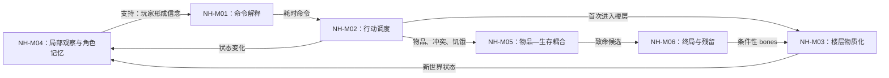

# 《NetHack》：5.0.0 普通模式 TTY 配置族

- 案例编号：`nethack-5.0.0-tty-normal-valkyrie`
- 分析深度：标准
- 状态：结构分析完成；目标二进制身份已核验，实际游玩、随机实例、`bones` 实例与行为证据待补
- 建档日期：2026-07-21
- 研究问题：传统 Roguelike 的命令、调度、程序生成、信息记忆、死亡与跨局残留，能否由当前模型表达而不压成几个类型标签？
- 案例角色：传统 Roguelike 锚点；与 [IFAB 2026/27 十一人制足球](football-ifab-2026-27-eleven-a-side-standard.md)构成第四组标准对照
- 模板版本：[案例研究包 v0.3](../CASE-PACKET-TEMPLATE.md)
- 共用来源包：[NetHack × 足球一手来源与版本冻结](../../research/sources/calibration-nethack-football-primary-sources.md)

> 本案冻结的是一组可复核的**规则／配置边界**，不是唯一可重放的一局。随机种子、实际地牢、输入轨迹和终局均未冻结；文中只能分析可达结构，不能声称某位玩家实际探索、学习或承担了某种风险。

## 1. 案例范围卡

| 字段 | 锁定值 | 证据或理由 |
| --- | --- | --- |
| 游戏制品 | Windows 10/11 x64 第四次打包 `nethack-500-win-x64-4.zip`；目标入口为 TTY `NetHack.exe` | 官方下载页；程序自报 `5.0.0-0 post-release`、提交 `e34238d2bc7092117b12d14927c1c62200dc658d` |
| 正式发行基线 | `NetHack-5.0.0_Released` 标签与 2026-05-02 源码包；提交 `16ff59115315917b93185d026aeefea06db9b0f4` | 用于确认正式版本谱系和固定源码制品；不冒充后来 rev4 的实际构建 |
| 模式 | 普通模式；排除 `explore` 与 `debug`；`tutorial:false`、`reroll:false` | **项目夹具**；普通模式与探索模式的保存、死亡和计分语义不同 |
| 角色配置 | `Valkyrie`／`Human`／`female`／`lawful`，名称 `Calibration` | **项目夹具**；该组合由 5.0.0 `role.c` 的角色约束允许 |
| 界面 | TTY／ASCII 字符显示、默认键位；不采用图形窗口端 | **项目夹具**；Guidebook 说明不同显示方式不意图改变玩法，但输入映射和可用功能仍属实现条件 |
| 初始持久环境 | `bones:true`；隔离且起初为空的 bones 目录；无既存保存文件 | **项目夹具**；保留机制本身，同时避免一开始就把未知旧局残留注入本局 |
| 启动条件 | 非星期五 13 日，并要求程序不判作新月或满月；复现时记录精确时间戳 | 排除日历条件对初始状态的额外影响；当前尚未执行目标程序 |
| 随机性 | 不固定 RNG 种子，不固定楼层布局、物品外观排列、怪物或事件 | 因此本案是配置族，不是唯一运行实例 |
| 明确排除 | 教学模式、探索／调试模式、GUI、变体与补丁、外部工具、保存复制、预置 bones、具体通关路线与玩家策略 | 防止把不同生命周期、界面或社群做法混成一个案例 |
| 来源锁定日期 | 2026-07-21 |  |
| 源码制品完整性 | 10,793,920 bytes；SHA-256 `2959B7886AAC76185B90AEA0C9F80D14343F604DE0AE96B3DD2A760F7AB3BDE9` | 官方源码包，项目下载核验；与官网公布值一致 |
| Windows 包完整性 | 13,413,515 bytes；SHA-256 `0C45A45051DDDFDBC30CA2F8DA7B3E7B4F260F2DEA70917EB812AA63912EE058` | 官方 x64 第四次打包，项目下载核验 |
| TTY 程序完整性 | `NetHack.exe` 12,598,272 bytes；SHA-256 `885A4E86E660B515F9C9F7393AE95F43557CEB112EA2CE50BDD10C74289CBA08` | 从冻结 ZIP 取得；只执行 `--version` 核验身份，未开始一局游戏 |
| Guidebook PDF 完整性 | 517,714 bytes；SHA-256 `1A72527A6F544E2E4BD2CE0F0CC74CEB2B7D2ADAF82DEC0AEC49735FDC385F05` | 固定 PDF 已下载、哈希并目视核验 |
| 复现状态 | 规则、源码与发行物身份已冻结，并核验 `NetHack.exe --version`；尚未进入实际游戏，也没有命令日志、存档、地牢快照或终局记录 | 身份核验不等于运行复现或行为观察 |

### 1.1 版本歧义与配置边界

- **[来源事实]** NetHack 5.0.0 于 2026-05-02 发布；旧版本的保存与 bones 文件不兼容。
- **[实现事实]** 正式源码标签是 2026-05-02 的基线，而 Windows `-4` 包中的 TTY 程序自报 2026-06-09 构建和 post-release 提交 `e34238d…`；版本字符串不足以唯一定位实现。
- **[来源事实]** Guidebook PDF 封面为 2026-05-06，文本版为 2026-05-02，在线 HTML 又更新到 2026-06-23。本文以固定 PDF 作页码制品，以源码标签作实现基线；后续 HTML 只作带日期的补充，三者不静默合并。
- **[项目夹具]** 人类、女性、守序 Valkyrie 是用于固定初始角色能力与物品的合法组合，不是“标准角色”或玩家常用选择。
- **[未知]** 未冻结随机种子与实际运行轨迹，所以不能列出本局真实地牢、物品身份、遭遇、死亡原因或分数。

## 2. 为什么研究它

### 2.1 一分钟内讲清这类游玩

玩家通过字符界面控制一名冒险者，在每局重新形成的多层地牢中移动、观察、拾取和使用物品、与怪物互动，并设法取得 Yendor 护符后活着离开。输入先被解释为语义命令；只有承诺游戏时间的命令才进入英雄与怪物的行动调度。新楼层也不只是“随机画地图”：程序可能随机生成普通层、实例化特殊模板，或载入经过处理的旧局 bones。

角色只能直接利用当前感知与程序保存的角色记忆；人类玩家还可能带入此前游玩获得的规则知识。普通模式下保存会暂停并退出，成功恢复后保存文件被消费；真正的终局死亡还要经过死亡规避、模式门控和终局处理，之后才可能留下 bones。因而“回合制、随机地牢、永久死亡”只是压缩标签，不是足够的结构解释。

### 2.2 本案承担的检验任务

- 把按键、语义命令、是否耗时、行动机会、怪物调度和全局回合效果分开，复验**动作生命周期**与**调度语义**。
- 把随机生成、特殊模板和历史 bones 注入分开，检验“程序生成”是否只是一个机制名称。
- 区分真实世界、当前感知、角色地图记忆、物品识别状态与人类玩家的跨局知识。
- 把致命条件、死亡规避、终局、一次性恢复和跨局残留拆开，检验“永久死亡”术语族。
- 检查规则例外、内容特例和抽象粒度的关系；不因规则很多就预设独立“例外层”。
- 与足球对照程序裁定、离散时基、随机过程和非具身输入。

### 2.3 当前最小主张

> **[综合判断]** 本案可表达为“界面输入经命令解析形成有条件耗时的行动 → 程序按移动点与全局回合调度英雄、怪物和持续效果 → 探索、战斗、物品和状态系统共同改变可观察世界与可行行动 → 终局／保存生命周期决定该运行如何结束或恢复 → 可选 bones 把经过变换的世界碎片带入未来运行”。其中“玩家学会了什么”不能由存档状态自动代替。

### 双视图导航

- **教学最小视图**：4.1、5.1 与第 6 节说明为什么“走一步＝一回合”“随机地图＝一个机制”“死亡＝删档”都不准确。
- **研究充分视图**：第 4 节保存调度、生成分派、信息层次和跨局状态；第 11 节记录版本与行为缺口。
- 本案不试图逐条整理 NetHack 的物品、怪物与环境规则；它们是后续规则家族抽样，而不是这份标准案例的完整内容词典。

## 3. 证据与来源语域

- **[来源事实]** 面向玩家的目标、命令、状态显示、地图记忆、保存、模式与 bones 说明来自冻结 Guidebook。
- **[实现事实]** 命令耗时、移动点调度、楼层生成分派、恢复后删档、死亡规避和 bones 处理来自 rev4 自报提交 `e34238d…` 的源码；正式源码包 `16ff591…` 另作发布基线。
- **[项目夹具]** 角色、界面、启动条件与初始持久目录由本项目选择。
- **[结构推导]** 机制与玩法模板候选是本项目对规则关系的解释，不是 NetHack 官方分类。
- **[行为待证]** 探索策略、资源管理、风险偏好、知识迁移、难度和体验均没有实际游玩证据。

| 来源术语 | 来源中的操作性含义 | 映射关系 | 项目共享术语或拆解 | 不能自动等同 |
| --- | --- | --- | --- | --- |
| `turn`／状态栏 `Time` | 全局回合计数及按回合推进的效果 | 拆分 | **全局回合边界**＋**行动机会**＋**命令耗时** | 一个按键、一次命令或玩家自然语言中的“一轮” |
| `command` | 经前缀、菜单或目标选择形成并由程序执行的操作 | 拆分 | **界面输入**＋**语义命令**＋**时间承诺**＋**状态效果** | 玩家意图或最终效果 |
| `save`／`restore` | 暂停退出，以及普通模式下消费保存文件的恢复 | 来源较窄 | **运行暂停凭证**＋**一次性恢复生命周期** | 可重复检查点、元进展或终局复活 |
| `bones` | 旧冒险者及环境残留，经规则净化后可被未来楼层载入 | 拆分 | **跨运行世界碎片**＋**条件载入** | 角色继承、常规元成长或必然出现的内容 |
| `explore mode` | 允许规避死亡、保留旧保存且不进入正常高分的模式 | 来源特定 | **模式配置**＋**生命周期规则替换** | 普通模式的无惩罚难度选项 |
| `random dungeon` | 每局及首次进入楼层时生成的新内容 | 来源较宽 | **生成策略选择**＋随机生成／模板实例化／历史注入 | 单一随机地图机制 |
| `knowledge`／`known` | 角色地图记忆、对象识别等实现状态 | 一词多义 | **角色记忆状态**／**玩家跨局知识** | 二者必然一致 |

## 4. 规则世界

### 4.1 教学最小视图

```text
观察字符地图与状态
→ 输入并完成一个语义命令
→ 若命令承诺时间，则程序结算英雄行动、怪物机会与全局效果
→ 位置、生命、物品、饥饿、识别状态和可见世界改变
→ 玩家再次观察与选择

首次进入未生成楼层
→ 载入 bones，或实例化特殊模板，或随机生成普通层

保存 → 暂停并退出 → 普通恢复后消费保存文件
致命条件 → 先检查死亡规避／模式 → 真正终局 → 可能生成 bones
```

### 4.2 参与者、能动性与执行

| 项目 | 内容 | 证据边界 |
| --- | --- | --- |
| 玩家 | 选择并输入角色命令 | 规则允许；实际策略未知 |
| 角色 | 具有位置、属性、感知、装备、物品、饥饿和状态的世界实体 | Guidebook 与源码 |
| 系统代理 | 怪物按程序状态和调度获得行动机会 | 实现事实；完整 AI 规则未在本案展开 |
| 执行来源 | 程序解释命令、阻止／变换非法候选、推进世界并呈现反馈 | rev4 身份已核验但尚未开始实际游戏；具体轨迹待证 |
| 裁定权 | 运行中的程序状态与规则实现决定合法性和终局 | 不等于 Guidebook 文本本身执行游戏 |
| 能动性边界 | 玩家选择命令但不能直接写入 RNG、怪物内部状态或生成结果 | 规则／实现结构 |

### 4.3 **实体**、**状态**与关系

| 实体／结构 | 关键状态或关系 | 作用 |
| --- | --- | --- |
| 冒险者 | 位置、HP、能量、等级、饥饿、负重、状态、角色／种族／性别／阵营 | 玩家行动载体与终局主体 |
| 怪物 | 类型、位置、生命、可见／可感知关系、行动机会与行为状态 | 系统代理、威胁或交互对象 |
| 地牢层与格位 | 分支、层级、地形、通行、门／楼梯、陷阱、对象占据 | 规则空间与生成载体 |
| 物品 | 类型、外观、真实身份、数量、位置／容器／持有、识别与使用状态 | 行动对象、能力载体、资源角色或目标物 |
| 命令 | 调用者、目标、参数、耗时标记与执行结果 | 界面到状态转换的中间对象 |
| 保存文件 | 对暂停运行的编码与恢复资格 | 一次性恢复载体，不是世界内道具 |
| bones 文件／层 | 经净化和变换的旧局对象及环境 | 条件性跨运行世界注入 |

关键关系包括：角色或怪物**占据**位置，角色**持有／装备／使用**物品，观察者对对象具有时间化的**信息访问**，命令在条件满足时**消耗行动时间**，保存文件对一次运行具有**恢复资格**。

### 4.4 **规则空间**与生成

- 地牢不是一张预先固定的完整地图；楼层、分支、特殊区域与上下行连接共同构成多层规则空间。
- 首次进入未生成楼层时，程序会在 bones 载入、特殊层／分支模板和普通随机生成之间作条件分派。
- 普通层还要生成房间、通道、对象与生物；物品外观身份也可在每局重排。因此“随机”修饰不同对象、时点与生成器。
- bones 不是简单复制旧局：对象识别、用户命名与部分唯一物品会被清除或转换。
- TTY 字符是观察投影，不等于规则空间本身；一个字符的显示身份还可能随感知和记忆状态改变。

### 4.5 **时间结构**与调度语义

```text
物理按键／菜单输入
→ 语义命令
→ 返回是否承诺时间
→ 英雄行动与移动点变化
→ 怪物依移动点获得机会
→ 全局回合计数与持续效果推进
```

- 查阅、观察或取消等输入可以不推进游戏时间；“按了一次键”不是可靠的回合单位。
- 速度和移动点使角色或怪物在全局回合内获得不同数量的行动机会；“玩家一步、怪物各一步”的教学速记并不充分。
- 自动移动和持续活动可跨越多个机会并被事件中断；它们不是一次不可分的大动作。
- 暂停保存属于运行生命周期，不等于世界内再过一个回合；现实墙钟时间也不等于状态栏 `Time`。

### 4.6 **信息结构**与知识层次

| 层次 | 例子 | 持续／后效 | 不能等同 |
| --- | --- | --- | --- |
| 真实世界 | 当前地形、怪物位置、陷阱、物品真实身份 | 随程序状态变化 | 玩家眼前显示 |
| 当前感知 | 当前能看见、听见或以特殊能力感知的对象 | 受位置、遮挡与状态影响 | 完整世界 |
| 角色记忆 | 已探索地形、曾见对象位置、物品识别状态 | 可跨行动与楼层保留，也可能过时或被清除 | 人类玩家一定相信 |
| 人类玩家信念 | 对当前危险、未知物品或地图的判断 | 可正确、错误或遗忘 | 程序保存的事实 |
| 人类跨局知识 | 对规则、物品、敌人与失败模式的长期学习 | 可跨角色与运行持续 | 角色元成长或本局状态 |

未被当前感知的怪物会从实时显示消失，地图上残留的旧标记可能只是过时位置。因而**观察后效**必须记录“保留了什么、由谁保留、是否仍可靠”，不能只写公开／隐藏。

### 4.7 **资源**、容量、进程与评价

| 候选 | 规则角色 | 判定 |
| --- | --- | --- |
| 能量／法力 | 可通过能力消耗并恢复，门控后续能力 | **可消耗存量资源** |
| 食物与营养／饥饿 | 食物可取得和消耗；营养状态随时间下降并门控生存 | **物品资源＋生存存量**，两者不是同一载体 |
| HP | 会受损和恢复，归零可触发致命处理 | **生存存量／阈值状态**；不是货币 |
| 物品与充能 | 可持有、使用、消耗、装备或占据负重 | 按具体物品承担**实体**、**能力载体**或**资源角色** |
| 负重 | 物品重量与携带能力的关系，影响移动与能耗 | **容量／约束状态**，不是可花费库存 |
| 回合数 | 已经过的规则时间计数 | **进程量**，不是玩家持有的时间点数 |
| 经验等级 | 角色能力进程状态 | **成长状态**，不能只因可提高就叫资源 |
| 分数 | 按经验、财宝、深度与终局计算 | **评价量** |

### 4.8 目标、终止、保存与跨局残留

- 面向玩家的总目标是取得 Yendor 护符并活着离开；实际运行还有死亡、退出和其他终局分支。
- 致命条件不总是直接终局：生命护符等规则内效果可以中止死亡；探索／调试模式还会改变继续资格，但本案排除这些模式。
- 普通模式保存会暂停并退出；成功恢复后保存文件被删除，且没有“保留当前保存同时继续”的普通命令。
- 真正终局后才进入计分、记录与可选 bones 生成。bones 创建与载入均受楼层、模式与概率门控，不是每次死亡必然留下、每次新局必然遇到。
- bones 继承的是经过变换的世界碎片，不是角色等级、技能点或一条稳定升级轨；把它叫作“元成长”会掩盖其对象和不确定性。

## 5. **机制**分解

### 5.1 尺度声明与索引

| ID | 暂定名称 | 一句话规则结构 | 主要依赖 |
| --- | --- | --- | --- |
| NH-M01 | 命令解释与时间承诺 | 把界面输入组合成语义命令，并判定它是否进入耗时执行 | 输入映射、上下文、命令表、目标 |
| NH-M02 | 移动点调度与全局推进 | 按角色／怪物移动点分配行动机会，并在全局边界推进持续状态 | NH-M01、速度、移动点、回合效果 |
| NH-M03 | 楼层物质化 | 对首次进入的楼层选择 bones、模板或随机生成路径并建立世界状态 | 分支／楼层状态、RNG、历史文件 |
| NH-M04 | 探索观察与角色记忆 | 按当前感知更新显示和角色记忆，使过去观察可能持续或过时 | 位置、视野、感知、对象状态 |
| NH-M05 | 物品—生存—冲突耦合 | 取得、识别、装备／使用和消耗物品，改变行动能力、风险与战斗结果 | 物品状态、HP、能量、营养、负重 |
| NH-M06 | 运行终结与历史残留 | 检查死亡规避和模式，终结角色并可能把净化后的世界片段写成 bones | 终局条件、保存模式、计分、持久文件 |

### 5.2 NH-M01／M02：输入不是回合

- **触发**：玩家输入字符、前缀、菜单选择或目标。
- **动作生命周期**：物理输入 → 语义命令 → 上下文与合法性检查 → 是否返回耗时标志 → 状态效果 → 调度其他代理与全局效果。
- **反馈**：字符地图、消息、菜单与状态栏更新；取消或信息查询可以无耗时结束。
- **调度**：英雄和怪物依移动点获得机会，速度、持续动作与中断使行动频率不必一一对应。
- **结论**：本案的“回合制”是一个带调度参数的术语族，不是 `Input → Turn` 的单箭头。

### 5.3 NH-M03／M04：生成世界与有限认识

- 新楼层只有在首次物质化时进入条件分派；随机生成只是其中一条路径。
- 模板规定局部结构，RNG 绑定内容与参数，bones 则把历史制品注入当前运行；三者的来源和可重复性不同。
- 生成完成不等于玩家立即知道世界。当前感知只开放局部观察，角色记忆保存部分后效，人类玩家再据此形成信念。
- 物品外观重排使“看见一个外观”和“知道真实物品类型”成为不同信息事件。

### 5.4 NH-M05／M06：风险存量与运行生命周期

- 物品的取得、识别、可用化与消耗经过不同状态；拥有一件物品不等于知道其身份或当前可安全使用。
- 战斗、陷阱、饥饿与状态效果共同改变 HP 和可行行动；本案不把所有伤害来源合并成一个“战斗机制”。
- 致命条件先进入规则例外与模式检查，只有未被拦截的结果才终结运行。
- 保存／恢复和死亡／bones 是两条不同生命周期：前者延续同一运行，后者结束角色并可能改变未来世界。

## 6. 机制间的**编排**



| 来源机制 | 关系类型 | 目标机制 | 传递对象 | 后果 |
| --- | --- | --- | --- | --- |
| NH-M04 | 信息支持 | NH-M01 | 当前观察、角色记忆与玩家信念 | 影响目标与命令选择，不决定真实策略 |
| NH-M01 | 调度请求 | NH-M02 | 语义命令与耗时结果 | 决定是否推进游戏时间和其他代理 |
| NH-M02 | 条件触发 | NH-M03 | 未生成楼层的进入事件 | 生成、模板或历史路径被实例化 |
| NH-M02／M03 | 状态供给 | NH-M04 | 世界位置、对象与可感知关系 | 改变显示和可形成的信念 |
| NH-M02／M05 | 风险耦合 | NH-M06 | HP、致命条件、终局原因 | 进入死亡规避或真正终局 |
| NH-M06 | 跨运行历史注入 | NH-M03 | 净化后的 bones 制品 | 未来运行可能遇见旧局世界碎片 |

## 7. 玩家层

### 7.1 可由规则支持的决策情境

| 情境 | 规则支持的可选行动或权衡 | 证据状态 |
| --- | --- | --- |
| 未知区域入口 | 移动、观察、搜索、使用物品、暂缓进入 | 可行结构；实际谨慎程度未知 |
| 未识别物品 | 携带、测试、使用、丢弃或保留 | 可行结构；识别策略与风险偏好未知 |
| 负重与饥饿压力 | 选择携带对象、消耗食物或改变路线 | 资源／容量关系可推导；优先级未知 |
| 致命风险前 | 战斗、逃离、使用能力或道具 | 规则提供选择；玩家是否识别危险未知 |
| 保存退出 | 暂停当前运行并以后恢复 | 生命周期事实；保存频率和动机未知 |

### 7.2 行为与知识证据边界

- Guidebook 可以证明出版者向玩家讲解了哪些规则，源码可以证明程序允许和执行什么；两者都不能证明玩家真实看见、理解、记住或采用了某种策略。
- 人类可能跨局学习敌人、物品、陷阱与规则，这是合理的**活动候选**，但本案没有玩家日志或访谈，不能把它写成已观察“知识进展”。
- 传统 Roguelike 的谨慎、惊喜、紧张、掌握感和失败学习都需要行为与体验材料；类型声誉不能代替证据。

## 8. **玩法模板**候选

| 候选名称 | 编排签名 | 持续玩家活动 | 时间与反馈 | 成立条件 | 证据状态 |
| --- | --- | --- | --- | --- | --- |
| 单运行生成式远征 | 条件生成／历史注入＋局部观察＋离散调度＋物品／生存耦合＋终局生命周期 | 探索、识别、路线与风险选择、能力准备 | 命令耗时与移动点推进；局部反馈；终局强制关闭本角色 | 世界需随运行实例化；知识受限；失败具有运行级后果 | 结构候选；行为待证 |
| 跨运行知识学习 | 新运行改变内容与身份＋人类保留规则知识＋角色状态重置／世界碎片偶尔继承 | 比较经验、修正信念、识别危险模式 | 跨越多个运行；程序状态和人类记忆不同步 | 同一玩家多次游玩且实际发生学习 | 仅活动／模板假设，未观察 |

- 这两个候选不能简单合并成一个“Roguelike 机制”。前者是单运行内的机制编排，后者还依赖跨运行的人类参与和证据。
- `permadeath`、`procedural generation`、`turn-based` 与 `grid-based` 只能描述部分结构；它们的并列不自动定义整个传统，也不能推出实际体验。

## 9. 从模板到这款游戏

- **角色绑定**：抽象行动者绑定为具有角色、种族、性别和阵营约束的冒险者；Valkyrie 夹具决定初始能力与内容入口。
- **内容实例化**：大量怪物、物品、地形、分支与特例把通用探索／生存结构具体化；同一机制骨架可被不同内容规则显著改写。
- **生成配置**：随机生成、Lua／迷宫模板、物品外观重排与 bones 共同决定某次运行的世界，不是一个 seed 槽位能完整替代。
- **界面实现**：TTY 把状态投影为字符、消息、菜单和状态栏；GUI 或无障碍输入可能改变感知与操作路径，即使目标规则相近。
- **持久环境**：隔离且初始为空的 bones 目录让第一局不继承未知历史，但该运行仍可能为以后留下世界碎片。
- **实例缺口**：没有 seed、初始 RNG 状态、完整输入、消息日志、保存／恢复制品和终局文件，不能称为一局已复现游戏。

## 10. 与足球的跨案例比较

| 比较对象 | 相同之处 | 关键差异 | 判断 |
| --- | --- | --- | --- |
| 行动 | 行动都受位置、对象、条件与后果限制 | NetHack 由界面命令调用程序状态转换；足球运动员身体直接参与连续物理过程 | **功能类比，执行结构不同** |
| 时间 | 都有多个不能混合的时间通道 | NetHack 有离散行动机会、全局回合与现实暂停；足球有连续比赛时钟、比赛状态、损失时间与裁判终场 | **同一术语族，不同参数** |
| 不确定性 | 玩家都无法预知全部未来状态 | NetHack 明确调用伪随机生成器；足球主要由他人选择、物理动态、环境与有限感知产生偶然性 | **不能统称随机机制** |
| 裁定 | 都需把行动变成正式游戏状态 | NetHack 程序主动计算并写回；足球物理先发生，裁判只把相关事件认定为规则事实并决定重启／处罚 | **执行来源不同** |
| 知识 | 玩家都可能积累长期技能与知识 | NetHack 角色记忆是程序状态，人类还可跨局学习；足球规则不把运动员经验编码进单场比赛状态 | **玩家层不可删** |
| 终局 | 都有正式结束边界 | NetHack 终结角色并可能产生跨局 bones；足球结束的是比赛，球员身体和团队制度不随终场删除 | **生命周期对象不同** |

## 11. 反例、失败与模型压力

### 11.1 本案最顺畅的解释

- **动作生命周期＋调度语义**能够拆开按键、命令、耗时、行动机会和全局效果，复验 A-F02／A-F03 与 C3-F02。
- **世界—观察—信念＋观察后效**能够表示当前感知、过时地图记忆和物品识别，而无需创造“未知信息层”。
- 有类型**编排**可把生成、探索、物品、生存、终局与跨局历史连接起来，比类型特征清单更接近可运行结构。
- **规则／实现／配置／运行实例／行为证据**分层能够诚实表达同名 5.0.0 的多种制品和本案尚未开始实际游玩的状态。

### 11.2 本案最失真的解释

| 编号 | 失败类型 | 具体症状 | 局部处理 | 可能修订 | 阻塞级别 |
| --- | --- | --- | --- | --- | --- |
| NH-F01 | 术语变义／时间结构 | “一个回合”可指按键、语义命令、耗时行动、移动点机会或全局回合效果 | 展开命令与调度生命周期 | 首轮汇总整理带参数的**时间术语族** | 门审 |
| NH-F02 | 粒度漂移／生命周期 | “永久死亡”把致命候选、死亡规避、终局、一次性恢复、模式差异和 bones 压成一个动作 | 逐个记录门控、载体与锁定点 | 建立**运行生命周期**比较槽位，不先录取死亡原语 | 门审 |
| NH-F03 | 信息／玩家层边界 | 人类玩家知识可跨局持续，却不属于角色、地牢或保存状态 | 分开角色记忆、玩家信念与跨局学习 | 玩家活动跨游戏实例的作用域需在首轮汇总检查 | 门审 |
| NH-F04 | 粒度漂移／规则例外 | 内容特例很多；在细尺度是普通条件规则，在粗尺度又像对通则的例外 | 每条规则声明作用域、优先级与抽象尺度 | 不建立固定“例外层”；寻找可证明的覆盖／优先关系 | 长期检查 |
| NH-F05 | 版本冲突／案例单位 | 源码标签、Windows `-4` 包和三个日期的 Guidebook 都叫 5.0.0，但不能互相替代 | 并列冻结制品、hash、用途与日期 | 案例范围卡需持续支持多制品基线 | 已可表达 |
| NH-F06 | 因果越界 | 规则允许跨局学习和风险管理，不能证明玩家实际这样做 | 模板标结构候选，玩家层标行为待证 | 重复 A-F08／B-F05；后续补日志与访谈 | 长期检查 |

### 11.3 反例与竞争解释

- 若固定完全相同的地牢和物品身份，命令、调度、战斗与死亡仍可运行；程序生成不是所有 NetHack 机制的前提。
- 若保留随机地牢但允许无限恢复同一存档，探索与战斗仍在，运行级风险和知识循环却会显著改变；“随机＋死亡”不是装饰性相加。
- 若关闭 bones，单运行结构仍成立，但跨运行世界碎片消失；bones 不是传统 Roguelike 身份的必要条件。
- 若只列 `turn-based + grid + permadeath + procedural generation`，无法推出物品识别、角色记忆、命令耗时、保存消费、特殊模板或具体玩家活动。
- 把每个物品交互都叫“规则例外”会使机制分解取决于研究者先选的通则；更稳妥的是记录条件、作用域、优先级和效果覆盖。

## 12. 标准案例暂不执行的模块

- 目标 Windows `-4` 二进制的实机复现、构建差异审计和逐命令状态日志。
- 固定 seed、楼层与物品映射的唯一运行实例。
- 完整怪物、物品、法术、陷阱与特殊楼层机制词典。
- 玩家行为、跨局学习、策略频率、难度与体验研究。

## 14. 校准结论与后续

- **结构校准状态**：在 NetHack 5.0.0 正式源码基线、Windows x64 `-4` 发行物边界和普通模式配置族内通过；当前模型能表达命令、调度、生成、记忆、资源角色与运行生命周期。
- **复现状态**：规则与制品身份已冻结，TTY 程序只完成 `--version` 身份核验，尚未开始实际游戏；不能声称任何实际楼层、命令序列或终局。
- **行为证据状态**：待补；不主张风险偏好、学习路径、玩家策略、难度或体验。
- 最重要的模型压力是：**运行生命周期**、跨实例玩家知识和带尺度的规则例外尚缺简洁的固定比较槽位。
- 后续先运行并记录一个固定 seed／环境的最小轨迹，再采集同一玩家多次运行的行为材料；不要用源码可达性冒充实际学习。
- 关联：[一手来源冻结](../../research/sources/calibration-nethack-football-primary-sources.md)、[校准失败清单](../../research/calibration-failure-log.md)、[传统 Roguelike 覆盖区域](../../research/corpus/genre-coverage-map.md#73-传统-roguelike)。
