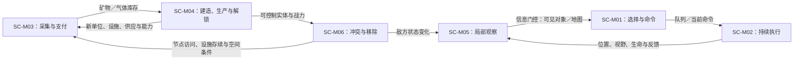

# 《星际争霸：母巢之战》：1.23.10.13515 `(2) Eldritch Lake` 二人 `Melee`

- 案例编号：`SC-BW-12310-13515-EL-1V1`
- 分析深度：标准
- 状态：结构分析完成，软件复现与行为证据待补
- 案例角色：实时程序执行、持续指挥与秘密当前状态的对照
- 研究日期：2026-07-21
- 模型版本：案例研究包模板 v0.3
- 共用来源包：[星际争霸 × 外交一手来源与版本冻结](../../research/sources/calibration-starcraft-diplomacy-primary-sources.md)

> 本案不是对“RTS”类型的完整定义，也不是职业比赛分析。它只冻结一个可复核的二人规则／地图夹具，用来检验**共享实时时基**、**动作生命周期**、**调度语义**、多实体控制、资源与容量、动态信息访问以及程序执行。没有回放、输入日志或目标客户端复现的地方，不以玩家常识补写。

## 1. 案例范围卡

| 字段 | 锁定值 | 证据或理由 |
| --- | --- | --- |
| 游戏制品 | Blizzard《StarCraft: Remastered》，启用 `Brood War` 内容 | Blizzard 的 Remastered 发布资料与补丁公告 |
| 官方清单身份 | `1.23.10.13515`；构建名 `1.23.10.13515-retail` | **实现事实**：2026-07-21 核验的 Blizzard 非中国区 `s1/versions` 清单与其指向的构建配置；不是已取得的客户端二进制身份 |
| 模式 | 两名人类玩家、`Melee`、非结盟 | **项目夹具**；排除 `Use Map Settings`、合作、AI 与观察者 |
| 阵营 | 玩家 A：Terran；玩家 B：Zerg | **项目夹具**；用于保留不同建造与生产载体，不主张这是官方标准对局 |
| 地图 | `(2) Eldritch Lake.scm`，128×128 Jungle | Blizzard 官方地图档案称其为二人推荐图及 StarCraft Season 4／Brood War Season 1 官方天梯图 |
| 起始位置 | 使用地图两个起点；本轮不固定实际抽到的起点 | 尚无目标客户端初始存档或回放，因此不是唯一可重放实例 |
| 游戏速度 | `Fastest` | **项目夹具**；精确模拟时间与墙钟时间倍率待客户端复现 |
| 平台 | Windows PC | 补丁公告与当前安装入口支持；目标二进制未取得 |
| 明确排除 | 战役、单人 AI、作弊、EUD／自定义触发、现代职业地图池、观战、网络延迟补偿的具体实现、具体开局与胜率 | 防止把相邻制品、社群惯例与本案例混合 |
| 来源锁定日期 | 2026-07-21 |  |
| 清单制品完整性 | `s1/versions`：`880` bytes，SHA-256 `27EADE68793827904437162C8D72B11B126011BC9E051C118D12D6729115030A`；构建配置：`875` bytes，SHA-256 `724A0DA8C179F26C8A6CCC1B40978EAE92D087D63C035540E3B8A8E2FC02ADD8` | 从 Blizzard 官方补丁服务与 CDN 取得；只冻结清单及配置返回内容 |
| 地图制品完整性 | `87,390` bytes；SHA-256 `26D24E60A110E851BC28303F364646535C5F84F4B3409AE15A7CFC6F694685CC` | 从 Blizzard 官方 `starcraftmaps.zip` 取得；总包 hash 见来源包 |
| 复现状态 | 未复现 | 未取得并哈希 1.23.10.13515 客户端、初始存档或回放；只完成官方清单身份、规则资料与地图制品冻结 |

### 1.1 版本歧义

- `StarCraft`、`Brood War`、1.16.1 经典客户端、1.18 免费版与 `StarCraft: Remastered` 不能只因共享核心玩法就合成一个软件版本。
- `1.23.10.13515` 是核验日能由 Blizzard 官方版本清单与构建配置共同定位的清单身份；本案没有取得主程序或安装内容的 hash，因此不写成“完整客户端已经冻结”。
- 2022-09-07 的官方公告只证明 `1.23.10` 补丁线当日已经发布；它不能证明 `13515` 子构建也在当日发布。构建配置的服务器修改时间同样不是发布日期。
- `(2) Eldritch Lake.scm` 是基础格式地图，但 Blizzard 官方档案明确把它列为 Brood War Season 1 官方天梯图；“地图格式”与“运行所选内容集”是两项状态。
- 本案冻结的是规则／配置可达状态集合，不是一场具体比赛。起点、所有输入、世界状态轨迹与终局尚未冻结。

## 2. 为什么研究它

### 2.1 一分钟内讲清这局游戏

两名玩家在同一张地图上持续建设和指挥。工人采集矿物与气体，玩家花费这些存量建造建筑、训练单位并研究能力；建筑、单位和采集过程不会因为玩家把视角移到别处便自动停下。玩家一次只能通过界面选择有限对象并发出命令，而敌方当前在做什么通常只在己方视野覆盖时可见。双方的生产、移动、侦察与战斗在共享时间中互相影响，直到一方被击败或退出。

### 2.2 本案承担的检验任务

- 检查“实时”是否足以描述持续程序、玩家输入、多个执行队列和同一更新边界；预期答案是否定的。
- 区分物理输入、选择集合、语义命令、单位当前命令、命令队列、程序执行与世界效果。
- 区分矿物／气体存量、地图资源节点、生产设施、人口供应容量、单位实体和玩家注意。
- 检查动态视野下的**当前世界隐藏**，与《外交》的**未来指令隐藏**是否需要不同信息结构。
- 与 [《Factorio》](factorio-2.0.77-base-freeplay.md) 复验持续过程与程序裁定，同时检验战斗、对手和不断输入造成的新调度压力。

### 2.3 当前最小主张

> **[工作假设]** 本案不是“所有人先选完再统一结算”的同时行动；它是两名玩家在共享实时时基中不断提交可替换或可排队的命令，由程序持续调度多个实体与过程。若只写“同时行动”，就会把它与《外交》的秘密批次提交误合并。

## 3. 证据与术语约定

本文区分**[来源事实]**、**[实现事实]**、**[项目夹具]**、**[结构推导]**、**[行为待证]**和**[实现未知]**。Blizzard 的原版手册与 Classic Battle.net 资料能支持界面、命令、资源、单位和地图的公开规则骨架；官方当前清单能支持目标构建身份。前者不是对当前构建每一项数值与实现的逐项证明，攻略式建议也只能支持出版者建议了某种行为，不能证明玩家实际采用、采用频率或效果。客户端内部帧序、寻路、网络同步与碰撞细节必须由目标程序或实现资料支持。

### 3.1 来源语域与术语映射

| 来源术语与来源身份 | 来源中的操作性含义 | 映射关系 | 项目共享术语或概念拆解 | 不能自动等同 |
| --- | --- | --- | --- | --- |
| `real-time strategy` | Blizzard 对作品的类型描述 | 来源较宽 | **共享实时时基＋持续程序＋指挥／生产／冲突编排** | 一个单一机制；所有策略游戏 |
| `command` | 对选中单位或建筑发出的 `Move`、`Stop`、`Attack` 等命令 | 拆分 | **界面输入**／**语义命令**／**执行中命令**／**命令队列项** | 玩家意图；已经产生的效果 |
| `group`／`control group` | 当前选择集合，或绑定数字键的建筑／至多十二单位集合 | 部分重叠 | **选择集合**／**快捷访问关系** | 永久编队实体；完整军队 |
| `Resources` | 界面与官方资料中的矿物、Vespene Gas，有时连同 Supplies 一起显示 | 拆分 | **可消费存量资源**＋**供应容量资源** | 地图上一切有价值对象；经济整体 |
| `Supply`／`Supplies` | 单位占用与供应上限相关的计数 | 来源较窄 | **已占容量＋总容量＋生产许可门槛** | 可花费货币；《外交》的 `supply center` |
| `Melee` | 标准多人对抗模板／地图运行方式 | 来源特定 | **模式配置** | 近战攻击距离；市场类型“格斗” |
| `fog of war`／探索后地图细节 | 未在当前观察范围内的世界呈现限制及已探索地图呈现 | 拆分 | **时间化信息访问关系＋观察后效** | 玩家已经记住；敌方未来命令 |
| `micro`、`macro`、`APM` | 社群／界面中常用的操作与统计词 | 无单一项目等价 | 保留为待取证的**行为术语族** | 规则机制；玩家水平；玩法模板本身 |

## 4. 规则世界

### 4.1 教学最小视图

```text
观察局部地图
→ 选择单位或建筑并发出命令
→ 程序持续执行移动、采集、生产与战斗
→ 世界状态、资源、视野和可行动集合改变
→ 玩家在不中断共享时间的情况下再次观察与命令
```

这张图省略了命令排队、寻路、攻击目标、建筑前置、生产设施差异、网络同步和内部更新顺序；这些只在下文按研究问题展开。

### 4.2 参与者、能动性与执行

| 项目 | 内容 | 证据状态 |
| --- | --- | --- |
| 玩家与阵营 | 两名人类分别控制 Terran 与 Zerg | **项目夹具** |
| 玩家控制的对象 | 自己阵营的单位、建筑、研究与生产入口；控制经选择和命令发生 | 官方手册与 Compendium |
| 系统行动者 | 单位自动执行当前命令，建筑推进生产，资源采集与战斗过程持续更新 | 规则／界面资料可支持外部语义；精确实现未知 |
| 裁定者与执行来源 | 程序检查输入是否有可用目标／能力，并推进世界；玩家不手工计算伤害、路径或生产时间 | 官方命令页与软件媒介事实 |
| 能动性边界 | 玩家可替换、停止或排队许多命令；不能直接写入敌方状态或内部更新顺序 | 官方命令与队列说明；具体例外待客户端 |

### 4.3 核心实体、状态与关系

| 类型 | 关键状态／关系 | 结构作用 | 证据边界 |
| --- | --- | --- | --- |
| 玩家／阵营 | 控制的单位建筑、矿物、气体、供应计数、科技与可见关系 | 行动者与竞争主体 | 不等于账号、屏幕或摄像机 |
| 单位 | 身份、类型、位置、生命、当前命令、队列、载荷或能量等 | 移动、采集、战斗、建造与侦察载体 | 完整内部字段未知 |
| 建筑 | 位置、生命、可用命令、生产／研究状态、依赖关系 | 生产、科技、容量、回收与防御载体 | 两阵营实现不同，不能抽成同一种建造动画 |
| 资源节点 | 位置、类型、剩余量或枯竭状态 | 有限采集来源与空间目标 | 精确初始数量须读地图／客户端 |
| 地图位置 | 128×128 地图格、可通行关系、高低地与具体对象位置 | 路径、射程、观察与建造边界 | 显示等距投影不等于规则空间本身 |
| 命令 | 来源玩家、目标实体／位置、接收对象、队列位置与执行状态 | 把界面输入连接到程序过程 | 不是可在地图上占位的题材实体 |

重要关系包括：玩家对单位／建筑的**控制**，单位对位置的**占据**，设施对生产项的**排队**，科技与建筑之间的**前置**，观察者与当前世界事实之间的**信息访问**，以及工人—节点—回收建筑之间的采集循环。

### 4.4 规则空间

- 官方地图档案把 `Eldritch Lake` 标为 128×128 Jungle 二人地图；这是内容制品的尺寸与地形身份。
- Blizzard 的 StarEdit FAQ 说明游戏内部地形采用矩形网格；单位又具有比整格更细的显示位置、碰撞、距离、射程和路径过程，因此本案暂记为**离散地形拓扑＋细粒度实体位置**的混合空间。
- `Move` 可能因水面、高地等物理边界受阻，`Attack`／`Attack-Move` 又会按目标类型与沿途敌人产生不同执行；“移动到一点”不是一次简单坐标赋值。
- 起点、矿区、坡道和路径的具体布局属于地图内容。没有目标客户端截图、解析结果或回放时，不把“地图控制”“扩张路线”写成已观察活动。

### 4.5 时间结构与调度语义

| 问题 | 本案判断 | 证据状态 |
| --- | --- | --- |
| 基础时间模型 | 两名玩家共享持续运行的程序时间，可在彼此过程进行时继续输入 | **来源事实＋结构推导** |
| 玩家输入 | 没有轮流取得唯一行动权；选择、命令、视角切换可反复发生 | 官方界面与命令资料 |
| 自动过程 | 移动、采集、生产、研究和战斗在获得运行条件后持续推进 | 外部语义可支持；精确更新频率未知 |
| 命令排队 | `Shift` 可加入多个命令；`Stop` 在非排队情形取消此前命令 | 官方 `Hot Keys and Special Commands`／`Unit Commands` |
| 同一更新边界 | 哪个单位、攻击、生产完成或网络输入先被处理，公开资料不足 | **实现未知** |
| 暂停与积压 | 本轮排除菜单暂停、掉线、重连和网络抖动；多人是否冻结与如何追赶未复现 | **实现未知** |

因此，本案中的**同时性**至少包含三项：玩家输入窗口重叠、多个世界过程在同一时段活跃、程序在细粒度更新边界调度它们。它不表示所有对象真正数学并行，也不表示从同一快照一次性结算。

### 4.6 资源、容量与生产

| 候选及载体 | 稀缺与竞争用途 | 主要操作 | 对未来可行行动的影响 | 判定 |
| --- | --- | --- | --- | --- |
| 已采集矿物存量 | 建筑、工人、单位、升级等竞争同一库存 | 采集、积累、支付 | 支付后减少；决定可启动哪些生产／建造 | **可消费存量资源** |
| 已采集 Vespene Gas 存量 | 高阶单位、建筑与升级竞争库存 | 采集、积累、支付 | 与矿物及前置共同门控高阶选项 | **可消费存量资源** |
| 地图矿物块／气泉 | 两方争夺可达节点和剩余采集量 | 占据访问、采集、枯竭 | 节点位置与耗尽改变后续收入路径 | **空间化资源来源**，本体仍是实体 |
| 供应已用／上限 | 新单位竞争剩余容量；容量建筑与单位可改变上限 | 占用、增加、释放 | 容量不足时不能开始某些生产 | **容量／许可资源**，不是货币 |
| 生产设施与队列 | 多个候选生产项竞争设施时间与队列位置 | 排队、执行、取消／完成 | 决定单位何时可用 | **设施容量与时间机会**，不是矿物同类库存 |
| 单位 | 可损失、可被投入战斗，但保持身份、位置和能力 | 控制、移动、受伤、移除 | 直接构成行动能力 | 首先是**实体**；仅在具体机制中承担资源角色 |
| 玩家注意／APM | 现实上有限，但本轮没有规则存量、分配接口或一致测量 | 选择、切换、输入 | 可能影响实际表现 | **不准入规则资源**；行为／执行条件待测 |

**[结构推导]** 生产不是“矿物 + 气体 → 单位”一条箭头。至少还依赖前置建筑、可用生产设施、供应余量、队列／时间和合法生成位置。开始生产与单位进入可控制状态之间存在**可用化路径**。

### 4.7 信息结构

| 信息项 | 世界真值 | 可观察范围与渠道 | 观察后效 | 边界 |
| --- | --- | --- | --- | --- |
| 己方资源、供应与选择对象状态 | 程序状态 | 界面数值、状态面板、提示与声音 | 界面可持续刷新；录像／日志未冻结 | 显示值不自动暴露内部队列的全部字段 |
| 地形与资源点 | 地图制品中的事实 | 小地图与主视图随探索增加细节 | 原版手册说明已探索地形保留；当前构建的逐项表现待复验 | 玩家记忆不等于系统记录 |
| 敌方单位／建筑当前状态 | 世界中存在 | 受己方当前视野、侦测与特殊能力限制 | 原版手册区分活动单位离开视野后隐藏、建筑保留最后所见状态；当前构建及例外待复验 | 不从“曾看见”推出仍然真实 |
| 敌方当前命令和生产意图 | 程序中可能存在 | 通常不直接公开，只可能由可见行动或结果推断 | 玩家信念可能保留或过时 | 与《外交》正式隐藏的书面命令不同 |
| 自己发出的命令 | 程序接收／队列状态 | 选择反馈、单位回应、移动或提示 | 可由后续状态间接验证；本案无日志 | 输入反馈不保证最终到达目标 |

本案暂不主张玩家必然完成侦察推理，也不把官方攻略提出的侦察建议写成已观察行为。

### 4.8 目标、终止与评价

- Classic Battle.net 的官方默认地图触发说明以当前玩家是否仍有建筑，以及是否仍有非盟友胜利玩家拥有建筑，作为失败／胜利检查。本案暂以它描述默认 `Melee` 的规则骨架。
- 尚未逐字节解析 `Eldritch Lake` 的触发区，也未在目标客户端复验投降、退出、断线与自动宣告的全部路径；因此不把默认触发说明冒充这张地图和当前构建的完整终止规格。
- 资源、供应、击杀和 APM 均不是本案例规则目标本身。它们可能是中间条件、统计或行为指标。

## 5. 机制分解

### 5.1 尺度声明与索引

本案把可独立触发并改变世界或可行动集合的规则结构作为机制单元；把资源—生产—控制—冲突的长期耦合视为机制系统。若粗略写成“采集、建造、战斗”，会漏掉命令生命周期、程序调度和可见性；若细拆每个单位技能，又会淹没本轮比较问题。

| ID | 暂定名称 | 尺度 | 一句话规则结构 |
| --- | --- | --- | --- |
| SC-M01 | 选择与命令提交 | 复合机制 | 输入建立可控对象集合，再把位置／目标／动作参数提交给程序 |
| SC-M02 | 持续命令执行 | 机制系统 | 程序按对象状态、命令队列、空间与目标条件推进或终止过程 |
| SC-M03 | 采集与支付 | 复合机制 | 工人在节点与回收建筑间循环，把地图存量转成玩家可消费库存 |
| SC-M04 | 建造、生产与解锁 | 机制系统 | 前置、库存、容量、设施与时间共同门控新实体或规则能力 |
| SC-M05 | 视野与侦测 | 复合机制 | 己方实体和能力建立有时间范围的信息访问关系 |
| SC-M06 | 冲突与移除 | 机制系统 | 移动／攻击命令与自动目标处理造成生命变化、能力丧失和实体移除 |

### 5.2 SC-M01／M02：从输入到持续执行

- **触发**：玩家选择对象并发出一个命令，或程序发现当前队列还有下一项。
- **行动者与执行者**：玩家选择语义目标；程序识别、检查并执行；单位是受控实体而非独立玩家。
- **输入与规则动作**：鼠标／键盘输入不等于规则命令。相同右键可能因目标是地面、友军、敌军或资源节点而映射到不同语义。
- **动作生命周期**：选择 → 输入映射 → 命令被接收／拒绝 → 进入当前项或队列 → 开始执行 → 持续／受阻／改道 → 完成、被替换、停止、目标消失或实体被移除。
- **锁定与可逆性**：多数命令没有类似《外交》整批公开后的统一锁定点；玩家可在共享时间中覆盖或追加命令。已经发生的移动、伤害、资源支付与时间流逝不因此回滚。
- **结算**：依命令、实体能力、空间、目标和程序调度而定；精确帧序与寻路实现未知。
- **反馈**：选中圈、语音、状态面板、移动／攻击表现和错误提示分别反馈不同层级，不能用一个“成功”包办。

```text
输入设备事件
→ 选择／目标解释
→ 语义命令进入对象当前项或队列
→ 程序跨多个更新边界推进
→ 世界效果与界面反馈
```

### 5.3 SC-M03／M04：从地图存量到可用能力

- 工人被分配到资源节点，在节点与对应回收建筑之间反复移动，把采集量加入阵营库存。
- 玩家提交建造、训练或研究命令时，库存、前置、供应容量、设施状态和位置合法性分别门控不同里程碑。
- 支付发生不等于结果立即可用；项目必须经过建造／生产时间，创建实体或改变规则能力后才进入可用状态。
- 设施可以与采集、其他设施和战斗过程并行活跃；“同时生产”不保证内部在同一 tick 完成或结算。
- Zerg 的工人变形与 Terran 工人持续建造具有不同实体身份效果，本标准案例不把阵营差异全部展开成一个统一动画参数。

### 5.4 SC-M05／M06：观察—冲突耦合

- 玩家只能对可选中、可定位或可指定的对象发出相应命令；目标访问与当前观察互相约束。
- 己方移动与侦察改变能看到的敌方状态；新观察可能改变后续生产、移动与攻击选择。
- 攻击执行读取攻击者、目标、距离、能力和生命等状态，产生伤害、移除或后续目标变化；精确公式与随机／确定细节留待实现取证。
- 敌方也在同一时段改变位置、生产和命令，因此旧观察可能迅速过时。这里的不确定性来自隐藏当前状态、对手选择与复杂程序，而不是秘密纸条的统一揭示。

## 6. 机制间的编排



| 来源机制 | 关系类型 | 目标机制 | 传递对象 | 时间尺度 | 后果 |
| --- | --- | --- | --- | --- | --- |
| 视野与侦测 | 信息门控 | 选择与命令 | 可见目标、已探索位置 | 瞬时至持续 | 改变可直接指定和可据以决策的对象 |
| 选择与命令 | 排队／替换 | 持续执行 | 语义命令与目标 | 输入至多 tick | 将玩家控制转为程序过程 |
| 采集与支付 | 共享资源 | 建造／生产 | 矿物、气体 | 多次往返至长期 | 开启实体与科技可用化路径 |
| 建造／生产 | 正反馈候选 | 采集／冲突 | 工人、设施、单位、容量 | 中长期 | 可能扩大收入与控制能力；实际轨迹待证 |
| 冲突 | 破坏／门控 | 采集／生产 | 单位、设施、位置与节点访问 | 多尺度 | 可中断反馈，也可重定向资源与命令 |

**[结构推导]** 本案最短的持续活动不是一个机制，而是“观察—命令—程序执行—新观察”控制环与“采集—生产—能力变化—空间冲突—资源访问变化”反馈环在同一时基中耦合。

## 7. 玩家层

### 7.1 可由规则支持的决策情境

| 情境 | 可选行动与权衡 | 证据状态 |
| --- | --- | --- |
| 当前选择集合不足以覆盖多个地点 | 切换视角／控制组，或让已有命令继续执行 | 规则可行；实际注意分配待观察 |
| 库存、供应、前置和设施同时约束生产 | 在工人、容量、科技、单位或设施之间分配 | 结构可推导；实际路线待观察 |
| 敌方当前状态不可见 | 侦察、暂缓、猜测或按既有计划行动 | 规则可行；风险评估与推理待证 |
| 单位正执行旧命令 | 覆盖、停止、追加队列或不干预 | 规则可行；所谓“微操”频率待证 |

### 7.2 行为证据边界

- 官方 Compendium 建议使用控制组、侦察、持续生产与资源扩张，这证明出版者把这些行为视为可行或值得建议，不证明玩家实际采用。
- `APM` 显示选项只证明存在一个动作统计界面，不证明更高数值等于更优策略、难度或体验。
- 本案没有目标回放，因此不主张双方实际形成了“运营”“骚扰”“地图控制”“兵种克制”或任何具体开局。
- 操作负荷是合理的后续研究问题，但必须把界面限制、任务并发、输入轨迹、玩家熟练度与结果分开测量。

## 8. 玩法模板候选

| 候选名称 | 编排签名 | 持续玩家活动 | 成立条件 | 证据状态 |
| --- | --- | --- | --- | --- |
| 实时指挥—生产冲突 | 局部观察 → 持续命令；采集 → 生产 → 能力；冲突反向改变观察与生产条件 | 在共享时间中切换观察、分配生产并指挥多个对象 | 程序持续运行；命令可并发覆盖不同过程；资源、空间与敌方互相门控 | **结构候选** |
| 信息受限的空间争夺 | 动态视野 ↔ 侦察／移动 ↔ 敌方隐藏过程 ↔ 节点与设施存续 | 获取并更新关于敌方和地图的可行动信息 | 当前世界确有局部隐藏，空间行动能改变访问与控制 | **结构候选** |

`RTS` 是来源／市场类型标签，不自动等于上述任一候选。还须有实际游玩证据才能把规则许可提升为稳定玩家活动。

## 9. 从模板到这款游戏

- **角色绑定**：采集者、生产设施、战斗单位和容量分别由 Terran／Zerg 的不同实体实现。
- **参数化**：单位成本、建造时间、供应、射程、生命与地图节点共同限定可达轨迹；本案没有逐项复制全部数据。
- **地图内容**：`Eldritch Lake` 的起点、道路、高低地与资源布局把抽象空间冲突实例化为特定路线集合。
- **界面**：至多十二单位的选择集合、控制组、快捷键、小地图和语音反馈影响怎样操控同一规则世界，不是可随意删除的装饰。
- **软件实现**：程序承担寻路、持续时间、伤害、可见性和网络同步；这些都使它不同于由玩家手工执行的桌面规则。
- **本轮缺口**：没有客户端、初始存档和回放，因此还没有这套模板在一次具体游玩中的实例化证据。

## 10. 与《外交》的跨案例比较

| 比较项 | 相同之处 | 关键差异 | 判断 |
| --- | --- | --- | --- |
| “同时行动” | 多名对手在不知道对方完整未来选择时决定行动 | 本案为共享时基中的持续输入与执行；《外交》为阶段内秘密计划、统一公开与批次裁定 | **功能类比，不结构等价** |
| 命令 | 都把玩家选择转成受控单位的后续结果 | 本案多数命令可随时间覆盖／排队；《外交》书面命令在公开后失去修正权 | **同一术语族，不同生命周期** |
| 隐藏信息 | 都需要处理对手未知选择 | 本案还隐藏当前世界状态；《外交》当前棋盘大体公开而未来指令隐藏 | **信息来源不同** |
| 空间冲突 | 位置、邻接／路径与多单位相互作用都决定结果 | 本案是细粒度持续空间与程序路径；《外交》是省份图和批次支持强度 | **机制家族对照** |
| 供应 | 都用 `supply` 词面 | 本案是单位容量计数；《外交》是带控制关系的领土节点，并在秋季调整单位数 | **不可因同名合并** |
| 执行 | 都需要把命令变成世界变化 | 本案由闭源程序持续执行；《外交》由玩家／中立主持按公开规则共同裁定 | **功能类比，媒介关键** |

## 11. 反例、失败与模型压力

### 11.1 本案最顺畅的解释

- **动作生命周期**把输入、命令、队列、执行和效果分开，足以解释一个命令为何可能被覆盖、受阻或失去目标。
- **调度语义**允许记录共享时间和持续过程，同时把未知的内部帧序保留为实现缺口。
- 严格**资源**准入区分矿物／气体库存、供应容量、设施时间、单位实体与玩家注意。
- **世界—观察—信念**能够表达当前世界局部隐藏，不必把“战争迷雾”升级为新本体层。
- 有类型编排比“采集＋建造＋战斗”的机制清单更能解释持续活动。

### 11.2 本案最失真的解释

| 编号 | 失败类型 | 具体症状 | 局部处理 | 可能修订 | 阻塞级别 |
| --- | --- | --- | --- | --- | --- |
| SC-F01 | 术语变义／时间结构 | “同时”既可指输入窗口重叠、多个过程活跃、同 tick 排序未知，也可指《外交》批次公开 | 每次写明快照、提交边界、可修改权与执行方式 | 首轮总汇报建立**同时性术语族** | 门审 |
| SC-F02 | 调度实现缺口 | 公开资料无法证明全部单位、攻击、生产和网络输入的精确更新顺序 | 只记录外部语义，把内部排序标为未知 | 承接 A-F03／FAC-F03；以后用目标客户端实验 | 延后实现取证 |
| SC-F03 | 动作生命周期／粒度 | “下命令”可能指右键、语义解释、队列项、开始执行或最终状态变化 | 使用 SC-M01／M02 的里程碑链 | 与《外交》的书面命令共同检验固定字段 | 门审 |
| SC-F04 | 信息边界 | 当前不可见世界、敌方未公开命令、已探索地形、玩家记忆和推断容易统称“战争迷雾” | 分开世界事实、访问、观察后效与信念 | 与《外交》隐藏未来行动对照 | 门审 |
| SC-F05 | 来源术语／资源边界 | `Supply` 与矿物／气体同列于界面，却不是同一种操作；又与《外交》`supply center` 同名 | 按载体、操作与时间尺度映射 | 长期保持资源角色与来源语域 | 长期检查 |
| SC-F06 | 因果越界 | 规则与官方建议容易被直接写成玩家必然微操、宏观运营、侦察、地图控制或高 APM | 所有玩家活动保持预期／待证状态 | 重复 A-F08／B-F05；补具体回放与输入日志 | 长期检查 |

### 11.3 反例与竞争解释

- 若程序在每次命令后暂停，等待另一方也提交一个命令再统一结算，资源、单位和地图仍可保留，但本案的实时控制环已经消失。
- 若整个地图和所有敌方队列持续公开，生产与空间冲突仍成立，信息受限模板却不成立。
- 若单位生产瞬时完成，库存和前置仍存在，但设施时间、队列与跨地点注意切换显著改变。
- 若玩家只能控制一个英雄而其他单位完全自主，同一资源与战斗内容可形成不同指挥尺度和玩法模板。
- 把本案解释成“即时国际象棋”会漏掉持续过程、隐藏当前状态、生产和界面操作；把它解释成“Factorio 加敌人”又会漏掉阵营冲突、单位命令和动态观察。

## 12. 标准案例暂不执行的模块

- 完整单位、建筑、科技和数值表：保留在目标程序与官方资料，不在本案复制。
- 精确帧／网络调度：需 1.23.10.13515 目标构建、最小测试地图、输入日志和状态采样。
- 地图解析与起点实例：需保存客户端读取后的初始状态、双方起点、颜色和种族分配。
- 行为观察：需一场与本夹具严格匹配的回放、双方输入／选择轨迹和必要的玩家说明。
- 完整证据账本：见共用[一手来源包](../../research/sources/calibration-starcraft-diplomacy-primary-sources.md)。

## 14. 校准结论与后续

- **结构校准状态**：在官方 `1.23.10.13515` 清单身份、Brood War 内容、Windows、二人 `Melee` 与官方 `Eldritch Lake` 地图制品的有限声明范围内通过；客户端二进制与运行实现仍为缺口。
- **复现状态**：未复现；版本清单、构建配置和地图制品已取得并哈希，目标客户端、初始状态和回放未取得。
- **行为证据状态**：待补；不主张实际微操、宏观运营、侦察路线、地图控制、策略频率、平衡、难度或体验。
- 现有模型无需增加公开层级，但必须把“实时／同时”展开为**调度语义**，把命令展开为**动作生命周期**。
- `Supply` 继续按容量角色分析；玩家注意与 APM 不因有限就自动进入规则资源。
- 下一步：取得并哈希目标客户端；生成严格夹具；记录输入—命令—执行—效果轨迹；用最小地图实验覆盖、排队、生产完成和视野观察后效。
- 关联：[《外交》七人标准局](diplomacy-fourth-edition-seven-player-standard.md)、[校准失败清单](../../research/calibration-failure-log.md)、[战略／战争模型覆盖区域](../../research/corpus/genre-coverage-map.md#6-第一轮研究区域与多角色案例组)。
