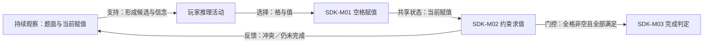

# 数独：Nikoli 标准 9×9 规则案例

- 案例编号：`sudoku-nikoli-standard-9x9-rules`
- 分析深度：标准
- 状态：第一轮结构案例已完成；第二轮已选官方例题锚点；解数量审计与行为证据待补
- 建档日期：2026-07-21
- 研究问题：一个规则极短、信息持续公开的逻辑谜题，怎样把重叠约束组织成可验证的完成任务？玩家推理为何不能直接写成规则机制？
- 案例角色：逻辑解谜锚点；与 R&R Games 标准卡牌版[《花火》四人五色基础局](hanabi-rr-2013-four-player-five-color.md)构成第一组标准对照
- 模板版本：[案例研究包 v0.3](../CASE-PACKET-TEMPLATE.md)

> 本文正文分析 Nikoli 的标准数独**规则对象**，不追溯修改第一轮案例单位。D2-4 已另行为第二轮选定 Nikoli 英文网页例题及配套途中图／答案图，见[一手来源选案](../../research/sources/second-cycle-logic-pilot-case-selection.md#31-静态约束锚点nikoli-数独)与 [ADR 0104](../../docs/adr/0104-freeze-dual-material-logic-puzzle-pilot-cases.md)。该选定仍不能自行证明唯一解、难度、解法顺序或真实玩家怎样推理。

## 1. 案例范围卡

| 字段 | 锁定值 | 证据或理由 |
| --- | --- | --- |
| 游戏制品 | Nikoli 发布的标准 9×9 数独规则 | [Nikoli 官方规则 PDF](https://www.nikoli.co.jp/ja/wp-content/uploads/sdcom_pdf/sd35_rule.pdf)，p.1 |
| 规则集或版本 | *数独のルールと解き方 / Rules of Sudoku*，2 页；PDF 嵌入创建时间 2018-07-30 | [一手来源冻结包 §2.1](../../research/sources/calibration-sudoku-hanabi-primary-sources.md#21-来源矩阵与制品身份) |
| 模式与配置 | 9×9 网格、九个 3×3 宫、值域 1–9；单一解题者；尚未指定一道题 | 规则为来源事实；单人和未指定题面为项目配置 |
| 平台或物质形式 | 以静态纸面／网格呈现为基准；不绑定任一 App | Nikoli 将其描述为 pencil puzzle；软件输入与反馈明确排除 |
| 游玩情境 | 不计时的规则结构分析；不引入赛事提交、排名或提示 | 来源未规定这些结构，不能反写成“官方无限时” |
| 明确排除 | 对角、杀手、不规则宫等变体；竞赛规则；自动候选、判错、提示、撤销和答案检查 | 防止实现功能或变体污染基础规则 |
| 来源锁定日期 | 2026-07-21 |  |
| 关键来源制品 | 上述官方 PDF；[Nikoli 英文 Sudoku 页](https://www.nikoli.co.jp/en/puzzles/sudoku/)只作交叉核对与历史语境 | PDF 冻结规则；网页不能替代固定版本 |
| 完整性标识 | PDF 165,508 bytes；SHA-256 `6B136301FCBA57259989C680C4261C65A82A4174515D5BB3D92A06A16B4B0411` | 项目于锁定日测量，不是 Nikoli 公布的校验值 |
| 复现状态 | 规则制品已冻结；没有具体题面、落笔轨迹或求解器审计 | 规则对象不等于一局可重放的解题实例 |

### 版本歧义与范围限制

- **[来源事实]** 官方 PDF 与英文网页都给出两条基础规则：在空格放入 1–9，并使每行、每列、每个 3×3 宫都包含 1–9。
- **[来源事实]** 英文网页把线索对称布局称为 Nikoli 在 1986 年采用的制题规则；它约束题目构造，不是解题者要满足的第四组完成条件。
- **[未知]** 来源没有规定候选记号、擦除、覆盖、撤销、逐步判错、计时、评分或提交程序。
- **[未知]** 当前没有具体题面，因此不能主张存在唯一解，更不能给出解题步数、所需技巧或难度。

## 2. 为什么研究它

### 2.1 一分钟内讲清这类题

玩家面对一个分成九个 3×3 宫的 9×9 网格。部分格已经写有数字，其余为空。玩家要在每个空格填入 1–9 中的一个数字，使每一行、每一列和每一宫最终都恰好出现 1–9。

规则没有规定先填哪一格，也没有不断发放新线索。题面的已知数字和三组约束从开始便持续公开；玩家反复查看它们，判断哪些填值仍可能成立，再把选择写回网格。填满不等于完成：完整赋值还必须同时满足三组重叠约束。

这个摘要故意没有说“每一步都靠演绎”“禁止猜测”或“每题唯一解”。Nikoli 的教学文字倡导寻找可以确定的位置并劝阻凭空猜测，但冻结的编号规则没有给出识别、处罚猜测或保证任意题唯一的程序。

### 2.2 本案承担的检验任务

- 检查**约束**能否以有作用域的规则结构表达，而不是把“行＋列＋宫＋数字”列成关键词。
- 区分初始线索、当前赋值、规则可推导命题与玩家实际形成的**信念**。
- 检查持续公开、可复查的静态题面怎样填写**观察后效**，并与《花火》的瞬时信息行动对照。
- 检查“推理”“候选消去”“不猜测”分别是规则结构、玩家活动、解题规范还是玩法模板候选。
- 暴露“规则家族案例”和“具体题面实例”之间的单位差异，避免用通用规则替代一局游戏。

### 2.3 当前最小主张

> **[综合判断]** 标准数独可表达为“固定公开线索与重叠全异约束限定解空间 → 玩家选择空格和值并写入当前赋值 → 当前或完整赋值接受约束检验 → 满足全部约束的完整赋值结束任务”。**玩家推理**连接观察与填写动作，但不是题面自动执行、也不是规则来源已经观察到的机制。

### 双视图导航

- **教学最小视图**：本节摘要、4.1 的七行结构、5.2 的机制索引和第 6 节编排足以说明“为什么数独不是数字匹配”。
- **研究充分视图**：第 4 节区分约束、状态与观察，第 5 节说明检查何时发生仍由实现决定，第 11 节保留题面缺失与玩家推理的证据边界。
- 教学视图省略具体线索矩阵、唯一性审计、候选笔记、擦除协议与玩家轨迹，因此不能支持难度或策略判断。

## 3. 证据与来源语域

- **[来源事实]** 规则、值域、网格结构和 Nikoli 的教学／制题陈述均来自冻结的一手资料。
- **[项目定义]** **实体**、**状态**、**约束**、**机制**、**观察**、**信念**、**编排**等为项目共享术语。
- **[结构推导]** 每组九格包含 1–9，因此每值在该组恰好一次；这不是来源逐字表达，也不证明玩家已经推出。
- **[观察]** 本案没有解题录像、输入日志、口述或具体题目复现。
- **[未知]** 凡涉及唯一解、解题路线、猜测、候选笔记、难度和体验，均不能由当前规则来源补写。

| 来源术语与来源身份 | 来源中的操作性含义 | 映射关系 | 项目共享术语或拆解 | 不能自动等同 | 定位 |
| --- | --- | --- | --- | --- | --- |
| *number* | 放入格中的 1–9 | 来源较窄 | **符号取值** | 算术量、得分或资源数值 | PDF p.1 |
| *empty cell* | 尚未填值的格 | 拆分 | **格实体＋空值状态** | 可消耗的“空格资源” | PDF p.1 |
| *row / column / block* | 三类九格组 | 拆分 | **集合／空间关系＋约束作用域** | 三种彼此无关的对象 | PDF p.1 |
| *clues* | 初始给定数字及其布局 | 部分重叠 | **初始固定值＋公开信息载体** | 《花火》的信息动作 | 英文页 `History` |
| *rule* | 解题规则，也用于对称线索制题约定 | 一词多义 | **游玩约束**／**构造约束** | 同一个规则槽位 | 英文页 `Rules / History` |
| *solution* | 示例完整填值 | 来源较窄 | **满足约束的完整赋值** | 必然唯一、预存且对玩家隐藏的答案对象 | 英文页 `Sample / Solution` |

## 4. 规则世界

### 4.1 教学最小视图

```text
81 个有坐标的格
+ 每格取值为空或 1–9
+ 部分格初始固定
+ 每格同时属于一行、一列和一宫
+ 三类九格组都必须包含 1–9
+ 玩家可向空格写入一个值
→ 全部填满且约束成立时完成
```

这个视图省略候选笔记、写错后的物理处理、逐步检查和具体题目的解数量；这些都不是冻结规则已经给出的统一结构。

### 4.2 参与者、能动性与执行

| 项目 | 内容 | 来源 |
| --- | --- | --- |
| 玩家与阵营 | 本案配置为一名解题者，无对立阵营 | 单人是项目配置；来源没有人数条款 |
| 玩家控制对象 | 对空格所作的当前填值；不能改变初始线索和三组约束 | PDF p.1；“不能改线索”由动作域仅含空格谨慎推导 |
| 系统或环境行动者 | 没有会作策略选择的系统代理；题面和约束持续存在 | 规则结构 |
| 执行来源 | 纸面基准下由玩家落笔并自行检查；网格只承载状态，不自动阻止错误 | 媒介配置与来源缺口 |
| 裁定权 | 完整赋值可由公开约束复核；逐步何时检查、谁宣布完成未规定 | PDF p.1 |
| 能动性边界 | 玩家可选择下一个空格和值；是否可擦除、撤销或试填未知 | 来源未规定 |

### 4.3 **实体**、**状态**与关系

| 实体／结构 | 身份与状态 | 关系或规则角色 | 证据 |
| --- | --- | --- | --- |
| 格 | 81 个坐标身份稳定的格；值为空或 1–9 | 每格属于恰一行、一列和一宫 | PDF p.1 |
| 行 | 9 个有序位置组 | 全异约束的作用域 | PDF p.1 |
| 列 | 9 个有序位置组 | 全异约束的作用域 | PDF p.1 |
| 宫 | 9 个粗线围成的 3×3 位置组 | 全异约束的作用域 | PDF p.1 |
| 初始线索 | 某格的固定初始值 | 题面状态兼公开信息载体 | PDF p.1 例题与空格措辞 |
| 玩家填值 | 某空格的当前值 | 玩家写入的基础状态；可能正确、错误或尚未验证 | 来源只规定要填值，不规定错误标签 |
| 完成判定 | 所有格非空且三组约束均成立 | 由当前赋值派生的终止事实 | PDF p.1 |

最小研究状态可写为：

```text
GivenValue(cell)
+ CurrentValue(cell)
+ RowOf(cell) + ColumnOf(cell) + BlockOf(cell)
+ Complete
+ ConstraintSatisfied(row/column/block)
```

**[综合判断]** “某格必为 7”不是必须另存的世界变量。它可能是由某个具体题面的全部合法完成赋值共同蕴含的**派生事实**，也可能只是玩家当前的**信念**；没有具体题面时连前者都不能实例化。

### 4.4 **规则空间**与约束

- 可寻址位置：81 个格坐标。
- 局部几何：行列正交排列，九个 3×3 宫由粗线分区。
- 规则关系：决定冲突的不是几何相邻，而是“同属一行、列或宫”；远隔的两个格也可能处于同一约束作用域。
- 约束结构：每个作用域恰含九格、目标值域恰含九个符号，因此“包含 1–9”与“每值恰一次”在完整赋值上等价。
- 物理／显示／规则空间：纸面布局直接呈现格、行、列和宫，但视觉接近本身不增加第四类约束。

### 4.5 **时间结构**、集合与资源边界

- 基础规则没有回合、时限或固定填格顺序；动作由玩家自行调度。
- “未规定规则时间”不等于解题不占物理时间，也不能排除赛事或 App 另加计时。
- 1–9 是可重复使用的符号域；行、列、宫是重叠集合。它们不是牌库式消耗集合。
- 本案没有通过严格准入的明确**资源**：空格、候选、数字、注意力和时间都没有同时获得规则存量、竞争用途、资源操作与未来行动门控。
- 分数、生命、行动点与经济均不适用。

### 4.6 **信息结构**与**观察后效**

| 信息项 | 世界真值 | 谁可观察 | 何时／渠道 | **观察后效** | 证据 |
| --- | --- | --- | --- | --- | --- |
| 初始线索 | 固定格值 | 解题者 | 题面持续呈现 | 题面永久保留，可低成本复查、直接验证和外部记录；无规则衰减 | PDF p.1 |
| 行／列／宫关系 | 固定作用域 | 解题者 | 网格位置与粗线 | 持续保留、可复查 | PDF p.1 |
| 当前填值 | 媒介中的当前赋值 | 解题者 | 落笔／显示 | 由媒介保留；擦除、日志和撤销能力未知 | 来源缺口 |
| 候选集合 | 由题面与约束推导的命题 | 只有计算或工具呈现后才被玩家观察 | 玩家推理或被排除的软件功能 | 可重新推导但不保证正确；玩家笔记协议未规定；状态变化会使旧候选过时 | 结构推导 |
| 某格确定值 | 对具体解空间的命题 | 取决于玩家是否推出 | 推理 | 可由后续推导或完成赋值验证；不保证玩家记住或相信 | 行为待证 |
| 示例答案 | 官方网页示例的完整图 | 网页读者 | 另列的 `Solution` 图 | 对该示例可事后复查；不是通用游玩权限 | 英文网页 |

- **世界—观察—信念**三分法足以表达本案；不需要把“候选集合”提升为第四种信息状态。
- 线索访问持续存在，规则不要求玩家记住已经消失的信息；但这不能证明实际解题不使用工作记忆。
- 完整赋值可由公开约束验证；没有具体题面时不能验证唯一性，也不能用“官方示例有一张答案图”推出所有题只准一个答案。
- 单人配置没有沟通动作；合作解题或讲解属于另一配置。

### 4.7 随机、目标与评价

| 项目 | 内容 | 证据状态 |
| --- | --- | --- |
| 随机过程 | 冻结的解题规则没有随机生成或抽样；题目怎样创作／选择不在本案 | **[来源缺口＋研究判断]** |
| 规则目标 | 为所有空格填入 1–9，使每行、列、宫都包含 1–9 | **[来源事实]** |
| 终止条件 | 满足上述条件的完整赋值 | **[结构推导]**；来源没有独立“胜利事件”程序 |
| 结果评价 | 完成／未完成；无来源支持的分数、排名或耗时 | **[来源缺口]** |
| 玩家自定目标 | 未主张 | **[未知]** |

## 5. **机制**分解

### 5.1 尺度与术语族

- 本案采用“可由一次填值或一次确定性检查运行”的机制单元尺度，并把完整解题视为机制系统。
- 更细拆成手部落笔、视线移动或字符识别会把媒介动作误当成通用规则机制。
- 更粗地把整款数独叫作一个“推理机制”，会合并规则检查与玩家认知，并失去题面、约束和填值的关系。

| 表面名称 | 动作义项 | 机制义项 | 玩法模板义项 | 类型标签义项 | 本案采用的尺度与 ID |
| --- | --- | --- | --- | --- | --- |
| 填数 | 向一格写值 | 写入当前赋值并进入约束检查 | 不适用 | 常见通俗描述 | `SDK-M01` 动作／机制单元 |
| 检查 | 人查看冲突 | 对指定作用域或完整赋值求约束真值 | 解题循环中的反馈环节 | 软件功能标签 | `SDK-M02` 机制单元；执行者依媒介变化 |
| 推理 | 玩家形成候选或结论 | 不录作规则机制 | 约束完成模板中的持续玩家活动 | 逻辑解谜标签的一部分 | 玩家活动，不建立机制 ID |
| 数独 | 不适用 | 可指整个机制系统 | 可指约束完成模板实例 | 作品／谜题传统名称 | 本案指规则制品；每次注明尺度 |

### 5.2 机制索引

| ID | 暂定名称 | 尺度 | 一句话规则结构 | 依赖 | 证据 |
| --- | --- | --- | --- | --- | --- |
| SDK-M01 | 空格赋值 | 单元 | 玩家选择一个空格与 1–9 中的值，更新当前赋值 | 格身份、空状态、符号域 | PDF p.1 |
| SDK-M02 | 作用域约束求值 | 单元 | 对一行、列或宫检查当前／完整赋值是否满足值域与不重复要求 | 三类组关系、当前赋值 | PDF p.1；结构拆分 |
| SDK-M03 | 完成判定 | 复合 | 当所有格非空且全部作用域约束成立时，判定任务完成 | SDK-M01、SDK-M02 | PDF p.1；结构推导 |

### 5.3 核心机制卡：SDK-M01 空格赋值

- **触发**：玩家决定填写一个仍为空的格。
- **触发策略**：可选；基础规则不指定下一格。
- **行动者与能动性**：玩家选择目标和值；题面不替玩家选择。
- **执行来源与裁定权**：纸面基准由玩家实施；合法完整结果由公开约束复核。
- **规则动作**：向目标空格放入 1–9 中一个值。
- **前置条件**：目标属于空格，值属于 1–9。
- **合法性缺口**：来源没有规定错误值是否在写入时被阻止、怎样撤销，也没有要求每一步先给出证明。
- **成本与决策锁定**：没有规则成本；物理墨迹是否可擦不是共享锁定规则。
- **状态效果**：该格从空变为当前值。
- **反馈**：纸面显示写入；是否即时指出冲突取决于未冻结的执行方式。
- **实体身份效果**：格与符号身份保留，只更新格值。
- **来源定位**：Nikoli PDF p.1 Rule 1。

### 5.4 核心机制卡：SDK-M02 作用域约束求值

- **触发**：研究模型可在每次赋值后、按需检查时或完成提交时运行；来源只给约束，没有统一调度协议。
- **行动者与执行**：可以由玩家、答案检查者或软件执行；本案纸面基准不假定自动程序。
- **输入**：一个作用域及其中当前／完整值。
- **过程**：检查值是否属于 1–9，并在完整状态下使 1–9 各出现一次；部分状态可检查重复，却不能仅凭无重复保证可完成。
- **效果**：产生“当前冲突”或“该完整作用域满足”的派生事实；不会自动把正确值写入格中。
- **反馈**：规则没有规定声音、颜色、提示或答案揭示。
- **未知与争议**：部分赋值的“合法”可指当前无重复，也可指仍可延伸为完整解；两者不能合并。

## 6. 机制间的**编排**



| 来源 | 关系类型 | 目标 | 传递对象 | 时间尺度 | 后果 | 证据状态 |
| --- | --- | --- | --- | --- | --- | --- |
| 题面观察 | 支持 | 玩家推理 | 初始线索、当前赋值、作用域 | 解题全过程 | 使候选判断成为可能，不保证实际完成 | 结构候选 |
| 玩家推理 | 选择 | SDK-M01 | 目标格、候选值、玩家信念 | 一次落笔前 | 把认知结果转为规则状态输入 | 行为待证 |
| SDK-M01 | 共享状态 | SDK-M02 | 当前赋值 | 每次写入或按需 | 约束可以重新求值 | 来源＋结构推导 |
| SDK-M02 | 反馈 | 下一次观察／推理 | 冲突或满足情况 | 可选检查点 | 影响后续选择；反馈渠道依媒介 | 结构候选 |
| SDK-M02 | 门控 | SDK-M03 | 所有作用域满足 | 完整网格 | 只在完成状态通过 | 结构推导 |

**[综合判断]** 规则没有产生新线索的机制；变化来自玩家把选择写进共享赋值。玩法得以持续，不是因为规则不断揭示信息，而是同一个持久约束网络在每次状态更新后提供新的可推导关系。

## 7. 玩家层

### 7.1 决策情境与活动边界

| 情境 | 可见状态与信念 | 可选行动 | 权衡／不可逆性 | 证据状态 |
| --- | --- | --- | --- | --- |
| 选择下一个格 | 全部题面持续公开；候选取决于玩家推导 | 选择任一空格及值，或继续观察 | 不同选择可能改变后续可见冲突；可擦除性未知 | 规则允许＋活动待证 |
| 判断某值是否确定 | 公开约束与当前赋值；玩家可能持有候选信念 | 写入、暂缓、重新检查 | 错误可能污染后续推导，但规则未规定处罚 | 结构候选 |
| 完整网格复核 | 全部格值公开 | 检查三类作用域 | 完整但不满足约束不构成完成 | 来源事实＋结构推导 |

- 规则结构使感知重叠约束、维护候选、推导和验证成为可能活动；没有轨迹时只能标为**预期／推断**。
- “不猜测”在本来源中是教学规范，不是可由裁判识别的动作类型。玩家的内在理由无法仅从写入一个正确数字反推。
- 本配置几乎没有身体速度要求；视觉辨认、落笔和工作记忆仍属于媒介与个体条件，不能宣称不存在。
- 无多人协调、沟通、威慑、承诺或欺骗结构。

### 7.2 策略、挑战与体验

- **策略**：当前不主张具体解法策略或技巧频率。PDF 展示六种思路，只能证明出版者教过这些例子。
- **挑战**：规则任务是从公开约束中找到一个满足赋值；具体推理负担取决于尚未冻结的题面。
- **难度**：未评估。规则相同不代表不同题面同难度。
- **公平／平衡**：单人基础配置没有对称竞争问题；不能因此把题目质量叫作“平衡”。
- **体验**：专注、满足、挫败或“纯逻辑感”均未获得行为证据。

## 8. **玩法模板**候选

| 候选名称 | 编排签名 | 持续玩家活动 | 时间与反馈结构 | 成立条件 | 证据状态 |
| --- | --- | --- | --- | --- | --- |
| 公开约束完成 | 固定公开实例＋重叠约束求值＋玩家赋值＋完成判定 | 观察、维护候选、选择填值、复核 | 自定步序；每次状态写入可改变后续可推导关系；终局确定检查 | 题面可读、约束一致、玩家能写入并复核；若主张唯一解还须另证 | 结构候选；行为待补 |

- 与“逻辑解谜”标签重叠，但不声称覆盖推箱子式状态搜索、规则改写或所有 Puzzle 市场标签。
- 该模板不是单一“推理机制”。至少需要公开实例、约束、写入、求值、反馈和目标连接；玩家推理位于机制与动作之间。
- 若移除重叠约束，只剩普通填表；若移除玩家写入与反馈，就只剩静态约束规格；若不保证可完成，则任务可能退化为无解判定。
- 相邻模板包括约束传播谜题、状态空间搜索谜题和规则变换谜题，后续由 Sokoban、Slitherlink 与 *Baba Is You* 对照。

## 9. 从模板到这个案例

- **角色绑定**：抽象变量绑定为 81 个格，值域绑定为 1–9，作用域绑定为行、列和 3×3 宫。
- **参数化**：9×9、九个符号和九格作用域共同建立标准结构；改变宫形或附加约束会形成别的规则对象。
- **内容**：具体题面的初始线索决定解空间、推理路径和可能难度；本案尚未实例化这一层。
- **界面与材料**：纸面让题面持续可见，却不自动阻止错误；App 可以增加候选、撤销、判错、计时和提示，从而改变机制与信息反馈。
- **制题约定**：对称线索属于 Nikoli 的构造传统，不等于解题机制；它可以影响审美与题目身份。
- **单次游玩实例**：某位玩家在某题上的落笔、回退、停顿和完成只属于那次轨迹，不能由规则家族填补。

## 10. 与《花火》的跨案例比较

| 比较对象 | 判断 | 相同之处 | 关键差异 | 证据 |
| --- | --- | --- | --- | --- |
| “线索” | 功能类比，不结构等价 | 都能约束玩家对未知值的信念 | 数独线索是初始固定公开状态；《花火》线索是有成本、定向且有完备匹配规则的行动结果 | 两案一手规则 |
| 信息访问 | 同一信息模型的不同参数 | 都需区分世界、观察、信念 | 数独题面持续公开可查；《花火》按观察者不对称，历史口头信息无系统记录 | 两案 4.6／4.9 |
| 玩家推理 | 活动家族候选 | 都可能从约束或信息推出行动依据 | 数独从固定约束解空间推导；《花火》还受随机牌序、他人行动、沟通成本与延迟验证影响 | 结构分析；行为待证 |
| 错误处理 | 不可比 | 错误都可能使目标更难达成 | 数独规则未规定自动处罚；《花火》错误出牌推进失败容限并可立即终局 | 官方规则 |
| 资源 | 不可比 | 信息都重要 | 数独没有通过准入的明确资源；《花火》蓝令牌形成共享信息行动容量 | 资源准入检查 |

## 11. 反例、失败与模型压力

### 11.1 本案最顺畅的解释

- **实体—状态—关系—约束—动作—效果**足以把两条短规则展开成可核对结构，无需新增“数字原语”或“逻辑原语”。
- **基础事实—派生事实—观察—信念**清楚区分题面、约束结论和玩家是否已经知道。
- **观察后效**可以简洁表达静态题面的长期保留、复查和验证，复验 ADR 0090。
- **玩家活动**作为机制到玩法模板的桥，避免把认知过程伪装成系统规则。

### 11.2 本案最失真的解释

| 编号 | 失败类型 | 具体症状 | 局部处理 | 可能修订 | 阻塞级别 |
| --- | --- | --- | --- | --- | --- |
| SDK-F01 | 案例单位／证据不足 | 只有规则对象，没有具体题面；“游戏”层无法实例化解空间、唯一性和难度 | 显式把本案限定为规则家族案例 | 模板未来可增加“规则家族／内容实例”单位提示 | 门审 |
| SDK-F02 | 歧义 | “合法部分赋值”可指当前无重复，也可指仍可扩展为完整解 | 分别写局部一致与全局可扩展 | 若跨案例复现，再建立两个稳定谓词 | 门审 |
| SDK-F03 | 因果越界 | 从公开约束很容易直接写成“玩家进行逻辑推理” | 玩家层全部标记结构预期或待证 | 无共享模型修订；继续执行双证据状态 | 长期检查 |
| SDK-F04 | 跨媒介失真 | 纸面、赛事与 App 对错误、擦除、候选、提示和计时的处理完全不同 | 冻结纸面基准并列出排除项 | 后续数字实现对照时复验规则实现层 | 延后 |
| SDK-F05 | 术语变义 | 来源的“规则”同时指解题约束和对称线索制题约定 | 来源语域中拆分映射 | 术语方法已能处理，不新增层级 | 已处理 |

### 11.3 反例与竞争解释

- 同样使用 9×9 格与数字清单但不施加行／列／宫约束，不会产生数独机制；原语清单相同不足以确定机制。
- 一个 App 可以使用相同完成约束，却通过即时判错和不可提交错误值产生不同的可达轨迹与玩家活动；规则目标相似不等于行为等价。
- “数独是约束满足问题”是有效的形式解释，但若只保留变量与约束，会删去题面呈现、玩家写入、反馈和媒介执行，不能独自替代游戏设计分析。
- 若具体题存在多个解，基础完成规则仍可运行，却会削弱“从线索推出唯一值”的玩法模板解释；唯一性必须成为内容层证据，而不是偷偷加入基础规则。

## 12. 标准案例暂不执行的模块

- 设计变体：留到冻结具体题面或数字实现后，以免把多个实现差异混成一次实验。
- 完整证据账本：标准案例不强制；可引用[一手来源冻结包 §5](../../research/sources/calibration-sudoku-hanabi-primary-sources.md#5-可直接进入案例包的主张账本)。
- 行为观察：待后续具体题、逐步轨迹或口述研究。

## 14. 校准结论与后续

- **结构校准状态**：在“标准 9×9 规则家族、无具体题面”的声明范围内通过；现有词汇可以表达作用域、约束、赋值、派生事实与持久信息访问。
- **行为证据状态**：待补；没有实际解题轨迹，不能确认推理方法、猜测、记忆、难度或体验。
- 保留的工作定义：**约束**是作用于有类型状态和作用域的规则结构；**玩家推理**不是规则系统自动执行的机制。
- 候选概念：暂不录取“逻辑”“候选消去”或“推理”原语；“局部一致／全局可扩展”保留为可能的合法性谓词细分。
- 新的模型压力：规则家族与内容实例必须显式区分；没有具体题不能把唯一性和难度写进游戏层。
- 后续取证：对已冻结的 Nikoli 网页例题审计解数量，并收集逐步解题轨迹；再与 Sokoban、Slitherlink 和数字数独实现对照。
- 关联：[一手来源冻结](../../research/sources/calibration-sudoku-hanabi-primary-sources.md)、[校准失败清单](../../research/calibration-failure-log.md)、[逻辑解谜覆盖地图](../../research/corpus/genre-coverage-map.md#71-逻辑解谜)。
