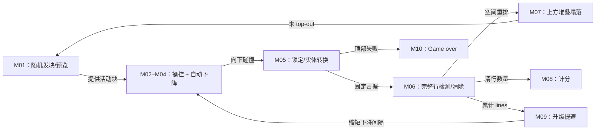

# 《俄罗斯方块》：Game Boy A-Type 深度案例

- 案例编号：`tetris-game-boy-v1.1-a-type-level-0`
- 分析深度：深度
- 状态：校准门 A 已通过；合法 ROM 复现与玩家观察待补
- 建档日期：2026-07-21
- 研究问题：实时数字游戏如何把玩家输入、自动时间过程、碰撞、结算流水线和反馈编排成持续玩法？“移动”在这里还是一次状态转换吗？
- 案例角色：实时规则语法锚点；与 FIDE 实体标准国际象棋构成时间、执行与信息对照
- 模板版本：[案例研究包 v0.2](../CASE-PACKET-TEMPLATE.md)

> 本文研究的是 1989 年 Game Boy 版本的一个明确配置，不把后来形成的 Tetris Guideline、现代旋转系统、hold、ghost piece 或其他平台版本倒灌进来。实现细节主要来自可重建的 ROM 反汇编；若尚未在合法持有的原版卡带/ROM 上复现，会明确标记。

## 1. 案例范围卡

| 字段 | 锁定值 | 证据或理由 |
| --- | --- | --- |
| 游戏制品 | Nintendo Game Boy 版 *Tetris* | 任天堂旧产品页列出日版 `1989.6.14` 发行并标注为“动作解谜”；[任天堂 Game Boy 软件表](https://www.nintendo.co.jp/n02/dmg/index.html) |
| 目标卡带与程序版本 | 北美英语制品语境的 `DMG-TR-USA`；程序候选为 `DMG-TRA-1` / World Rev 1，32 KiB，SHA-1 `74591cc9501af93873f9a5d3eb12da12c0723bbc`。反汇编称其 `Tetris (JUE) (V1.1)` | [保存测量数据库](https://gbhwdb.gekkio.fi/cartridges/DMG-TRA-1/)与[反汇编 README](https://github.com/kaspermeerts/tetris/tree/b95c66859339f5523e80213de5857eefc1c7703f)；北美实物到该哈希的自有 dump 链尚待闭合 |
| 反汇编快照 | `kaspermeerts/tetris` commit `b95c66859339f5523e80213de5857eefc1c7703f` | 锁定行号与注释，不把未来仓库改动混入本案 |
| 模式与配置 | 单人 A-Type；普通速度；初始 Level 0；NEXT 初始显示；无预置垃圾；音乐任选 | 原版手册第 5–7、15 页；模式中仍允许暂停和切换 NEXT |
| 平台 | 原始 DMG-01 Game Boy 为最终复现基线；具体显示延迟和硬件个体差异暂不测量 | 不把模拟器增强功能纳入核心案例 |
| 游玩情境 | 从开局持续到堆叠触发 game over 的一次得分挑战 | 原版手册第 3、7、16 页 |
| 明确排除 | B-Type、双人、heart 高速模式、Tetris DX、NES 版、现代 Guideline 规则、非原生 rewind/save-state | 防止同名作品与模式混并 |
| 来源锁定日期 | 2026-07-21 |  |
| 关键来源制品 | Nintendo of America ©1989 英文说明书扫描；`DMG-TRA-1` 候选 ROM；固定反汇编 commit | 分别支持玩家契约、候选二进制身份与可定位实装分析 |
| 完整性标识 | 候选 ROM SHA-1 `74591cc9501af93873f9a5d3eb12da12c0723bbc`、SHA-256 `0d6535aef23969c7e5af2b077acaddb4a445b3d0df7bf34c8acef07b51b015c3`；反汇编 commit `b95c66859339f5523e80213de5857eefc1c7703f`；说明书扫描 hash 未保存 | ROM 哈希来自保存测量，不是 Nintendo 官方校验值 |
| 复现状态 | 反汇编静态分析完成；未在本项目用合法持有的目标 ROM 重建、逐帧运行或 DMG-01 实测 | 实装结论按证据强度标记，不冒充自有执行观察 |

### 来源与复现限制

- 规则面材料采用 Nintendo of America ©1989 的 20 页英文说明书扫描；扫描托管方不是 Nintendo，但 The Strong 馆藏对象可旁证该制品身份。[说明书扫描](https://www.videogamemanual.com/gameboy/Tetris%20%28USA%29.pdf)；[The Strong 对象记录](https://artsandculture.google.com/asset/instruction-booklet-nintendo-game-boy-tetris-instruction-booklet-nintendo/0AGPujAxJh-jcA?hl=en)
- 保存数据库的详细 hash 样本来自 `DMG-TR-FAH` 卡带；它把多个 `DMG-TR-USA` 实物列在同一 World Rev 1 组，但本项目尚未对北美目标卡带完成自有或获授权 dump。因此“北美说明书—北美卡带—目标程序哈希”仍是一条显式证据缺口。
- 反汇编是对具体 ROM 的逆向工程实现证据，不是开发者原始源代码；README 称其完整但并非每个例程都已解释。本文优先引用具清楚指令行为的部分，不把注释中的猜测当事实。
- 本轮没有在仓库中保存或分发受版权保护的 ROM，也尚未执行基于原版 ROM 的逐帧复现。能从代码强支持但未运行验证的实现主张标为“实现推断”。

## 2. 一分钟内讲清这局游戏

七种由四个方格组成的形状会一个接一个从狭长场地上方出现，并随时间自动下降。玩家只能在当前形状落下时左右移动、顺时针或逆时针旋转，也可以按下加速下降。形状碰到底部或既有堆叠后会固定；任何被完全填满的横行随后消失，上方方块下落。一次消除越多行、当前等级越高，得分越多。A-Type 没有“通关”终点：消行使等级和下落速度逐渐提高，直到新形状无法正常进入场地、堆叠到顶，结算最终分数。

这不是“玩家把方块放进网格”这么简单。玩家没有一个暂停世界后任意选择的终点；位置是输入、自动重力、离散帧、碰撞回退和锁定共同产生的轨迹终点。

### 当前最小主张

> **[工作假设]** Game Boy A-Type 的核心不是单独的“方块下落”或“消行”，而是“随机顺序发放 → 有限预览 → 实时操控与自动下降 → 碰撞锁定 → 行检测/删除/塌落 → 计分与提速 → 再发放”的闭环；玩法模板来自这些机制的有类型编排，而非任何一个机制自动升级。

### 双视图导航

- **教学最小视图**：本节通俗摘要、5.2 机制索引、5.3–5.6 核心机制与第 6 节闭环，足以解释“多个机制怎样经编排形成持续玩法”。
- **研究充分视图**：第 4 节实现状态与时间结构、5.7 调度补记、第 11 节版本冲突与第 13 节证据账本，用来复核逐帧顺序、锁定、实体转换和上方两行边界。
- 教学视图省略内存计时器、隐藏候选块和异常路径；它们不改变核心说明，但任何精确时序或实现等价主张必须回到研究充分视图。

## 3. 证据边界

- **[来源事实]** 手册直接说明的模式、目标、控制、界面字段和计分规则，按页码标注。
- **[实现事实/推断]** 可由锁定 commit 的指令与数据表复核的帧循环、计时器、碰撞回退、随机选择和状态顺序。
- **[教程意图]** 手册“Technique”页提供发行方希望玩家学习的基本策略；它不是玩家实际普遍行为的观察样本。
- **[观察缺口]** 本案尚无真实玩家输入日志、录像逐帧编码或访谈，不声称某种堆叠策略的使用率和体验。

## 4. 规则世界

### 4.1 参与者、能动性与执行

| 项目 | 内容 | 证据 |
| --- | --- | --- |
| 玩家 | 一人，通过十字键、A/B、Start、Select 输入 | 手册 pp. 4–7、15 |
| 玩家当前控制对象 | 当前活动四格块的朝向和横向位置，并可加速其下落 | 手册 p. 4 |
| 系统过程 | 读取输入、倒计时、自动下降、碰撞、锁定、消行、塌落、抽取下一块、计分、升级、终局 | [主循环和普通游戏状态 L386–417、L4405–4421](https://github.com/kaspermeerts/tetris/blob/b95c66859339f5523e80213de5857eefc1c7703f/tetris.asm#L386-L417) |
| 规则执行 | 程序自动执行；玩家不能声明例外或请求裁判 | 数字实现结构 |
| 能动性边界 | 玩家不能选择形状、向上移动、任意指定终点、撤销已锁定形状或阻止正常重力；可以暂停与隐藏/显示 NEXT | 手册 pp. 4、15；实现 L4423–4494 |

### 4.2 **实体**、身份与生命周期

| 实体或结构 | 生命周期 | 身份问题 |
| --- | --- | --- |
| 活动 tetromino | 从 preview 转为 active，具有形状/朝向和位置，直到锁定 | 作为一个四格复合对象被操控 |
| 四个活动方格 | 随复合对象一起变换 | 碰撞逐格检测，但玩家不独立控制 |
| 固定方格 | 活动块锁定后写入场地背景 | 原 tetromino 的整体身份不再用于后续规则，方格只以占据参与消行 |
| 完整横行 | 由十个占据格派生 | 不是持久实体；检测后进入清除列表并消失 |
| 当前/预览/隐藏候选块 | 形成短队列 | 玩家看到当前与一个 NEXT；实现还保存一个对玩家不可见的下一候选 |

**[实现事实]** 锁定例程把当前活动块的四个对象写入背景场地并隐藏活动对象；这不是同一“棋子”继续静止，而是从可操控复合实体转换为匿名占据单元。[`LockPieceIntoBackground`, L6067–6107](https://github.com/kaspermeerts/tetris/blob/b95c66859339f5523e80213de5857eefc1c7703f/tetris.asm#L6067-L6107)

**[模型压力]** 如果**实体身份**被假定必须跨所有状态转换保持，Tetris 的锁定会被错误表达。更稳妥的是允许“解组/物化”：一个复合实体的效果生成多个不再保留整体身份的状态单元。

### 4.3 **状态**与事实

```text
FieldOccupancy(10 × 18)
+ ActivePiece(type, orientation, x, y)
+ PreviewPiece
+ HiddenNextCandidate / randomizer history
+ DropTimer + FramesPerDrop
+ InputPressed + InputHeld + RepeatTimer
+ Lock/Clear/Collapse substate
+ Level + Lines + Score + SoftDropCounter
+ Paused + PreviewVisible + GameState
```

| 状态项 | 类别 | 更新方式 | 证据 |
| --- | --- | --- | --- |
| 场地占据 | 基础离散状态 | 锁定写入；清行删除；上方行下移 | 实现 L5301–5550、L6067–6107 |
| 活动块姿态 | 基础离散状态 | 输入或重力尝试更新，碰撞时回退 | 实现 L5193–5236、L5910–6028 |
| 当前等级 | 进程状态 | 由初始选择与累计消行推进，上限速度表到 level 20 | 实现 L4240–4283、L5825–5876 |
| 下落计时器 | 时间状态 | 每个主循环递减，到零触发一次向下尝试 | 实现 L395–405、L5193–5229 |
| 清行/塌落子状态 | 阶段状态 | 锁定后依次检测、动画、移动和重新发块 | 实现 L5301–5550 |
| 得分与行数 | 累积/评价状态 | 软降和消行后更新 | 手册 pp. 7、16；实现 L4992–5037、L5283–5299 |
| 暂停与预览显示 | 模式状态 | Start/Select 切换 | 手册 p. 15；实现 L4423–4494 |

### 4.4 **关系**与权限

- `occupies(fixedCell, fieldCell)`：固定方格占据场地单元。
- `covers(activePieceCell, fieldCell)`：活动块当前投影，不等于已经写入场地。
- `partOf(activeCell, activeTetromino)`：四格组成当前可操控复合实体。
- `collides(pose, boundaryOrOccupiedCell)`：候选姿态任一方格进入非空位置即失败。
- `above(rowA, rowB)`：清行后决定哪些行下移。
- `previews(nextPiece, player)`：信息访问关系，可由 Select 暂时移除。
- `controls(player, activePiece)`：持续但受重力、碰撞和输入窗口限制的局部控制。

这里的玩家**控制**不等于完整**许可**：玩家可以按旋转键，但若候选朝向碰撞，实现会回退；输入被接受不代表规则动作成功改变姿态。

### 4.5 **规则空间**

- 实现使用宽 10、高 18 的离散场地；每个 tetromino 由四个方格组成。[场地填充例程 L5039–5058](https://github.com/kaspermeerts/tetris/blob/b95c66859339f5523e80213de5857eefc1c7703f/tetris.asm#L5039-L5058)
- 空间关系主要是正交平移、围绕预设姿态的旋转、占据与边界碰撞。
- 玩家操控的是复合形状的姿态，不是四格分别移动。
- 清行检测寻找十格全部非空的横行；实现只检查 18 行中的下方 16 行，这是说明书通俗规则没有揭示的实现边界。[`CheckForCompletedRows`, L5301–5337](https://github.com/kaspermeerts/tetris/blob/b95c66859339f5523e80213de5857eefc1c7703f/tetris.asm#L5301-L5337)
- 清除后并不是物理方块逐个模拟掉落，而是程序按行复制占据数据；“重力”在活动块和堆叠塌落两个机制中具有不同执行语义。

### 4.6 **时间结构**

本案不是纯连续模拟，而是帧同步的离散更新系统：

1. 主循环读取当前按住与刚按下的输入。
2. 分派当前游戏状态，普通游玩依次执行操控、下降、行检测、锁定、塌落与计分。
3. 递减计时器。
4. 等待下一次 VBlank 标记后再进入下一轮。

[主循环 L386–417](https://github.com/kaspermeerts/tetris/blob/b95c66859339f5523e80213de5857eefc1c7703f/tetris.asm#L386-L417) 与 [普通游玩流水线 L4405–4421](https://github.com/kaspermeerts/tetris/blob/b95c66859339f5523e80213de5857eefc1c7703f/tetris.asm#L4405-L4421)支持这一路径。

| 时间尺度 | 结构 |
| --- | --- |
| 帧/主循环 | 输入采样和状态更新的基本节拍 |
| 自动下落间隔 | Level 0 为 52 个节拍一次下落，随等级缩短，表中 Level 20 为 2；这是实现计数，不直接等同书面“秒” |
| 水平自动重复 | 初次左右移动后，持续按住约 23 帧进入自动重复，之后约每 9 帧尝试一次 |
| 单块生命周期 | 生成 → 多帧操控/下落 → 碰撞 → 锁定 |
| 结算阶段 | 锁定 → 行检测 → 闪烁/清除 → 塌落 → 计分/升级 → 下一块 |
| 整局 | 难度逐步提高，直到 top-out；无固定胜利时点 |

**[综合判断]** “实时”在此表示系统更新不等待玩家声明一个完整回合；但程序内部仍有严格次序、计时器和阶段。实时/回合不是“有无离散步骤”的二元划分，而是行动许可与系统推进如何调度。

### 4.7 **集合结构**

- 七类 tetromino 形状构成可重复抽取的类型集合。
- 当前、preview 和隐藏候选构成短队列；只向玩家公开前两个位置中的当前与 preview。
- 固定方格构成按坐标索引的场地集合，不保持原块分组。
- 完整行列表最多记录一次锁定后识别出的清除目标，并按阶段统一处理。
- top score 表按初始 Level 保存各档前三名，但断电后消失；它属于本机短期记录，不是单局核心状态（手册 p. 9）。

### 4.8 **资源**与资源操作

| 候选 | 判断 | 理由 |
| --- | --- | --- |
| 空余场地容量 | 资源角色成立 | 稀缺、不同摆法竞争使用、错误封闭空间难以回收，耗尽导致失败 |
| 可操控时间/高度 | 机会窗口，是否定为资源待校准 | 下落使未来输入机会减少，却不是可储存和跨对象自由转移的数值池 |
| 当前块 | 强制任务对象，不宜仅叫资源 | 玩家必须处理，不能储存或丢弃；其形状既是约束也可能提供机会 |
| score | 评价量，不是资源 | 只累计和排名，不能花费或转换为行动能力 |
| lines | 进程计数，不是资源 | A-Type 中推动等级且显示成就，但无竞争用途 |
| NEXT 信息 | 信息关系，不是资源 | 可选择隐藏，但没有消耗、交换或跨用途配置 |

**[反例]** 把所有可计数状态都叫资源，会把得分、消行数、等级和下落计时器塞进同一类别，从而掩盖它们分别承担评价、进程、参数和调度职责。

### 4.9 **信息结构**

玩家可见当前场地、活动块、分数、等级、累计行数和一个 NEXT 形状；按 Select 可以隐藏或重新显示 NEXT（手册 pp. 7、15）。

实现中还存在尚未展示的候选块和随机生成内部状态。因此：

```text
World = 固定场地 + 当前块 + preview + 隐藏候选 + timers + randomizer state
Observation = 屏幕场地 + 当前块 + 可选 preview + score/level/lines + 反馈
Belief = 玩家对未来形状、可达落点和风险的估计
```

**[设计实验线索]** 原作甚至允许玩家主动关闭一条有用信息，而不给分数补偿。这是一个纯粹改变观察关系、基本不改世界状态与结算规则的现成变体。

### 4.10 **随机性**与不确定性

说明书只承诺七种块依次落下，不说明均匀独立抽样。锁定反汇编显示：实现从 Game Boy divider register 取值，按七类形状映射，并最多重试两次以避免特定近期重复；代码注释本身提示该逻辑与常见二手描述可能不一致。[`NextPiece`, L5077–5164](https://github.com/kaspermeerts/tetris/blob/b95c66859339f5523e80213de5857eefc1c7703f/tetris.asm#L5077-L5164)

因此当前只下三条稳健结论：

- 块序由实现的伪随机/时序相关过程生成，不由玩家选择。
- 玩家通常只提前看到一个 preview，不能完全知道后续序列。
- “七种块所以每七块各出现一次”不是规则事实；任何概率分布主张都需进一步复现或数学分析。

### 4.11 **目标**、终止与评价

| 层面 | 内容 | 证据 |
| --- | --- | --- |
| 模式目的 | A-Type 是耐力型高分挑战，尽可能消除更多行 | 手册 p. 7 |
| 终止 | 堆叠到场地顶部后 game over | 手册 pp. 3、7；实现 top-out 逻辑 L5261–5277 待实机边界复现 |
| 评价 | 消行与 soft drop 产生分数；一次消 1/2/3/4 行的基础分为 40/100/300/1200，再乘当前等级 + 1 | 手册 p. 16；实现 L4992–5037 |
| 进程 | 累计消行使 Level 和下落速度逐渐提高 | 手册 p. 7；实现 L4240–4283、L5825–5876 |
| 玩家子目标 | 保持平整、预留长槽、修洞等来自手册教程或策略材料，不是终止条件 | 手册 pp. 13–14 |

## 5. **机制**分解

### 5.1 尺度声明

本案把输入可调用的平移/旋转、系统自动调用的下降、碰撞回退、锁定、行清除、塌落、计分与提速视为机制单元或小型复合机制；把完整“处理一个块”视为复合循环，把整局 A-Type 视为机制系统。这样既能与棋步比较，又不把所有程序例程都误叫独立玩法。

### 5.2 机制索引

| ID | 暂定名称 | 尺度 | 规则结构 | 证据 |
| --- | --- | --- | --- | --- |
| M01 | 随机发块与单块预览 | 复合 | 内部随机候选 → preview → 下一活动块；再生成隐藏候选 | 手册 p. 7；实现 L5077–5164 |
| M02 | 帧采样平移 | 单元 | 左/右输入 → 尝试一格横移 → 碰撞则回退；支持延迟自动重复 | 实现 L5965–6028 |
| M03 | 帧采样旋转 | 单元 | A/B 新按 → 尝试预设朝向 → 碰撞则回退 | 手册 p. 4；实现 L5910–5963 |
| M04 | 自动下降与 soft drop | 复合 | 计时到期或持续按下 → 尝试下移；soft drop 另计分 | 实现 L5166–5299 |
| M05 | 碰撞锁定 | 复合 | 向下候选碰撞 → 回退 → 进入锁定 → 活动四格写入场地 | 实现 L5220–5281、L6030–6107 |
| M06 | 完整行识别与清除 | 复合 | 锁定后扫描横行 → 记录完整行 → 动画删除 | 实现 L5301–5496 |
| M07 | 堆叠塌落 | 单元/过程 | 把被清行以上的行向下复制，清空顶部 | 实现 L5498–5550 |
| M08 | 消行与软降计分 | 复合 | 清除数/下降距离 × 等级参数 → 累计 score | 手册 p. 16；实现 L4843–4907、L4992–5037 |
| M09 | 消行驱动提速 | 反馈机制 | lines 达阈值 → level 增加 → frames-per-drop 减少 | 手册 p. 7；实现 L4240–4283、L5825–5876 |
| M10 | top-out | 终止机制 | 新块在顶部无法正常进入/锁定 → game over | 手册 pp. 3、7；实现 L5261–5277 |
| M11 | 暂停/预览切换 | 元操作 | Start 暂停更新；Select 切换 preview 观察权限 | 手册 p. 15；实现 L4423–4494 |

### 5.3 核心机制卡：M02/M03 操控变换

- **触发**：主循环读取到刚按的 A/B/左/右，或横向按住达到重复时点。
- **行动者与输入**：玩家给出方向或旋转按钮；程序将其解析为候选姿态变化。
- **前置条件**：存在活动块，未暂停，当前不在阻止操控的结算状态。
- **合法性与结算**：先临时改变 x 或 orientation，渲染四格位置并检测碰撞；无碰撞则保留，有碰撞则恢复原值。
- **效果**：改变活动块姿态，不直接改变固定场地。
- **反馈**：活动块画面和成功时音效；碰撞时旋转/位移不发生，音效被取消。
- **时间**：旋转取“刚按”而非持续按住；横移有按下、延迟、重复三个时间阶段。

```text
InputSample
→ CandidatePose
→ CollisionTest(candidatePose, field)
→ accept ? Pose := candidatePose : Pose := previousPose
→ Render / SFX
```

**[校准价值]** 输入已经被系统接收，但规则动作可能以“没有状态变化”结算。动作结果需要区分输入、声明、候选转换、合法性与最终效果。

### 5.4 核心机制卡：M04/M05 下降与锁定

- **触发**：drop timer 到零，或玩家持续按下且 soft-drop timer 允许。
- **系统动作**：活动块尝试向下一个单元。
- **结算**：无碰撞则保留新 y；碰撞则回退 y，进入锁定流程。
- **转换**：活动块四格写入固定场地，活动对象隐藏；随后才检测完整行。
- **得分旁路**：满足实现条件的 soft drop 距离换成分数；自动重力不计该分。
- **终止旁路**：顶部生成/锁定边界满足时进入 game over。

这里没有一个由玩家直接选择的 `destination`。最终落点是多帧输入和系统过程共同积分的结果：

```text
Pose(t+1) = Resolve(Pose(t), Input(t), GravityTimer(t), Collision(Field))
```

### 5.5 核心机制卡：M06/M07 行清除与塌落

- **触发**：活动块完成锁定。
- **前置**：固定场地形成一个或多个十格全占据横行。
- **结算阶段**：扫描并登记 → 更新 lines/清除类型 → 闪烁并置空 → 把上方数据下移 → 清顶部 → 生成下一块。
- **多行原子性**：一次锁定可以识别 1–4 行；计分按这次组合评价，而不是把四行当四次 single。
- **反馈**：不同清行数的音效、动画、计数和分数。
- **实现边界**：上方两行不进入扫描，需单独标注为版本行为/潜在缺陷。

### 5.6 反馈机制卡：M09 提速

- **触发**：累计 lines 越过与当前/初始等级相关的阈值。
- **规则效果**：Level 增加，重载新的 `FramesPerDrop`。
- **系统后果**：同样长度的物理时间中，玩家可用于横移和旋转的输入窗口减少。
- **玩家后果**：难度可能提高，但幅度仍取决于熟练度、堆叠状态和硬件输入；因此写“速度参数提高”，不直接写“所有玩家都同等更难”。

### 5.7 校准门 A 回填：生命周期、调度、执行与身份

| 机制 | **动作生命周期** | **调度语义** | 执行来源 / 裁定权 | **实体身份效果** |
| --- | --- | --- | --- | --- |
| M02/M03 操控变换 | 输入被帧采样 → 建立候选姿态 → 碰撞检测 → 接受或回退 → 反馈 | 主循环在固定阶段读取输入；旋转读新按，横移另有延迟与重复计时 | 玩家提供输入；程序执行并裁定候选是否合法 | 接受或回退都保留活动块身份，仅更新或恢复姿态 |
| M04/M05 下降与锁定 | 计时或按下触发 → 尝试下移 → 接受，或碰撞后回退 → 锁定 → 固定场地写入 | drop timer 与输入采样共享帧循环；锁定后门控后续清行阶段 | 程序执行与裁定；本案无外部裁判 | 活动复合实体被移除或拆分，四个组成格物化为固定占据 |
| M06/M07 清行与塌落 | 锁定完成 → 扫描快照 → 登记完整行 → 动画／置空 → 上方复制下移 → 清顶 | 只在锁定后运行；结算期间普通操控不并发，完成后才发下一块 | 程序执行与裁定 | 完整行不是持久实体；主要更新占据事实，避免为每条派生横行制造虚假身份 |
| M11 暂停 | Start 被识别 → 进入暂停 → 等待恢复输入 → 返回循环 | 暂停冻结正常更新；具体哪些硬件／音频过程继续需实测 | 程序执行；玩家选择暂停与恢复 | 不适用 |

## 6. 机制间的**编排**



有三个尤其重要的连接：

1. **门控**：只有活动块锁定，行检测才运行；不是场地任意时刻完整就立即清除。
2. **转换**：可控复合实体先变成固定占据，才成为清行输入。
3. **正反馈压力**：成功消行推动 level，提高下降频率，使后续操控窗口收紧；进步与挑战增长由同一计数连接。

完整循环可以写成：

```text
发放未知任务
→ 预览并在时限中塑形/定位
→ 不可逆提交到共享堆叠
→ 检测空间模式并清除
→ 奖励 + 腾出容量 + 提高速度
→ 在更紧条件下重复
```

## 7. 玩家层

### 7.1 决策情境

| 情境 | 可见信息与权衡 | 证据状态 |
| --- | --- | --- |
| 当前块如何放置 | 当前场地、当前形状、一个 preview；眼前消行与未来可用空间可能冲突 | 结构支持，具体权重待观察 |
| 何时 soft drop | 更快承诺、可得 drop 分；同时减少修正机会 | 规则支持，玩家使用待观察 |
| 是否追求多行同消 | 4 行基础分显著高于四个 single；等待长块可能增加堆高风险 | 手册计分与随机结构支持；实际策略待观察 |
| 是否隐藏 NEXT | 信息减少且规则奖励不变 | 可作为自设挑战；动机与体验待观察 |
| 高速下怎样分配输入 | 水平移动、旋转和下降共享越来越短的操作窗口 | 实现支持；技能差异待观察 |

### 7.2 推理、执行与教程意图

手册第 13–14 页建议玩家避免空洞、填满横行，并学习一次消除 2/3/4 行；还展示了在特定紧急局面中等待新块锁定声后迅速横移的技巧。它支持“发行方将空间规划、洞修复和时机操作视为可学习活动”，却不证明所有玩家都采用相同策略。

玩家活动至少横跨：

- 识别当前形状和可达姿态；
- 预测下降期间还剩多少次有效输入；
- 想象放置后的场地和未来形状兼容性；
- 执行按键时机与持续时长；
- 在得分、空间安全和未来灵活性之间选择。

### 7.3 **策略**、挑战与体验边界

“留井等 I 块”“保持表面平整”“避免覆盖洞”可作为策略候选，因为它们是对一类场地状态的条件性方针；本轮除手册教程意图外尚无真实使用证据。

本案的**挑战**可以结构化地定位为：随机任务顺序、有限预览、不可撤回锁定、容量累积和缩短的操作窗口。某一 Level 对某位玩家的**难度**仍是玩家—配置关系，不是 Level 数字自身的绝对属性。

“心流”“上瘾”“焦虑”等体验词不能从循环结构直接断言。可检验假设是：清行同时提供可见空间恢复、分数反馈和短时停顿，使一次输入序列形成清楚闭合；升级则逐渐缩短下一轮可用时间。

## 8. **玩法模板**候选

| 候选 | 编排签名 | 持续活动 | 成立条件 | 状态 |
| --- | --- | --- | --- | --- |
| 实时落块堆叠—消行 | 随机顺序发块 + 有限预览 + 重力调度 + 姿态操控 + 碰撞锁定 + 满行删除/塌落 + top-out | 在持续推进的时间中把当前形状整合进累积场地，为未来保留可用结构 | 不可逆堆叠会制造容量压力；清行能重开空间；玩家在锁定前有有限控制 | **[规则预期]** |
| 递增速度得分生存 | 上述循环 + 组合计分 + 消行驱动提速 + 无固定胜利终点 | 在风险逐渐上升时延长生存并最大化分数 | 评价量持续累积，挑战随成功增长，失败终止 | **[规则预期]** |

这两个候选不是“消行机制”的别名。若把预制方块静态摆入无时间限制棋盘，仍可能有满行删除，却不再拥有实时落块模板；若保留落块却不删除行，场地只累积而没有核心恢复反馈，玩法也会显著改变。

## 9. 从模板到这款**游戏**

- 七类四格形状、10×18 场地、具体旋转姿态、无 wall kick、单格平移、下落速度表和随机器把抽象模板实例化为这一版本。
- Game Boy 的十字键、A/B、Start/Select 映射出双向旋转、soft drop、暂停和可隐藏 preview；不同输入映射会改变可达姿态和执行负荷。
- A-Type 把循环接到无限时长高分与提速；B-Type 则接到预置垃圾、25 行终点和固定 level，属于同一制品里的不同实例化。
- 黑白屏幕、音效、清行动画与火箭结尾是反馈和表达内容；它们不全是原语/机制，却影响玩家辨认状态和结束意义。
- 一次具体 run 的块序、输入轨迹和堆叠历史是游玩实例，不等于 A-Type 规则系统。

## 10. 跨案例比较准备

| 比较对象 | 暂定关系 | 关键差异 |
| --- | --- | --- |
| Tetris 横移与国际象棋走子 | 共享“候选位置 + 合法性 + 状态更新”的功能类比，非结构等价 | Tetris 无直接目的地选择，系统实时推进，可多次输入且碰撞后无效；棋步离散提交并转移许可 |
| Tetris 旋转与横移 | 同一“候选姿态—碰撞—接受/回退”机制家族 | 输入边沿/持续处理、姿态参数与自动重复不同 |
| 活动块下降与清行后塌落 | 功能类比，执行结构不同 | 前者逐时步进并受玩家影响；后者是结算阶段的批量行复制 |
| A-Type 与 B-Type | 同一制品内共享大量机制，不同玩法编排 | A-Type 是无固定胜利的提速得分生存；B-Type 有预置场地、25 行目标与固定等级 |

## 11. 反例、失败与模型压力

### 11.1 当前模型解释最顺畅之处

- 触发—输入—候选过程—合法性—效果—反馈能准确表达平移和旋转。
- 有类型编排图清楚显示“锁定”为什么是操控与消行之间的转换接口。
- 世界—观察—信念区分能表达隐藏候选、可切换 preview 和玩家对未来的估计。
- 玩法模板在本案中确实由多机制、反馈循环和持续玩家活动共同形成。

### 11.2 活跃失败

| ID | 类型 | 症状 | 临时处理 | 门审 |
| --- | --- | --- | --- | --- |
| TT-F01 | 时间模型歧义 | “实时”会掩盖输入采样、主循环顺序、计时器和结算暂停 | 表达为帧同步调度 + 多时间作用域 | A |
| TT-F02 | 动作边界歧义 | 一次“移动方块”可指一个按键、一次成功横移、一段持续控制或从生成到落点的整条轨迹 | 分开输入事件、规则动作、自动过程和复合生命周期 | A |
| TT-F03 | 实体身份失真 | 活动 tetromino 锁定后不作为完整实体继续存在 | 加入解组/物化式效果，不强制身份连续 | A |
| TT-F04 | 规则来源冲突 | 手册说完整横行会消失，实现只扫描下方 16/18 行 | 同时保留说明规则与可执行实现边界，需复现后决定表述 | A |
| TT-F05 | 调度槽缺失 | 模板机制卡有触发策略，但不能统一表示同帧内多个系统过程的固定执行顺序 | 在编排边增加优先级/阶段/原子性，门 A 评估独立调度槽 | A |
| TT-F06 | 资源边界 | 空间容量和可操控时间都像资源，但其可存储、可转移与可配置性质不同 | 暂记“资源角色”与“机会窗口”，不扩张资源定义 | A |
| TT-F07 | 证据不足 | 反汇编未在本轮使用原 ROM 重建和逐帧测试，玩家活动也未观察 | 实现主张分级；建立复现清单与玩家观察任务 | 延后 |
| TT-F08 | 教学负担 | 完整实现状态远多于解释玩法所需状态 | 分“教学最小状态”和“实现充分状态”，不要求正文展示内存变量 | A |

详细跨案例登记见[第一轮失败清单](../../research/calibration-failure-log.md)。

### 11.3 竞争解释与反例

- 可以把每一帧视为一个极短“系统回合”，从而把实时统一进回合模型；但这种重命名没有解释谁拥有行动许可、为何玩家输入和系统动作能同帧发生，教学价值有限。
- 可以把固定堆叠仍追溯到每个原 tetromino；但后续清行只读取格占据，保留谱系是实现外分析数据，不是本版本规则所需状态。
- 可以把 preview 关闭称为“提高难度机制”；更精确的表达是它改变观察关系，难度变化仍需玩家证据。
- 说明书的完整横行规则与上两行实现边界构成“规范—实现”冲突；不能为了整洁只保留其中一个。

## 12. 设计变体与预测

| ID | 隔离改变 | 保持不变 | 规则预测 | 玩家后果假设 | 最小测试 |
| --- | --- | --- | --- | --- | --- |
| V01 | 取消 NEXT 显示且不可恢复 | 块序、操控、计分与速度 | 世界状态不变，观察函数减少一项 | 放置更依赖当前安全性而非下一块兼容性 | 对照相同预生成块序的输入/场地轨迹 |
| V02 | 清行后不让上方块下落 | 发块、操控、完整行检测 | 清空行变成永久空带，上方结构悬空 | 空间恢复方式和洞的意义根本改变 | 小型原型比较可持续性与可达局面 |
| V03 | 锁定前无限暂停并允许逐步输入 | 所有空间与随机规则 | 时间压力可被玩家外置取消 | 规则问题趋近离线序列摆放，执行技能下降 | 同一块序比较暂停/不暂停成绩，不推断主观体验 |
| V04 | 每次发块允许从七类中选择 | 场地、操控、消行、速度 | 去除块序不确定性 | 规划空间扩大，等待特定块的风险消失 | 穷举/AI 对照固定策略的生存长度 |
| V05 | 行满即刻清除，不等待活动块锁定 | 其他状态 | 活动块移动过程中可能触发清行和空间改变 | 操控与结算互相打断，出现原版不存在的中间状态 | 实现逐帧原型并寻找行为差异 |

## 13. 证据账本

| ID | 主张 | 类型 | 范围 | 来源与定位 | 支持 / 不支持 |
| --- | --- | --- | --- | --- | --- |
| C001 | 任天堂于 1989-06-14 在 Game Boy 发布日版 Tetris，并标为动作解谜 | 版本/出版事实 | 日版产品 | Nintendo [Game Boy 软件表](https://www.nintendo.co.jp/n02/dmg/index.html) | 支持作品身份；不支持具体 v1.1 机制 |
| C002 | 本案反汇编基于给定 SHA-1 的 JUE v1.1 ROM | 实现来源事实 | 锁定仓库 commit | [README](https://github.com/kaspermeerts/tetris/tree/b95c66859339f5523e80213de5857eefc1c7703f) | 支持版本可复核性；不是官方源代码 |
| C003 | A-Type 以尽可能消行和高分为目的，等级逐渐提高，堆顶后结束 | 说明规则 | 北美英文手册所述单人 A-Type | Nintendo 说明书扫描 pp. 3、7 | 支持模式循环；不支持逐帧算法 |
| C004 | 左右、下、A/B 分别映射横移、soft drop 和双向 90° 旋转 | 说明规则/输入 | 原版 Game Boy | Nintendo 说明书扫描 p. 4 | 支持输入语义；不支持精确帧时序 |
| C005 | 普通游玩每轮按固定顺序调用操控、下降、行检测、锁定、塌落和计分 | 实现事实 | v1.1 ROM 反汇编 | `tetris.asm` L4405–4421 | 支持编排顺序；仍需运行测试异常路径 |
| C006 | 旋转和横移先尝试候选姿态，碰撞时恢复 | 实现事实 | v1.1 | L5910–6058 | 支持候选—检验—回退机制 |
| C007 | 活动块锁定后四格写入固定场地 | 实现事实 | v1.1 | L6067–6107 | 支持实体解组/物化分析 |
| C008 | 场地实现为 10×18，但完整行扫描只覆盖其中 16 行 | 实现事实/边界 | v1.1 | L5039–5058、L5301–5337 | 支持规范—实现差异；实际可触发性待复现 |
| C009 | 重力间隔由 Level 查表，从 52 逐步降至 2 个计数单位 | 实现事实 | 正常/heart 共同表，A-Type 本案正常模式 | L4240–4283 | 支持速度参数；不直接支持玩家难度 |
| C010 | single/double/triple/Tetris 基础分 40/100/300/1200，并乘 Level+1 | 规则/实现一致 | A-Type line clear | 手册 p. 16；实现 L4992–5037 | 支持计分反馈 |
| C011 | 玩家通常会为了四行消除而保留竖井 | 策略假设 | 未锁定玩家/水平 | 手册只支持“多行得高分”，没有行为样本 | 当前不能标已观察 |
| C012 | “实时落块堆叠—消行”是可跨游戏比较的玩法模板 | 项目工作假设 | 当前案例及未来对照 | 本文第 6–8 节 | 待其他落块、静态摆放和无消行案例校准 |

### 规则实现层补记

| 层 | 本案已覆盖 | 尚未覆盖 |
| --- | --- | --- |
| 规范 | 1989 年英文说明书对目标、输入、模式、得分和选项的玩家契约 | 说明书未规定的逐帧算法与全部边界 |
| 实装 | 固定 commit 反汇编与候选 ROM 哈希支持静态定位 | 本项目尚未完成合法 ROM 重建及字节一致性验证 |
| 执行 | 无自有执行证据 | DMG-01 或已验证模拟器的输入—状态轨迹 |
| 观察 | 无真实玩家样本 | 锁定版本、设备、玩家与场次的录像、输入日志或访谈 |

### 来源与复现清单

- Nintendo. [Game Boy 软件产品表](https://www.nintendo.co.jp/n02/dmg/index.html)，访问于 2026-07-21。
- Nintendo of America. [*Tetris Game Boy Instruction Booklet*](https://www.videogamemanual.com/gameboy/Tetris%20%28USA%29.pdf)，©1989，20 页，访问于 2026-07-21；扫描托管方非 Nintendo，引用时保留页码与来源层级。
- Game Boy hardware database. [*Tetris (World) (Rev 1), DMG-TRA-1*](https://gbhwdb.gekkio.fi/cartridges/DMG-TRA-1/)及[详细 dump 记录](https://gbhwdb.gekkio.fi/cartridges/DMG-TRA-1/3615retro-1.html)，访问于 2026-07-21；这些是保存者测量，不是 Nintendo 官方哈希。
- Kasper Meerts. [*A comprehensive disassembly of Tetris for the Game Boy*](https://github.com/kaspermeerts/tetris/tree/b95c66859339f5523e80213de5857eefc1c7703f)，commit `b95c66859339f5523e80213de5857eefc1c7703f`，基准 ROM SHA-1 如范围卡，访问于 2026-07-21。
- 第一轮校准的完整来源矩阵、版本陷阱与复现夹具见[校准门 A 资料包](../../research/sources/calibration-a-primary-sources.md)。

待复现步骤：

1. 在研究者合法持有对应卡带/ROM 的前提下核验 SHA-1，不向仓库提交 ROM。
2. 按反汇编 README 使用兼容 RGBDS 版本重建并做字节级比较。
3. 记录 Level 0 A-Type 的输入、主循环帧、姿态、drop timer、碰撞与锁定状态。
4. 构造上两行完整、spawn/top-out、连续 soft drop、旋转撞墙和多行清除边界。
5. 将实测轨迹以状态日志或短视频时间戳加入证据账本；若与注释冲突，以可重复执行结果修订。

## 14. 校准门 A 后结论

- 保留：输入与规则动作分离、自动过程作为机制、结算流水线、有类型编排、世界/观察/信念和玩家相对难度。
- 已采纳：时间结构增加**调度语义**；效果可声明**实体身份效果**；机制卡区分执行来源与裁定权。
- 原语候选：`tick/计时器`、`候选—接受/回退`、`占据`、`复合实体解组`、`观察开关`；均需跨案例准入。
- 模板已升级为 v0.2，采用规范—实装—执行—观察证据标记、教学最小／研究充分双视图与复现状态字段。
- 后续：完成 ROM/手册复现取证；选一段真实玩家 run 编码玩家活动。上述缺口不阻塞校准门 B。
