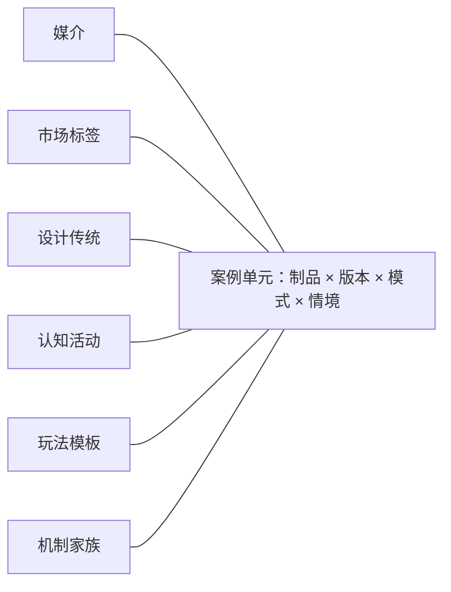

# 类型覆盖地图：多维语料与分层抽样方案

- 状态：研究方案 / 待执行
- 日期：2026-07-20
- 访问日期：外部链接均于 2026-07-20 核验
- 研究阶段：阶段一·开放研究
- 适用范围：为《游戏原语》选择、记录和检查研究案例；不是书稿章节，也不是终极类型学

## 结论摘要

**[综合判断]** 可执行的“类型覆盖地图”不应是一棵把所有游戏塞进唯一位置的类型树，而应是一张以**案例单元**为中心、连接六组独立坐标的多对多关系网：

1. 媒介（Medium）
2. 市场标签（Market Label）
3. 设计传统（Design Tradition）
4. 认知活动（Cognitive Activity）
5. 玩法模板（Gameplay Pattern）
6. 机制家族（Mechanic Family）

项目的核心编辑主干仍保持为：

```text
原语 --语法--> 机制 --编排--> 玩法模板 --实例化--> 游戏
```

本地图只在“游戏案例”周围增加多组检索坐标，用来保证语料覆盖、发现标签与结构的错位，并把案例送回核心主干分析；它**不修改核心模型，也不把类型标签插进核心链条**。这一边界与 [`CONTEXT.md`](../../CONTEXT.md)、[ADR-0003](../../docs/adr/0003-cross-media-research-corpus.md)、[ADR-0004](../../docs/adr/0004-separate-theory-from-genre-map.md) 和 [ADR-0008](../../docs/adr/0008-use-multi-role-case-sets.md) 一致。

**[工作假设]** 第一轮以 12 个可重叠研究区域、48 个“案例—角色”席位启动。案例可以在多个区域复用，因此预计形成 36–44 个独立案例单元，而不是机械地收集 48 个互不相干的标题。四个指定垂直传统——逻辑解谜、德式/欧式桌游、传统 Roguelike、硬核模拟——各自拥有完整的锚点、对照、纵深与边界案例组。

## 1. 认识论标记与证据边界

本文使用五种标记：

- **[来源事实]**：来源明确陈述的事实，只外推到该来源有权说明的范围。
- **[项目定义]**：项目当前采用的术语或分析约定；不冒充外部共识。
- **[综合判断]**：本研究根据多个来源作出的组织、比较或方法判断。
- **[工作假设]**：尚需规则分析、游玩观察或跨案例检验的结构判断。
- **[开放问题]**：当前资料不足，或不同规则版本、社群与情境可能给出不同答案的问题。

证据按用途分工，不互相冒充：

| 证据 | 能支持什么 | 不能单独支持什么 |
|---|---|---|
| 官方规则书、手册、源代码、规范 | 合法动作、状态、结算、模式、版本差异 | 玩家实际策略、体验或社群身份 |
| 作者/开发团队的官方说明与演讲 | 设计意图、自我定位、版本背景 | 设计意图是否在真实游玩中实现 |
| 官方商店与数据库标签 | 某来源在某时点怎样标注作品 | 该标签就是机制、模板或唯一类型 |
| 设计组织、奖项与传统社群文件 | 传统内部的术语、资格、典范与争议 | 对传统外全部游戏的普遍分类权 |
| 实际游玩记录、录像、遥测、访谈 | 观察到的活动、策略、误解与体验 | 未观察玩家或其他版本的普遍规律 |

**[综合判断]** 正式建档时，规则事实必须有页码、章节或稳定锚点；市场标签必须记录来源、语言、抓取日期和原始字符串；认知活动与玩法模板若只有规则书支持，最多标为“预期”，不能写成“已观察”。

## 2. 为什么不能采用单一类型树

### 2.1 标签系统实际混用了不同维度

**[来源事实]** Steam 允许开发者、玩家与版主添加标签，官方说明标签可以是 genre、theme 或 attribute；只有权重最高的 20 个会影响主要展示与发现，权重还会随社群标注变化。[Steamworks：Steam Tags](https://partner.steamgames.com/doc/store/tags) 进一步说明了参与者和权重机制；[Steam Popular Tags](https://store.steampowered.com/tag/browse/) 的 2026-07-20 快照则把 `Action`、`Singleplayer`、`2D`、`Early Access`、`Horror`、`Traditional Roguelike`、`Hobby Sim` 等放在同一频次列表中。

**[综合判断]** 这个列表很适合观察市场语言，却不能直接充当结构分类：其中至少混有玩法类型、玩家人数、表现维度、发行状态、题材、难度承诺和设计传统。

**[来源事实]** Google Play 要求开发者为游戏选择类别，并最多添加五个最相关标签；其游戏类别包括 Action、Adventure、Arcade、Board、Card、Casino、Casual、Educational、Music、Puzzle、Racing、Role Playing、Simulation、Sports、Strategy、Trivia、Word。[Google Play Console：Choose a category and tags](https://support.google.com/googleplay/android-developer/answer/9859673)

**[综合判断]** 这套分类是移动商店的发现入口，能给“主流标签护栏”提供一个明确清单；单一类别和最多五标签的产品约束，也意味着它必然压缩混合游戏和细分传统。

**[来源事实]** IGDB 的 API 把 `genres`、`themes`、`game_modes`、`player_perspectives`、`platforms` 和 `keywords` 设为不同字段，而不是一条统一类型路径。[IGDB API documentation](https://api-docs.igdb.com/)

**[综合判断]** IGDB 证明“市场数据库也可以保存并列维度”，但它仍是电子游戏元数据模式，不提供本项目所需的认知活动、玩法模板或规则分解。

### 2.2 桌游与传统游戏数据库也各有用途边界

**[来源事实]** BGG 的 Category 页面说明，类别用于按相似主题或特征分组，由用户提交、经管理员审核；其列表本身混有活动（Deduction）、组件（Card Game）、题材（Fantasy）和非游戏条目。BGG 另设 Mechanism 列表，记录 Auction、Deck Building、Worker Placement 等功能性描述。[BGG Category](https://boardgamegeek.com/wiki/page/Category)；[BGG Mechanism](https://boardgamegeek.com/wiki/page/mechanism)；[BGG 分类浏览](https://boardgamegeek.com/browse/boardgamecategory)；[BGG 机制浏览](https://boardgamegeek.com/browse/boardgamemechanic)

**[综合判断]** BGG 适合采集桌游社群实际使用的类别和机制候选词，但不能把 BGG 的“机制”字段无转换地当作本项目的机制层：条目的分析尺度、结构粒度和命名原则并不完全一致。

**[来源事实]** Ludii 将传统游戏表示为由 ludemes 组成的结构化规则，并提供可按 time model、turns、chance、hidden information、players、equipment、rules 等概念检索的数据库；官方同时公开语言、数据库与概念资料。[Ludii Portal](https://ludii.games/)；[Concept Search](https://ludii.games/searchConcepts.php)；[Digital Ludeme Project Database Guide，§3.1–3.2](https://ludii.games/downloads/DLP_Database_Guide.pdf)

**[综合判断]** Ludii 是传统策略游戏与规则结构的重要抽样框，但其优势在可执行形式与历史规则集，不应被要求代表电子游戏市场语言、身体技能、商业运营或玩家意义。

### 2.3 垂直传统必须使用各自的一手入口

| 垂直传统 | 来源事实与可用入口 | 局限 |
|---|---|---|
| 逻辑解谜 | **[来源事实]** Nikoli 官方列出 Sudoku、Slitherlink、Nurikabe 等长期编辑的纸笔逻辑谜题，并为各题型给出规则；Simon Tatham 的官方合集则把许多单人小型谜题置于同一可移植框架中。[Nikoli puzzles](https://www.nikoli.co.jp/en/puzzles/)；[Sudoku](https://www.nikoli.co.jp/en/puzzles/sudoku/)；[Slitherlink](https://www.nikoli.co.jp/en/puzzles/slitherlink/)；[Portable Puzzle Collection manual](https://www.chiark.greenend.org.uk/~sgtatham/puzzles/doc/) | Nikoli 是特定出版传统，Tatham 是作者选择的实现合集；两者都不等于所有“Puzzle”市场标签。 |
| 德式/欧式桌游 | **[来源事实]** Spiel des Jahres 自 1979 年评选德语地区的实体桌面游戏（analogue board games），明确区分家庭向 Spiel、儿童向 Kinderspiel 与资深玩家向 Kennerspiel，并列出创意、可玩性、规则清晰度、材料和图形等评审关注点。[Spiel des Jahres FAQ](https://www.spiel-des-jahres.de/en/faq/)；UWA 的机构记录将 Stewart Woods 2012 年的 *Eurogames: The Design, Culture and Play of Modern European Board Games* 标为经同行评审的研究成果，其书名明确并置设计、文化与游玩。[UWA 研究记录](https://research-repository.uwa.edu.au/en/publications/eurogames-the-design-culture-and-play-of-modern-european-board-ga/) | Spiel des Jahres 是有地区、年份、语言、销售和目标读者条件的奖项，不是“Eurogame”定义；UWA 书目记录只能证明文献身份与题名，不能替代对正文论证的逐页取证；Eurogame 也不等于德国制造或所有现代桌游。 |
| 传统 Roguelike | **[来源事实]** 2008 年 International Roguelike Development Conference 形成的 Berlin Interpretation 以 Rogue、ADOM、Angband、Crawl、NetHack 为 canon，列出高低权重因素，并明确“缺少某项不等于不是、拥有某项也不等于就是”，其目的不是约束设计。[Berlin Interpretation 原始文本存档](https://www.roguebasin.com/index.php/Berlin_Interpretation) | 这是特定社群在特定时间形成的多因素解释，不是永恒二元标准；Steam 的 `Roguelike`、`Roguelite` 与 `Traditional Roguelike` 仍须分别保存。 |
| 硬核模拟 | **[来源事实]** DCS 官方提供按机型拆分的飞行手册；Falcon BMS 4.38 的用户手册还指向独立的飞行程序、航电/武器、训练、通信与导航资料；Command: Modern Operations 官方手册自称处于传统 wargame 与专业军事模拟之间，成功依赖真实能力、限制与作战权衡的理解。[DCS documentation](https://www.digitalcombatsimulator.com/en/downloads/documentation/?SHOWALL_1=1)；[Falcon BMS 4.38 User Manual](https://cdn.falcon-bms.com/docs/4.38/BMS-User-Manual.pdf)；[CMO Manual，Introduction](https://command.matrixgames.com/manual/introduction/) | 手册数量和营销中的“真实”不能自动证明模拟准确度，也不能单独证明玩家忠诚；“硬核”暂作设计传统与学习实践标签，不作二元机制类型。 |

## 3. 六维多对多数据模型

### 3.1 分析单位

**[项目定义]** 地图的最小案例单元不是标题，而是：

```text
案例单元 = 游戏制品 + 规则/软件版本 + 模式 + 平台/物质实现 + 研究情境
```

例如 `Minecraft Java / Survival / Hardcore / 某版本` 与同一标题的 Creative 模式应分别建档。Minecraft 官方说明两种标准模式在资源、伤害、飞行、饥饿和目标开放度上显著不同，并另有一命的 Hardcore 模式。[Minecraft：What is Minecraft?](https://www.minecraft.net/en-us/article/what-minecraft)；[Minecraft Help：All Game Modes](https://help.minecraft.net/hc/en-us/articles/360058743992-Minecraft-Differences-Between-Creative-Survival-and-Hardcore-Game-Modes)

### 3.2 六个坐标的职责

| 坐标 | 回答的问题 | 记录方法 | 不得替代 |
|---|---|---|---|
| 媒介 | 规则通过什么物质、计算、界面和身体配置被实现？ | 可多选：PC/主机/移动/街机/VR、棋盘/卡牌/纸笔、口述/跑团、场地/身体、位置感知、混合媒介；另记输入与裁判/计算执行者 | 市场类型、玩法模板 |
| 市场标签 | 玩家、商店、数据库、发行方在何时怎样称呼它？ | 保存 `source + raw_label + locale + observed_at + weight/rank（若有）`；标准化别名另建映射，不覆盖原词 | 机制、设计传统 |
| 设计传统 | 作品与哪种历史谱系、制作惯例、社群讨论和典范集合发生关系？ | 保存自我认同、作者/机构说明、谱系证据、社群文件和置信度；允许“受影响但不属于” | 地理产地、单个机制 |
| 认知活动 | 玩家在某任务中主要感知、推断、记忆、规划或协调什么？ | 记录到具体任务：反应/时机、空间变换、约束传播、概率判断、短期战术、长期规划、系统学习、社会推理、沟通协商、创造表达、程序操作；规则推断与实测分开 | 玩家人格、难度或类型 |
| 玩法模板 | 多个机制怎样围绕持续活动、决策、时间和反馈组成可复用玩法？ | 采用项目模板：结构、活动、时间、反馈、成立条件、变体/反例；标记“预期”或“已观察” | 市场标签、单个机制 |
| 机制家族 | 哪类可触发/反复运行的规则结构造成状态变化？ | 先以检索家族暂记：空间/移动、行动权限、时间/回合、信息/隐藏、随机/结算、资源/经济、组合/构筑、冲突/伤害、成长/解锁、目标/评分/终止、沟通/社会规则、界面映射、模拟过程；每项必须链接具体规则 | 原语总表、玩法模板 |

**[工作假设]** 上述认知活动和机制家族只是首轮编码菜单，不是完备分类。一个词可以在不同命名空间重复出现。例如 `deckbuilding` 可以同时是 `steam-tag:Deckbuilding`、`bgg-mechanism:Deck, Bag, and Pool Building` 和本项目待验证的“获取—循环—精炼牌组”玩法模板；三条记录必须保留不同来源和语义角色。

### 3.3 关系而非层级



每条边都要带来源或判断状态：

```text
case --realized_in--> medium
case --labeled_as {source, locale, date}--> market_label
case --participates_in {evidence, confidence}--> design_tradition
case/task --demands {expected|observed}--> cognitive_activity
case --instantiates {expected|observed, conditions}--> gameplay_pattern
case --implements {rule_locator, scale}--> mechanic_family
```

### 3.4 最小案例卡

```yaml
case_id: title-version-mode-platform
artifact:
  title: ""
  version_or_ruleset: ""
  mode: ""
  platform_or_material_form: ""
  play_context: ""
coordinates:
  media: []
  market_labels: []       # 每项保留来源、语言、日期
  design_traditions: []   # 证据与置信度
  cognitive_activities: [] # expected / observed
  gameplay_patterns: []    # expected / observed + 成立条件
  mechanic_families: []    # 规则定位 + 分析尺度
case_roles: []            # 相对于哪个研究问题的 anchor/contrast/deep-cut/boundary
primary_evidence: []
counterevidence: []
open_questions: []
```

## 4. 分层抽样方法

### 4.1 抽样目标

**[综合判断]** 本方案追求的是**分析覆盖（analytical coverage）**，不是市场占有率估计，也不是对“全部游戏”的统计代表。抽样先保证不同规则环境和传统能对核心模型施压，再考虑销量或当期热度。

### 4.2 五步流程

1. **冻结标签快照。** 保存 Steam Popular Tags、Google Play 类别、IGDB 字段、BGG 类别/机制和 Ludii 概念的日期、语言与原词；动态页面至少每半年重抓一次，旧快照不覆盖。
2. **建立非互斥分层。** 同时按媒介、时代、人数/关系、文化与地区、主流/垂直传统、规则可得性分层。一个案例可以命中多个层。
3. **以研究问题组案例。** 每个区域先确定一个能区分结构的问题，再选锚点、对照、纵深与边界；角色属于“案例 × 问题”，不永久属于标题。
4. **先做规则级编码，再做运行级观察。** 规则书只产出机制候选和预期模板；至少一局观察、可靠录像/日志或模拟轨迹后，才能写“观察到的活动/模式”。
5. **按缺口和新边收益迭代。** 每批完成后检查六维边、跨媒介对照和反例；新增案例优先补空白关系，而不是继续堆同质名作。

### 4.3 第一轮最低覆盖线

**[工作假设]** 以下配额均为**非互斥最低命中数**，总和不等于案例总数：

| 分层 | 第一轮最低线 | 用途 |
|---|---:|---|
| 数字屏幕媒介 | 24 个案例单元 | 维持电子游戏作为主要教学语境 |
| 桌游/卡牌 | 10 | 提供规则透明、多人互动与物质执行对照 |
| 纸笔/传统抽象游戏 | 6 | 检验极简器材、规则集变体与跨文化传播 |
| 体育/具身/场地游戏 | 4 | 压力测试身体技能、裁判、连续时间与物理边界 |
| 口述/跑团/社会游戏 | 4 | 压力测试人类裁定、协商、私定规则与共同叙事 |
| 混合/位置感知/平台型实践 | 2 | 暴露“游戏制品”边界和外部基础设施 |
| 1970 年以前或传统规则集 | 6 | 避免历史近视 |
| 1970–1999 | 8 | 覆盖街机、早期主机/电脑、现代桌游和 Roguelike 谱系 |
| 2000–2012 | 8 | 覆盖网络化、模组、现代独立与桌游扩张 |
| 2013–2026 | 12 | 覆盖直播运营、平台化、移动与当代混合标签 |
| 四个指定垂直传统 | 每个 4 个角色席位 | 保证锚点、对照、纵深、边界完整 |

**[工作假设]** 文化与地区不设僵硬国别配额；第一轮至少应出现东亚传统游戏/解谜、欧洲现代桌游、北美电脑/桌面角色扮演传统，以及不以欧美日商业电子游戏为唯一来源的传统规则集。Ludii 的规则集与地域字段可做候选入口，但每条历史/起源判断仍要回到其引用资料。麻将必须按具体规则集建档；例如 [World Riichi Championship Rules（2022 版）](https://www.worldriichi.org/s/WRC_Rules_2022_20220708_site.pdf) 只能代表该赛事采用的立直麻将竞赛规则，不能代表全部地方麻将。

### 4.4 案例选择评分

**[综合判断]** 候选案例在 0–2 分上评估五项，总分只用于排队，不自动决定收录：

| 项 | 0 分 | 1 分 | 2 分 |
|---|---|---|---|
| E：一手证据可得性 | 无稳定资料 | 只有官方简介/部分规则 | 有版本明确的完整规则、手册、源码或设计说明 |
| D：区分力 | 只重复已知结构 | 改变多个变量，因果较混 | 与锚点共享背景但突出一项关键差异 |
| V：纵深 | 无稳定传统依据 | 有社群使用但谱系不清 | 有长期规则/社群/组织资料且把机制发展到显著深度 |
| X：跨域价值 | 与现有样本同质 | 补一个媒介/年代/人数缺口 | 同时建立新的跨媒介、文化或传统连接 |
| B：边界压力 | 完全符合预期 | 有轻微歧义 | 明确暴露标签、规则、制品/游玩或模型边界 |

使用约束：锚点优先 `E + 可解释性`；对照优先 `D`；纵深优先 `V + E`；边界优先 `B`。销量只能作为熟悉度的一个旁证，不能代替结构理由。

### 4.5 覆盖停止条件

**[工作假设]** 第一轮在同时满足下列条件时暂停扩样并进入比较：

- 12 个区域均有四角色席位，角色理由指向明确研究问题。
- 90% 以上案例单元完成六维字段；未知项被显式标为未知，而非猜测补齐。
- 四个指定垂直传统各至少有两种独立的一手来源类型，例如规则书 + 社群定义、作者说明 + 官方手册。
- 每条拟进入玩法模板的“机制组合 → 持续活动”关系至少有两个案例支持，其中一个为不同媒介或远缘传统；否则保留为工作假设。
- 每个区域至少保留一个失败、歧义或边界记录。
- 同一区域连续加入两个案例都没有新增机制耦合、认知活动、标签错位或边界问题时，暂停该区域扩样；这只是局部饱和，不宣称完备。

## 5. 主流市场标签护栏

**[综合判断]** 主流覆盖以 Google Play 的明确类别清单和 Steam 动态高频标签为双重护栏。护栏不是新的分类树：每个标签要么进入一个或多个研究区域，要么进入“尚未覆盖”清单并说明原因。

| 市场标签簇 | 主要研究区域 | 必须保留的错位 |
|---|---|---|
| Action / Arcade / Platformer / Shooter / Fighting / Action RPG / Souls-like | R1 实时空间控制与 R2 探索、角色与知识进展 | `Action` 过宽；第一/第三人称是视角，`2D/3D` 是表现/空间实现；Souls-like 还带有谱系判断 |
| Adventure / Open World / Metroidvania / Point & Click / Visual Novel | R2 探索、角色与知识进展 | `Horror`、`Story Rich` 常是题材/体验承诺；Visual Novel 的阅读、分支与状态结构也不能由 `Adventure` 自动推出 |
| Strategy / RTS / Turn-Based Strategy / 4X / Wargame / MOBA | R3 战略、战术与战争模型及 R10 多人关系 | 实时/回合是时间结构，不是战略深度本身；MOBA 还横跨单角色操作、团队角色与直播运营 |
| Simulation / Management / Building / Survival / Sandbox / Automation | R4 与 R8 | `Simulation` 同时覆盖生活、载具、经济和专业模拟，必须拆传统与任务 |
| Puzzle / Logic / Word / Trivia / Educational / Casual | R5 逻辑解谜；缺口批次 | `Casual` 更像受众/门槛承诺；Word、Trivia 不应被逻辑推演替代 |
| Board / Card / Deckbuilding / Trading Card Game | R6 德式桌游与 R9 卡牌构筑 | Board/Card 可能只是媒介；deckbuilding 在市场、机制和模板层需分开 |
| Roguelike / Roguelite / Traditional Roguelike / Dungeon Crawler | R7 | 同根词不代表同一结构；保留来源原词和传统归属判断 |
| Sports / Racing / Music / Rhythm | R11 | 数字再现与身体项目要成对抽样，不能只分析屏幕版本 |
| Co-op / PvP / MMO / Social Deduction / Party / Battle Royale | R10 与 R12，必要时回连 R1 | 这些标签常指关系、淘汰格式或规模，可与任意题材/机制组合 |
| Indie / Early Access / Free to Play | R12 与缺口批次 | 生产、发行或商业状态，不作为玩法类型；可能改变更新节奏与元游戏 |
| Casino / Gambling | R9 与缺口批次 | 需区分规则结构、虚拟下注与真钱监管情境；首轮不能用纸牌案例代替全部博彩实践 |

## 6. 第一轮研究区域与多角色案例组

下表所有角色分配均为 **[工作假设]**。链接证明规则、官方自我描述或传统材料可得；“为什么承担该角色”是本研究待检验的综合判断。区域可以重叠，同一案例可以在不同问题中换角色。

| 区域与核心问题 | 锚点案例 | 对照案例 | 纵深案例 | 边界案例 |
|---|---|---|---|---|
| **R1 实时空间控制**：移动、瞄准、碰撞、时机和输入反馈怎样形成平台、射击与格斗活动？ | [Super Mario Bros. Wonder](https://supermariobroswonder.nintendo.com/)：熟悉的横向移动、跳跃、障碍与到达结构 | [DOOM (1993)](https://store.steampowered.com/app/2280/DOOM_1993/)：同为实时空间控制，核心从跳跃/路线转向导航、瞄准与火力管理 | [Street Fighter 6](https://www.streetfighter.com/6/en-us/)：把输入、帧时机、距离、资源与对手建模推到竞技纵深 | [QWOP](https://www.foddy.net/Athletics.html)：输入映射本身成为主要障碍，迫使区分界面、身体技能与角色移动机制 |
| **R2 探索、角色与知识进展**：地图开放、能力门控、数值成长和玩家知识怎样分别推进？ | [The Legend of Zelda: Breath of the Wild](https://www.nintendo.com/us/store/products/the-legend-of-zelda-breath-of-the-wild-us/)：开放导航、资源与环境交互的共同直觉 | [D&D 2024 Free Rules](https://www.dndbeyond.com/posts/1804-start-playing-today-with-the-2024-d-d-free-rules)：把角色能力与世界裁定移到桌面、人类主持和共同叙事中 | [Path of Exile](https://www.pathofexile.com/game)：以角色构筑、掉落与长期系统学习检验“成长”内部的不同反馈环 | [Outer Wilds](https://www.mobiusdigitalgames.com/outer-wilds.html)：主要进展可能发生在玩家知识而非角色数值或永久道具上 |
| **R3 战略、战术与战争模型**：信息、指挥尺度、行动时序与承诺怎样改变决策？ | [FIDE Laws of Chess](https://handbook.fide.com/chapter/e012023)：规则稳定、完全信息、交替行动的共同基线 | [StarCraft II](https://starcraft2.blizzard.com/)：把同时行动、战争迷雾、生产与操作负荷加入竞争结构 | [Command: Modern Operations](https://command.matrixgames.com/manual/introduction/)：从单个平台组件扩展到战役级情报、后勤、兵力与任务分配 | [Diplomacy](https://renegadegamestudios.com/diplomacy/)：谈判与承诺影响结果，却有大量信息和约束存在于棋盘规则之外 |
| **R4 生产、建造、经营与自动化**：采集、转换、布局、委派和反馈怎样产生不同的“建设”玩法？ | [Minecraft Survival](https://www.minecraft.net/en-us/article/what-minecraft)：采集—制作—建造—生存的熟悉循环 | [Sid Meier's Civilization VI](https://civilization.2k.com/civ-vi/)：同样建设与增长，但采用回合、城市/帝国尺度和显式胜利目标 | [《Factorio》2.0.77 基础自由模式](../../catalog/cases/factorio-2.0.77-base-freeplay.md)：以物流、转换、容量、供能与解锁检验自动化；实际吞吐、瓶颈和优化行为仍待测 | [Dwarf Fortress](https://bay12games.com/dwarves/features.html)：生成历史、持续世界、间接控制与细粒度模拟模糊了建造游戏、殖民模拟和 Roguelike 谱系边界 |
| **R5 逻辑解谜传统**：约束传播、状态搜索、不可逆动作与规则变换是否需要不同模板？ | [Sudoku](https://www.nikoli.co.jp/en/puzzles/sudoku/)：规则短、状态清楚、以约束推断为主 | [PuzzleScript 的 Sokoban 规则例](https://www.puzzlescript.net/Documentation/rules.html)：从静态填数转为移动、推动与不可逆状态搜索 | [Slitherlink](https://www.nikoli.co.jp/en/puzzles/slitherlink/)：局部数字约束与全局单环条件持续相互传播 | [Baba Is You](https://www.hempuli.com/Baba/)：规则句本身成为可移动对象，迫使模型处理元规则与规则改变 |
| **R6 德式/欧式桌游传统**：低门槛规则、资源转换、间接竞争与现代爱好者纵深怎样组合？ | [Catan 规则](https://www.catan.com/sites/default/files/2021-06/catan_base_rules_2020_200707.pdf)：生产、交易、网络建设与胜利点的熟悉入口 | [Pandemic](https://www.zmangames.com/game/pandemic/)：共享类似桌游可读性，但把竞争改成共同危机、角色能力与团队胜负 | [Food Chain Magnate / Splotter](https://www.splottershop.com/)：出版方明确以面向策略爱好者的深而复杂桌游定位，可检验经济网络与强耦合纵深；[Agricola](https://www.lookout-spiele.de/en/games/agricolare.html) 为工人放置/生存压力的备用纵深 | [The Mind](https://www.spiel-des-jahres.de/en/games/the-mind/)：被德国奖项体系认可，却以禁言、无固定回合和共享时机感为核心，说明奖项生态不等于单一 Eurogame 结构 |
| **R7 传统 Roguelike 与广义 Roguelike 标签**：哪些结构属于传统谱系，哪些只保留部分循环？ | [NetHack 5.0.0 Windows x64 rev4 TTY 普通模式配置族](../../catalog/cases/nethack-5.0.0-windows-x64-tty-normal.md)：以正式源码、post-release 运行包与分日期 Guidebook 分层冻结的传统参照 | [Hades FAQ](https://www.supergiantgames.com/blog/hades-faq/) 与 [Berlin Interpretation](https://www.roguebasin.com/index.php/Berlin_Interpretation)：用实时动作、跨局进展的当代 “rogue-like” 自我定位，对照传统回合、网格与策略取向 | [Angband 4.2.6 Manual](https://angband.readthedocs.io/en/stable/)：长期角色养成、逐层风险、庞大物品/怪物知识与一命后果形成另一条经典纵深 | [Minecraft Hardcore](https://help.minecraft.net/hc/en-us/articles/360058743992-Minecraft-Differences-Between-Creative-Survival-and-Hardcore-Game-Modes)：程序世界与一命制并不足以自动建立传统 Roguelike 身份 |
| **R8 硬核模拟与“Simulation”市场标签**：模型保真、程序知识、感知界面与任务尺度怎样成为玩法？ | [DCS 官方文档库](https://www.digitalcombatsimulator.com/en/downloads/documentation/?SHOWALL_1=1)：机型手册和任务操作提供可审查的专业模拟入口 | [The Sims 4](https://www.ea.com/games/the-sims/the-sims-4)：同属广义 Simulation 市场语言，但主要任务、时间尺度和拟真对象完全不同 | [Falcon BMS](https://www.falcon-bms.com/) 与 [4.38 手册](https://cdn.falcon-bms.com/docs/4.38/BMS-User-Manual.pdf)：飞行程序、航电、通信、导航与动态战役共同构成学习纵深 | [Command: Modern Operations](https://command.matrixgames.com/manual/introduction/)：官方明确把它放在 wargame 与专业军用模拟之间，暴露类型、用途和指挥尺度边界 |
| **R9 卡牌、牌组与规则例外**：构筑发生在局前、局中还是长期收藏层，会怎样改变决策？ | [Magic: The Gathering 官方规则](https://magic.wizards.com/en/rules)：基础规则与综合规则提供共享语言，并显示卡牌例外的规模 | [《Dominion》第二版二人 `First Game`](../../catalog/cases/dominion-second-edition-first-game-two-player.md)：把局内获得、弃置、洗回、抽取和终局评价组织成循环牌库构筑 | [Null Signal Games：Netrunner](https://nullsignal.games/players/learn-to-play/)：非对称身份、隐藏信息、行动点和卡池构筑形成纵深对照 | [Slay the Spire](https://www.megacrit.com/)：数字单人、程序路线和局内构筑把 deckbuilding 与 Roguelike 市场标签耦合 |
| **R10 合作、社交推理、协商与共同叙事**：哪些规则由系统执行，哪些依赖说话、信任与人类裁定？ | [Among Us](https://www.innersloth.com/games/among-us/)：任务、隐藏阵营、讨论与投票的熟悉数字入口 | [Pandemic](https://www.zmangames.com/game/pandemic/)：同为合作沟通，但没有隐藏敌对玩家 | [Blood on the Clocktower](https://bloodontheclocktower.com/)：主持人、持续信息、死亡后参与和大量角色能力提供社交推理纵深 | [D&D 2024 Free Rules](https://www.dndbeyond.com/posts/1804-start-playing-today-with-the-2024-d-d-free-rules)：人类主持、虚构定位和开放行动迫使区分正式规则、裁定与共同创造 |
| **R11 体育、竞速、节奏与具身控制**：身体执行、器材、连续物理和数字模型怎样对应？ | [IFAB 2026/27 成年十一人制足球标准配置](../../catalog/cases/football-ifab-2026-27-eleven-a-side-standard.md)：足球的场地、身体、连续物理、官员观察与裁判权提供非数字基线 | [Mario Kart 8 Deluxe](https://mariokart8.nintendo.com/)：数字竞速加入道具、角色/车辆参数与赛道反馈 | [iRacing Official Sporting Code](https://www.iracing.com/iracing-official-sporting-code/)：模拟、赛事程序、安全评分和线上裁判共同形成纵深 | [Beat Saber](https://beatsaber.com/)：VR 空间、节奏判断与真实身体动作使“输入”同时成为规则动作和身体表演 |
| **R12 持续世界、直播运营与创作平台**：版本、赛季、经济、社群和用户内容何时改变“同一游戏”？ | [World of Warcraft](https://worldofwarcraft.blizzard.com/)：长期角色、团队副本与持续世界的熟悉入口 | [Fortnite](https://www.fortnite.com/)：赛季更新、多个模式和跨媒体活动改变单一 Battle Royale 标签的解释力 | [EVE Online](https://www.eveonline.com/)：长期经济、组织、领土和玩家政治把机制与社群制度深度耦合 | [Roblox](https://corp.roblox.com/)：更接近承载许多规则制品与创作者经济的平台，压力测试“一个标题 = 一个游戏”的假设 |

**[校准进展·2026-07-21]** [Nikoli 标准 9×9 数独](../../catalog/cases/sudoku-nikoli-standard-9x9.md)与[R&R Games 四人五色《花火》](../../catalog/cases/hanabi-rr-2013-four-player-five-color.md)已经完成第一轮标准结构案例。数独承担 R5 锚点；《花火》作为 R5 的玩家推理问题与 R10 的受限沟通／共享目标之间的跨区域对照，不因同样常被称作“推理游戏”就自动进入同一玩法模板。

**[校准进展·2026-07-21]** [《星际争霸：母巢之战》1.23.10.13515 二人 `Melee`](../../catalog/cases/starcraft-brood-war-1.23.10-eldritch-lake-1v1.md)与[Hasbro 第四版七人《外交》](../../catalog/cases/diplomacy-fourth-edition-seven-player-standard.md)已经完成第一轮标准结构案例，作为 R3 的内部对照并回连 R10。《星际争霸》校准共享实时时基、持续命令和动态当前世界访问；《外交》校准非约束沟通、秘密未来指令、同步公开与人类批量裁定。两案不能仅凭“同时行动”“战争”“命令”或 `supply/control` 的词面重合并入同一玩法模板；客户端运行、具体命令批次与玩家行为仍待取证。

**[校准进展·2026-07-21]** [《NetHack》5.0.0 普通模式配置族](../../catalog/cases/nethack-5.0.0-windows-x64-tty-normal.md)与[IFAB 2026/27 成年十一人制足球配置](../../catalog/cases/football-ifab-2026-27-eleven-a-side-standard.md)已经完成第四组标准结构案例，分别承担 R7 与 R11 锚点。NetHack 校准命令耗时、移动点调度、随机／模板／历史生成、一次性恢复、终局例外和跨局知识；足球校准具身行动、连续物理到离散规则事件、官员观察、裁判权、多时间通道与测量。两案说明 `turn/random/permadeath/possession/time` 都不是无参数原语；实际游戏运行、实体比赛、测量和行为证据仍待补。

**[第二轮方法试验决定·2026-07-22]** 第二轮先从 R5 与 R1 所代表的压力中依次建立两个问题组：“逻辑解谜与状态空间”先检验局部一致／全局可扩展、不可逆动作、状态搜索和规则修改；组间复核方法后，“连续行动与具身控制”再检验动作／事件／过程、时间、空间和行动实现载体。该决定只选择问题域和执行顺序，不自动采用 R1、R5 表中的既有游戏名单；具体案例仍须按[第二轮协议](../calibration-cycle-2-protocol.md)另行冻结，并在两组后进入[校准门 D](../calibration-gates/gate-d-second-cycle-method-pilot.md)。

## 7. 四个指定垂直传统的首轮问题单

### 7.1 逻辑解谜

**[工作假设]** 至少要区分三类玩家工作：从已给约束推出唯一状态、在动作空间中搜索可行序列、修改产生约束的规则本身。Sudoku、Sokoban、Baba Is You 不能因为都叫 Puzzle 就被写成同一模板。

**[开放问题]** “不猜测”是题目设计规范、玩家策略还是事后解题叙述？题目生成器保证唯一解，不代表真实玩家只使用演绎。后续需要收集作者解题路径、实际思考过程或操作日志。

### 7.2 德式/欧式桌游

**[工作假设]** Eurogame 更适合作为历史—设计—社群传统节点，其常见机制只能作为多对多边，不能作为必要条件。Catan、Pandemic、Food Chain Magnate 与 The Mind 共同用于测试“易教规则、间接冲突、资源效率、合作、社会时机”等经常被混称为 Eurogame 的不同现象。

**[开放问题]** 何时应采用 `Eurogame`、`German-style`、`modern hobby board game` 或特定机制名？需要从设计师/出版方自我定位、Woods 的原始研究和不同语言社群用法中分别取证。

### 7.3 传统 Roguelike

**[来源事实]** Berlin Interpretation 自己要求把因素理解为权重而非逐项资格考试；Supergiant 也公开说明 Hades 是实时动作游戏，而传统 Roguelike 通常是回合制、策略型游戏。[Berlin Interpretation](https://www.roguebasin.com/index.php/Berlin_Interpretation)；[Supergiant《Hades》FAQ](https://www.supergiantgames.com/blog/hades-faq/)

**[综合判断]** 因而地图应保存至少三种不同关系：`market-labeled-as roguelike`、`participates-in traditional-roguelike tradition`、`implements run-reset/procedural/permadeath mechanics`。三者可重合，但任何一个都不能推出另外两个。

### 7.4 硬核模拟

**[工作假设]** 这一传统的区分力可能不在“模拟了现实”本身，而在模型细度、程序性知识、界面映射、错误后果、训练资料和任务/社群实践的耦合。DCS、Falcon BMS 与 CMO 应分开记录飞行、航电、通信、传感器、后勤和指挥尺度，不能只贴 `Simulation`。

**[开放问题]** 模型准确度由谁验证？官方手册只能证明系统声称并教玩家操作什么；若要判断保真度，需要真实领域规范、专业用户验证或模型测试，不能引用营销语自证。

## 8. 覆盖缺口登记

| 优先级 | 缺口 | 当前风险 | 下一步一手来源 |
|---|---|---|---|
| 高 | 移动原生、免费游玩、抽卡与广告驱动循环 | PC/主机案例会把商业节奏误当外部包装 | Google Play 标签快照；开发者概率公示、版本公告与官方规则；分别采样 match-3、gacha、location-based |
| 高 | 中文、韩文及其他非英语市场标签 | Steam 标签按语言分开，英语词表不能代表本地社群用法 | 同日抓取简中/日/韩 Steam 标签；本地官方商店和发行页；保留原词而非先翻译归并 |
| 高 | 传统游戏的地方规则集 | 标题级建档会抹平麻将、棋类和民间游戏的规则差异 | Ludii 规则集与引用；各协会规则；具体地区/比赛规则书 |
| 高 | 实际认知活动证据 | 规则书容易把设计意图误写成玩家真实思考 | 录像、输入日志、赛后访谈、think-aloud 小样本；区分新手/熟练者 |
| 中 | Word、Trivia、Educational、Casino | 主流商店类别尚无完整案例组，逻辑谜题不能代替它们 | 官方规则书、教育目标说明、赛事/监管规则；真钱与虚拟下注分开 |
| 中 | 儿童、家庭、无障碍与辅助技术 | 当前案例偏向熟练成人，界面条件可能被低估 | 官方无障碍说明、适龄规则、辅助控制规范和有障碍玩家的一手观察 |
| 中 | LARP、ARG、户外与位置感知游戏 | 物理/社会/外部规则容易被核心规则描述漏掉 | 组织者规则包、安全规则、场地材料、实际活动记录 |
| 中 | 模组、关卡编辑器与用户生成内容 | “作者”“版本”“制品”边界不稳定 | 官方 modding/API 文档、平台发布规范、具体模组版本与依赖 |
| 中 | 直播运营和电子竞技版本漂移 | 标签、规则、元游戏和赛事规则会持续变化 | 补丁说明、赛事规则、赛季快照；禁止用当前版本代表全生命周期 |
| 低 | 赌博、严肃游戏和专业训练的伦理/法规边界 | 玩法相似不等于社会用途相同 | 官方法规、训练标准和机构课程；另立情境字段，不从机制直接推断价值 |

## 9. 优先研究批次

### P0：冻结词表与建档协议

交付：

- 保存 Steam（简中/英语）、Google Play、IGDB、BGG、Ludii 的来源快照和字段说明。
- 建立六维案例卡、来源等级、版本字段、角色字段和未知值规则。
- 从 Steam 前 50 高频标签中逐项标记：市场类型、题材/体验、模式/人数、表现/视角、发行/商业、设计传统或歧义；允许一词多标。

完成信号：四名不同研究者或四次独立复核能用同一协议给示例案例建档，争议被记录而不是静默覆盖。

### P1：四个垂直传统校准

交付：R5–R8 的 16 个角色席位，优先完成 Sudoku—Sokoban—Slitherlink—Baba、Catan—Pandemic—Food Chain Magnate—The Mind、NetHack—Hades—Angband—Minecraft Hardcore、DCS—The Sims—Falcon BMS—CMO；Berlin Interpretation 作为 Roguelike 组的传统边界资料，而不是替代游戏案例。

完成信号：每组都产生至少一条“相同标签、不同结构”和一条“相似机制、不同传统”的明确对照；每个案例有版本和规则定位。

### P2：主流电子游戏骨架

交付：R1–R4 与 R9 的锚点/对照，覆盖 Action、Adventure、RPG、Strategy、Simulation、Survival/Sandbox、Card/Deckbuilding 等主流标签；每组至少一个非数字或远缘媒介对照；另以 [League of Legends 官方玩法说明](https://www.leagueoflegends.com/en-us/how-to-play/) 添加 MOBA 跨区补样，检验单英雄控制、固定团队角色、路线/资源/推塔结构与 RTS 的共享和差异。

完成信号：Google Play 主类别和 Steam 高频结构标签均能指向案例或显式缺口，不把 `Indie`、`Horror`、`Early Access` 等误写成机制。

### P3：多人关系、具身与持续世界

交付：R10–R12；加入体育规则、跑团裁定、社会推理、MMO、直播运营和创作平台；同时补麻将具体规则集及至少两个非欧美日商业电子游戏来源的传统规则案例。

完成信号：模型能分别记录系统规则、人类裁定、社会约定、身体/场地条件和版本基础设施；不能解释的部分进入反例库。

### P4：缺口定向补样与第二轮选择

交付：移动原生、Word/Trivia/Educational/Casino、无障碍、儿童、LARP/ARG、模组与地区标签的小型案例组。

完成信号：按第 4.5 节检查局部饱和；把高信息案例转入后续机制拆解，把只提供重复标签的案例留作索引而不继续深挖。

## 10. 执行检查表

每加入一个案例，按以下顺序检查：

1. 是否写明规则/软件版本、模式、平台或物质实现？
2. 市场标签是否保存原始来源、语言和日期？
3. 设计传统是否有自我认同、机构、作者或社群一手证据，而非只凭相似？
4. 机制候选是否能回到具体规则、条件、作用对象、效果和时序？
5. 玩法模板是预期还是已观察？成立条件和失败例是什么？
6. 认知活动是否绑定具体任务，并区分新手与熟练者的可能差异？
7. 案例角色相对于哪个研究问题？它真正区分了什么变量？
8. 是否新增了跨媒介/跨传统关系、反例或覆盖缺口？若没有，为什么仍值得保留？

## 11. 当前判断与开放问题

**[综合判断]** 这套方案的最小可行成果不是“为每个游戏找到正确类型”，而是：

- 能从市场中的真实称呼进入研究；
- 能在不丢失社群传统的前提下，把标签与结构分开；
- 能用锚点、对照、纵深和边界案例检验机制与玩法模板；
- 能清楚显示哪些媒介、玩家活动和规则情境仍未覆盖。

**[开放问题]** 后续最需要验证的不是区域名称是否漂亮，而是六维边是否稳定：

1. 同一机制家族跨媒介时，哪些界面、身体和裁定条件会改变其玩法模板？
2. 设计传统的成员关系应采用自我认同、社群承认、谱系影响还是结构相似，如何并存而不互相覆盖？
3. 认知活动应记录到动作、回合、任务、整局还是长期学习尺度？
4. 直播运营、模组和玩家制定规则何时构成新的案例单元？
5. 当市场标签扩张而传统社群收窄同一个词时，地图如何同时展示两者而不替任何一方裁决？

在这些问题获得多轮案例证据前，本文只是一份可执行的覆盖与抽样方案，不是对“原语 → 机制 → 玩法模板 → 游戏”核心模型的修订。
